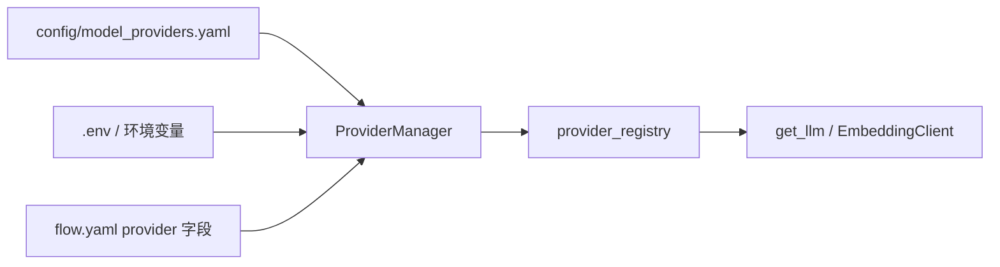
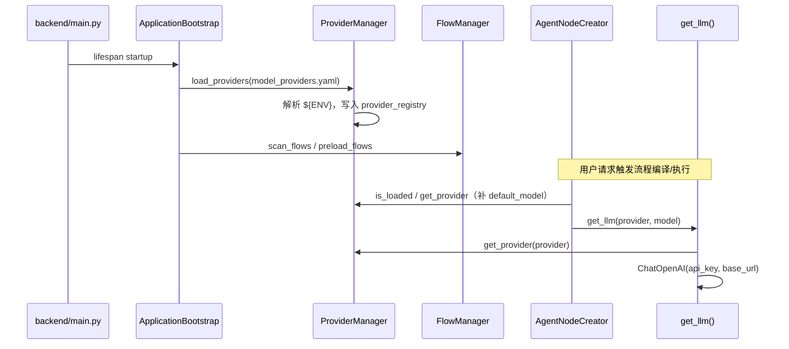

# ProviderManager 全系统用法梳理

> **源文件**：`backend/infrastructure/llm/providers/manager.py`  
> **关联组件**：`provider_registry`（`registry.py`）、`config/model_providers.yaml`、`.env`  
> **生成日期**：2026-06-11

---

## 一、职责概述

`ProviderManager` 是**模型供应商配置的统一加载与查询入口**，负责：

1. 读取 `config/model_providers.yaml`
2. 将 `${DOUBAO_API_KEY}` 等占位符解析为 `.env` / 环境变量中的真实值
3. 写入内存注册表 `provider_registry`
4. 在运行时按 `provider` 名称（如 `doubao`、`doubao-embedding`）提供 `api_key`、`base_url`、`default_model`

它**不直接调用 LLM**，只提供配置；真正创建客户端的是 `get_llm()`、`EmbeddingClient` 等下层模块。




---

## 二、类结构与状态

### 2.1 类变量（进程内单例状态）


| 变量             | 类型               | 含义                          |
| -------------- | ---------------- | --------------------------- |
| `_config_path` | `Optional[Path]` | 最近一次使用的 YAML 路径（缓存）         |
| `_loaded`      | `bool`           | 是否已成功执行过 `load_providers()` |


所有方法均为 `**@classmethod**`，无需实例化，全进程共享一份状态。

### 2.2 公开 API


| 方法                                 | 调用场景                   | 说明                                  |
| ---------------------------------- | ---------------------- | ----------------------------------- |
| `load_providers(config_path=None)` | 应用启动、独立脚本              | 加载 YAML → 清空并重建注册表 → `_loaded=True` |
| `get_provider(provider: str)`      | LLM/Embedding 创建、节点默认值 | 按名称取配置；未 load 则 `RuntimeError`      |
| `get_all_providers()`              | **当前代码库无调用**           | 返回全部配置副本                            |
| `is_loaded()`                      | Agent/RAG 节点创建前        | 判断是否需懒加载                            |


### 2.3 内部 API


| 方法                        | 说明               |
| ------------------------- | ---------------- |
| `_resolve_env_var(value)` | 替换 `${VAR_NAME}` |
| `_get_config_path()`      | 解析默认 YAML 绝对路径   |


### 2.4 与 `provider_registry` 的分工


| 组件                                       | 层级   | 职责                                                 |
| ---------------------------------------- | ---- | -------------------------------------------------- |
| `ProviderManager`                        | 管理器  | 读文件、解析环境变量、控制加载状态                                  |
| `ProviderRegistry` / `provider_registry` | 注册表  | 内存字典，`register` / `get` / `clear`                  |
| `ProviderConfig`                         | 数据模型 | `provider`, `api_key`, `base_url`, `default_model` |


---

## 三、配置来源

### 3.1 YAML：`config/model_providers.yaml`

当前注册的供应商（节选）：


| provider 名称        | 用途            | default_model                    |
| ------------------ | ------------- | -------------------------------- |
| `openai`           | OpenAI 兼容 API | 无                                |
| `doubao`           | 豆包对话模型        | `doubao-seed-1-8-251228`         |
| `doubao-embedding` | 豆包 Embedding  | `doubao-embedding-vision-250615` |
| `deepseek`         | DeepSeek API  | 无                                |


`flow.yaml` 中节点配置示例：

```yaml
model:
  provider: doubao
  name: doubao-seed-1-6-251015   # 可省略，则用 default_model
```

### 3.2 环境变量

YAML 中 `api_key: "${DOUBAO_API_KEY}"` 经 `_resolve_env_var` 解析：

1. 优先 `settings.DOUBAO_API_KEY`（来自 `.env`）
2. 其次 `os.getenv("DOUBAO_API_KEY")`
3. 未设置 → 空字符串 → **该 provider 跳过注册**（warning 日志）

---

## 四、全系统调用关系

### 4.1 调用方总览


| 类别                | 文件                                                | 使用的 API                                               |
| ----------------- | ------------------------------------------------- | ----------------------------------------------------- |
| **应用启动**          | `backend/app/bootstrap.py`                        | `load_providers()`                                    |
| **LLM 客户端**       | `backend/infrastructure/llm/client.py`            | `get_provider()`                                      |
| **Embedding 客户端** | `backend/infrastructure/llm/embedding_client.py`  | `get_provider()`                                      |
| **Embedding 工厂**  | `backend/domain/embeddings/factory.py`            | `get_provider()`                                      |
| **Agent 节点**      | `backend/domain/flows/nodes/agent_creator.py`     | `is_loaded()` / `load_providers()` / `get_provider()` |
| **RAG Agent 节点**  | `backend/domain/flows/nodes/rag_agent_creator.py` | 同上                                                    |
| **独立脚本**          | 见下表                                               | `load_providers(config_path)`                         |


**独立脚本（不经过 FastAPI 启动，需自行 load）：**


| 脚本路径                                                              |
| ----------------------------------------------------------------- |
| `scripts/create_rag_data/run_create_rag_data.py`                  |
| `scripts/create_rag_data_v2/run_create_rag_data_v2.py`            |
| `scripts/embedding_import/run_embedding_import.py`                |
| `scripts/embedding_import/run_embedding_import_parallel.py`       |
| `scripts/embedding_import_qa/run_embedding_import_qa_parallel.py` |


### 4.2 主路径：Web 应用启动 → 聊天/流程




**启动顺序**（`ApplicationBootstrap.startup` 第 1 步）：

```32:35:backend/app/bootstrap.py
        logger.info("1. 加载模型供应商配置...")
        config_path = find_project_root() / "config" / "model_providers.yaml"
        ProviderManager.load_providers(config_path)
        logger.info("   ✓ 成功加载模型供应商配置")
```

此后所有经 FastAPI 进入的请求，默认 **无需再次** `load_providers()`。

### 4.3 运行时：LLM 调用链

```51:57:backend/infrastructure/llm/client.py
    provider_config = ProviderManager.get_provider(provider)
    if provider_config is None:
        raise ValueError(f"模型供应商 '{provider}' 未注册，请检查配置文件")
    
    api_key = kwargs.get("api_key", provider_config.api_key)
    base_url = kwargs.get("base_url", provider_config.base_url)
```

调用链：

```text
flow.yaml (provider: doubao)
  → AgentFactory / EmbeddingFactory
    → get_llm() 或 EmbeddingClient
      → ProviderManager.get_provider("doubao")
        → provider_registry.get("doubao")
```

### 4.4 运行时：flow 节点缺省模型名

当 `flow.yaml` 的 `model` 未写 `name` 时，`AgentNodeCreator` / `RagAgentNodeCreator` 会：

```176:182:backend/domain/flows/nodes/agent_creator.py
                if not ProviderManager.is_loaded():
                    ProviderManager.load_providers()
                
                provider_config = ProviderManager.get_provider(provider_name)
                if provider_config and provider_config.default_model:
                    model_dict["name"] = provider_config.default_model
```

这是**懒加载兜底**：脚本单测或未走 `bootstrap` 时仍能工作；正常 Web 启动下 `is_loaded()` 已为 `True`。

### 4.5 独立脚本路径

脚本不启动 FastAPI，必须在入口显式加载：

```100:103:scripts/create_rag_data/run_create_rag_data.py
        project_root = find_project_root()
        config_path = project_root / "config/model_providers.yaml"
        ProviderManager.load_providers(config_path)
        logger.info("模型供应商配置加载成功")
```

随后脚本内调用 `FlowManager.get_flow()` → 节点创建 → 同样依赖 `get_provider()`。

---

## 五、load_providers 执行流程（摘要）


| 步骤  | 动作                                                |
| --- | ------------------------------------------------- |
| 1   | 确定 YAML 路径（参数或 `settings.MODEL_PROVIDERS_CONFIG`） |
| 2   | 读取并校验 `providers` 列表                              |
| 3   | `provider_registry.clear()`                       |
| 4~5 | 逐条解析 `${ENV}`，api_key 为空则跳过                       |
| 6   | `_loaded = True`                                  |


**注意**：重复调用会**清空并重建**注册表，非增量更新。

---

## 六、错误与边界行为


| 场景                                    | 行为                                      |
| ------------------------------------- | --------------------------------------- |
| 未 `load_providers` 就 `get_provider()` | `RuntimeError: 模型供应商配置未加载...`           |
| provider 名称不存在                        | 返回 `None`；上层通常转 `ValueError`            |
| api_key 环境变量未配置                       | 该 provider 不注册，日志 warning               |
| YAML 缺失 / 格式错误                        | `FileNotFoundError` / `ValueError`，启动失败 |
| 多 worker 部署                           | 每个进程各自 `load_providers()`，内存注册表不共享      |


---

## 七、设计要点与使用约束

### 7.1 为何用类方法 + 类变量

- 全进程只需**一套**供应商配置
- 与 `FlowManager`、`get_context_manager()` 等全局单例风格一致
- 入口统一：`ProviderManager.load_providers()` / `ProviderManager.get_provider(name)`

### 7.2 配置读取规范（项目约定）

- **禁止**在业务代码中直接从环境变量读 API Key 创建 LLM
- **必须**经 `ProviderManager` → `config/model_providers.yaml`
- 脚本与 Web 共用同一 YAML，保证行为一致

### 7.3 与 `.env` / `settings` 的关系


| 配置项                                       | 定义位置                                         | 消费方                |
| ----------------------------------------- | -------------------------------------------- | ------------------ |
| `DOUBAO_API_KEY` 等                        | `.env` → `backend/app/config.py`             | `_resolve_env_var` |
| `MODEL_PROVIDERS_CONFIG`                  | `settings`（默认 `config/model_providers.yaml`） | `_get_config_path` |
| `provider` / `base_url` / `default_model` | YAML                                         | `load_providers`   |


### 7.4 当前未使用的 API

- `get_all_providers()`：已实现，代码库内**无引用**，可用于管理端列举供应商或调试。

---

## 八、扩展新供应商 Checklist

1. 在 `config/model_providers.yaml` 增加条目，`api_key: "${YOUR_API_KEY}"`
2. 在 `.env` / `.env.example` 增加对应 key
3. 在 `backend/app/config.py` 的 `Settings` 中增加可选字段（若使用 `${}` 占位符）
4. 在目标 `flow.yaml` 的 `model.provider` 中引用新名称
5. 若需默认模型，配置 `default_model` 字段
6. 独立脚本场景：确保脚本入口调用 `ProviderManager.load_providers()`

---

## 九、相关文档与代码索引


| 类型             | 路径                                                 |
| -------------- | -------------------------------------------------- |
| 管理器            | `backend/infrastructure/llm/providers/manager.py`  |
| 注册表            | `backend/infrastructure/llm/providers/registry.py` |
| 配置文件           | `config/model_providers.yaml`                      |
| 应用启动           | `backend/app/bootstrap.py`                         |
| LLM 封装         | `backend/infrastructure/llm/client.py`             |
| Embedding      | `backend/infrastructure/llm/embedding_client.py`   |
| 默认值机制          | `cursor_docs/012603-Agent节点模型配置默认值机制分析.md`         |
| Provider 默认值方案 | `cursor_docs/012604-基于Provider配置的模型默认值方案分析.md`     |


---

*本文档基于代码库静态检索生成，反映当前 `shumac/v1` 分支实现。*