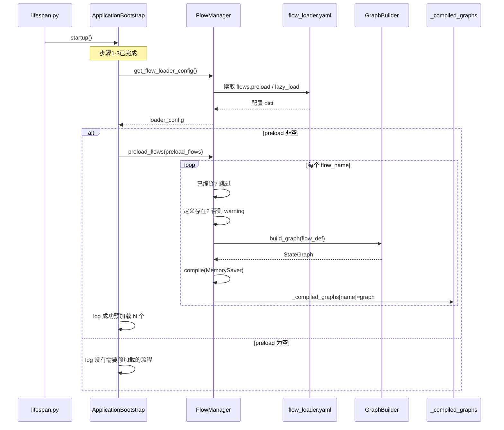
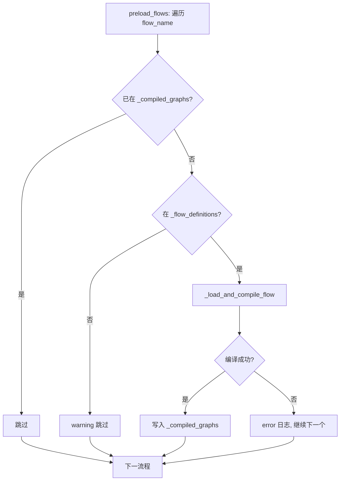
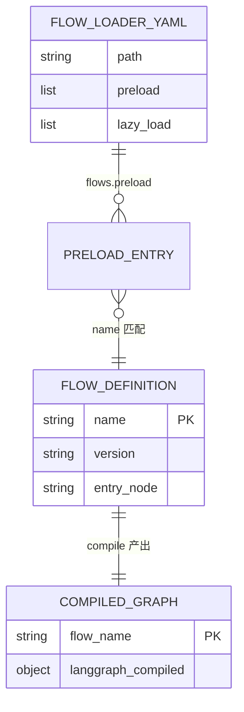

# bootstrap 启动步骤 4：流程预加载

> 入口锚点：`backend/app/bootstrap.py` 第 45–52 行（`ApplicationBootstrap.startup` 步骤 4）

---

## 0. 代码概要

- **一句话定位**：FastAPI 应用启动时，按配置文件将「常用 LangGraph 流程」提前编译进内存，避免首请求冷启动延迟。
- **价值与边界**：
  - **做**：读取 `config/flow_loader.yaml` 中的 `flows.preload` 列表，对已在步骤 3 扫描到的流程定义执行「建图 + 编译」，写入 `FlowManager` 类级缓存。
  - **不做**：不处理 `lazy_load` 列表（该字段在同一次 `get_flow_loader_config()` 中读出，但本段代码未使用）；不执行流程业务逻辑；不访问数据库；单个流程预加载失败**不会**中断应用启动（异常在 `preload_flows` 内部捕获）。
  - **与易混能力区分**：步骤 3 `scan_flows()` 只解析 YAML 为 `FlowDefinition`；步骤 4 才构建并 `compile` 为可执行的 `CompiledGraph`。运行时未预加载的流程仍可通过 `FlowManager.get_flow()` 按需加载。

---

## 1. 入口与入参解析


| 项        | 说明                                                                                                                                                                                  |
| -------- | ----------------------------------------------------------------------------------------------------------------------------------------------------------------------------------- |
| **入口说明** | 应用生命周期钩子：`backend/app/lifespan.py` → `ApplicationBootstrap.startup()` 第 4 步；类型为 **异步应用启动编排**，非 HTTP 接口。                                                                             |
| **进入条件** | FastAPI `lifespan` 上下文进入时执行；须步骤 1–3 已成功完成（模型供应商、工具注册表、流程定义扫描）。任一步骤抛异常则整个启动失败，步骤 4 不会执行。                                                                                             |
| **入参形态** | 无方法入参；驱动数据来自磁盘配置文件 `config/flow_loader.yaml`。                                                                                                                                       |
| **参数逻辑** | `loader_config.get("preload", [])`：流程名称字符串列表；空列表则跳过预加载。名称须与 `flow.yaml` 内 `name` 字段一致（如 `medical_agent_v5`），且已在步骤 3 写入 `FlowManager._flow_definitions`；否则该条被 `preload_flows` 警告并跳过。 |


**当前配置示例**（`config/flow_loader.yaml`）：

```yaml
flows:
  preload:
    - medical_agent_v5
  lazy_load:
    - medical_agent_v3
```

---

## 2. 出参、数据变更与外部依赖


| 项         | 说明                                                                                                                                                                                             |
| --------- | ---------------------------------------------------------------------------------------------------------------------------------------------------------------------------------------------- |
| **出参**    | 无返回值；仅写日志（成功条数或「没有需要预加载的流程」）。                                                                                                                                                                  |
| **存储变更**  | **内存写**：`FlowManager._compiled_graphs[flow_name] = compiled_graph`（LangGraph 编译图 + `MemorySaver` checkpointer）。**内存读**：`FlowManager._flow_definitions`（步骤 3 已填充）。无 DB / Redis / 文件写。           |
| **外部依赖**  | **读型**：`config/flow_loader.yaml`；编译过程中间接读各流程目录下 `flow.yaml`、prompt 文件等（已在步骤 3 解析过定义，编译阶段会实例化 Agent/Function 节点，可能再读 prompt 与 `model_providers.yaml` 经 `ProviderManager`）。**无** HTTP/RPC/MQ 调用。 |
| **其它副作用** | 预编译会为每个 Agent 节点创建 `AgentFactory` 执行器、注册 Function 节点实例等，占用内存；日志输出到应用 logger。                                                                                                                   |


---

## 3. 流程

### 3.1 核心流程概括

应用启动编排执行到第 4 步时，先从项目根目录读取流程加载配置，取出 `preload` 流程名列表。若列表非空，则逐个调用 `FlowManager.preload_flows`：对已缓存的流程定义调用 `GraphBuilder` 构建 LangGraph，再 `compile` 并放入类级 `_compiled_graphs`。若列表为空或配置文件缺失，则只记录「无需预加载」并继续后续启动步骤（Token/Session 缓存、队列消费者等）。

### 3.2 纵向链路（入口 → 边界）

1. `**lifespan.lifespan`** — FastAPI 启动时 `await _bootstrap.startup()`。
2. `**ApplicationBootstrap.startup`（L45–52）** — 打日志 → 取配置 → 条件调用预加载。
3. `**FlowManager.get_flow_loader_config`** — `find_project_root()` → 读 `config/flow_loader.yaml` → 返回 `{"preload": [...], "lazy_load": [...]}`；文件不存在或解析失败则返回空列表并打 warning/error。
4. `**FlowManager.preload_flows(flow_names)**` — 遍历 `flow_names`：
  - 已在 `_compiled_graphs` → 跳过；
  - 不在 `_flow_definitions` → warning 跳过；
  - 否则 `**FlowManager._load_and_compile_flow(flow_name)**`。
5. `**FlowManager._load_and_compile_flow**` — 取 `FlowDefinition` → `**GraphBuilder.build_graph**`（节点注册表创建各节点函数、连边、设入口）→ `graph.compile(checkpointer=MemorySaver())` → 写入 `_compiled_graphs`。
6. **边界**：编译完成的 `CompiledGraph` 驻留进程内存；后续 `**FlowManager.get_flow(flow_key)`** 命中缓存直接返回（如 `backend/app/api/helpers.py` 聊天链路）。

**前置依赖（步骤 1–3，本段未显式调用但必须先完成）**：


| 步骤                                 | 作用                                                  | 与预加载关系                    |
| ---------------------------------- | --------------------------------------------------- | ------------------------- |
| 1 `ProviderManager.load_providers` | 加载 LLM 供应商                                          | Agent/RAG 节点编译时解析默认 model |
| 2 `init_tools()`                   | 工具注册表                                               | Agent 节点若绑定 tools 需已注册    |
| 3 `FlowManager.scan_flows()`       | 扫描 `config/flows/*/flow.yaml` → `_flow_definitions` | 预加载依赖流程定义已存在              |


### 3.3 流程图 / 时序图

**总览**：覆盖 bootstrap 第 4 步到内存缓存写入的主路径。




**子流程 A：单流程编译失败（不阻断启动）**

`preload_flows` 对单个流程 `try/except`：失败只 `logger.error`，继续下一个；**不向上抛出**，因此 bootstrap 仍可能打印「成功预加载 N 个」（N 为配置列表长度，非实际成功数）。




---

## 4. 实体清单与关系

### 关键实体清单


| 实体                           | 形态                              | 在本流程中的用途                      |
| ---------------------------- | ------------------------------- | ----------------------------- |
| `flow_loader.yaml`           | 配置文件                            | **读**：`flows.preload` 驱动预加载列表 |
| `FlowDefinition`             | Pydantic 模型 / 内存 dict 值         | **读**：步骤 3 扫描结果，编译输入          |
| `CompiledGraph`              | LangGraph 编译对象                  | **写**：预加载产物，供运行时 `invoke`     |
| `FlowDefinition.nodes/edges` | 嵌套结构                            | **读**：`GraphBuilder` 建图       |
| `_flow_definitions`          | `Dict[str, FlowDefinition]` 类变量 | **读**                         |
| `_compiled_graphs`           | `Dict[str, CompiledGraph]` 类变量  | **写**                         |


### 关系与约束

- 一个 **流程名**（`flow.yaml` 的 `name`）对应一条 `_flow_definitions` 与至多一条 `_compiled_graphs` 记录（1:1）。
- `preload` 列表中的名称必须与扫描得到的 `FlowDefinition.name` 一致；目录名（如 `medical_agent_v5/`）与 `name` 通常一致但**以 YAML 内 `name` 为准**。
- `lazy_load` 与 `preload` 互斥使用策略由运维/配置约定，代码层**未强制**同一流程不能同时出现在两列表。

### ER / 依赖简图




### 数据转换链

```
flow_loader.yaml (flows.preload: List[str])
    → get_flow_loader_config() → dict["preload"]
    → preload_flows(names)
    → _flow_definitions[name] (FlowDefinition)
    → GraphBuilder.build_graph → StateGraph
    → .compile(checkpointer=MemorySaver())
    → _compiled_graphs[name] (CompiledGraph)
```

### 字段说明


| 字段                    | 来源                           | 说明                                  |
| --------------------- | ---------------------------- | ----------------------------------- |
| `flows.preload`       | `flow_loader.yaml`           | 启动时编译的流程名列表；缺失则 `[]`                |
| `flows.lazy_load`     | 同文件                          | 本入口**不消费**；供 API schema 文档等其它模块合并展示 |
| `FlowDefinition.name` | 各 `config/flows/*/flow.yaml` | 预加载匹配键                              |
| `MemorySaver`         | LangGraph                    | 每个预加载流程独立 checkpointer 实例           |


---

## 5. 用例

**场景**：生产环境启动，配置预加载 `medical_agent_v5`。

1. **入参（配置）**
  `config/flow_loader.yaml` 含 `flows.preload: [medical_agent_v5]`；`config/flows/medical_agent_v5/flow.yaml` 存在且 `name: medical_agent_v5`。
2. **内部变化**
  - 步骤 3 已将 `medical_agent_v5` 放入 `_flow_definitions`。  
  - 步骤 4：`get_flow_loader_config()` 返回 `preload=["medical_agent_v5"]`。  
  - `preload_flows` 调用 `_load_and_compile_flow`：构建含 `intent_recognition`、`retrieval_node`、`core_agent` 等节点的图并 compile。  
  - `_compiled_graphs["medical_agent_v5"]` 就绪。
3. **出参（可观测结果）**
  - 日志：`4. 预加载常用流程...` → `✓ 成功预加载 1 个流程`。  
  - 用户首条聊天请求调用 `FlowManager.get_flow("medical_agent_v5")` 时**无**编译等待，直接返回缓存图。

**反例**：`preload` 配置了 `unknown_flow`，但磁盘无对应定义 → 步骤 4 对该条 warning 跳过，应用仍启动完成；日志仍可能显示预加载列表长度为 1（见第 6 节待确认项）。

---

## 6. 横切与其它（收尾）


| 类别            | 说明                                                                  |
| ------------- | ------------------------------------------------------------------- |
| **启动顺序**      | 预加载必须在 `scan_flows` 之后；模型与工具须先初始化，否则 Agent 节点编译可能失败。                |
| **并发与一致性**    | `FlowManager` 为类级单例缓存；多 worker 部署时**每个进程**各自预加载一份（无跨进程共享）。          |
| **可靠性**       | 单流程预加载失败不 fail-fast；与步骤 1–3、5–6 的「失败即启动失败」策略不一致。                    |
| **lazy_load** | 配置项存在但 bootstrap 45–52 未读取；`medical_agent_v3` 等仅在首次 `get_flow` 时编译。 |
| **日志准确性**     | `len(preload_flows)` 统计的是**配置条数**，非 `_compiled_graphs` 实际新增数量。      |


**待确认**

- 产品是否要求「任一 preload 失败则启动失败」；当前实现为宽松模式。  
- `lazy_load` 是否计划由启动步骤统一校验存在性（当前无校验）。  
- 多 worker 下预加载内存占用与启动时延的运维基线。

