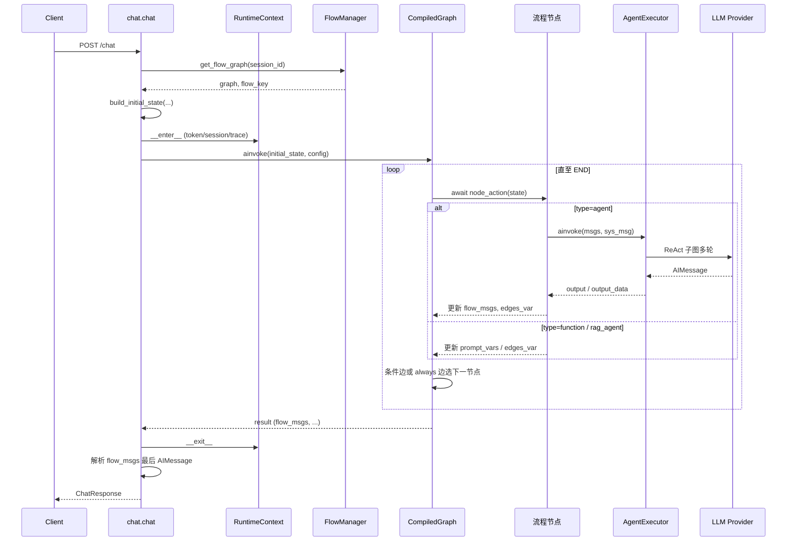
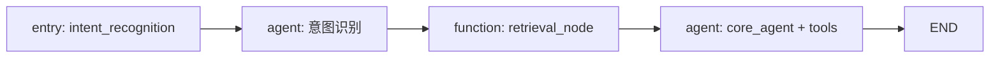
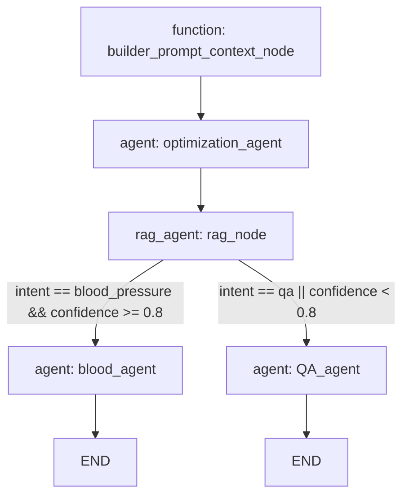
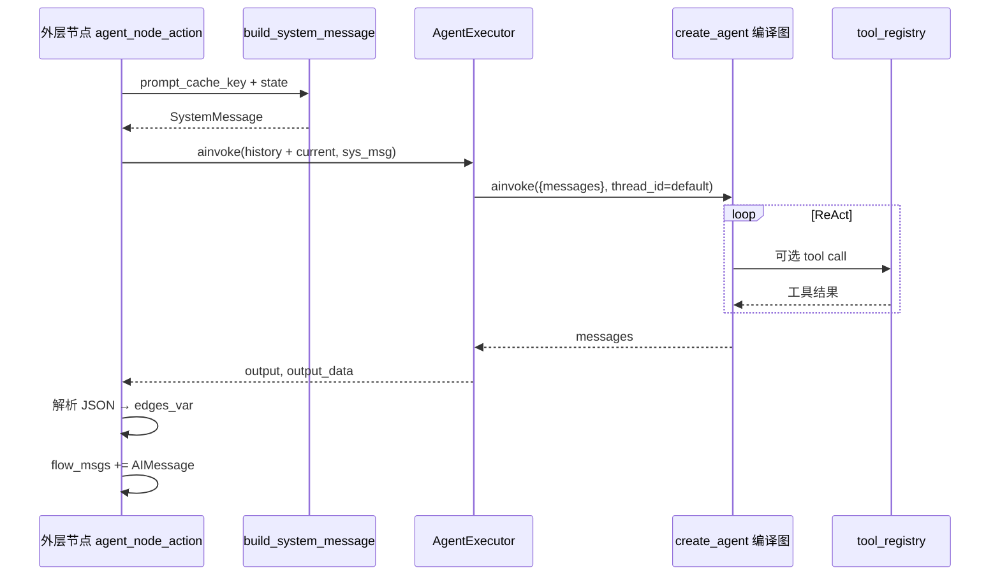
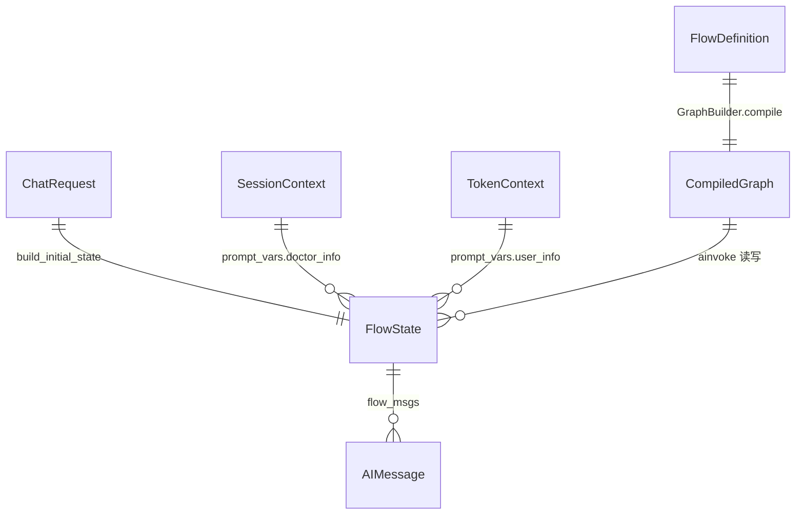

# chat.py:92 `graph.ainvoke` 内部运行机制

> **分析锚点**：`backend/app/api/routes/chat.py` 第 92 行  
> `result = await graph.ainvoke(initial_state, config)`

---

## 0. 代码概要

- **一句话定位**：Chat API 中驱动 **LangGraph 编译流程图** 异步执行的核心调用点，将用户本轮消息与上下文状态送入 Session 绑定的医疗 Agent 流程，直至流程结束并返回含 AI 回复的状态字典。

- **价值与边界**：
  - **做**：在 `RuntimeContext` 与 Langfuse 回调已就绪的前提下，按 `flow.yaml` 定义的节点与边顺序/条件，依次执行 function / agent / rag_agent 等节点，汇总 `flow_msgs` 供上层提取回复。
  - **不做**：不负责 HTTP 鉴权（由 `@validate_context_cache` 完成）、不负责选流程（由 `get_flow_graph` 根据 Session 的 `flow_info.flow_key` 完成）、不负责解析最终回复文本（第 94～112 行完成）。
  - **职责分层**：第 92 行本身是 **LangGraph 运行时入口**；图的结构在启动/首次使用时由 `FlowManager` + `GraphBuilder` 编译；各节点业务逻辑在 `backend/domain/flows/nodes/` 与 `implementations/` 中。

---

## 1. 入口与入参解析

| 内容 | 说明 |
|------|------|
| **入口说明** | HTTP `POST /chat` 路由体内部的一步；上游已完成消息组装、图获取、Langfuse 配置。 |
| **进入条件** | `@validate_context_cache` 已通过（内存中存在 token/session 上下文）；`get_flow_graph` 已成功返回编译图；`initial_state` 已构建。 |
| **入参形态** | 两个 positional 参数：`initial_state: FlowState`、`config: dict`。 |

### 1.1 `initial_state`（FlowState）

由 `build_initial_state()` 组装，类型为 `FlowState`（`backend/domain/state.py`）：

| 字段 | 来源 / 含义 | 影响分支 |
|------|-------------|----------|
| `current_message` | 本轮 `HumanMessage` | Agent 节点拼入 LLM 消息列表 |
| `history_messages` | 历史对话转 `BaseMessage` 列表 | Agent 节点上下文 |
| `flow_msgs` | 初始 `[]` | 各 Agent 节点产出经 `add_messages` reducer **追加** |
| `session_id` / `token_id` / `trace_id` | 请求体或装饰器注入 | 工具层经 `RuntimeContext` 读取；Langfuse 元数据 |
| `prompt_vars` | `current_date`、`user_info`（Token 缓存）、`doctor_info`（Session 缓存格式化） | `build_system_message` 替换提示词占位符 |
| `edges_var` / `persistence_edges_var` | 初始无或空 | 节点间传递；**条件边**评估变量来源 |

图的 **input_schema** 为 `FlowInputSchema`，为上述字段子集；LangGraph 只校验/接受对外输入字段。

### 1.2 `config`

```python
config = {
    "configurable": {"thread_id": request.session_id},
    # 可选：
    "callbacks": [langfuse_handler],
    "metadata": { "langfuse_user_id", "langfuse_session_id", "flow_key", ... },
}
```

| 字段 | 作用 |
|------|------|
| `configurable.thread_id` | 与编译时注入的 `MemorySaver` 检查点关联；**同 session 多次 chat 可复用图级 checkpoint**（与 Agent 内层图使用的 `"default"` thread 不同，见 §6）。 |
| `callbacks` / `metadata` | 传入 LangChain/LangGraph 可观测链路；LLM 调用自动上报 Langfuse。 |

### 1.3 `graph` 从何而来

`get_flow_graph(session_id)` → `FlowManager.get_flow(flow_key)`：

1. 从 `ContextManager` 读 Session 的 `flow_info.flow_key`（login 创建 Session 时写入）。
2. 命中 `_compiled_graphs` 缓存则直接返回；否则 `scan_flows` → `_load_and_compile_flow`。
3. `_load_and_compile_flow`：`GraphBuilder.build_graph(flow_def)` → `graph.compile(checkpointer=MemorySaver())`。

默认预加载流程见 `config/flow_loader.yaml`（当前 `medical_agent_v5`）。

---

## 2. 出参、数据变更与外部依赖

| 内容 | 说明 |
|------|------|
| **出参** | `result: dict`，符合 `FlowOutputSchema` 子集；Chat 路由主要读 **`flow_msgs`**（`List[BaseMessage]`，含各 Agent 节点的 `AIMessage`）和 **`session_id`**。 |
| **存储变更** | **图级 checkpoint**：`MemorySaver` 按 `thread_id=session_id` 写入内存检查点（流程状态快照，非业务表）。**业务写库**发生在节点内：如 Agent 调工具 `record_blood_pressure`、function 节点查血压、RAG 节点读向量库等——**非 ainvoke 本身**。 |
| **外部依赖** | 节点执行期间可能调用：LLM Provider（豆包等）、Embedding、PostgreSQL+pgvector（RAG）、血压等业务 API/DB、Langfuse。**读/写取决于具体节点与工具**。 |
| **其它副作用** | Langfuse trace；日志；`RuntimeContext` 作用域内工具可读 `token_id`/`session_id`。 |

---

## 3. 流程

### 3.1 核心流程概括

1. LangGraph 从 `flow.yaml` 的 **`entry_node`** 开始，将 `initial_state` 作为初始快照。
2. 按边定义依次 **异步调用** 当前节点函数；节点返回的状态片段与现有 state **合并**（`flow_msgs` 用 reducer 追加，不覆盖）。
3. 若出边为 **条件边**，`ConditionEvaluator` 读取 `persistence_edges_var` 与 `edges_var` 合并变量，决定下一节点或 `END`。
4. **agent 类型节点** 内部会再调用一层 LangGraph ReAct 子图（`create_agent`），完成 LLM + 工具循环，并将 AI 输出写入 `flow_msgs` 与 `edges_var`。
5. 到达 `END` 后，`ainvoke` 返回最终 state；Chat 路由从 `flow_msgs` 取最后一条 AI 消息作为用户可见回复。

### 3.2 纵向链路（入口 → 边界）

1. **`chat.chat`**（`routes/chat.py`）— 在 `RuntimeContext` 内调用 `graph.ainvoke`。
2. **LangGraph CompiledGraph.ainvoke** — 框架调度：checkpoint 加载/保存、节点顺序、条件路由、state reducer。
3. **节点函数**（编译时由 `GraphBuilder._create_node_function` → `node_creator_registry.create_node` 绑定）：
   - **`function`** → `FunctionNodeCreator` → `function_registry` 实例的 `execute(state)`（如 `QueryUserInfoNode` 写 `prompt_vars.other_info`）。
   - **`agent`** → `AgentNodeCreator` → `agent_node_action(state)`：
     - `build_system_message` 替换占位符；
     - `AgentExecutor.ainvoke(msgs, sys_msg)` → **内层** `create_agent` 图的 `ainvoke`；
     - 解析 LLM JSON 输出 → `edges_var`；可选 `persist_to_persistence_edges_var`；
     - `flow_msgs += AIMessage(content=output)`。
   - **`rag_agent`** → `RagAgentNodeCreator` → embedding + pgvector 检索 + 科普文章 → 写入 `edges_var.edges_prompt_vars`。
   - **`em_agent`** → Embedding 节点（本分析不展开，注册表已支持）。
4. **条件路由** — `GraphBuilder` 编译的 `route_func` → `ConditionEvaluator.evaluate(condition, state)` → 下一节点名或 `END`。
5. **边界** — LLM HTTP、向量 DB、业务工具 API/ORM、Langfuse；流程结束返回 `FlowOutputSchema` 字段。

### 3.3 流程图 / 时序图

#### 总览：Chat 请求到 `graph.ainvoke` 返回

下图覆盖从 HTTP 进入到第 92 行及返回后的解析；**第 92 行方框内** 即 LangGraph 主循环。



#### 子流程 A：以 `medical_agent_v5` 为例的节点链

预加载默认流程为线性三节点（无分支）：



#### 子流程 B：以 `medical_agent_v6.3` 为例的条件分支

说明 **条件边** 如何依赖上游 Agent 写入的 `intent` / `confidence`（经 `persist_to_persistence_edges_var` 持久化）：



`optimization_agent` 配置 `persist_to_persistence_edges_var: [intent, confidence]`，故 `rag_node` 之后路由仍可读这些字段，即使中间节点重置了 `edges_var`。

#### 子流程 C：单个 Agent 节点内部

Agent 节点存在 **双层 LangGraph**：外层流程图 + 内层 ReAct Agent 图。



---

## 4. 实体清单与关系

### 4.1 关键实体清单

| 实体 | 用途（本流程） |
|------|----------------|
| `FlowState` | 节点间传递的完整状态 TypedDict |
| `FlowInputSchema` / `FlowOutputSchema` | LangGraph 对外输入/输出约束 |
| `FlowDefinition` | 自 `config/flows/*/flow.yaml` 解析的流程定义 |
| `CompiledGraph` | `StateGraph.compile(checkpointer=MemorySaver())` 产物 |
| `ChatRequest` / `ChatResponse` | HTTP 契约 |
| Session 内存上下文 | `flow_info`、`doctor_info`；驱动选流与 `prompt_vars` |
| Token 内存上下文 | `UserInfo`；驱动 `prompt_vars.user_info` |
| `{TABLE_PREFIX}embedding_records` | RAG 节点向量检索（读） |
| Langfuse trace | callbacks + metadata 上报 |

### 4.2 关系与约束

- **Session 1 : 1 flow_key**：创建 Session 时绑定，Chat 全程用同一编译图。
- **FlowDefinition 1 : N NodeDefinition / EdgeDefinition**：YAML 静态配置。
- **Agent 节点 1 : 1 AgentExecutor 1 : 1 内层 ReAct 图**：编译期创建，运行期复用。
- **flow_msgs**：多 Agent 节点顺序执行时**累积**多条 `AIMessage`；Chat 取**最后一条**作为回复（中间节点输出可能被后续节点覆盖语义，但消息仍保留在列表中）。

### 4.3 ER / 依赖简图



### 4.4 数据转换链

| 阶段 | 结构 | 说明 |
|------|------|------|
| HTTP  body | `ChatRequest` | message, session_id, token_id, history… |
| 初始图状态 | `FlowState` | + `prompt_vars` 填充 |
| Agent 节点 | `history + current → LLM messages` | + 运行时 `SystemMessage` |
| Agent 输出 | `str` 或 `dict` JSON | → `edges_var` 键值；→ `flow_msgs` AIMessage |
| RAG 节点 | 检索文本 | → `edges_var.edges_prompt_vars.retrieved_examples` 等 |
| 图返回 | `result["flow_msgs"]` | Chat 解析 `response_content` 或原文 |
| HTTP 响应 | `ChatResponse` | response, session_id |

### 4.5 字段说明（影响路由与回复）

| 字段 | 写入方 | 含义 |
|------|--------|------|
| `edges_var` | 各节点 | **当前节点**产出；Agent 节点每次 **新建空 dict**，防污染下游条件 |
| `persistence_edges_var` | Agent 配置 `persist_to_persistence_edges_var` | 跨节点持久化的边变量（如 intent、confidence） |
| `edges_var.edges_prompt_vars` | function/RAG 等 | 专供 `build_system_message` 占位符，优先级高于 `prompt_vars` |
| `flow_msgs` | agent 节点 | AI 回复累积；Chat 只消费**最后一条** |
| `intent` / `confidence` | 意图类 Agent JSON 输出 | v6.3 等流程条件边判断 |

---

## 5. 用例

### 场景：Session 绑定 `medical_agent_v5`，用户问「我昨天血压多少？」

**入参示例**（节选）：

```json
{
  "message": "我昨天血压多少？",
  "session_id": "user001_doctorId001_medical_agent_v5",
  "token_id": "user001",
  "conversation_history": []
}
```

**内部关键变化**：

1. `get_flow_graph` 返回已预编译的 v5 图；`initial_state.prompt_vars` 含 user_info、doctor_info、current_date。
2. `graph.ainvoke` 执行：
   - **intent_recognition**：LLM 返回 JSON（含 query 等）→ `edges_var`。
   - **retrieval_node**：向量/用户数据检索 → 写入 `edges_var.edges_prompt_vars`（如 retrieved_examples）。
   - **core_agent**：系统提示词注入检索结果；ReAct 可能调用 `query_blood_pressure` 工具（经 `RuntimeContext` 取 token_id）→ 最终 AIMessage 写入 `flow_msgs`。
3. `result["flow_msgs"]` 含至少 3 条 AIMessage（每 agent 节点一条）；Chat 取**最后一条**（core_agent）。

**出参示例**：

```json
{
  "response": "您昨天记录的血压为 …",
  "session_id": "user001_doctorId001_medical_agent_v5"
}
```

若 core_agent 输出 JSON 且含非空 `response_content`，Chat 会优先提取该字段作为 `response` 文本。

---

## 6. 横切与其它（收尾）

| 类别 | 说明 |
|------|------|
| **横切：RuntimeContext** | `with RuntimeContext(...)` 包裹 ainvoke，使节点内工具通过 `get_token_id()` 等读取会话身份，无需从 state 显式传参。 |
| **横切：Langfuse** | `config["callbacks"]` 在外层图生效；内层 AgentExecutor 默认 **未** 透传 chat 的 callbacks（`callbacks=None`），LLM 内层 trace 与外层关系 **待确认** 是否完全关联。 |
| **并发与一致性** | 节点函数为 `async`；单请求内顺序执行。`MemorySaver` 为进程内存，重启丢失。 |
| **安全** | `@validate_context_cache` 要求 token/session 已 login 写入内存；无则 404。 |
| **双层 thread_id** | 外层 `graph.ainvoke` 使用 `session_id` 作 checkpoint key；内层 Agent 固定 `"default"`——两层 checkpoint **相互独立**。 |
| **待确认** | ① 条件边多条匹配时的优先级（`route_func` 按 edges 列表顺序第一个为真者）；② 多 Agent 节点时中间节点 AIMessage 是否应参与「最后回复」选择；③ 生产环境是否需持久化 checkpointer 替代 `MemorySaver`。 |

---

## 附录：关键代码索引

| 模块 | 路径 | 职责 |
|------|------|------|
| Chat 路由 | `backend/app/api/routes/chat.py:92` | `graph.ainvoke` 调用点 |
| 图获取 | `backend/app/api/helpers.py:get_flow_graph` | Session → FlowManager |
| 状态构建 | `backend/app/api/helpers.py:build_initial_state` | FlowState + prompt_vars |
| 流程管理 | `backend/domain/flows/manager.py` | 扫描、编译、缓存 |
| 图构建 | `backend/domain/flows/builder.py` | StateGraph、边、条件路由 |
| Agent 节点 | `backend/domain/flows/nodes/agent_creator.py` | LLM 节点 + edges_var |
| Agent 执行 | `backend/domain/agents/factory.py:AgentExecutor` | 内层 ReAct ainvoke |
| 条件评估 | `backend/domain/flows/condition_evaluator.py` | 边条件 |
| 状态定义 | `backend/domain/state.py` | FlowState / schemas |
| 流程配置 | `config/flows/*/flow.yaml` | 节点拓扑 |
