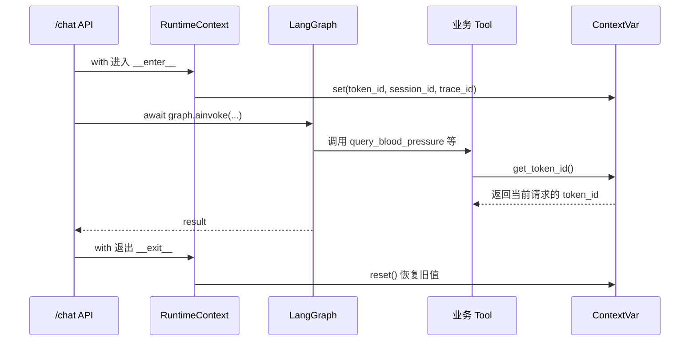

# RuntimeContext 模块 — 面试介绍稿

> 适用场景：介绍 `backend/domain/tools/context.py` 及在 `/chat` 中的 `with RuntimeContext(...)` 用法。  
> 目标：用 1～3 分钟讲清「解决什么问题、怎么设计、为什么这样选」。

---

## 一、30 秒版（开场白）

> 我们做的是一个基于 LangGraph 的医疗 Agent 系统。HTTP 请求进来时带有 `token_id`、`session_id`、`trace_id`，但执行链路很长：API → Graph → Agent → LLM → Tool，如果每个函数都显式传这三个参数，签名会非常臃肿，而且 LangChain Tool 的调用接口也不方便扩展。
>
> 所以我们用 **`contextvars` + 上下文管理器 `RuntimeContext`**，在请求执行期间把这三个 ID 注入「当前协程上下文」，下游 Tool 通过 `get_token_id()` 等方式按需读取；`with` 块结束后自动恢复，避免污染下一个请求。

---

## 二、1～2 分钟版（结构化介绍）

### 1. 业务背景

- 入口：`POST /chat`（`backend/app/api/routes/chat.py`）
- 核心调用：`await graph.ainvoke(initial_state, config)`
- 流程中会触发多个业务 Tool（查血压、用药、症状等），这些 Tool 需要 **`token_id` 识别用户**，有时还需要 `session_id`、`trace_id` 做日志或链路关联

### 2. 要解决的问题

| 痛点 | 说明 |
|------|------|
| 参数透传链路过长 | Graph → Node → Agent → Tool，层层加参数成本高 |
| Tool 接口受限 | LangChain `@tool` 的参数由 LLM 决定，不适合把 `token_id` 写进工具入参 |
| 并发安全 | FastAPI 多请求并发，不能用全局变量存「当前用户」 |
| 生命周期要明确 | 只在单次请求/单次 `ainvoke` 内有效，结束必须清理 |

### 3. 设计方案

**核心文件**：`backend/domain/tools/context.py`

- 用 3 个 `contextvars.ContextVar` 分别存 `token_id`、`session_id`、`trace_id`
- 提供 `get_*()` / `set_*()` 读写接口
- `RuntimeContext` 实现上下文管理器协议（`__enter__` / `__exit__`），支持 `with` 语法

**在 chat 中的用法**：

```python
with RuntimeContext(
    token_id=request.token_id,
    session_id=request.session_id,
    trace_id=request.trace_id,
):
    result = await graph.ainvoke(initial_state, config)
```

### 4. 执行流程（可画在白板上）



### 5. 消费方示例

业务 Tool 不接收 `token_id` 参数，运行时从上下文读取：

```python
# blood_pressure_tool.py
token_id = get_token_id()
if not token_id:
    return []
```

同类用法还出现在 `medication_tool.py`、`symptom_tool.py`、`health_event_tool.py` 等。

---

## 三、技术细节（面试官追问时用）

### 1. 为什么用 `contextvars`，不用全局变量或 `threading.local`？

| 方案 | 评价 |
|------|------|
| 全局变量 | 并发请求会互相覆盖，不可用 |
| `threading.local` | 只隔离线程；asyncio 里多个协程可能在同一线程，会串数据 |
| **`contextvars`** | Python 3.7+ 官方方案，**协程/任务级隔离**，与 `async/await` 兼容 |

### 2. `with` 到底做了什么？

等价于：

1. `__enter__`：对每个非 `None` 字段调用 `ContextVar.set()`，并保存返回的 **token**
2. 执行 `with` 块
3. `__exit__`：按逆序 `ContextVar.reset(token)`，恢复进入前的值

支持**嵌套**：内层 `with` 结束后，外层上下文仍能正确恢复。

### 3. 和 Langfuse 配置的分工

同一段 `chat` 代码里还有：

```python
config["callbacks"] = [langfuse_handler]
config["metadata"] = {"langfuse_user_id": ..., ...}
```

| 机制 | 职责 |
|------|------|
| `RuntimeContext` | **业务层**：Tool 读用户身份、会话、追踪 ID |
| Langfuse `config` | **观测层**：LLM 调用链路上报、Trace 关联 |

两者互补，不是重复设计。

### 4. 作用域边界

`with RuntimeContext` **只包裹** `graph.ainvoke` 这一段；响应解析（从 `flow_msgs` 取 AI 回复）在 `with` 外，不再依赖上下文。这样作用域最小化，语义清晰。

### 5. 可选字段

`RuntimeContext` 的三个参数都是 `Optional`；为 `None` 的字段不会 `set`，避免把上下文误写成 `None` 覆盖已有值。

---

## 四、设计取舍（体现工程思维）

**优点**

- 调用链解耦：新增 Tool 只需 `get_token_id()`，不用改上游签名
- 并发安全：请求级隔离
- 自动清理：`with` 保证异常时也能 `reset`
- 与 async 友好：适合 FastAPI + LangGraph 异步执行

**局限 / 可主动说的 trade-off**

- **隐式依赖**：读上下文不如显式传参直观，新人需要看文档或约定
- **测试要注意**：单测里若直接调 Tool，需手动 `with RuntimeContext(...)` 或 mock `get_token_id`
- **不能替代 state**：Graph 业务状态仍应放在 `initial_state`；上下文只适合「横切」的请求元数据

---

## 五、常见面试追问 & 参考回答

**Q：为什么不把 `token_id` 放进 LangGraph 的 `state`？**

A：可以放进去，但 Tool 是 LangChain 标准接口，由框架按 LLM 输出的 arguments 调用，不会自动把 state 里的字段注入 Tool。用 `contextvars` 是在不改动 Tool 签名的前提下，把请求级元数据送到任意深度的同步/异步代码里。若未来统一改成自定义 Tool 包装层，也可以从 state 注入 context，但当前方案改动面最小。

**Q：`await graph.ainvoke` 在 `with` 里，上下文会丢吗？**

A：不会。`contextvars` 在 asyncio 中随 Task 传播；在 `with` 内 `await` 时，同一请求链路内的协程能读到同一套值。

**Q：如果忘记 `with` 会怎样？**

A：`get_token_id()` 返回 `None`，Tool 里一般有兜底（如返回空列表、打 warning），不会崩溃，但业务数据查不到，属于**静默失败**，所以入口必须包 `with`。

**Q：和 OpenTelemetry / Langfuse 的 trace 有什么关系？**

A：`trace_id` 放进 `RuntimeContext` 是为了业务代码和日志统一取 ID；Langfuse 走 callback/metadata 做 LLM 观测。两边可以共用同一个 `trace_id` 字符串做关联，但机制独立。

---

## 六、收尾一句话（记忆点）

> **`RuntimeContext` = 请求级的隐式上下文传递：用 `contextvars` 做协程安全，用 `with` 管生命周期，让 LangGraph 深处的 Tool 能拿到 `token_id`，而不用污染每一层函数签名。**

---

## 七、相关代码索引

| 文件 | 说明 |
|------|------|
| `backend/domain/tools/context.py` | `ContextVar` 定义与 `RuntimeContext` |
| `backend/app/api/routes/chat.py` | `/chat` 入口，`with RuntimeContext` |
| `backend/domain/tools/blood_pressure_tool.py` | `get_token_id()` 消费示例 |
| `scripts/embedding_import/core/runner.py` | 批处理脚本中的同类用法 |
