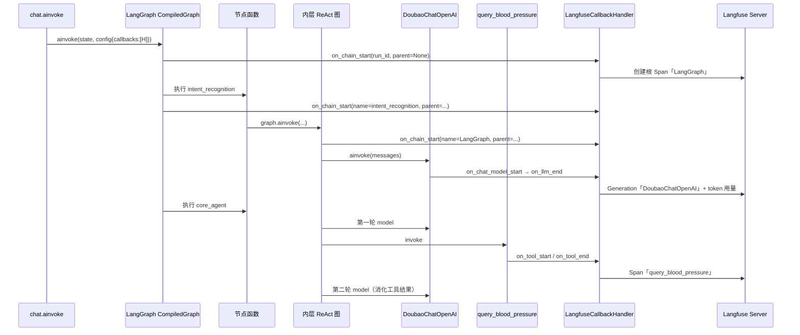
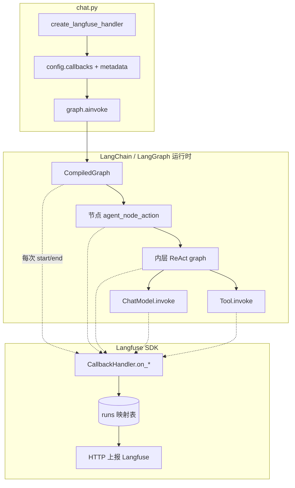

# Langfuse 埋点与 Trace 树结构讲解

> **分析锚点**：`backend/app/api/routes/chat.py` 第 68～92 行  
> **关联代码**：`backend/infrastructure/observability/langfuse_handler.py`

---

## 0. 一句话结论

**Langfuse 并不是在业务代码里手写「前后拦截」**，而是借助 **LangChain 的 Callback（回调）机制**：你在 `graph.ainvoke` 的 `config` 里挂一个 `LangfuseCallbackHandler`，LangGraph / LangChain 在执行每一层 Runnable（图、节点、LLM、工具）的 **开始与结束** 时，会自动调用 Handler 的 `on_*` 方法；Handler 根据 LangChain 传入的 `run_id` / `parent_run_id` 维护父子关系，最终在 Langfuse UI 上渲染成你截图里的 **树形 Trace**。

---

## 1. chat.py 里实际只做了两件事

```68:92:backend/app/api/routes/chat.py
        # 5. 创建 Langfuse 回调，供 LLM 调用链路自动上报可观测数据
        langfuse_handler = create_langfuse_handler(context={"trace_id": request.trace_id})

        # 6. 在 RuntimeContext 下异步执行流程图
        with RuntimeContext(
            token_id=request.token_id,
            session_id=request.session_id,
            trace_id=request.trace_id,
        ):
            config = {"configurable": {"thread_id": request.session_id}}
            if langfuse_handler:
                config["callbacks"] = [langfuse_handler]
                config["metadata"] = {
                    "langfuse_user_id": request.token_id or "",
                    "langfuse_session_id": request.session_id,
                    "langfuse_tags": ["chat", "api"],
                    "flow_key": flow_key,
                    "flow_name": flow_name,
                    "source": "chat_api",
                    "message_length": str(len(request.message)),
                    "history_count": str(len(request.conversation_history or [])),
                }

            # graph.ainvoke：按 initial_state 驱动 LangGraph 全链路执行
            result = await graph.ainvoke(initial_state, config)
```

| 步骤 | 作用 |
|------|------|
| `create_langfuse_handler(...)` | 构造 **一个** `LangfuseCallbackHandler` 实例，并通过 `trace_context` 把本次请求绑定到指定 `trace_id` |
| `config["callbacks"] = [langfuse_handler]` | 把这个 Handler 注册为本次 `ainvoke` 的观察者 |
| `config["metadata"]` | 附带 user / session / tags 等，Handler 在根链启动时写入 Trace 属性 |

**注意**：`chat.py` 虽然 `import` 了 `set_langfuse_trace_context`，但当前路由 **并未调用** 它。Trace 的根由 CallbackHandler 在 **第一次 `on_chain_start` 且 `parent_run_id is None`** 时创建，并挂到 `trace_context={"trace_id": ...}` 指定的 ID 上。

`RuntimeContext` 与 Langfuse **无直接关系**，仅供工具层读取 `token_id` / `session_id` / `trace_id`。

---

## 2. `create_langfuse_handler` 做了什么

```112:175:backend/infrastructure/observability/langfuse_handler.py
def create_langfuse_handler(
    context: Optional[Dict[str, Any]] = None,
) -> Optional["LangfuseCallbackHandler"]:
    # ...
    handler = LangfuseCallbackHandler(
        public_key=public_key,
        update_trace=True,
        trace_context=trace_context,
    )
```

要点：

1. **开关与密钥**：`LANGFUSE_ENABLED`、PUBLIC_KEY / SECRET_KEY 不全则返回 `None`，主流程照常跑，只是不上报。
2. **`trace_context`**：把客户端传入的 `request.trace_id` 规范化为 32 位十六进制，使 UI 上的 Trace ID 与业务侧一致（如 `844b34d6e09c686af4c6219dd889ced4`）。
3. **`update_trace=True`**：根链结束时，用链的 input/output 更新 Trace 级别信息。
4. **单例 Langfuse Client**：`_get_langfuse_client()` 负责 host / secret，Handler 通过 SDK 的 `get_client` 复用。

**LLM 工厂层不挂回调**（`client.py` 注释已说明）：观测入口统一在 **外层 LangGraph `config`**，避免重复埋点。

---

## 3. 核心机制：LangChain Callback，不是 AOP 拦截

可以把它理解成 **发布-订阅**：



LangChain 每启动一层 Runnable，都会：

1. 生成唯一 `run_id`（UUID）
2. 若有上层调用，带上 `parent_run_id`
3. 依次通知所有 `callbacks` 的 `on_*_start`
4. 执行完毕后调用 `on_*_end`（或 `on_*_error`）

Langfuse Handler **只实现这些钩子**，在钩子里创建 / 结束 Langfuse Observation（Span / Generation），**业务代码无需在每个节点前后写 log**。

---

## 4. Handler 如何拼出父子树

Langfuse Python SDK 的 `CallbackHandler` 内部维护两张关键表（简化理解）：

| 结构 | 含义 |
|------|------|
| `runs: Dict[UUID, Observation]` | 每个 LangChain `run_id` 对应一个 Langfuse Span/Generation |
| `_child_to_parent_run_id_map` | 子 run → 父 run，用于 `_get_parent_observation` |

**`on_chain_start`（链 / 图开始）** 伪逻辑：

```
parent = runs[parent_run_id] if parent_run_id else LangfuseClient
span = parent.start_observation(name=节点名, ...)
runs[run_id] = span

若 parent_run_id is None（根调用）：
    span.update_trace(user_id, session_id, tags, ...)  # 从 metadata 解析
```

**`on_chat_model_start` / `on_llm_end`（模型调用）**：

```
generation = parent.start_observation(as_type=generation, name=DoubaoChatOpenAI)
on_llm_end 时写入 output、token usage（截图里的 1,612 → 27）
```

**`on_tool_start` / `on_tool_end`（工具调用）**：

```
tool_span = parent.start_observation(as_type=tool, name=query_blood_pressure)
on_tool_end 时写入工具返回值
```

因此 UI 上的树 **完全由 LangChain 的调用栈 + run_id 父子关系决定**，不是 Langfuse 去 parse 你的 Python 调用栈。

---

## 5. 对照截图：树节点与真实流程的映射

截图 Trace 总耗时 **22.10s**，结构可与默认流程 `medical_agent_v5` 的三段式链路一一对应：

```
LangGraph (22.10s)                    ← 外层 CompiledGraph.ainvoke 根链
├── intent_recognition (3.70s)        ← agent 节点：意图识别
│   └── LangGraph (3.70s)             ← 内层 create_agent ReAct 子图
│       └── model (3.70s)
│           └── DoubaoChatOpenAI      ← 1,612 → 27 tokens
├── retrieval_node (2.21s)            ← function 节点（查数据/拼上下文，通常无 LLM 子节点）
└── core_agent (16.18s)               ← agent 节点：核心对话 + 工具
    └── LangGraph (16.18s)            ← 内层 ReAct 子图
        ├── model (6.22s)             ← 第一轮：决定调工具
        │   └── DoubaoChatOpenAI      ← 10,201 → 95 tokens
        ├── tools (0.02s)             ← LangChain 工具执行包装层
        │   └── query_blood_pressure  ← 血压查询工具
        └── model (9.93s)             ← 第二轮：根据工具结果生成回复
            └── DoubaoChatOpenAI      ← 10,249 → 245 tokens
```

**为何有两层 LangGraph？**

- **外层**：`FlowManager` 编译的业务流程图（`intent_recognition` → `retrieval_node` → `core_agent`）。
- **内层**：每个 `agent` 节点在编译期通过 `create_agent` 生成的 **ReAct 子图**（`AgentFactory` → `AgentExecutor.graph`），负责「模型 ↔ 工具」循环。

Handler 对两层图都会收到 `on_chain_start`，名称可能都显示为 `LangGraph`，但 **parent_run_id 不同**，所以在 UI 上呈现为 **嵌套** 而非扁平。

**`core_agent` 下两次 model**：典型 ReAct 模式——第一次 LLM 产出 tool call，执行 `query_blood_pressure` 后，第二次 LLM 把工具结果融入最终回答。

---

## 6. callbacks 如何传到内层图（agent 节点未显式透传）

`AgentNodeCreator` 调用内层图时写的是 `callbacks=None`：

```104:109:backend/domain/flows/nodes/agent_creator.py
            result = await agent_executor.ainvoke(
                msgs=msgs,
                callbacks=None,
                sys_msg=sys_msg,
            )
```

`AgentExecutor` 仅在 `callbacks` 非空时才写入 config：

```129:135:backend/domain/agents/factory.py
        config: Dict[str, Any] = {"configurable": {"thread_id": "default"}}
        if callbacks:
            config["callbacks"] = callbacks

        result = await self.graph.ainvoke({"messages": messages}, config)
```

内层仍能出现在 Langfuse 树中，是因为 **LangGraph 执行节点时，会在当前异步上下文中注入 RunnableConfig（含 callbacks）**；LangChain 的 `ainvoke` 会通过 contextvars **合并父级 callbacks**。也就是说：

- 你在 **最外层** `graph.ainvoke(..., config)` 挂一次 Handler 即可；
- 嵌套图、LLM、Tool 只要走在同一条 LangChain 调用链上，都会触发同一 Handler 的钩子。

若将来在 **独立线程 / 另一进程** 里调 LLM 且未继承 config，则会出现「parent run not found」类问题——那是回调上下文断裂，不是 Handler 失效。

---

## 7. metadata 如何变成 Trace 上的 user / session / tags

`config["metadata"]` 中的约定字段会被 Handler 解析：

| config metadata 键 | Langfuse Trace 属性 |
|--------------------|---------------------|
| `langfuse_user_id` | `user_id` |
| `langfuse_session_id` | `session_id` |
| `langfuse_tags` | `tags`（如 `chat`, `api`） |
| 其它键（`flow_key`, `flow_name` 等） | 进入 span / trace 的 metadata |

解析发生在 **根链 `on_chain_start`（`parent_run_id is None`）** 且 `update_trace=True` 时。

---

## 8. 端到端数据流（简图）



---

## 9. 与「手写埋点」的对比

| 方式 | 本项目做法 |
|------|------------|
| 每个节点前后 `logger.info` | ❌ 未采用 |
| 每个 LLM 调用包 try/finally 上报 | ❌ 未采用 |
| LangChain `CallbackHandler` 挂到 `ainvoke` config | ✅ 采用 |
| 指定 `trace_id` 与业务请求对齐 | ✅ `trace_context` |
| LLM 工厂内再挂一份 Handler | ❌ 故意避免重复 |

---

## 10. 实践注意点

1. **一次请求一个 Handler 实例**：并行多请求共用同一个 Handler 实例可能导致 span 挂错父节点（Langfuse 社区 issue 有讨论）；当前 chat 路由是 **每请求 `create_langfuse_handler` 一次**，做法正确。
2. **`trace_id` 来源**：`@validate_context_cache` 从 Header / Body 读取，缺失时 `secrets.token_hex(16)` 自动生成。
3. **`retrieval_node` 无 LLM 子节点**：function 节点只做数据查询与 state 更新，没有 ChatModel 调用，树上通常只有一个节点级 span。
4. **Token 数字**：来自 `on_llm_end` 时 LangChain `LLMResult` 的 `usage_metadata`，由 Handler 写入 Generation。
5. **更深执行细节**：外层 `graph.ainvoke` 调度逻辑见 `ai_docs/26061501-chat-graph-ainvoke内部运行机制.md`。

---

## 11. 小结

| 问题 | 答案 |
|------|------|
| 谁负责「拦截」？ | LangChain 运行时在每个 Runnable 生命周期点调用 Callback |
| 谁负责「记录」？ | `LangfuseCallbackHandler` 的 `on_chain_*` / `on_llm_*` / `on_tool_*` |
| 树结构怎么来的？ | `run_id` + `parent_run_id` → Handler 内 `runs` 字典嵌套创建 Observation |
| 业务要写多少埋点？ | chat 路由仅创建 Handler 并传入 `config`；节点 / LLM / 工具层 **零手写** |
| 为何能对应截图？ | 外层三节点 + 内层 ReAct（双 model + tool）与 `medical_agent_v5` 一致 |

若要本地验证，可在 `.env` 打开 Langfuse，发起一次 `/chat`，用装饰器注入的 `trace_id` 在 Langfuse UI 搜索，对照本文第 5 节逐层展开即可。
