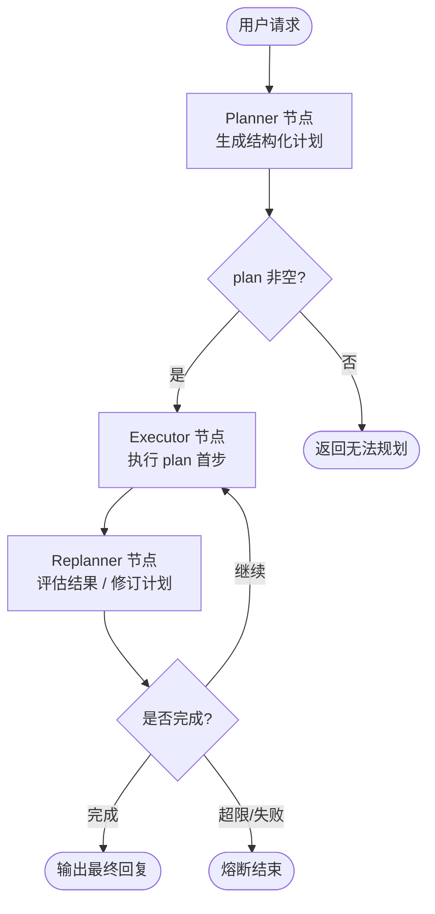
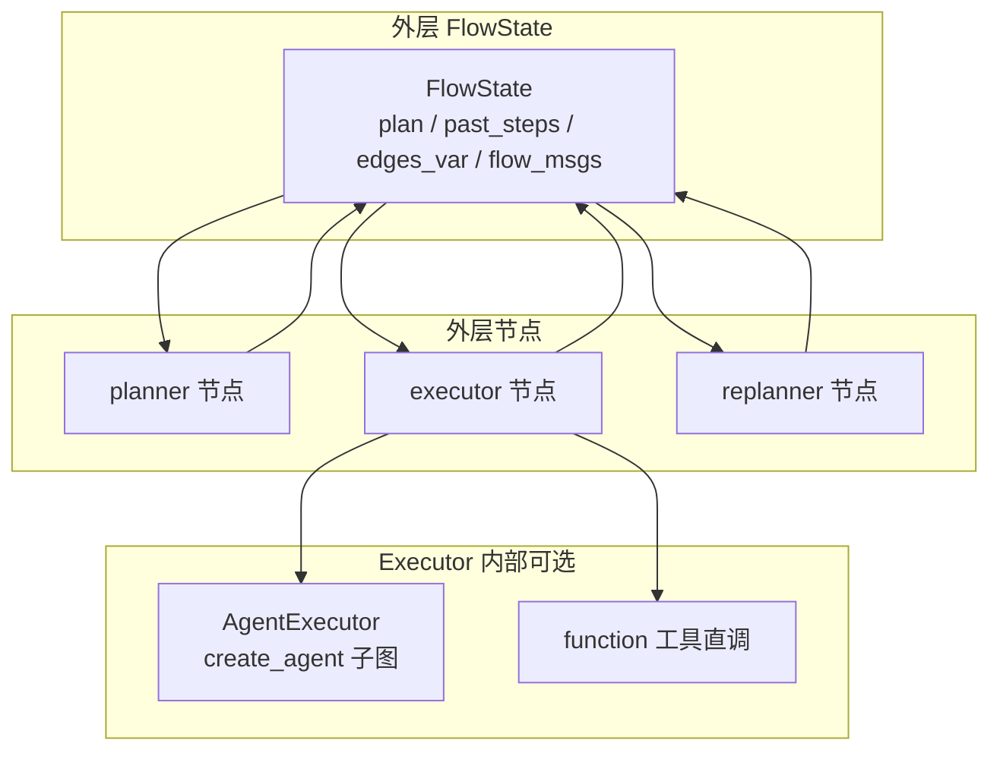
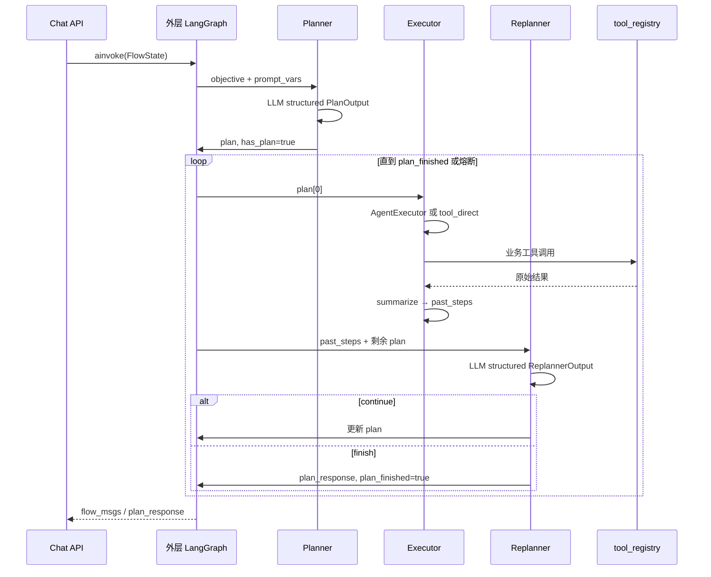

# Plan-and-Execute 路线 B 方案设计

本文档说明：在本项目（gd25-biz-agent-python）中按**路线 B**落地 LangGraph 经典 **Plan-and-Execute** 架构时，需要新增哪些模块、如何扩展状态与流程编排、与现有 YAML 流程体系如何衔接，以及分阶段实施与风险控制。

> **路线 B 定义**：在**外层 LangGraph 流程图**中引入独立的 **Planner / Executor / Replanner** 节点，由 LLM **运行时动态生成与修订执行计划**；计划、执行历史、最终结论写入 **FlowState 共享状态**，通过条件边在节点间循环，直到 Replanner 判定任务完成。

> **与路线 A 的关系**：路线 A（`TodoListMiddleware`）在单 Agent 节点内轻量自规划；路线 B 是流程级、可审计、可独立观测的重规划架构。两者可并存：简单多步任务用 A，开放式长链路任务用 B。

---

## 一、背景与选型依据

### 1.1 当前项目编排模式（基线）

本项目外层流程由 **YAML 静态定义 + `GraphBuilder` 编译**：

```
intent_recognition → retrieval_node → core_agent → END
```

- **Planner = 人**（YAML 设计者）
- **Executor = 各 agent / function 节点**
- **路由 = 条件边**（`edges_var` + `ConditionEvaluator`）

模型的多步能力目前发生在 **单个 Agent 节点内部的 ReAct 循环**，没有「先全局规划、再逐步执行、再动态重规划」的三段式结构。

### 1.2 路线 B 要解决的问题

| 痛点 | 路线 A 能否覆盖 | 路线 B 如何覆盖 |
|------|----------------|----------------|
| 长链路任务缺乏全局视野 | 部分（todo 列表） | Planner 先输出完整步骤 |
| 执行中需大幅改计划 | 部分（write_todos 替换） | 独立 Replanner 节点显式重规划 |
| 计划需可审计、可回放 | 弱（嵌在 Agent trace 内） | `plan` / `past_steps` 持久在 FlowState |
| 跨工具强依赖编排 | 中 | Executor 按步骤调度工具/子 Agent |
| 流程级限流与熔断 | 弱 | 可对 Planner/Executor/Replanner 分别设限 |

### 1.3 适用场景（本项目）

| 场景 | 建议 |
|------|------|
| 开放式健康报告生成（查多项指标 → 对比 → 建议 → 记录） | ✅ 路线 B |
| 数据清洗 pipeline 多阶段任务 | ✅ 路线 B |
| 单条血压记录 / 单意图 QA | ❌ 保持现有静态流程 |
| 意图识别 + 固定分支路由 | ❌ 现有 YAML 更合适 |

---

## 二、目标架构总览

### 2.1 经典三段式状态图



### 2.2 与现有工程的分层关系



**核心原则**：

1. **外层**用现有 `GraphBuilder` + YAML 定义 Planner/Executor/Replanner 节点与条件边。
2. **Executor 内部**可复用现有 `AgentFactory` / `tool_registry`，不重复造轮子。
3. **计划与执行历史**走 FlowState 专用字段，不仅藏在 Agent messages 里。

### 2.3 两种落地形态

#### 形态 1：独立 Plan-and-Execute 流程（推荐首期）

新建 `config/flows/plan_execute_agent/flow.yaml`，作为**专用流程**对外提供（如 `flow_key=plan_execute_agent`）。

```
entry: planner
planner → executor → replanner ⇄ executor
replanner → END（完成）
```

适合：试点验证、与现有 `medical_agent_v5` 并行，不影响线上主流程。

#### 形态 2：嵌入现有医疗流程（二期）

在 `medical_agent_v6` 等流程中，将 `core_agent` 替换为 plan 子链路：

```
intent_recognition → retrieval_node → planner → executor ⇄ replanner → END
```

检索结果通过 `prompt_vars` / `edges_var` 注入 Planner，使计划具备 RAG 上下文。

---

## 三、状态模型设计

### 3.1 扩展 `FlowState`

在 `backend/domain/state.py` 中新增 Plan-and-Execute 专用字段（`total=False`，向后兼容）：

```python
import operator
from typing import Annotated, List, Optional, Dict, Any, Literal
from typing_extensions import TypedDict

class PlanStep(TypedDict):
    """单步计划项"""
    step_id: str                          # 步骤 ID，如 "step_1"
    description: str                      # 自然语言描述
    tool_name: Optional[str]            # 建议调用的工具名（可为空，由 Executor LLM 决定）
    expected_output: Optional[str]      # 预期产出描述
    status: Literal["pending", "in_progress", "completed", "failed", "skipped"]

class PastStepRecord(TypedDict):
    """已执行步骤记录"""
    step_id: str
    description: str
    result_summary: str                   # 执行结果摘要（工具层应做摘要，避免上下文爆炸）
    success: bool
    error: Optional[str]

class FlowState(TypedDict, total=False):
    # ... 现有字段保持不变 ...

    # ========== Plan-and-Execute 扩展 ==========
    objective: str                        # 用户目标（通常取自 current_message）
    plan: List[PlanStep]                  # 当前待执行/执行中的计划（Replanner 可整体替换）
    past_steps: Annotated[List[PastStepRecord], operator.add]  # 历史执行记录（追加型 reducer）
    plan_response: Optional[str]          # Replanner 判定完成时的最终回复
    plan_finished: bool                   # 是否结束（供条件边路由）
    plan_iteration: int                   # 已循环次数（熔断用）
    plan_metadata: Optional[Dict[str, Any]]  # 版本号、规划模型、耗时等
```

**设计说明**：

| 字段 | 写入节点 | 用途 |
|------|----------|------|
| `objective` | Chat API / Planner 入口 | 规划输入 |
| `plan` | Planner、Replanner | 当前步骤队列；Executor 消费 `plan[0]` |
| `past_steps` | Executor | 追加执行记录；Replanner 读历史做决策 |
| `plan_response` | Replanner | 完成时写入；Chat API 优先取此字段 |
| `plan_finished` | Replanner | 条件边：`plan_finished == true` → END |
| `plan_iteration` | Replanner 或 Builder 包装 | `plan_iteration >= max_iterations` → 熔断 |

### 3.2 Pydantic 结构化输出（Planner / Replanner）

为避免 JSON 解析失败，Planner 与 Replanner 的 LLM 输出应使用 **Pydantic v2 模型 + `with_structured_output`**：

```python
from pydantic import BaseModel, Field
from typing import List, Optional, Union

class PlanOutput(BaseModel):
    """Planner 输出"""
    steps: List[PlanStepModel] = Field(description="有序执行步骤，保持细粒度")
    reasoning: Optional[str] = Field(default=None, description="规划理由，便于 Langfuse 审计")

class PlanStepModel(BaseModel):
    step_id: str
    description: str
    tool_name: Optional[str] = None
    expected_output: Optional[str] = None

class ReplannerContinue(BaseModel):
    """Replanner：继续执行"""
    action: Literal["continue"] = "continue"
    steps: List[PlanStepModel] = Field(description="修订后的剩余步骤")

class ReplannerFinish(BaseModel):
    """Replanner：任务完成"""
    action: Literal["finish"] = "finish"
    response: str = Field(description="面向用户的最终回复")

# Replanner 使用 Union 或 discriminated union
ReplannerOutput = Union[ReplannerContinue, ReplannerFinish]
```

与现有 `agent_creator` 中「从 output 字符串解析 JSON」相比，结构化输出可显著降低 Planner/Replanner 节点的解析失败率。

### 3.3 `edges_var` 与专用字段的分工

| 数据 | 存放位置 | 原因 |
|------|----------|------|
| `intent`、`confidence` 等业务路由变量 | `edges_var` | 与现有条件边体系一致 |
| `plan`、`past_steps` | FlowState 专用字段 | 循环体内高频读写，避免与节点级 `edges_var` 清空逻辑冲突 |
| `plan_finished` | 同时写 `edges_var` + 专用字段 | 条件边评估器读 `edges_var` 更简单 |

**注意**：现有 `AgentNodeCreator` 每次执行后会 **`new_state["edges_var"] = {}`** 清空边变量。Plan 节点创建器**不能**沿用该逻辑，需使用独立的 `PlanNodeCreator` 基类行为。

---

## 四、节点类型与职责

### 4.1 新增节点类型一览

| YAML `type` | 创建器类 | 职责 |
|-------------|----------|------|
| `planner` | `PlannerNodeCreator` | 根据 objective + 上下文生成 `plan` |
| `plan_executor` | `PlanExecutorNodeCreator` | 执行 `plan[0]`，写 `past_steps`，更新步骤状态 |
| `replanner` | `ReplannerNodeCreator` | 读 `past_steps`，决定继续或结束 |
| `plan_router` | `PlanRouterNodeCreator`（可选） | 纯逻辑节点：判断 `plan` 是否为空、是否超限 |

在 `backend/domain/flows/nodes/registry.py` 注册：

```python
node_creator_registry.register("planner", PlannerNodeCreator())
node_creator_registry.register("plan_executor", PlanExecutorNodeCreator())
node_creator_registry.register("replanner", ReplannerNodeCreator())
```

### 4.2 Planner 节点

**输入**：

- `state.objective` 或 `state.current_message.content`
- `state.history_messages`
- `state.prompt_vars` / `persistence_edges_var`（RAG、用户信息等）

**处理**：

1. 加载节点专属 prompt（`prompts/planner.md`）
2. 调用 LLM 结构化输出 `PlanOutput`
3. 校验：步骤数 ≤ `max_steps`、工具名在 `tool_registry` 中存在（若指定）
4. 写入 `state.plan`、`state.plan_iteration = 0`

**输出**：

```python
{
    "plan": [...],
    "plan_finished": False,
    "edges_var": {"has_plan": len(plan) > 0},
    "plan_metadata": {"planner_model": "...", "step_count": N},
}
```

**Prompt 要点**（`planner.md`）：

- 先理解用户目标，再拆步骤；每步足够小、可在一个工具调用或一次 Executor 内完成
- 医疗场景：禁止编造数据；涉及记录/查询必须标明对应工具名
- 输出步骤数上限（配置项，默认 8）

### 4.3 Executor 节点

**输入**：`state.plan[0]`（当前步骤）

**处理（两种实现，可配置）**：

| 模式 | 说明 | 适用 |
|------|------|------|
| `tool_direct` | 若 `tool_name` 有值，直接调 `tool_registry` | 步骤明确、参数可从上下文推断 |
| `agent_react` | 用 `AgentFactory.create_agent` 执行单步任务 | 步骤模糊、需 LLM 推理 |

推荐首期用 **`agent_react`**，与现有工具体系一致；在 prompt 中注入「当前只需完成这一步：{description}」。

**输出**：

```python
{
    "past_steps": [{
        "step_id": step["step_id"],
        "description": step["description"],
        "result_summary": summarized_result,  # 必须摘要，见 4.6
        "success": True,
        "error": None,
    }],
    "plan": updated_plan,  # 去掉已完成的首步或标记 completed
}
```

### 4.4 Replanner 节点

**输入**：`objective`、`plan`（剩余）、`past_steps`（全量）

**处理**：

1. LLM 结构化输出 `ReplannerOutput`
2. `continue`：用新 `steps` **替换** `state.plan`
3. `finish`：写 `plan_response`、`plan_finished=True`
4. `plan_iteration += 1`；若超过 `max_iterations` 强制 finish（熔断）

**输出**：

```python
# 继续
{"plan": new_steps, "plan_finished": False, "edges_var": {"plan_finished": False}}

# 完成
{
    "plan_response": "...",
    "plan_finished": True,
    "edges_var": {"plan_finished": True},
    "flow_msgs": [AIMessage(content="...")],
}
```

### 4.5 条件边与循环（YAML）

```yaml
edges:
  - from: planner
    to: plan_executor
    condition: has_plan == true

  - from: planner
    to: END
    condition: has_plan != true

  - from: plan_executor
    to: replanner
    condition: always

  - from: replanner
    to: plan_executor
    condition: plan_finished != true && plan_iteration < 20

  - from: replanner
    to: END
    condition: plan_finished == true || plan_iteration >= 20
```

**`GraphBuilder` 注意点**：现有实现已支持条件边；需确认 `plan_iteration >= 20` 这类数值比较在 `ConditionEvaluator` 中可用（若不支持，在 `plan_router` 节点预计算 `should_abort` 布尔值）。

### 4.6 大结果摘要（必做）

与面试材料一致：**工具返回的大结构数据必须在 Executor 内摘要后再写入 `past_steps`**。

建议在 `PlanExecutorNodeCreator` 中统一处理：

```python
def summarize_tool_result(raw: Any, max_chars: int = 2000) -> str:
    """将工具原始返回压缩为 Replanner 可消费的摘要"""
    ...
```

否则多步执行后 `past_steps` 迅速撑爆上下文，Replanner 质量下降。

---

## 五、配置模型与 YAML 示例

### 5.1 新增 Pydantic 配置类

在 `backend/domain/flows/models/definition.py` 中扩展：

```python
class PlanNodeConfig(BaseModel):
    """Planner / Replanner 共用配置基类"""
    prompt: str
    model: ModelConfig
    max_steps: int = Field(default=8, description="计划最大步骤数")
    max_iterations: int = Field(default=20, description="Executor-Replanner 最大循环次数")

class PlanExecutorNodeConfig(BaseModel):
    """Executor 节点配置"""
    prompt: str
    model: ModelConfig
    tools: Optional[List[str]] = None
    execution_mode: Literal["agent_react", "tool_direct"] = "agent_react"
    result_max_chars: int = Field(default=2000, description="单步结果摘要最大字符数")
```

### 5.2 完整流程 YAML 示例（形态 1）

`config/flows/plan_execute_agent/flow.yaml`：

```yaml
name: plan_execute_agent
version: "1.0"
description: "Plan-and-Execute 试点流程 - 动态规划与重规划"

nodes:
  - name: planner
    type: planner
    config:
      prompt: prompts/planner.md
      max_steps: 8
      max_iterations: 20
      model:
        provider: doubao
        name: doubao-seed-1-6-251015
        temperature: 0.3
        thinking:
          type: disabled

  - name: plan_executor
    type: plan_executor
    config:
      prompt: prompts/executor.md
      execution_mode: agent_react
      result_max_chars: 2000
      model:
        provider: doubao
        name: doubao-seed-1-8-251228
        temperature: 0.5
        thinking:
          type: enabled
        reasoning_effort: low
        timeout: 1800
      tools:
        - query_blood_pressure
        - query_medication
        - query_symptom
        - query_health_event
        - record_blood_pressure
        - record_medication

  - name: replanner
    type: replanner
    config:
      prompt: prompts/replanner.md
      max_iterations: 20
      model:
        provider: doubao
        name: doubao-seed-1-6-251015
        temperature: 0.3
        thinking:
          type: disabled

edges:
  - from: planner
    to: plan_executor
    condition: has_plan == true

  - from: planner
    to: END
    condition: has_plan != true

  - from: plan_executor
    to: replanner
    condition: always

  - from: replanner
    to: plan_executor
    condition: plan_finished != true && should_abort != true

  - from: replanner
    to: END
    condition: plan_finished == true || should_abort == true

entry_node: planner
```

### 5.3 Prompt 文件结构

```
config/flows/plan_execute_agent/
├── flow.yaml
└── prompts/
    ├── planner.md      # 规划规则、工具清单、输出格式说明
    ├── executor.md     # 单步执行约束、禁止越权、摘要要求
    └── replanner.md    # 何时 continue / finish、医疗安全边界
```

---

## 六、代码改造清单

### 6.1 必改文件

| 文件 | 改造内容 |
|------|----------|
| `backend/domain/state.py` | 扩展 `FlowState`、`PlanStep`、`PastStepRecord` |
| `backend/domain/flows/models/definition.py` | 新增 `PlanNodeConfig`、`PlanExecutorNodeConfig` |
| `backend/domain/flows/nodes/planner_creator.py` | 新建 Planner 节点 |
| `backend/domain/flows/nodes/plan_executor_creator.py` | 新建 Executor 节点 |
| `backend/domain/flows/nodes/replanner_creator.py` | 新建 Replanner 节点 |
| `backend/domain/flows/nodes/registry.py` | 注册三种新 type |
| `backend/domain/planning/structured_output.py` | 新建：Pydantic 规划/重规划模型 + LLM 调用封装 |
| `backend/domain/planning/summarizer.py` | 新建：工具结果摘要 |
| `config/flows/plan_execute_agent/` | 新建试点流程与 prompts |

### 6.2 建议改文件

| 文件 | 改造内容 |
|------|----------|
| `backend/app/api/helpers.py` | `build_initial_state` 写入 `objective` |
| `backend/app/api/routes/chat.py` | 完成时优先取 `plan_response`；可选返回 `plan` / `past_steps` |
| `backend/app/api/schemas/chat.py` | 扩展 `ChatResponse`（`plan_summary`、`steps_completed`） |
| `backend/domain/flows/condition_evaluator.py` | 支持 `plan_iteration` 数值比较（若尚未支持） |
| `backend/infrastructure/observability/langfuse_handler.py` | 节点 span 增加 `plan_step_count`、`iteration` metadata |

### 6.3 可选改文件

| 文件 | 改造内容 |
|------|----------|
| `backend/domain/flows/builder.py` | 提供 `build_plan_execute_subgraph()` 工厂方法，减少 YAML 重复 |
| `backend/domain/flows/manager.py` | 预加载配置增加 `plan_execute_agent` |
| `cursor_test/test_plan_execute_flow.py` | 端到端测试 |
| `frontend/` | 展示计划进度条（消费 `past_steps`） |

### 6.4 明确不需要改动的部分

| 模块 | 原因 |
|------|------|
| `requirements.txt` | 不新增依赖；沿用 LangGraph 1.x + LangChain 1.x + Pydantic 2.x |
| `backend/domain/tools/*` 业务工具定义 | 工具本身不变；Executor 按名调用 |
| `backend/domain/flows/builder.py` 核心编译逻辑 | 条件边机制已满足循环，除非加子图工厂 |
| PostgreSQL 表结构 | 首期不落库；计划状态在内存 FlowState 中 |

---

## 七、执行链路（改造后数据流）

### 7.1 端到端时序



### 7.2 Chat API 响应优先级

```python
# 建议取值顺序
reply = (
    result.get("plan_response")
    or extract_last_ai_message(result.get("flow_msgs", []))
    or "抱歉，暂时无法完成您的请求。"
)
```

---

## 八、可观测性（Langfuse）

### 8.1 Trace 结构（目标形态）

```
Trace: chat_api
├── Span: planner
│   ├── metadata: step_count, model
│   └── output: plan (JSON)
├── Span: plan_executor (iteration=1)
│   ├── tool: query_blood_pressure
│   └── output: result_summary
├── Span: replanner (iteration=1)
│   └── decision: continue | finish
├── Span: plan_executor (iteration=2)
...
```

### 8.2 实现要点

1. **外层 config callbacks** 继续用 `create_langfuse_handler`（与现网一致）。
2. 每个 Plan 节点函数内打 **子 span** 或通过 `metadata` 写入 `plan_iteration`、`current_step_id`。
3. **不要把完整 plan 原文重复写入每条 tool span**；用 `plan_id` + `step_id` 关联即可。
4. Replanner 的 `reasoning` 字段写入 span output，便于排查「为何改计划」。

---

## 九、与路线 A 的对比与组合策略

| 维度 | 路线 A（TodoListMiddleware） | 路线 B（本方案） |
|------|------------------------------|------------------|
| 改造范围 | `AgentFactory` + 节点 config | 新节点类型 + FlowState + 新 flow |
| 规划可见性 | Agent 内部 todos | 流程级 `plan` / `past_steps` |
| 重规划 | 模型自发 write_todos | 独立 Replanner 节点 |
| Langfuse 审计 | tool call 级 | 节点级 + 计划级 |
| Token 成本 | 中 | 高（至少 3 类 LLM 节点） |
| 上线风险 | 低 | 中高 |
| 适合任务 | 单节点多步 | 跨多步、需全局重规划 |

**组合策略**：

- 主流程 `medical_agent_v5` 保持静态 YAML。
- `core_agent` 可开路线 A（`planning: true`）处理节点内多工具串联。
- 新接 **开放式任务 API** 走 `plan_execute_agent`（路线 B）。
- 避免同一条请求链路同时跑 A+B，防止双重规划浪费 token。

---

## 十、风险、熔断与测试

### 10.1 风险矩阵

| 风险 | 影响 | 缓解措施 |
|------|------|----------|
| Planner 产出不可执行步骤 | Executor 失败 | 工具名校验；Replanner 修订；步骤模板约束 |
| 无限循环 | 成本飙升 | `max_iterations` + `should_abort` |
| 上下文膨胀 | Replanner 失真 | 强制 `summarize_tool_result` |
| 结构化输出失败 | 节点异常 | fallback 到 JSON 解析（复用 `_parse_json_from_output_string`） |
| 延迟显著增加 | 用户体验 | 仅开放场景启用；简单问答题走原流程 |
| `edges_var` 被清空 | 路由异常 | Plan 节点不用 Agent 那套清空逻辑 |

### 10.2 熔断规则（建议默认值）

| 参数 | 默认值 | 说明 |
|------|--------|------|
| `max_steps` | 8 | Planner 单次计划上限 |
| `max_iterations` | 20 | Executor↔Replanner 循环上限 |
| `executor_timeout` | 1800s | 单步 Agent 超时（与现网一致） |
| `result_max_chars` | 2000 | 单步摘要上限 |

### 10.3 测试清单

- [ ] Planner 对复合问题生成 ≥2 步计划
- [ ] Executor 逐步执行并正确追加 `past_steps`
- [ ] Replanner 在工具失败时修订计划（continue）
- [ ] Replanner 在完成全部步骤后 finish 并输出 `plan_response`
- [ ] `max_iterations` 触发 `should_abort` 且 API 返回友好错误
- [ ] 工具大结果摘要后 Replanner 仍可理解
- [ ] Langfuse trace 可区分 planner / executor / replanner
- [ ] 与现有 `medical_agent_v5` 回归互不影响

---

## 十一、分阶段实施计划

### 阶段 0：设计评审（0.5 天）

- 确认首期用形态 1（独立 flow）还是形态 2（嵌入医疗流程）
- 确认 Executor 默认 `agent_react` 还是 `tool_direct`
- 评审 Prompt 安全边界（医疗）

### 阶段 1：状态与结构化输出（1～2 天）

1. 扩展 `FlowState` 与 Pydantic 模型
2. 实现 `structured_output.py`（豆包 structured output 联调）
3. 单元测试：Planner/Replanner 模型解析

### 阶段 2：三节点创建器（2～3 天）

1. `PlannerNodeCreator`
2. `PlanExecutorNodeCreator`（复用 `AgentFactory`）
3. `ReplannerNodeCreator`
4. 注册到 `node_creator_registry`

### 阶段 3：试点流程与 API（1～2 天）

1. 新建 `config/flows/plan_execute_agent/`
2. `build_initial_state` 补 `objective`
3. Chat API 支持选择 `flow_key`（或新路由 `/chat/plan`）
4. Langfuse metadata 补充

### 阶段 4：联调与压测（1～2 天）

1. 3～5 个多步医疗场景用例
2. 对比路线 A / 静态流程的延迟与成功率
3. 调 `max_steps`、`max_iterations` 参数

### 阶段 5：产品化（可选）

1. 前端计划进度展示
2. 嵌入 `medical_agent_v6`（形态 2）
3. `cursor_test` 自动化覆盖

**预估总工期**：约 **6～10 人天**（视豆包 structured output 联调难度而定）。

---

## 十二、目录结构建议（新增文件）

```
backend/domain/planning/
├── __init__.py
├── models.py              # PlanOutput, ReplannerOutput 等 Pydantic 模型
├── structured_output.py   # get_structured_llm_response()
└── summarizer.py          # summarize_tool_result()

backend/domain/flows/nodes/
├── planner_creator.py
├── plan_executor_creator.py
└── replanner_creator.py

config/flows/plan_execute_agent/
├── flow.yaml
└── prompts/
    ├── planner.md
    ├── executor.md
    └── replanner.md

cursor_test/
└── test_plan_execute_flow.py
```

---

## 十三、总结

| 问题 | 答案 |
|------|------|
| 路线 B 是什么？ | 外层 LangGraph 上独立 Planner / Executor / Replanner 三段式循环 |
| LangGraph 是否原生支持？ | **无单一 API**；用 StateGraph + 条件边 + 共享状态实现（官方教程同款模式） |
| 本工程能接吗？ | **能**，与现有 `GraphBuilder`、工具注册、Langfuse 兼容 |
| 主要改动？ | 新节点类型、扩展 `FlowState`、新 flow YAML、Chat 取 `plan_response` |
| 新增依赖？ | **不需要** |
| 与路线 A 关系？ | 互补；A 轻量节点内规划，B 流程级可审计重规划 |
| 推荐首期？ | 独立 `plan_execute_agent` 流程试点，不动 `medical_agent_v5` 主链路 |

路线 B 的本质是：**把「规划权」从 YAML 设计者手里，部分交给运行时 LLM**，同时用 LangGraph 状态图把规划、执行、重规划固定在可观测、可熔断的工程骨架上。适合作为路线 A 验证后的**进阶方案**，用于开放式、长链路、强依赖任务。

---

## 附录 A：与 LangGraph 官方 Plan-and-Execute 教程的对照

| 官方教程概念 | 本方案映射 |
|--------------|------------|
| `PlanExecute` TypedDict | `FlowState` 扩展字段 |
| `plan_step` 节点 | `planner` 节点（`type: planner`） |
| `execute_step` 节点 | `plan_executor` 节点 |
| `replan_step` 节点 | `replanner` 节点 |
| `should_end` 路由函数 | YAML 条件边 + `plan_finished` / `should_abort` |
| `agent_executor` 子图 | `AgentFactory.create_agent`（Executor 内部） |

## 附录 B：相关源码索引

| 文件 | 职责 |
|------|------|
| `backend/domain/state.py` | FlowState 定义 |
| `backend/domain/flows/builder.py` | 外层图编译 |
| `backend/domain/flows/nodes/agent_creator.py` | 现有 Agent 节点（参考，勿直接复用 edges_var 清空逻辑） |
| `backend/domain/agents/factory.py` | Executor 内部子 Agent |
| `backend/domain/tools/registry.py` | 工具注册表 |
| `backend/app/api/routes/chat.py` | 对外 Chat 接口 |
| `cursor_docs/071301-TodoListMiddleware路线A改造方案.md` | 路线 A 对照文档 |
| LangGraph 官方 | [Plan-and-Execute Tutorial](https://langchain-ai.github.io/langgraph/tutorials/plan-and-execute/plan-and-execute/) |
