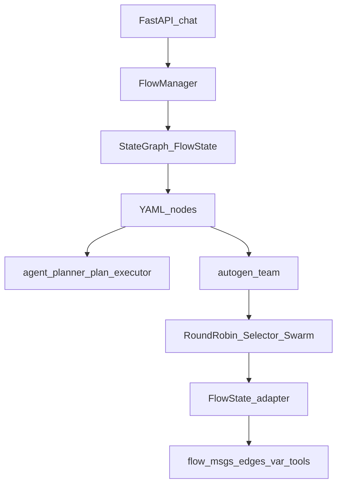
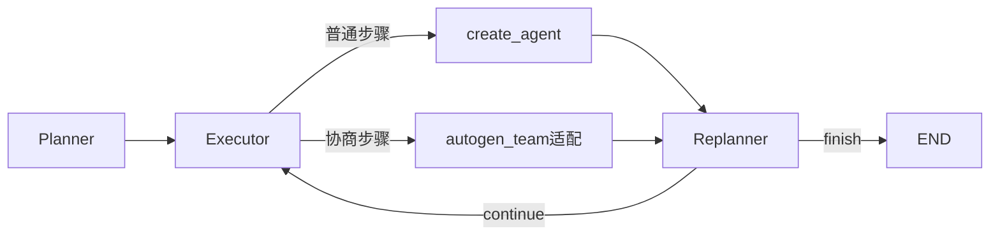
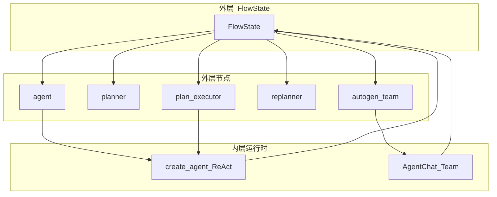

# AutoGen 与 LangGraph 融合方案

本文档说明：在本项目（gd25-biz-agent-python）中，如何**一步一步**评估并落地 Microsoft **AutoGen AgentChat（0.7.x）** 与现有 **YAML + LangGraph** 流程体系的融合——包括包兼容边界、协作模式对照、推荐构造方式，以及分阶段实施与风险控制。

> **定案**：采用 **外层 LangGraph（本系统 Flow）+ 内层 AutoGen Team（节点）**。  
> 不把 AutoGen Runtime 抬到 FastAPI / `FlowManager` 入口外层（官方 cookbook 是反向封装，与本项目 YAML 流程体系冲突）。

> **与路线 B 的关系**：路线 B（Plan-and-Execute，见 `ai_docs/26071301-Plan-and-Execute路线B方案设计.md`）解决「可审计的计划—执行—重规划」。本方案解决「开放式多角色协商/评审」。两者可并存：主链路用 YAML / 路线 B，局部协商用 AutoGen Team 节点。

> **详细技术设计**：类 / 状态字段 / YAML Schema / 三桥契约 / 测试与验收见 [`26071402-AutoGen与LangGraph融合技术设计.md`](./26071402-AutoGen与LangGraph融合技术设计.md)。

---

## 一、背景与问题边界

### 1.1 当前系统编排基线

本项目外层流程由 **YAML 静态定义 + `GraphBuilder` 编译为 `StateGraph(FlowState)`**：

```
FastAPI chat → FlowManager.get_flow → Compiled StateGraph + MemorySaver
  → 节点：agent / function / rag_agent / planner / plan_executor / replanner
  → 条件边：edges_var + ConditionEvaluator
```

| 层级 | 实现 | 职责 |
|------|------|------|
| 外层 Flow | `builder.py` / `manager.py` / `config/flows/*/flow.yaml` | 流程编排、会话 checkpoint、统一状态 |
| 节点 | `nodes/registry.py` + 各 `*Creator` | 可插拔节点类型 |
| 内层 ReAct | `agents/factory.py` → `langchain.agents.create_agent` | 单 Agent 工具循环 |
| 状态 | `domain/state.py` → `FlowState` | 跨节点共享数据 |

**现有多 Agent 形态（纯 LangGraph）**：

1. **意图路由**：条件边把请求打到专科 agent（medical v4 / v6）。
2. **单超 agent**：RAG 后一个 ReAct agent 挂多工具（medical v5）。
3. **Plan-and-Execute**：Planner → Executor ⇄ Replanner（`plan_execute_agent`）。

协作靠 **图边 + 共享 FlowState**，不是 AutoGen 式 Group Chat。

### 1.2 为什么考虑 AutoGen

| 痛点 | 现有能力 | AutoGen 可能补什么 |
|------|----------|-------------------|
| 开放式多角色辩论 / 批评—修订 | 无现成 Team API | `RoundRobinGroupChat` 等开箱 Team |
| 动态选「下一说话人」 | 需自写条件边 + 选人 LLM | `SelectorGroupChat` |
| 显式 Handoff 移交 | 可用条件边近似 | `Swarm` + `HandoffMessage` |
| 医疗主路径固定路由 | YAML 已足够 | **不必引入 AutoGen** |

### 1.3 本文不解决什么

- 不替换 `FlowManager` / YAML 配置体系。
- 不把医疗意图固定分支改成 Group Chat。
- 本文侧重选型与节奏；**可编码级细节**见技术设计文档 `26071402`。

---

## 二、第一步：包兼容性

### 2.1 目标包（选型定案）

| 包 | 用途 | 说明 |
|----|------|------|
| `autogen-agentchat` | AgentChat 高层 API（Agent / Team） | **推荐入口** |
| `autogen-core` | Runtime / 消息 / CancellationToken | AgentChat 依赖 |
| `autogen-ext` | OpenAI 等 model client、扩展 | 模型与工具扩展 |

**明确不采用**：旧版 `pyautogen`（0.2 GroupChat API）。本项目应直接对齐 **AutoGen 0.4+ / AgentChat 0.7.x**。

### 2.2 环境实测矩阵（2026-07-14）

在 conda 环境 `py311_GD25_autoGen` / `py311_GD25_base`（Python 3.11）中实测：

| 组件 | 实测版本 | 结果 |
|------|----------|------|
| `autogen-agentchat` | 0.7.5 | 可 import |
| `autogen-core` | 0.7.5 | 可 import |
| `autogen-ext` | 0.7.5 | 可 import |
| `langgraph` | 1.0.5 | 与仓库 lock 一致 |
| `langchain` / `langchain-core` | 1.2.0 / 1.2.5 | 同环境无冲突 |
| `openai` | 1.109.1 | 同环境无冲突 |
| `pydantic` | 2.12.5 | 同环境无冲突 |
| `pip check` | — | **No broken requirements** |
| Team 类 | RoundRobin / Selector / MagenticOne | **可成功 import** |

**结论**：AutoGen 0.7.x 与当前 `langgraph>=1` / `langchain>=1` **可以共存于同一 Python 环境**，包层面无硬冲突。

### 2.3 仓库依赖声明（已入库）

| 位置 | AutoGen 声明 |
|------|----------------|
| `requirements.txt` | **已声明** 范围约束 `>=0.7.0,<1.0.0`（含 `autogen-ext[openai]`） |
| `requirements.lock` | **已锁定** `autogen-agentchat/core/ext==0.7.5`（由 `py311_GD25_autoGen` freeze） |
| conda 本地环境 | `py311_GD25_autoGen` 与声明一致 |

推荐开发环境：`conda activate py311_GD25_autoGen`。节点编码与 lazy flow 接入前仍须完成 P0/P1 兼容与模型桥验证（见技术设计文档）。

### 2.4 兼容风险点（「能装」≠「能无缝用」）

#### （1）模型客户端适配

| 本项目 | AutoGen 默认 |
|--------|----------------|
| `ProviderManager` + `config/model_providers.yaml` | `OpenAIChatCompletionClient` |
| `DoubaoChatOpenAI` / Volcengine ARK | 偏 OpenAI / Azure OpenAI 直连 |

**风险**：豆包 / ARK 的 base_url、api_key、模型名若未正确注入 AutoGen client，Team 无法跑通。

**适配方向**：

1. 从 `ProviderManager.get_provider(...)` 读取 endpoint / key / 模型；
2. 构造兼容 OpenAI API 的 `OpenAIChatCompletionClient`（若 ARK 已兼容 Chat Completions）；
3. 若扩展点不够，再评估 `autogen-ext` 自定义 model client，或「用 LangChain 模型包一层」的试验——以 P1 PoC 结果为准。

#### （2）工具桥接

| 本项目 | AutoGen |
|--------|---------|
| `@register_tool` + `tool_registry` | `AssistantAgent(..., tools=[...])` |
| 运行时注入 `token_id` 等 | 需自行包装闭包 |

**风险**：不能直接把 LangChain Tool 对象塞给 AutoGen；需适配器把注册工具包装成可调用函数，并透传会话上下文。

#### （3）消息与状态模型不一致

| 本项目 | AutoGen |
|--------|---------|
| `langchain_core.messages.BaseMessage` | `TextMessage` / `TaskResult` 等 |
| `FlowState.flow_msgs` + reducers | Team 内部 transcript |

**风险**：需显式双向转换；禁止两套消息列表无协议地混写进 checkpoint。

#### （4）异步与会话生命周期

- 外层：`graph.ainvoke(..., config={"configurable": {"thread_id": session_id}})`。
- 内层 Team：`await team.run(task=...)` / `run_stream`，另有 `CancellationToken`、`team.reset()`。

**风险**：未熔断的 Team 可能多轮对话导致成本爆炸；未 `reset` 可能污染同进程下一次任务。

#### （5）产品与生态选型风险

Microsoft 已将 AutoGen 置于 **maintenance**（修 bug / 安全补丁为主），新产线引导至 **Microsoft Agent Framework**（AutoGen + Semantic Kernel 收敛方向）。

**对本项目含义**：

- 短期试点用 AgentChat 0.7.x **可行**（本地已验证）。
- 若长期重仓多 Agent Team，P5 决策时必须复评：继续 AutoGen、迁 Agent Framework、或用纯 LangGraph 重写同等协作模式。

### 2.5 兼容结论清单

| 问题 | 结论 |
|------|------|
| AutoGen 包能否与当前代码依赖同环境安装？ | **能**（已实测 0.7.5 + LG 1.0.5） |
| 能否零改动直接替换现有 agent 节点？ | **不能**（模型 / 工具 / 消息需桥） |
| 依赖是否已写入仓库？ | **是**（`requirements.txt` + `requirements.lock`） |
| 推荐首选用哪条 AutoGen 产品线？ | **AgentChat 0.7.x**，不用 pyautogen 0.2 |

---

## 三、第二步：协作模式与融合构造

### 3.1 AutoGen AgentChat 协作模式

AgentChat 以 **Team** 组织多 Agent 协作。与本项目相关的预设：

| Team 类型 | 协作方式 | 典型用途 | 成本/可控性 |
|-----------|----------|----------|-------------|
| `RoundRobinGroupChat` | 参与者轮流发言，共享上下文 | 作者—批评者、双人辩论—修订 | 中；需 `TextMentionTermination` / `MaxMessageTermination` |
| `SelectorGroupChat` | LLM 选下一说话人 | 多专家会诊、动态角色调度 | 中高；选人本身耗 token |
| `Swarm` | `HandoffMessage` 显式移交 | 明确「交给谁处理」的流水 | 中；移交规则要设计好 |
| `MagenticOneGroupChat` | 通用开放式多 Agent | 网页/文件类开放任务 | **高**；不适合医疗主路径默认启用 |

终止条件常见组合：

- `TextMentionTermination("APPROVE")`：批评者批准即停。
- `MaxMessageTermination(n)`：硬上限，**生产必配**。
- `ExternalTermination`：外层超时 / 用户取消。

### 3.2 与现有 LangGraph 模式对照

| 场景 | 现有做法 | 是否引入 AutoGen | 理由 |
|------|----------|------------------|------|
| 意图固定分支（medical v4/v6） | YAML 条件边 | **否** | 静态路由更稳、可测、成本可控 |
| 单 Agent 多工具 ReAct | `create_agent` | **否** | 已够用，引入 Team 只会增成本 |
| 可审计计划执行 | Plan-and-Execute（路线 B） | **一般否** | `plan` / `past_steps` 已可审计 |
| 开放式多角色辩论 / 评审 / 会诊 | 无 | **是** | AutoGen Team 价值最大处 |
| 计划某步需「多专家协商一轮」 | `plan_executor` 单 ReAct | **可选** | Executor 内调用 `autogen_team` 适配器 |
| 开放式网页/文件 Agent | 无 | **慎用 MagenticOne** | 成本与不可控风险高 |

### 3.3 融合方向定案：外层 LangGraph + 内层 AutoGen



**为何不采用「外层 AutoGen + 内嵌 LangGraph」**（官方 cookbook 方向）：

1. 本项目入口、会话、`thread_id`、YAML 扫描预热均绑定 `FlowManager`。
2. chat 契约吃 `FlowOutputSchema`（尤其 `flow_msgs` / `plan_response`）。
3. AutoGen Runtime 抬到最外层会拆掉现有运维与热加载路径，收益不对等。

### 3.4 推荐构造：新节点类型 `autogen_team`

#### 3.4.1 注册方式（对齐现有扩展点）

在 `backend/domain/flows/nodes/registry.py` 增加：

```text
node_creator_registry.register("autogen_team", AutogenTeamNodeCreator())
```

实现模式对齐 `AgentNodeCreator` / `PlanExecutorNodeCreator`：

- 编译期：解析 YAML，缓存角色与 team 配置；
- 运行期：从 `FlowState` 拼 `task`，`await team.run(...)`，写回状态。

#### 3.4.2 YAML 示意（草案，实施时细化）

```yaml
nodes:
  - name: review_team
    type: autogen_team
    config:
      team_mode: round_robin   # round_robin | selector | swarm
      model:
        provider: doubao
        model_name: ...
      agents:
        - name: writer
          system_prompt: prompts/writer.md
          tools: [query_blood_pressure]
        - name: critic
          system_prompt: prompts/critic.md
          tools: []
      termination:
        text_mention: APPROVE
        max_messages: 8
      output:
        write_to_flow_msgs: true
        edges_var_key: review_approved
```

该 flow 建议放入 `config/flows/` 下独立目录，并在 `flow_loader.yaml` 标为 **lazy**，**不要**打进预热主路径（当前预热以 `medical_agent_v5` 为主）。

#### 3.4.3 状态桥（FlowState 适配器）

**输入（Flow → Team）**：

| 来源 | 用途 |
|------|------|
| `current_message` / `objective` | 拼 `task` 主文本 |
| `prompt_vars` / RAG 摘要 | 附加上下文（控制长度） |
| `history_messages`（可选） | 短摘要注入；默认不整包灌入，控成本 |
| `token_id` / `session_id` | 工具包装闭包 |

**输出（Team → Flow）**：

| 目标字段 | 内容 |
|----------|------|
| `flow_msgs` | 最终对用户可见回复（或协商摘要） |
| `edges_var` | 如 `review_approved` / `team_stop_reason`，供条件边 |
| 可选新字段 `team_result` | `stop_reason`、轮次、关键发言摘要 |
| 可选 `team_transcript` | 调试用完整/截断 transcript（生产默认关或限长） |

草案（`total=False`，向后兼容）：

```python
class FlowState(TypedDict, total=False):
    # ... 现有字段 ...
    team_result: Optional[Dict[str, Any]]
    team_transcript: Optional[List[Dict[str, Any]]]  # 限长或仅 debug
```

#### 3.4.4 工具桥

```text
tool_registry.get(name)
  → 包装为 async/sync callable（注入 token_id）
  → 挂到对应 AssistantAgent.tools
```

原则：

1. **只暴露 YAML 点名的工具**，避免 Team 内全量工具导致乱跑。
2. 工具返回先做摘要，防止 transcript 爆炸。
3. 错误转成可观测文本，由 critic / max_messages 熔断，而不是让外层图崩溃。

#### 3.4.5 与 Plan-and-Execute 组合



- **Planner / Replanner**：继续用现有节点（结构化 `PlanOutput`）。
- **Executor**：默认 `agent_react`；仅当某步元数据标记 `execution_mode: autogen_team`（或独立边进入 `autogen_team` 节点）时走 Team。
- **禁止**：用 AutoGen Team 整体替代 Planner/Replanner 审计链路。

### 3.5 三种落地形态

#### 形态 A：独立协作 Flow（推荐首期）

新建例如 `config/flows/autogen_review_agent/`：

```
entry → autogen_team → END
```

- 与 `medical_agent_v5`、`plan_execute_agent` 并行。
- 用 lazy_load，隔离风险。

#### 形态 B：嵌入现有医疗支路（二期试点）

```
... → rag_node → review_team(autogen_team) → specialist_agent → END
```

仅用于「生成草稿后多角色质检」类子场景；主意图路由仍用条件边。

#### 形态 C：Executor 步骤调用（与路线 B 组合）

在 `plan_execute_agent` 中对高风险步骤调用 Team。适合「先规划，再对关键步做会诊」——**实施难度高于 A，放在 P4**。

### 3.6 反模式

| 反模式 | 为何禁止 |
|--------|----------|
| 用 AutoGen Runtime 替换 `FlowManager` | 丢掉 YAML、checkpoint、chat 契约 |
| 主医疗路径默认 `MagenticOne` | 成本与不可控 |
| Team 不设 `MaxMessageTermination` / 超时 | Token 与时延不可控 |
| 两套消息无桥直接写入 `flow_msgs` | checkpoint / 前端解析混乱 |
| 为「看起来像多 Agent」而替换已稳定的意图分支 | ROI 为负 |

---

## 四、架构总览（与现有工程分层）



**核心原则**：

1. **外层**永远是 LangGraph + YAML + `FlowState`。
2. **AutoGen 只出现在节点内部**，对 Flow 表现为「黑盒函数：state in → state out」。
3. **工具、模型配置、可观测性**尽量复用 `tool_registry` / `ProviderManager` / Langfuse，而不是各建一套。

---

## 五、可观测性、安全与成本

| 维度 | 要求 |
|------|------|
| Trace | Team `run_stream` 事件挂到现有 `trace_id` / Langfuse span（如 `autogen_team.run`） |
| 熔断 | `max_messages` + 外层节点超时；超过写入 `edges_var` 并条件边到失败回复 |
| 日志 | 记录 team_mode、轮次、stop_reason；默认不落全文 transcript |
| 权限 | 工具集最小权限；与现网同样依赖 `token_id` |
| 成本 | P4 对比「同等场景纯 LangGraph 多节点」的 token / 时延 |

---

## 六、分阶段落地节奏（P0–P5）

### P0：兼容矩阵固化（不进主路径）

**目标**：把第二节结论变成可回归的检查。

- 在 `cursor_test/` 增加 `test_autogen_compat.py`：版本打印、Team 类 import、与 langgraph 同进程 import。
- 文档/注释中固定推荐环境：`py311_GD25_autoGen`。
- 依赖已在仓库声明；P0 **不**接入 YAML 节点 / 不改 preload 主路径。

**完成标准**：测试在目标 conda 环境下一键通过。

### P1：最小 PoC（独立于 Flow）

**目标**：证明「豆包/ARK + RoundRobin + 假工具」能跑完并终止。

- 脚本或测试：`RoundRobinGroupChat`（writer + critic）+ `TextMentionTermination` + `MaxMessageTermination`。
- 打通 `ProviderManager` → AutoGen model client。
- 记录失败模式（鉴权、模型名、超时）。

**完成标准**：一次完整 `APPROVE` 终止；有 token 用量粗估。

### P2：节点接入（lazy flow）

**目标**：`autogen_team` 进入注册表 + 独立 YAML flow。

- 实现 `AutogenTeamNodeCreator`。
- 新增 lazy flow（形态 A）。
- Chat 用独立 `flow_key` 联调，**不预热、不改 medical_agent_v5**。

**完成标准**：登录绑定该 flow 后，会话可返回协商后的最终回复。

### P3：状态与观测完备

**目标**：状态桥、熔断、Langfuse 分段可用。

- `team_result` / 可选限长 `team_transcript`。
- `edges_var` 驱动条件边。
- 超时 / max_messages 路径有明确用户可见文案。

**完成标准**：故意触发熔断时可观测、可断言。

### P4：业务试点 + 对比基线

**目标**：选 **1 个**「多角色评审」医学子场景做 A/B。

- 对照组：纯 LangGraph 双 agent 节点 + 条件边。
- 实验组：`autogen_team`。
- 对比：答案质量（人工）、轮次、时延、token、故障率。

**完成标准**：有书面对比结论，作为 P5 输入。

### P5：去留决策

> 依赖已入库；P5 关注**节点与 flow 的去留**，而非再次写入 requirements。

| 结果 | 动作 |
|------|------|
| 效果/成本优于或明显补足空白 | **保留** `autogen_team` 与试点 flow；补运维说明；评估是否上形态 B/C |
| 持平或更差 | **删除/禁用**节点类型与实验 flow；协作需求改用纯 LangGraph；依赖清理另开任务 |
| 长期战略转向 Agent Framework | 冻结 AutoGen 新功能，只维护安全补丁路径 |

---

## 七、与路线 B / 医学 YAML 的边界（速查）

| 需求 | 优先方案 |
|------|----------|
| 固定意图 → 专科回答 | 现有 medical YAML 条件边 |
| 长链路可审计执行 | 路线 B：`plan_execute_agent` |
| 单节点轻量自规划 | 路线 A：`TodoListMiddleware`（若已启用） |
| 多角色开放协商 / 质检 | **本方案**：`autogen_team` |
| 计划中某步要会诊 | 路线 B + 本方案形态 C（晚期） |

---

## 八、关键代码与配置锚点

| 锚点 | 路径 |
|------|------|
| 构图 | `backend/domain/flows/builder.py` |
| 加载/编译 | `backend/domain/flows/manager.py` |
| 节点注册 | `backend/domain/flows/nodes/registry.py` |
| 状态 | `backend/domain/state.py` |
| Agent 工厂 | `backend/domain/agents/factory.py` |
| 模型供应 | `backend/infrastructure/llm/providers/manager.py`、`client.py` |
| 流程配置 | `config/flows/`、`config/flow_loader.yaml` |
| 路线 B 设计 | `ai_docs/26071301-Plan-and-Execute路线B方案设计.md` |
| Chat 入口 | `backend/app/api/routes/chat.py` |

---

## 九、参考资料

1. 本仓库详细技术设计：`ai_docs/26071402-AutoGen与LangGraph融合技术设计.md`  
2. AutoGen AgentChat Teams：https://microsoft.github.io/autogen/stable/user-guide/agentchat-user-guide/tutorial/teams.html  
3. AutoGen 内嵌 LangGraph Agent（与本方案方向相反，仅作对照）：https://microsoft.github.io/autogen/stable/user-guide/core-user-guide/cookbook/langgraph-agent.html  
4. 本仓库 Plan-and-Execute 路线 B：`ai_docs/26071301-Plan-and-Execute路线B方案设计.md`  
5. LangGraph Plan-and-Execute 教程：https://langchain-ai.github.io/langgraph/tutorials/plan-and-execute/plan-and-execute/

---

## 十、一句话总结

**包能共存且依赖已入库，但不能零成本塞进节点；外层继续 LangGraph/YAML，内层用 `autogen_team` 承接开放式多角色协作，按 P0→P5 试点后再决定是否保留节点并进入主业务。**
