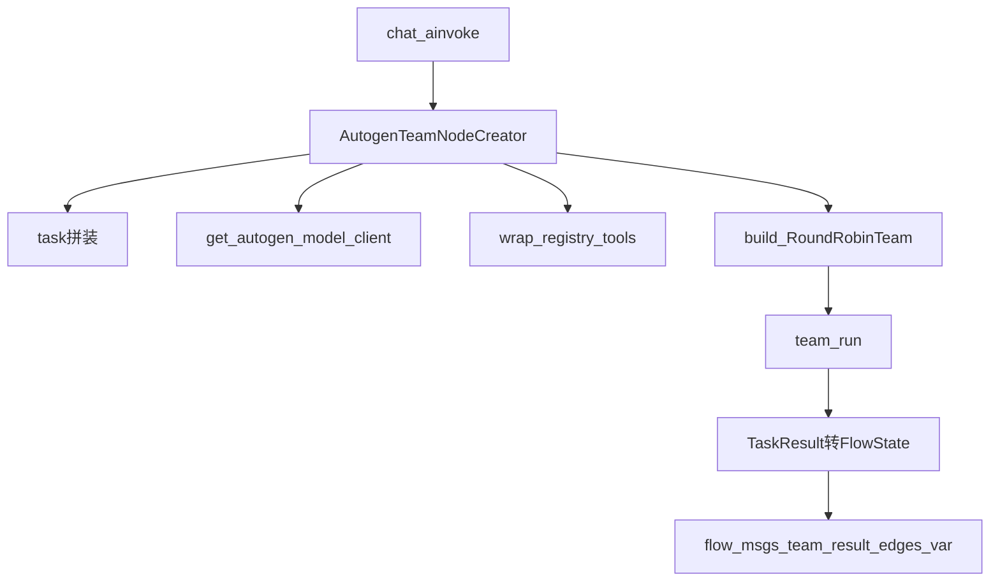

# AutoGen 与 LangGraph 融合：详细技术设计

本文档在 [`26071401-AutoGen与LangGraph融合方案.md`](./26071401-AutoGen与LangGraph融合方案.md) 的选型与边界之上，给出**可编码级**详细设计：模块划分、状态字段、YAML/Pydantic Schema、三桥契约、节点运行时序、测试与阶段验收。

> **方案文档** = Why / When（何时引入 AutoGen、与路线 B / 医学 YAML 的边界）。  
> **本文档** = How（类、字段、配置、伪代码、测试用例）。

> **范围定案**：详细设计覆盖 **P0–P3 + 形态 A**（独立 lazy flow：`autogen_review_agent`）。形态 B/C 与 P4–P5 仅写扩展接口与去留标准。  
> **本文档阶段不落地代码**；实施按第九节验收清单分批提交。

---

## 一、文档关系与目标

### 1.1 相关文档

| 文档 | 职责 |
|------|------|
| `ai_docs/26071401-AutoGen与LangGraph融合方案.md` | 融合方向、协作模式对照、P0–P5 节奏 |
| `ai_docs/26071301-Plan-and-Execute路线B方案设计.md` | Plan-and-Execute；与本设计并存不替代 |
| **本文** | `autogen_team` 节点与配套桥接的详细设计 |

### 1.2 首期交付目标（形态 A）

```
FastAPI chat（flow_key=autogen_review_agent）
  → FlowManager 懒加载
  → entry: review_team（type=autogen_team）
  → END
```

| 项 | 定案 |
|----|------|
| Team 模式 | 首期仅实现 **`round_robin`**（writer + critic） |
| YAML 预留 | `selector` / `swarm` 枚举存在，实现期直接 `ValueError` |
| 模型桥 | `ProviderManager` → `OpenAIChatCompletionClient`（ARK OpenAI 兼容） |
| MagenticOne | **不实现、不上主路径** |
| 依赖 | `requirements.txt` / `requirements.lock` **已含** AutoGen 0.7.x |

### 1.3 非目标

- 不替换 `FlowManager` / YAML / chat 契约。
- 不把 medical 意图路由改成 Group Chat。
- 不在首期实现 Selector / Swarm / MagenticOne。
- 不用 AutoGen Team 替代 Planner / Replanner。

---

## 二、目标架构与模块划分

### 2.1 运行时数据流



### 2.2 分层原则

1. **外层**永远是 LangGraph + YAML + `FlowState`（经 `GraphBuilder` / `FlowManager`）。
2. **AutoGen 仅存在于节点内部**：对 Flow 表现为 `async (FlowState) -> dict` 状态补丁。
3. **模型 / 工具 / 观测**复用 `ProviderManager`、`tool_registry`、Langfuse；不另建平行体系。

### 2.3 新增文件清单（实施时按此落地）

| 模块 | 路径 | 职责 |
|------|------|------|
| 配置模型 | `backend/domain/flows/models/autogen_config.py` | `AutogenTeamNodeConfig` 等 Pydantic |
| 节点创建器 | `backend/domain/flows/nodes/autogen_team_creator.py` | `AutogenTeamNodeCreator` |
| 模型桥 | `backend/infrastructure/llm/autogen_client.py` | `get_autogen_model_client` |
| 工具桥 | `backend/domain/autogen/tool_bridge.py` | `wrap_registry_tools` |
| 结果桥 | `backend/domain/autogen/result_bridge.py` | `TaskResult` → FlowState 字段 |
| 包初始化 | `backend/domain/autogen/__init__.py` | 导出桥接 API |
| 注册 | `backend/domain/flows/nodes/registry.py` | `register("autogen_team", ...)` |
| 状态扩展 | `backend/domain/state.py` | `TeamResult` / `team_result` / `team_transcript` |
| 流程配置 | `config/flows/autogen_review_agent/` | 形态 A YAML + prompts |
| 懒加载 | `config/flow_loader.yaml` | `lazy_load` 增加 `autogen_review_agent` |

对齐参考：

- [`backend/domain/flows/nodes/agent_creator.py`](../backend/domain/flows/nodes/agent_creator.py)
- [`backend/infrastructure/llm/client.py`](../backend/infrastructure/llm/client.py)
- [`backend/domain/flows/nodes/registry.py`](../backend/domain/flows/nodes/registry.py)
- [`backend/domain/flows/models/definition.py`](../backend/domain/flows/models/definition.py) 中 `ModelConfig` / `NodeDefinition`

---

## 三、状态模型设计

### 3.1 扩展 `FlowState`

在 `backend/domain/state.py` 增加（`total=False`，向后兼容）：

```python
from typing import TypedDict, List, Optional, Dict, Any, Literal


class TeamTranscriptItem(TypedDict, total=False):
    """Team 单条发言摘要（供调试 / 限长落库）"""

    source: str          # AutoGen message.source，如 writer / critic / user
    content: str         # 文本内容（可截断）
    type: str            # 消息类型名，如 TextMessage


class TeamResult(TypedDict, total=False):
    """autogen_team 节点结构化结果"""

    team_mode: Literal["round_robin", "selector", "swarm"]
    stop_reason: Optional[str]       # TaskResult.stop_reason 或本地生成原因
    message_count: int               # Team 产出消息条数（含 user task）
    final_content: str               # 面向用户的最终正文
    approved: bool                   # 是否因 text_mention（如 APPROVE）正常结束
    error: Optional[str]             # 超时 / 异常时的错误摘要
    timed_out: bool                  # 是否外层 asyncio 超时
    hit_max_messages: bool           # 是否触达 MaxMessageTermination


class FlowState(TypedDict, total=False):
    # ... 现有字段保持不变 ...

    # ========== AutoGen Team 扩展 ==========
    team_result: Optional[TeamResult]
    team_transcript: Optional[List[TeamTranscriptItem]]
```

### 3.2 字段写入与读取

| 字段 | 写入方 | 读取方 | 说明 |
|------|--------|--------|------|
| `team_result` | `result_bridge` / 异常路径 | Chat（可选）、条件边上游逻辑、Langfuse | 结构化结论，默认始终写入 |
| `team_transcript` | `result_bridge`（开关控制） | 调试 / 测试 | 默认 **不写**；开则限长 |
| `flow_msgs` | 节点（`write_to_flow_msgs=true`） | Chat API | `AIMessage(content=final_content)` |
| `edges_var` | 节点每次执行新建字典后写入 | `ConditionEvaluator` | 见 §3.3 |

### 3.3 `edges_var` 约定键

| Key | 类型 | 含义 |
|-----|------|------|
| `team_finished` | `bool` | 节点是否结束（成功或熔断均为 `true`） |
| `review_approved` | `bool` | 是否 text_mention 批准（与 YAML `output.edges_var_key` 可映射） |
| `team_stop_reason` | `str` | 停止原因短码 / 原文摘要 |

说明：

- YAML `output.edges_var_key`（默认 `review_approved`）指向「批准」布尔写入的 key，便于不同 flow 自定义命名。
- `team_finished` / `team_stop_reason` **固定写入**，不随 `edges_var_key` 改名。

### 3.4 与 `AgentNodeCreator` 的 edges 行为对照

现有 `AgentNodeCreator`：

```text
new_state = state.copy()
new_state["edges_var"] = {}          # 浅拷贝后重置边变量
# 解析输出写入 edges_var
# 可选把部分 key 拷到 persistence_edges_var（需 .copy()）
```

`AutogenTeamNodeCreator` **必须**：

1. 同样使用 `new_state["edges_var"] = {}` 后写入约定键（与条件边体系一致）。
2. **禁止**直接 mutate `state["persistence_edges_var"]`；若 YAML 配置了 `persist_to_persistence_edges_var`，按 agent 节点相同方式 `.copy()` 再写。
3. **禁止**把 AutoGen 原始 message 列表无桥直接塞进 `flow_msgs`。

### 3.5 Chat 输出约定（形态 A）

形态 A 无 `plan_response`。Chat 继续取 `flow_msgs` 最后一条 AI 消息。

若未来形态 B 挂在医疗链路上，仍以 `flow_msgs` 为主；`team_result.final_content` 仅作结构化旁路，不改 chat 契约，除非单独开改造任务。

---

## 四、YAML / Pydantic 配置 Schema

### 4.1 Pydantic 模型（`autogen_config.py`）

```python
from typing import List, Literal, Optional
from pydantic import BaseModel, Field, model_validator

from backend.domain.flows.models.definition import ModelConfig


class AutogenAgentSpec(BaseModel):
    """Team 内单个参与者"""

    name: str = Field(description="Agent 名称，须在 Team 内唯一，建议英文标识")
    system_prompt: str = Field(description="系统提示词路径，相对于流程目录")
    tools: List[str] = Field(default_factory=list, description="tool_registry 中的工具名")


class AutogenTerminationConfig(BaseModel):
    """终止条件：text_mention 与 max_messages 同时生效（OR 组合）"""

    text_mention: str = Field(
        default="APPROVE",
        description="出现该子串则停止（通常由 critic 发出）",
    )
    max_messages: int = Field(
        ...,
        ge=2,
        le=64,
        description="硬上限，生产必填；建议 6–12",
    )


class AutogenTaskConfig(BaseModel):
    """任务拼装"""

    template: Optional[str] = Field(
        default=None,
        description=(
            "可选模板；支持 {user_message}、{prompt_vars}。"
            "为空则使用 current_message.content"
        ),
    )
    include_prompt_vars_keys: Optional[List[str]] = Field(
        default=None,
        description="从 prompt_vars 选取的 key 列表；None 表示不附加",
    )


class AutogenOutputConfig(BaseModel):
    """写回 FlowState 的策略"""

    write_to_flow_msgs: bool = Field(default=True)
    edges_var_key: str = Field(
        default="review_approved",
        description="写入「是否批准」布尔值的 edges_var key",
    )
    persist_transcript: bool = Field(default=False)
    max_transcript_messages: int = Field(default=20, ge=1, le=100)
    content_max_chars: int = Field(
        default=8000,
        ge=256,
        description="写入 flow_msgs / transcript 的单条正文截断上限",
    )


class AutogenTeamNodeConfig(BaseModel):
    """YAML nodes[].config 对应结构（type=autogen_team）"""

    team_mode: Literal["round_robin", "selector", "swarm"] = Field(
        default="round_robin",
    )
    model: ModelConfig = Field(description="全 Team 共用模型（首期简化）")
    agents: List[AutogenAgentSpec] = Field(min_length=2)
    termination: AutogenTerminationConfig
    timeout_seconds: int = Field(default=120, ge=10, le=1800)
    task: AutogenTaskConfig = Field(default_factory=AutogenTaskConfig)
    output: AutogenOutputConfig = Field(default_factory=AutogenOutputConfig)
    persist_to_persistence_edges_var: Optional[List[str]] = Field(
        default=None,
        description="执行后从 edges_var 同步到 persistence_edges_var 的 key 列表",
    )

    @model_validator(mode="after")
    def validate_round_robin_agents(self) -> "AutogenTeamNodeConfig":
        names = [a.name for a in self.agents]
        if len(names) != len(set(names)):
            raise ValueError("agents.name 必须唯一")
        if self.team_mode != "round_robin":
            # 首期：枚举预留，运行期拒绝
            pass
        return self
```

**与 `NodeDefinition` 衔接**：在 `definition.py` 中为 `type == "autogen_team"` 增加 config 解析分支（或在 `AutogenTeamNodeCreator.create` 内 `AutogenTeamNodeConfig.model_validate(node_def.config)`）。推荐 **Creator 内 validate**，减少对通用解析器的侵入；若 `node_def.config` 已是 dict 即可。

### 4.2 首期对 `team_mode` 的硬约束

```python
SUPPORTED_TEAM_MODES = frozenset({"round_robin"})

if config.team_mode not in SUPPORTED_TEAM_MODES:
    raise ValueError(
        f"autogen_team 首期仅支持 {sorted(SUPPORTED_TEAM_MODES)}，"
        f"当前: {config.team_mode}"
    )
```

### 4.3 完整 Flow 示例：`autogen_review_agent`

#### `config/flows/autogen_review_agent/flow.yaml`

```yaml
name: autogen_review_agent
description: AutoGen RoundRobin 作者-批评者评审试点（形态 A）
version: "1.0"
entry_node: review_team

nodes:
  - name: review_team
    type: autogen_team
    config:
      team_mode: round_robin
      model:
        provider: doubao
        name: doubao-seed-1-8-251228
        temperature: 0.3
      agents:
        - name: writer
          system_prompt: prompts/writer.md
          tools: []
        - name: critic
          system_prompt: prompts/critic.md
          tools: []
      termination:
        text_mention: APPROVE
        max_messages: 8
      timeout_seconds: 120
      task:
        template: null
        include_prompt_vars_keys: null
      output:
        write_to_flow_msgs: true
        edges_var_key: review_approved
        persist_transcript: false
        max_transcript_messages: 20
        content_max_chars: 8000

edges:
  - from: review_team
    to: END
    condition: always
```

#### `prompts/writer.md`（草案要点）

- 角色：根据用户任务撰写简洁、专业、可执行的答复（医疗场景禁止编造数据）。
- 收到 critic 反馈后修订；不要输出 `APPROVE`。

#### `prompts/critic.md`（草案要点）

- 角色：检查事实性、安全性、完整性；给出可执行修改建议。
- 当答复可接受时，**单独一行或明确包含** `APPROVE`（与 `text_mention` 一致）。

#### `config/flow_loader.yaml`

```yaml
flows:
  preload:
    - medical_agent_v5
  lazy_load:
    - medical_agent_v3
    - plan_execute_agent
    - autogen_review_agent   # 新增：不预热
```

---

## 五、节点运行时序

### 5.1 `AutogenTeamNodeCreator` 骨架

```python
class AutogenTeamNodeCreator(NodeCreator):
    def create(self, node_def: NodeDefinition, flow_def: FlowDefinition):
        config = AutogenTeamNodeConfig.model_validate(node_def.config or {})
        if config.team_mode not in SUPPORTED_TEAM_MODES:
            raise ValueError(...)
        flow_dir = flow_def.flow_dir  # 或现有解析得到的目录 Path
        node_name = node_def.name

        async def node_fn(state: FlowState) -> dict:
            return await _run_autogen_team_node(
                state=state,
                config=config,
                flow_dir=flow_dir,
                node_name=node_name,
            )

        return node_fn
```

### 5.2 `_run_autogen_team_node` 逐步伪代码

```text
1. new_state 准备
   - base = state.copy()
   - 不在此提前写 flow_msgs

2. 校验
   - termination.max_messages 必填（Pydantic 已保证）
   - agents 提示词文件存在

3. model_client = get_autogen_model_client(
       provider=config.model.provider,
       model=config.model.name,
       temperature=config.model.temperature,
   )

4. 构造 agents
   for spec in config.agents:
       system_message = load_prompt(flow_dir / spec.system_prompt)
       tools = wrap_registry_tools(spec.tools, token_id=state.get("token_id"))
       AssistantAgent(name=spec.name, model_client=..., system_message=..., tools=tools)

5. team = RoundRobinGroupChat(
       participants,
       termination_condition=(
           TextMentionTermination(config.termination.text_mention)
           | MaxMessageTermination(config.termination.max_messages)
       ),
   )

6. task = build_task(state, config.task)

7. 观测 span 开始：autogen_team.run
   try:
       result = await asyncio.wait_for(
           team.run(task=task),
           timeout=config.timeout_seconds,
       )
   except asyncio.TimeoutError:
       返回失败补丁：timed_out=True, approved=False, 用户可见超时文案
   except Exception as e:
       返回失败补丁：error=str(e)，用户可见降级文案
   finally:
       await team.reset()
       span 结束

8. patch = result_bridge.to_flow_patch(result, config, state)
9. return patch
```

### 5.3 `build_task`

| 配置 | 行为 |
|------|------|
| `task.template is None` | `task = str(current_message.content)` |
| 有 template | `template.format(user_message=..., prompt_vars=...)` |
| `include_prompt_vars_keys` | 将指定 key 的值格式化为附加段落追加到 task |

默认 **不**注入完整 `history_messages`，避免成本膨胀；若二期需要，增加 `include_history_summary: bool` 与摘要长度上限。

### 5.4 成功 / 失败写回补丁（规范）

**成功（含触达 max_messages 但未异常）**：

```python
{
    "team_result": {
        "team_mode": "round_robin",
        "stop_reason": result.stop_reason,
        "message_count": len(result.messages),
        "final_content": final_content,
        "approved": approved,
        "error": None,
        "timed_out": False,
        "hit_max_messages": hit_max,
    },
    "flow_msgs": [AIMessage(content=final_content)],  # 若 write_to_flow_msgs
    "edges_var": {
        "team_finished": True,
        config.output.edges_var_key: approved,
        "team_stop_reason": stop_reason_short,
    },
    # team_transcript: 仅 persist_transcript=True 时出现
}
```

**超时 / 异常**：

```python
{
    "team_result": {
        "team_mode": "round_robin",
        "stop_reason": "timeout" | "error",
        "message_count": 0,
        "final_content": user_facing_message,
        "approved": False,
        "error": "...",
        "timed_out": True | False,
        "hit_max_messages": False,
    },
    "flow_msgs": [AIMessage(content=user_facing_message)],
    "edges_var": {
        "team_finished": True,
        edges_var_key: False,
        "team_stop_reason": "timeout" | "error",
    },
}
```

用户可见文案（定稿）：

| 场景 | 文案 |
|------|------|
| 超时 | `评审协作超时，请稍后重试或缩短任务描述。` |
| 未捕获异常 | `评审协作暂时不可用，请稍后重试。` |
| max_messages 且未 APPROVE | 取 writer 最后一条有效正文；`approved=False`；可在正文前不加系统前缀（避免污染业务内容），仅日志标记 |

---

## 六、三桥详细契约

### 6.1 模型桥：`get_autogen_model_client`

**路径**：`backend/infrastructure/llm/autogen_client.py`

```python
def get_autogen_model_client(
    provider: str,
    model: str,
    temperature: float = 0.7,
    *,
    api_key: Optional[str] = None,
    base_url: Optional[str] = None,
) -> OpenAIChatCompletionClient:
    """
    从 ProviderManager 读取供应商配置，构造 AutoGen OpenAI 兼容客户端。

    与 get_llm 的差异：
    - 返回 autogen_ext 的 OpenAIChatCompletionClient，而非 LangChain BaseChatModel
    - 不注入 LangChain Callback；观测由节点级 Langfuse span 覆盖
    - 首期不传豆包 thinking / reasoning_effort（Team 路径关闭深度思考，控时延）
    """
```

实现要点：

1. `ProviderManager.get_provider(provider)`，缺失则 `ValueError`。
2. `api_key` / `base_url` 优先显式参数，否则取 provider 配置。
3. 构造：

```python
OpenAIChatCompletionClient(
    model=model,
    api_key=api_key,
    base_url=base_url,
    temperature=temperature,
    # 其它字段按 autogen-ext 0.7.x API 对齐
)
```

4. 豆包 ARK：`base_url` 形如 `https://ark.cn-beijing.volces.com/api/v3`（与 `config/model_providers.yaml` 一致）；P1 必须实测 Chat Completions 兼容性。

### 6.2 工具桥：`wrap_registry_tools`

**路径**：`backend/domain/autogen/tool_bridge.py`

```python
def wrap_registry_tools(
    tool_names: List[str],
    *,
    token_id: Optional[str] = None,
    result_max_chars: int = 4000,
) -> List[Callable[..., Any]]:
    """
    将 tool_registry 中的工具包装为 AutoGen AssistantAgent 可调用函数。
    仅暴露 YAML 点名的工具；未知工具名 → ValueError（编译期/运行期尽早失败）。
    """
```

行为定案：

| 规则 | 说明 |
|------|------|
| 查找 | `tool_registry.get_tool(name)`，`None` 则报错 |
| 注入 | 闭包绑定 `token_id`（及未来需要的 `session_id`） |
| 调用 | 优先 `ainvoke` / 异步；同步 tool 用 `asyncio.to_thread` |
| 返回 | `str`；超长按 `result_max_chars` 截断并加后缀 `...(truncated)` |
| 异常 | catch 后返回 `TOOL_ERROR: {name}: {message}`，**不**向外抛，避免打垮 Team |

首期形态 A 示例 flow 的 `tools: []`；工具桥仍要实现并单测，供后续步骤挂工具。

### 6.3 结果桥：`result_bridge`

**路径**：`backend/domain/autogen/result_bridge.py`

```python
def to_flow_patch(
    result: TaskResult,
    config: AutogenTeamNodeConfig,
    state: FlowState,
) -> Dict[str, Any]:
    """将 AutoGen TaskResult 转为 FlowState 补丁。"""
```

#### `final_content` 选取规则（写死）

按 `result.messages` **从后往前**扫描：

1. 跳过 `source == "user"`。
2. 若消息 `content` 经 strip 后 **等于或完整匹配** `text_mention`（默认 `APPROVE`），或 content 为短批准句且包含 mention：记 `approved=True`，**继续向前**找上一条「非批准」发言作为正文候选。
3. `final_content` = 最近一条非 user、非纯批准的文本；若不存在，则用空串并记录日志。
4. 对 `final_content` 做 `content_max_chars` 截断。

#### `approved` 判定

```text
approved = True  当且仅当：
  - 任一共有消息 content 包含 termination.text_mention
  - 且非超时 / 非节点级 Exception 路径
```

`hit_max_messages`：`stop_reason` 文本匹配或 `message_count >= max_messages` 启发式（以 AutoGen 实际 `stop_reason` 字符串为准，实施时固化常量）。

#### `team_transcript`

仅当 `persist_transcript=True`：

- 取最后 `max_transcript_messages` 条；
- 每条：`{source, content(截断), type}`。

---

## 七、可观测性、安全与熔断

### 7.1 Langfuse

| 项 | 定案 |
|----|------|
| Span 名 | `autogen_team.run` |
| Attributes | `team_mode`, `node_name`, `message_count`, `stop_reason`, `approved`, `timed_out`, `flow_key`（若可得） |
| 关联 | 写入现有 `trace_id` / session 属性，与 chat 同轨 |
| 不做 | 不向 AutoGen client 注入 LangChain CallbackHandler |

实现方式：与现有节点一致，使用项目内 Langfuse helper（若有 context manager 则包住 `team.run`；否则手动 start/end）。

### 7.2 熔断优先级

```text
1. asyncio.wait_for(timeout_seconds)     # 最高：强制中断
2. MaxMessageTermination                # Team 内硬停
3. TextMentionTermination               # 正常业务停
```

默认值：

| 参数 | 默认 |
|------|------|
| `max_messages` | **必填**，示例 8 |
| `timeout_seconds` | 120 |
| 生产关闭 max_messages | **禁止**（Pydantic `...` 必填） |

### 7.3 安全

- 工具集最小权限：仅 YAML 列表。
- `token_id` 与现网工具鉴权一致。
- 默认不落全文 transcript；日志只打 `stop_reason` / 轮次 / `approved`。
- Prompt 中明确医疗场景禁止编造体征数据。

---

## 八、测试设计（`cursor_test/`）

| 文件 | 阶段 | 覆盖点 |
|------|------|--------|
| `test_autogen_compat.py` | P0 | `importlib.metadata` 版本 ≥0.7；`AssistantAgent` / `RoundRobinGroupChat` / `OpenAIChatCompletionClient` import；与 `langgraph` 同进程 import |
| `test_autogen_model_client.py` | P1 | mock `ProviderManager.get_provider`；断言 client 收到预期 `base_url` / `model` |
| `test_autogen_tool_bridge.py` | P1–P2 | 未知工具名报错；返回截断；异常转为 `TOOL_ERROR` 字符串；`token_id` 传入可断言 |
| `test_autogen_result_bridge.py` | P2 | 构造假 `TaskResult`：APPROVE 路径 / 无 APPROVE / 截断 / transcript 开关 |
| `test_autogen_team_node.py` | P2–P3 | mock `team.run`；断言 `edges_var` / `team_result` / `flow_msgs`；超时分支 |

环境：`conda activate py311_GD25_autoGen`，使用  
`/opt/anaconda3/envs/py311_GD25_autoGen/bin/python -m pytest cursor_test/test_autogen_*.py`。

P1 真连接（可选、标记 `@pytest.mark.integration`）：豆包 ARK + RoundRobin 直至 APPROVE；默认 CI 不跑。

---

## 九、实施阶段映射与验收

### 9.1 P0：兼容矩阵固化

| 验收项 | 标准 |
|--------|------|
| 依赖 | `requirements.txt` 已含 `autogen-*`；lock 含 `==0.7.5`（或实施时更新 pin） |
| 测试 | `test_autogen_compat.py` 绿 |

### 9.2 P1：模型桥 + 最小 PoC

| 验收项 | 标准 |
|--------|------|
| `get_autogen_model_client` | 单测通过 |
| 可选集成 | 一次 RoundRobin 至 APPROVE，有耗时/轮次日志 |

### 9.3 P2：节点 + lazy flow

| 验收项 | 标准 |
|--------|------|
| registry | `autogen_team` 已注册 |
| flow | `autogen_review_agent` lazy 可编译 |
| chat | 绑定该 `flow_key` 可返回评审后回复 |
| 回归 | `medical_agent_v5` preload 行为不变 |

### 9.4 P3：状态 / 观测 / 熔断

| 验收项 | 标准 |
|--------|------|
| `team_result` | 成功与失败路径字段齐全 |
| 超时 | `timeout_seconds=1` 用例触发用户文案与 `timed_out=True` |
| max_messages | 无 APPROVE 时 `approved=False` 且流程结束 |
| Langfuse | 本地可见 `autogen_team.run` span（若环境配置了 Langfuse） |

### 9.5 P4：业务试点对比（不展开实现清单）

| 指标 | 记录 |
|------|------|
| 人工质量 | 1–5 分 |
| 平均轮次 | Team messages / 对照组节点跳转 |
| 时延 P50/P95 | 秒 |
| 约略 token | 若可从 span 取得 |
| 故障率 | 超时 / 异常占比 |

对照组：纯 LangGraph 双 agent 节点 + 条件边，同一评审用例集。

### 9.6 P5：去留决策（依赖已入库）

| 结果 | 动作 |
|------|------|
| 达标 | **保留**节点与 flow；补运维说明；评估形态 B |
| 不达标 | **删除/禁用** `autogen_team` 注册与实验 flow；协作改回纯 LangGraph；`requirements` 可保留依赖或后续清理（另开任务） |
| 战略迁 Agent Framework | 冻结 AutoGen 新功能，只跟安全补丁 |

---

## 十、形态 B / C 扩展接口（概要）

### 10.1 形态 B（嵌入医疗支路）

```text
... → rag_node → review_team(autogen_team) → specialist_or_END
```

- 条件边可读 `edges_var.review_approved`。
- `task.include_prompt_vars_keys` 注入 RAG 摘要 key。
- **不**改意图识别主路由。

### 10.2 形态 C（与路线 B 组合）

- `plan_executor` 增加 `execution_mode: autogen_team` **或** YAML 独立边进入 `autogen_team` 节点。
- Planner / Replanner 保持现有实现。
- Team 结论摘要写入 `past_steps.result_summary`。

首期 **不实现** B/C；接口预留仅体现于配置字段与本节说明。

---

## 十一、反模式（技术强化）

| 反模式 | 处理 |
|--------|------|
| AutoGen Runtime 替换 FlowManager | Code Review 拒绝 |
| 主路径 MagenticOne | 不提供 YAML 枚举值 |
| `max_messages` 缺失 | Pydantic 校验失败，图编译/创建失败 |
| 原始 AutoGen messages 写入 `flow_msgs` | 仅允许 `AIMessage(final_content)` |
| 清空或污染 `persistence_edges_var` 浅拷贝 | 按 agent 节点 `.copy()` 规范 |
| Team 不 `reset()` | `finally` 强制 `await team.reset()` |

---

## 十二、关键锚点速查

| 锚点 | 路径 |
|------|------|
| 方案 | `ai_docs/26071401-AutoGen与LangGraph融合方案.md` |
| 路线 B | `ai_docs/26071301-Plan-and-Execute路线B方案设计.md` |
| 状态 | `backend/domain/state.py` |
| 节点注册 | `backend/domain/flows/nodes/registry.py` |
| 构图 / 管理 | `backend/domain/flows/builder.py`、`manager.py` |
| 模型供应 | `backend/infrastructure/llm/providers/manager.py`、`config/model_providers.yaml` |
| 工具 | `backend/domain/tools/registry.py` |
| Chat | `backend/app/api/routes/chat.py` |
| 流程加载 | `config/flow_loader.yaml` |

---

## 十三、一句话总结

**首期用 `autogen_team` + RoundRobin（writer/critic）挂在懒加载 Flow 内；通过模型桥 / 工具桥 / 结果桥与 `FlowState` 对齐；熔断与观测写死后按 P0→P3 验收，再决定是否嵌入医疗链或与计划执行组合。**
