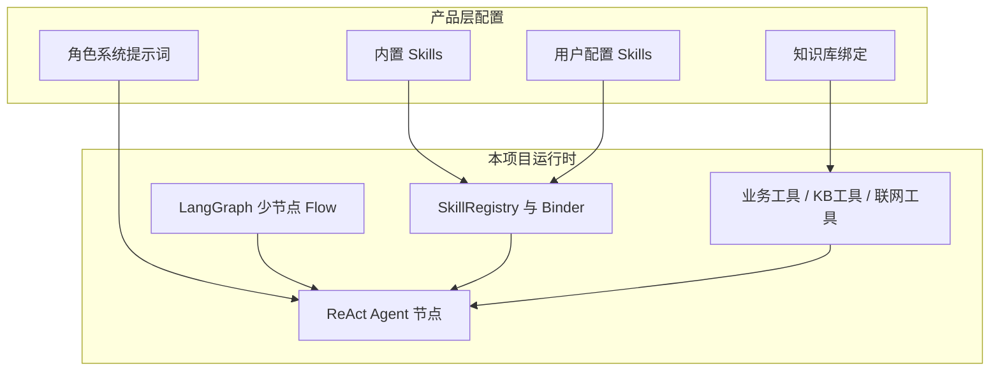
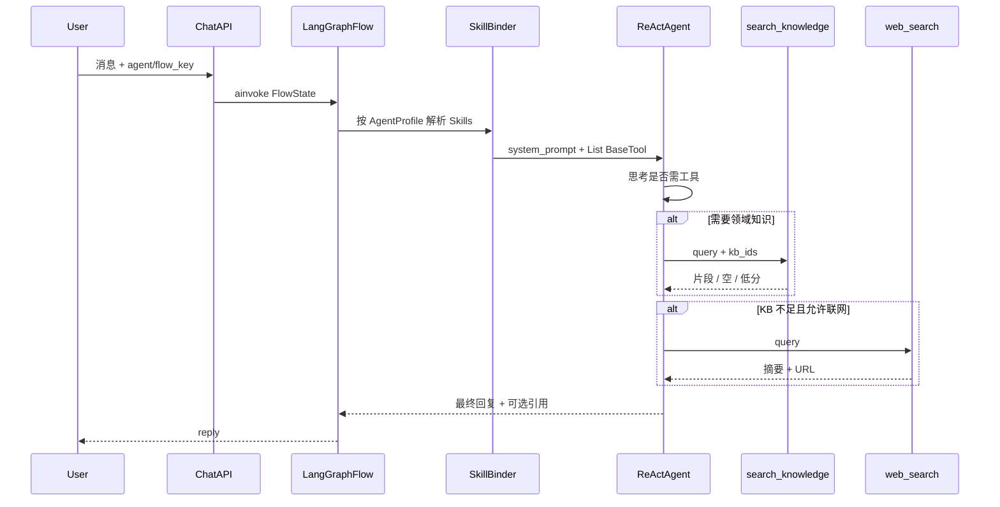

# 智能体 Skills 化演进规划

本文档说明：在本项目（gd25-biz-agent-python）中，如何从「YAML 写死的 LangGraph Workflow」演进为接近市面主流产品形态的「**单主智能体 + 角色提示词 + 可扩展 Skills + 可配置知识库**」，包括技术选型结论、目标架构、Skills / 知识库 / 联网补全的代码设计要点，以及分阶段实施路线。

> **定案**：外层继续 **YAML + LangGraph Flow**（不更换编排内核）；下一代默认产品形态为 **单节点 ReAct Agent + Skills（工具）动态绑定 + 知识库/联网检索工具**。  
> 固定 Workflow（医疗意图路由、Plan-and-Execute、AutoGen Team）与 Skills 智能体 **双轨并存**，按场景选用，而非一刀切替换。

> **与既有定案的关系**：
>
> - AutoGen 融合（[`26071401`](./26071401-AutoGen与LangGraph融合方案.md) / [`26071402`](./26071402-AutoGen与LangGraph融合技术设计.md)）解决「开放式多角色协商/评审」，**不是** Skills 主形态。
> - Plan-and-Execute（`26071301`）解决「可审计的计划—执行—重规划」，与 Skills 正交，可并存。
> - 本文解决「能力如何自由扩展、由模型按需调度」，而不是再堆更多图节点类型。

---

## 一、问题与目标

### 1.1 产品观察

体验较好的通用智能体产品，开放配置通常呈现为：

| 配置面 | 典型形态 |
|--------|----------|
| 主智能体 | **一份角色/人设系统提示词** |
| 能力 | **内置 Skills** + **用户可挂载 Skills** |
| 知识 | **用户绑定知识库**，对话中按需检索 |
| 缺失知识 | 允许 **联网检索** 补全，并标注来源 |

能力扩展主要靠「挂载技能包」，而不是改一条又一条硬编码工作流边。

### 1.2 本项目当前形态

节点类型已覆盖多种编排范式（见 `backend/domain/flows/nodes/registry.py`）：

| YAML `type` | 角色 |
|-------------|------|
| `agent` | LangChain ReAct 单 Agent |
| `function` | 图侧确定性副作用 |
| `em_agent` / `rag_agent` | 向量化 / 图侧 RAG 召回 |
| `planner` / `plan_executor` / `replanner` | Plan-and-Execute |
| `autogen_team` | 内层 AutoGen 多角色 Team |

工具能力靠 **`tool_registry` + 节点 YAML `tools: [...]` 静态白名单**；知识靠 **`rag_agent` / `retrieval_node` 在图上注入提示词**。模型无法在同一轮内自主决定「要不要搜库、再搜一次、还是上网」。

代表路径：`config/flows/medical_agent_v5` —— 意图识别 → 强制检索 → 挂全工具的核心 Agent，已接近「单超 Agent」，但仍是 **图编排 RAG**，不是 Skills 产品模型。

### 1.3 演进目标

| 目标 | 说明 |
|------|------|
| **G1** | 新产品默认形态：角色提示词 + Skills 列表 + 知识库绑定即可上线 |
| **G2** | Skills 由 **模型在工具循环中自行选择调用**，新增能力尽量不改图边 |
| **G3** | 知识库变为 **可调用工具**；空结果/低相关时可 **联网补全** 并溯源 |
| **G4** | 不破坏现有医疗 Workflow / Plan-Execute / AutoGen 已验证路径 |

### 1.4 非目标（本文不承诺）

- 不把 FastAPI / `FlowManager` 入口换成 AutoGen Runtime。
- 不把每个 Skill 做成独立 LangGraph 节点。
- 本期规划不落地 MCP（作为 P3 可选项）。
- 不要求一次迁移全部 medical_agent 版本。

---

## 二、现状基线与差距

### 2.1 运行时分层（已具备）

```
FastAPI /chat
  → FlowManager.get_flow(flow_key)
  → StateGraph(FlowState) + MemorySaver
  → 节点 Creator（registry）
  → agent 节点内：AgentFactory → langchain.agents.create_agent + tools
```

关键路径：

| 关注点 | 路径 |
|--------|------|
| 节点注册 | `backend/domain/flows/nodes/registry.py` |
| ReAct 工厂 | `backend/domain/agents/factory.py` |
| 工具注册 | `backend/domain/tools/registry.py`、`decorator.py`、`init_tools()` |
| 状态 | `backend/domain/state.py` → `FlowState` |
| 图侧 RAG | `rag_agent`、`retrieval_node`（function） |
| 向量/语料 | `embedding_records`、legacy 多表示例表、知识库管理 API |

### 2.2 差距矩阵

| 能力 | 现状 | 目标差距 |
|------|------|----------|
| 角色提示词 | 各节点 `prompts/*.md` | 需 **AgentProfile 级** 统一人设配置 |
| Skills | 无；仅有扁平 Tool 名列表 | 需 Skill 元数据、打包、按 Profile 绑定 |
| 动态挂载 | YAML 写死 tools | 需内置 + 用户勾选 → Binder |
| 模型自调度技能 | ReAct 可调已绑定工具 | 调度机制已有；缺「技能产品层」与动态绑定 |
| 知识库自查 | 图侧强制注入 | 需 `search_knowledge` 等工具 |
| 库中无知识 | 无联网工具 | 需 `web_search` / `fetch_url` + 提示策略 |

### 2.3 一句结论

**「技能自调度」不需要新编排引擎**——现有 ReAct 工具循环即可；缺的是 **Skill 抽象、配置模型（AgentProfile）、KB/联网工具化，以及产品侧挂载能力**。

---

## 三、技术选型结论

### 3.1 推荐方案（定案）

| 层级 | 选型 | 理由 |
|------|------|------|
| 会话外壳 | **继续 LangGraph Flow** | checkpoint、统一 `FlowState`、与现有 chat/API 一致 |
| 默认智能体内核 | **单 Agent ReAct**（已有 `create_agent`） | 与市面「主智能体 + 工具」一致；Skills 映射为 Tools |
| 能力扩展 | **Skill 包 → Tool 列表** | 自由扩展 = 挂载，而非改边 |
| 知识 / 联网 | **工具化检索** | 模型可多次查询、可回落联网 |
| 特殊协作 | **按需** 使用 Plan-Execute / AutoGen Team Flow | 不作为默认产品形态 |



### 3.2 明确否定清单

| 做法 | 结论 |
|------|------|
| 为 Skills 整体换 AutoGen Runtime 做外层入口 | **否**（与 26071401 定案冲突） |
| 每个 Skill 对应一个 LangGraph 节点 + 条件边 | **否**（边爆炸，无法自由扩展） |
| 用 AutoGen Team 冒充「可挂 Skills 的主智能体」 | **否**（Team 解决多角色协商，不解决技能市场） |
| 首期引入 MCP 作为唯一 Skill 后端 | **否**；进程内 Tool/Skill 足够，MCP 放 P3 评估 |

### 3.3 双轨策略

| 轨道 | 适用 | 举例 |
|------|------|------|
| **A. 固定 Workflow** | 强合规、强步骤、已验证医疗链路、多角色评审、可审计计划 | medical_v4/v6 意图路由、`plan_execute_agent`、`autogen_review_agent` |
| **B. Skills 智能体** | 平台化配置、能力快速组合、KB 自调度、联网补全 | 新 `skills_agent`（或同等命名）pilot；长期承接「编排价值低、工具价值高」的业务 |

长期迁移原则：只迁移 **编排价值低、工具/知识价值高** 的链路；强流程管控场景留在轨道 A。

---

## 四、目标架构

### 4.1 配置模型：AgentProfile

产品层「一个智能体」对应一份 **AgentProfile**（首期可落 `config/agents/*.yaml` 或 flow 旁配置，P3 进 DB）：

| 字段 | 含义 |
|------|------|
| `id` / `name` | 智能体标识 |
| `system_prompt` / `prompt_path` | 角色说明（主提示词） |
| `model` | 模型与采样参数 |
| `builtin_skills` | 内置技能 id 列表 |
| `skills` | 用户/租户勾选的技能 id |
| `knowledge_base_ids` | 绑定的知识库/语料范围 |
| `policy` | 是否允许联网、最大工具调用次数、审计开关等 |

Flow 侧倾向 **少节点**：例如仅一个 `agent`（可选轻量前置 function 做鉴权/上下文加载），由 Profile 决定提示词与工具集。

### 4.2 运行时数据流



### 4.3 与现有代码落点（规划）

| 模块 | 建议路径（规划） | 职责 |
|------|------------------|------|
| Skill 元数据 | `backend/domain/skills/models.py` | `SkillDefinition` |
| 注册与加载 | `backend/domain/skills/registry.py`、`loader.py` | 内置包 + 配置加载 |
| 绑定 | `backend/domain/skills/binder.py` | Profile → `List[BaseTool]` |
| Profile | `backend/domain/agents/profile.py` 或 config 模型 | AgentProfile 解析 |
| 工厂改造 | `backend/domain/agents/factory.py` | 支持 binder 输出，兼容现有 `tools: []` |
| KB 工具 | `backend/domain/tools/knowledge_tool.py` | `search_knowledge` |
| 联网工具 | `backend/domain/tools/web_search_tool.py` | `web_search` / `fetch_url` |
| Pilot Flow | `config/flows/skills_agent/` | 单节点演示流 |

**兼容原则**：现有 YAML `tools: [name, ...]` 继续可用；Skills 路径是 **增强**，不是强制切断。

---

## 五、Skills 设计

### 5.1 核心洞见：Skills 最终都是 Tool

市面「Skill」对模型而言，本质是：

1. **一段可发现的能力描述**（name + description → 进入 tool schema / 提示）；
2. **一组可执行动作**（一个或多个函数调用）；
3. 可选：**额外提示片段**（何时用、约束、输出格式）。

本项目已有 LangChain `BaseTool` + `tool_registry`。演进路径是：

```
SkillDefinition
  → 解析出 1..N 个 BaseTool（多数直接引用 registry 中已有工具）
  → 可选追加 skill 级 prompt 片段到系统提示
  → 交由 ReAct 循环调度
```

**「智能体自己调度 Skills」= 模型根据 tool schema 与对话上下文决定调用哪些工具、调用几次。**  
不需要自研第二套调度器。

### 5.2 SkillDefinition（建议字段）

| 字段 | 类型 | 说明 |
|------|------|------|
| `id` | str | 稳定标识，如 `vitals.blood_pressure` |
| `name` | str | 展示名 |
| `description` | str | 给模型与人类看的能力说明 |
| `version` | str | 语义化版本 |
| `tools` | list[str] | 引用 `tool_registry` 中的工具名 |
| `prompt_snippet` | str? | 挂载该 skill 时注入系统提示的附加说明 |
| `tags` | list[str] | 如 `medical`、`builtin`、`user` |
| `permissions` | list[str] | 如 `read_user_health`、`write_user_health`、`network` |
| `enabled_by_default` | bool | 是否算内置默认挂载 |

内置示例打包思路（对应现有工具）：

| Skill id（示例） | 包含工具 |
|------------------|----------|
| `health.blood_pressure` | `record_blood_pressure`、`query_blood_pressure`、`update_blood_pressure` |
| `health.medication` | `record_medication`、`query_medication` |
| `health.symptom` | `record_symptom`、`query_symptom` |
| `health.event` | `record_health_event`、`query_health_event` |
| `knowledge.search` | `search_knowledge`（P1） |
| `web.search` | `web_search`（P2，受 policy 控制） |

### 5.3 SkillRegistry / Loader / Binder

```
启动或按需：
  SkillLoader
    ├─ 扫描代码内置 skill 包（builtin）
    └─ 读取用户/租户配置（YAML → 远期 DB）

运行一次对话：
  SkillBinder.bind(profile) →
    校验 permissions ∩ profile.policy
    合并 builtin_skills ∪ skills
    展开 tools → 去重 → List[BaseTool]
    合并 prompt_snippet → 最终 system prompt 附加段
```

**安全性**：Binder 是能力篱笆。用户配置不能绕过 `permissions` 与 `policy.allow_network` 等开关；未知 skill id 应告警并跳过（对齐今日未知 tool name 的日志行为）。

### 5.4 与 function 节点、AutoGen 工具的关系

| 现有机制 | 与 Skills 关系 |
|----------|----------------|
| `function` 节点 | 仍是 **图侧确定性管道**（清洗、批入库），一般不暴露为模型可选 Skill；若需模型触发，应 **包装成 Tool** 再进 Skill |
| YAML `tools: []` | 过渡期保留；新流量优先 Profile + Skills |
| AutoGen `tool_bridge` | 继续包装同一 `tool_registry`；若 Team 节点也要 Skills，可复用 Binder 输出后再 bridge |

### 5.5 工具过多时的调度质量

Skills 增多后，一次性挂载全部 tool schema 可能损伤选型质量。缓解（写入后续技术设计时可细化）：

1. **按 Profile 精选**挂载，而不是全局全开；
2. 可选 **两级路由**：轻量「选 skill 组」工具再展开（P3）；
3. 控制单 tool 描述长度，避免无信息噪声。

首期（P0/P1）以 Profile 精选为主即可。

---

## 六、知识库工具化

### 6.1 现状问题

当前 RAG 典型路径：

```
上游产出检索 query / scene_summary
  → rag_agent 或 retrieval_node（图边强制）
  → 写入 prompt_vars / edges_prompt_vars
  → 下游 Agent 只能「看见」本轮注入结果
```

模型不能：换 query 再搜、换语料、判断「不够再联网」。

### 6.2 目标：`search_knowledge` 工具

建议工具契约（示意）：

| 参数 | 说明 |
|------|------|
| `query` | 检索问句 |
| `top_k` | 条数上限 |
| `knowledge_base_ids` | 可选；默认取 Profile 绑定集合 |

行为：

1. 使用现有 embedding + pgvector 路径（优先统一到 `embedding_records` / 已绑定语料；legacy 多表示例表可作为另一 corpus 或适配层）；
2. 返回结构化片段：文本、分数、来源 id、标题/链接（若有）；
3. 空结果或低于阈值阈值时，返回明确 `hit=false` / `low_confidence=true`，便于模型触发下一策略。

**闭包**：工具工厂根据 `AgentProfile.knowledge_base_ids` 构造实例，防止越权查其它租户语料。

### 6.3 预检索是否保留

| 模式 | 用途 |
|------|------|
| **纯工具化** | 完全由模型决定是否检索；最灵活，首 token 可能更慢 |
| **轻量预检索 + 工具** | 图上或节点入口做一轮粗召回写入上下文，同时保留 `search_knowledge` 供精搜/改写再查 |

规划建议：pilot 先做 **纯工具化** 验证产品形态；延迟敏感场景再叠加可选预检索，但 **不得** 再把「只能图侧检索」作为唯一路径。

### 6.4 管理面与运行面分离

| 面 | 现状 / 方向 |
|----|-------------|
| 管理面 | 知识库 CRUD / 向量化流水线（`knowledge_base` API、embedding flow）继续服务人与离线任务 |
| 运行面 | 对话内只通过 **检索类 Tool（必要时空写慎授）** 访问；写知识需单独权限 skill |

---

## 七、知识库未命中与联网补全

### 7.1 策略（提示词 + 工具，而非硬编码边）

推荐决策顺序写入主提示词 / `knowledge.search` / `web.search` 的 `prompt_snippet`：

1. **优先** 调用 `search_knowledge`；
2. 若 `hit=false` 或相关度不足，且 `policy.allow_network=true`，再调用 `web_search`；
3. 必要时 `fetch_url` 拉取少量白名单页面正文（限长、超时）；
4. 回答中 **强制区分** 来源：`knowledge_base` vs `web`，列出引用；
5. 仍不足时 **明确告知不确定**，禁止伪装成库内知识。

> 注意：用「提示词策略」而非「图条件边」实现回落，这样才符合 Skills 智能体「自由扩展」目标。若医疗合规要求「禁止自动联网」，则 Profile.policy 关闭即可。

### 7.2 工具边界与安全

| 控制点 | 要求 |
|--------|------|
| 开关 | `policy.allow_network`；未授权不得注册 `web_*` 工具 |
| 检索 | 查询改写长度限制、结果条数上限 |
| 抓取 | URL 协议白名单、域名黑白名单、超时、body 截断 |
| 内容 | 过滤明显有害内容；医疗场景强化「非诊断声明」 |
| 审计 | 记录 tool 调用参数摘要、返回来源 URL、session/trace_id |

### 7.3 风险与对策

| 风险 | 对策 |
|------|------|
| 网页幻觉 / 过时信息 | 强制引用；提示「以权威指南为准」；可选人工审核队列（产品侧） |
| 提示词注入（网页正文） | fetch 结果当数据包裹，指示模型勿执行页面中的指令 |
| 成本与延迟 | 限制每轮联网次数；KB 命中则短路 |

---

## 八、分阶段实施

### 8.1 总览

| 阶段 | 目标 | 关键交付 | 建议验收 |
|------|------|----------|----------|
| **P0** | 概念落地、可演示 | `SkillDefinition` + Registry/Loader/Binder；2～3 个 builtin skills（打包现有健康工具）；`AgentProfile` YAML；单节点 pilot flow；Factory 兼容 binder | `cursor_test`：binder 展开工具正确；未知 skill 跳过；pilot 可调现有 record/query 工具 |
| **P1** | KB 自调度 | `search_knowledge` 工具；Profile 绑定 `knowledge_base_ids`；pilot 不依赖强制 `rag_agent` 边 | 模型可主动搜库；空库返回可机读；越权语料不可查 |
| **P2** | 联网补全 | `web_search`（+ 可选 `fetch_url`）；提示词回落策略；来源字段；安全限制 | KB 空 → 联网；关闭 network 时无 web 工具；回复含来源类型 |
| **P3** | 平台化 | Skills/KB 挂载的存储与 API；权限审计面板；评估 MCP 作为外部 Skill 后端 | 用户配置可热更新绑定；审计可查；MCP 仅 POC |

### 8.2 P0 详细

1. 新增 `backend/domain/skills/` 骨架与内置 skill 声明（可先 YAML/Python 常量）。
2. Binder 输出接入 `AgentFactory`（或 Agent 节点 Creator）：有 Profile 则用 Skills，否则回退 `config.tools`。
3. 新增 pilot：`config/flows/skills_agent/flow.yaml`（单 `agent` 节点）+ 角色提示词。
4. 测试：`cursor_test/test_skill_binder.py` 等，覆盖展开、去重、权限拒绝。

### 8.3 P1 详细

1. 实现 `search_knowledge`，复用 embedding / pgvector 基础设施。
2. 将 `knowledge.search` 作为 builtin skill 挂入 pilot Profile。
3. 对比实验：同问句下「图侧 RAG」vs「工具 RAG」的召回与延迟，记录到简短评测笔记（可另文）。

### 8.4 P2 详细

1. 接入可替换的搜索后端（抽象接口，便于换供应商）。
2. Prompt snippet 固化「KB → Web → 承认未知」顺序。
3. 安全默认：生产 Profile 默认 `allow_network=false`，显式开启。

### 8.5 P3 详细

1. 管理 API：为智能体增删 skills、绑定 KB。
2. 运行时从 DB 加载 Profile（带缓存）。
3. MCP：仅当需要跨进程/跨语言第三方工具市场时立项；内部业务优先继续进程内 Skill。

---

## 九、与 AutoGen / Plan-and-Execute 的关系

| 模式 | 解决什么 | 是否 Skills 默认形态 |
|------|----------|----------------------|
| **Skills + 单 ReAct** | 能力组合、KB/工具自调度、平台化配置 | **是** |
| **Plan-and-Execute** | 多步任务可审计计划与重规划 | 否；复杂项目型任务可选用；Executor 内工具仍可来自 Binder |
| **AutoGen Team** | 多角色协商、批评—修订 | 否；评审/辩论场景按需挂 `autogen_team` 节点 |
| **意图路由多 Agent 图** | 强专科隔离、合规分流 | 否；高管控医疗主路径可继续保留 |

协作建议：

- 默认流量 → Skills 智能体；
- 需要「先计划再执行」→ Plan-Execute Flow，**Executor 的 tools 由同一 SkillBinder 提供**；
- 需要「写手 + 评审」→ AutoGen Team 节点或独立 Flow，**不强行 Skills 化每一个说话人**。

---

## 十、代码设计检查清单（供后续技术设计拆解）

后续若撰写「Skills 技术设计」（类似 26071402），建议至少覆盖：

- [ ] `SkillDefinition` / `AgentProfile` schema（YAML + Pydantic）
- [ ] Registry 初始化时机与 `init_tools()` 的顺序
- [ ] Binder 与 `AgentNodeCreator` 的接线点
- [ ] `search_knowledge` 与双语料（legacy / embedding_records）统一策略
- [ ] `edges_var` 重置行为下，引用信息写入 `flow_msgs` 或 `prompt_vars` 的约定
- [ ] 观测：tool 调用 span、命中率、联网率
- [ ] 兼容：旧 flow 的 `tools: []` 回归集

本文为 **演进规划**，不替代上述编码级设计文档。

---

## 十一、开放问题与待确认

| 编号 | 问题 | 影响 |
|------|------|------|
| Q1 | 首个生产租户的 Profile 存在 YAML 还是直接上 DB？ | P0/P3 边界 |
| Q2 | 医疗合规场景是否允许默认联网？ | P2 policy 默认值 |
| Q3 | legacy 示例表与 `embedding_records` 是否在工具层合并为统一 corpus API？ | P1 工程量 |
| Q4 | Skills 描述语言：仅中文 / 中英双语 tool description？ | 模型选型稳定性 |
| Q5 | 用户自定义 Skill 是否允许上传代码，还是仅允许「勾选平台已有技能」？ | 安全模型；建议首期 **仅勾选** |

---

## 十二、总结

1. **不必重新选型外层编排**：LangGraph 继续管会话与流程；ReAct 继续管「技能自调度」。
2. **演进核心**是补齐 **AgentProfile + Skill 包 + Binder**，并把 **知识库与联网做成工具**，而不是继续增加 Workflow 节点类型。
3. **双轨并存**：固定 Workflow 与 Skills 智能体按场景选用；AutoGen / Plan-Execute 保持为专用协作模式。
4. **落地节奏**：P0 演示绑定 → P1 KB 自查 → P2 联网回落 → P3 平台化（含可选 MCP）。

按此规划，项目可以在不推翻现有投资的前提下，逐步逼近「角色提示词 + 可挂 Skills + 可配知识库」的主流智能体产品形态。
`)