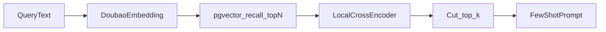

# 本地 Rerank 能力评估

## 1. 结论摘要

在本地电脑上做 Rerank，**不必引入 Elasticsearch**，也**不必替换**现有的 Doubao Embedding 与 `embedding_records`（pgvector）。需要补齐的是：**本地排序模型（通常来自 HuggingFace / ModelScope）**，以及在「向量召回」与「拼 few-shot」之间插入的精排代码与配置。

| 问题 | 结论 |
|------|------|
| 需要 Elasticsearch 吗？ | **不需要。** Rerank 作用于「已召回的候选集」；ES 只在要做关键词/BM25 一阶段召回或真混合检索时才有价值。 |
| 需要 HuggingFace 排序模型吗？ | **需要一类本地排序模型**（CrossEncoder / BGE-Reranker），不是再建一套 embedding 存库。 |
| 要升级哪些组件？ | 新增 Reranker 模块；放大 `rag_agent` 召回窗口再精排；扩展 `RagAgentNodeConfig` / `flow.yaml`；按模型选型决定是否加 `FlagEmbedding`。 |

推荐链路：

```text
Query → Doubao Embedding → pgvector 召回 top_n（如 20）
      → 本地 CrossEncoder 精排 → 截断 top_k（如 5）→ Few-shot Prompt
```



---

## 2. 现状摘要

### 2.1 当前检索路径（medical_agent v6.x）

主路径为 `rag_agent` 节点：

1. `optimization_agent` 产出 `scene_summary` / `optimization_question`。
2. [`backend/domain/flows/nodes/rag_agent_creator.py`](backend/domain/flows/nodes/rag_agent_creator.py) 拼查询文本并调用 Doubao Embedding。
3. 在 `gd2502_embedding_records` 上用 pgvector 余弦距离检索：`similarity = 1 - (embedding_value <=> query)`。
4. 按 `similarity_threshold` 过滤（不足时降阈值），再 `LIMIT top_k`。
5. 结果写入 `edges_prompt_vars`，供下游 Agent 作 few-shot。

典型配置见 `config/flows/medical_agent_v6_3/flow.yaml`：`top_k: 5`、`similarity_threshold: 0.7`、`provider: doubao-embedding`。

配置模型定义：

```124:132:backend/domain/flows/models/definition.py
class RagAgentNodeConfig(BaseModel):
    """RAG Agent节点配置"""
    model: ModelConfig = Field(description="Embedding模型配置")
    top_k: int = Field(default=5, description="召回数量")
    similarity_threshold: float = Field(default=0.7, description="相似度阈值")
    output_field: str = Field(
        default="retrieved_examples",
        description="输出字段名，存于 state.edges_var['edges_prompt_vars'] 下，供下游 agent 占位符替换"
    )
```

### 2.2 向量库与 Embedding

| 能力 | 现状 |
|------|------|
| 向量库 | PostgreSQL + pgvector（同 `DATABASE_URL`），HNSW + `vector_cosine_ops` |
| 在线 Embedding | 火山 Doubao `doubao-embedding-vision-250615`，**2048 维**，写入 `embedding_records` |
| 遗留 Embedding | `sentence-transformers` + `moka-ai/m3e-base`（**768 维**），用于 legacy 表与科普文检索 |
| ES / OpenSearch / Milvus 等 | **未使用** |
| Rerank / CrossEncoder / 分数融合 | **未实现**（设计文档中有混合检索+rerank 设想，未落代码） |

### 2.3 与 Rerank 的缺口

当前排序仅靠「向量相似度阈值 + `ORDER BY` 距离 + `top_k`」。双塔/向量ANN 擅长粗召回，对「查询与案例是否真匹配」的细粒度语义判别弱于 CrossEncoder。医疗 few-shot 对用例质量敏感，适合在召回后再精排。

---

## 3. Rerank 在链路中的位置；为何不依赖 ES

### 3.1 分工

| 阶段 | 作用 | 当前实现 | 本地 Rerank 后 |
|------|------|----------|----------------|
| 一阶段召回 | 从全库快速筛出候选 | pgvector `LIMIT top_k` | pgvector `LIMIT recall_k`（更大，如 20） |
| 二阶段精排 | 对候选做 query–doc 交互打分 | 无 | 本地 CrossEncoder / BGE-Reranker |
| 截断输出 | 控制 prompt 长度 | `top_k` | 精排后再取 `top_k` |

Rerank **不负责**全库扫描；它假设候选已由向量（或可选的关键词检索）给出。因此 ES 不是 Rerank 的前置条件。

### 3.2 何时才需要 ES

仅在以下目标明确时考虑 Elasticsearch / OpenSearch：

- 强依赖 BM25 / 分词关键词召回（药名、检查项、规范用语精确命中）。
- 语料规模与多字段检索复杂度明显超出 PostgreSQL 全文检索可接受范围。
- 已有 ES 运维体系，希望统一混合检索入口。

对本仓库：一阶段用 **已有 pgvector 放大召回** 即可支撑本地精排 MVP。若后续要混合检索，可优先评估 **PostgreSQL `tsvector` 全文 + 向量 RRF 融合**，再共用同一 Reranker；ES 作为再后置选项。

---

## 4. 模型选型（本地排序模型）

### 4.1 需要什么模型

需要 **排序 / CrossEncoder 类模型**，例如：

| 候选 | 说明 | 加载方式（示意） |
|------|------|------------------|
| `BAAI/bge-reranker-base` | 中文友好、体量适中，适合 PC MVP | `sentence_transformers.CrossEncoder` 或 FlagEmbedding |
| `BAAI/bge-reranker-v2-m3` | 多语/更强，延迟与显存更高 | FlagEmbedding `FlagReranker` 更常见 |
| 其它医疗域 / 中文 rerank | 视测评再换 | 接口应抽象为 `rerank(query, docs) -> scores` |

注意：

- **不是**用 rerank 模型改写或覆盖 `embedding_records` 中的 2048 维向量。
- Embedding（Doubao）与 Reranker（本地）职责分离：前者粗召回，后者精排。
- 仓库已有 `sentence-transformers` 与 HF 缓存用法（legacy `EmbeddingModelCache` / `moka-ai/m3e-base`），可复用「本地文件优先 / `~/.cache/huggingface`」模式。

### 4.2 算力与延迟

| 环境 | 建议 |
|------|------|
| 仅 CPU 笔记本 | 优先 `bge-reranker-base`；`recall_k` 控制在 10–20；务必实测 P95 |
| 有 GPU | 可用 v2-m3 或更大 batch |
| 冷启动 | 首次从 HF/ModelScope 下载；生产/演示机应预热加载并固定本地路径 |
| 进程内缓存 | 单例加载模型，避免每个请求重新 load |

---

## 5. 需新增 / 改动的组件清单

本次评估**只描述改造范围**；落地实现时再改业务代码。

### 5.1 MVP（本地 PC 做 Rerank 的最小集合）

| 序号 | 动作 | 位置 | 说明 |
|------|------|------|------|
| 1 | **新增** | `backend/infrastructure/rag/reranker.py`（建议） | 加载本地 CrossEncoder；实现 `rerank(query, candidates, top_k)`；候选文本建议拼接 `scene_summary` + `optimization_question`（必要时含 `ai_response` 摘要） |
| 2 | **复用模式** | 参考 `backend/infrastructure/rag/data_import.py` 的 `EmbeddingModelCache` | 进程内缓存、本地缓存命中时 `local_files_only`、明确模型名与路径配置 |
| 3 | **改** | `backend/domain/flows/nodes/rag_agent_creator.py` | SQL `LIMIT` 使用 `recall_k`；取得候选后调用 reranker；再截断为 `top_k` 进入 few-shot 格式化 |
| 4 | **改** | `backend/domain/flows/models/definition.py` 中 `RagAgentNodeConfig` | 增加例如：`recall_k`、`rerank_enabled`、`rerank_model`（模型 ID 或本地路径） |
| 5 | **改** | `config/flows/medical_agent_v6_*/flow.yaml` 等 `rag_agent` 节点 | 打开/配置上述字段；默认可先 `rerank_enabled: false` 保证兼容 |
| 6 | **依赖** | `requirements.txt` | 继续用现有 `sentence-transformers` 的 CrossEncoder **即可跑通 MVP**；若选定 FlagEmbedding API 再追加 `FlagEmbedding` 版本约束；**不必**为 Rerank 引入 ES |

### 5.2 建议的配置语义（示意）

```yaml
- name: rag_node
  type: rag_agent
  config:
    model:
      provider: doubao-embedding
    top_k: 5                    # 精排后最终进入 prompt 的条数
    recall_k: 20                # pgvector 粗召回条数（应 > top_k）
    similarity_threshold: 0.5   # 粗召回阈值可略低于现网，以免候选过少
    rerank_enabled: true
    rerank_model: BAAI/bge-reranker-base
    output_field: retrieved_examples
```

语义约定：

- `top_k`：最终使用条数（与现含义对齐，避免 silent breaking）。
- `recall_k`：一阶段召回窗口；未开 rerank 时可令 `recall_k = top_k`。
- `rerank_enabled=false`：行为与今日一致（仅向量排序）。

### 5.3 明确不在 MVP 做的事

- 不上 Elasticsearch / OpenSearch。
- 不把 Rerank 模型输出当作 embedding 写入 `embedding_records`。
- 不强制 GPU；不强制切换 Doubao Embedding。
- 不在本期重写 legacy `retrieval_node_v2` / m3e 768 维路径（除非单独排期）。

### 5.4 可选二期

1. **PostgreSQL 全文检索** + 向量召回 → 去重 / RRF 融合 → 同一 Reranker。
2. 科普文章检索路径是否跟进精排（若 few-shot 质量主要依赖案例库，可后置）。
3. 仅当 PG 全文不足以支撑关键词召回规模/运维时，再评估 ES。
4. 离线评测集：用人工标注「该 query 下该案例是否优质 few-shot」，对比开/关 rerank 的命中率与业务侧回复质量。

---

## 6. 分阶段落地路径

### 阶段 A — MVP（推荐先做）

1. 下载并缓存 `bge-reranker-base`（或等价模型）。
2. 实现 `reranker.py` + 单例缓存。
3. 改造 `rag_agent`：`recall_k` → rerank → `top_k`。
4. 配置开关默认可关，在开发环境实测延迟与效果。
5. 不引入新向量库、不引入 ES。

验收建议：

- 同一 query 下，粗召回 top20 中「语义近但场景错」的案例，精排后排名下降。
- 单次请求增加的延迟在可接受范围（例如 CPU 下 P95 可控）。
- `rerank_enabled=false` 时回归行为与改造前一致。

### 阶段 B — 可选增强

- PG `tsvector` 混合召回 + RRF。
- 更强 rerank 模型 / GPU。
- 监控：rerank 分数分布、空结果率、端到端延迟。

### 阶段 C — 按需 ES

- 仅当「关键词召回 + 运维」成为明确瓶颈时引入；Rerank 模块复用不变。

---

## 7. 风险与注意点

| 风险 | 说明 | 缓解 |
|------|------|------|
| 维度 / 路径混用 | 在线 Doubao 2048 与 legacy m3e 768 勿混表混模型 | Rerank 只作用于 `embedding_records` 召回结果的文本，不改向量列 |
| 冷启动下载 | 首次拉取 HF 模型失败或极慢 | 预下载到本机；配置本地路径；CI/部署预热 |
| CPU 延迟 | `recall_k` 过大时 CrossEncoder 线性变慢 | 控制候选数；小号模型；可选 batch |
| 医学域效果 | 通用 reranker 未必最优 | 小样本人工评测；必要时换域内或更强模型 |
| Prompt 污染 | 精排把「相似但错误场景」仍留在 top_k | 结合阈值与业务过滤；评测驱动调参 |
| 依赖膨胀 | 随意升级 `sentence-transformers` 大版本可能与现有 m3e 冲突 | 沿用现有版本范围；FlagEmbedding 单独评估 |

---

## 8. 直接回答三个原始问题

1. **做本地 Rerank 还需要追加什么？**  
   本地排序模型 + Reranker 服务模块 + `rag_agent` 放大召回再精排 + 配置项（`recall_k` / `rerank_*`）。可选：进程内模型缓存、预热脚本、延迟与质量评测。

2. **需要 ES 吗？**  
   **MVP 不需要。** ES 属于「另一路召回」基础设施，不是 Rerank 本身。

3. **需要 HuggingFace 上的排序模型吗？需要升级哪些组件？**  
   **需要本地排序模型**（常用来源是 HuggingFace，也可用 ModelScope 镜像）。组件上重点升级/新增的是：`reranker` 模块、`RagAgentNodeConfig`、`rag_agent_creator`、相关 `flow.yaml`；依赖上优先复用已有 `sentence-transformers`，不必为此换成 ES 或重做 Doubao/pgvector 入库链路。
