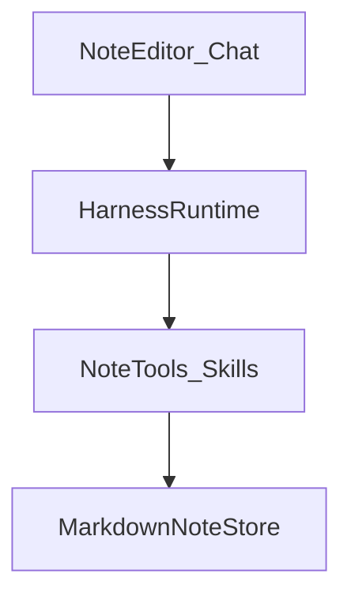

# 笔记 Harness 九大模块裁剪

本文档按「笔记 + Agent Harness」场景，对业界生产级 harness 九大模块做 **MVP / P1 / 不做（或更晚）** 裁剪，作为后续独立笔记产品的启动边界。本稿只定边界，不写实现细节。

> **与本仓库关系**：本文是产品/架构边界笔记，**不**要求把 `gd25-biz-agent-python` 改造成笔记产品。本仓库已有 Skills / Plan-Execute 等经验仅作能力注册与编排思路参考。

---

## 一、产品一句话与非目标

### 1.1 定位

以 **Markdown 笔记库为 Artifact Store（工作记忆）** 的轻量 Agent Harness：笔记是中心资产，模型可插拔，Agent 通过工具读写/检索笔记完成问答、整理与创作。

### 1.2 非目标（首版明确不做）

| 非目标 | 说明 |
|--------|------|
| 完整 IDE Agent | 不做编辑器级代码工程环境（Claude Code / Cursor 路线） |
| 可视化 Workflow 画布 | 不做 Dify 式节点编排平台 |
| 多渠道 Bot 分发 | 不做 Coze 式微信/飞书等渠道发布 |
| 完整沙箱 | MVP 不做 Docker/强隔离执行环境 |
| 多模型市场 | MVP 不做模型广场与复杂路由；模型配置保持简单可插拔即可 |

---

## 二、九大模块对照表（核心）

职责列按 **笔记场景** 释义；优先级已按「笔记优先、harness 渐进」拍板。

| # | 模块 | 笔记场景职责 | MVP（能跑起来） | P1（长会话可用） | 不做 / 更晚 | 建议开卷参考 |
|---|------|--------------|-----------------|------------------|-------------|--------------|
| 1 | **Loop Engine** | 驱动 think → 调笔记工具 → observe，直到回答或停止 | 单 Agent ReAct 循环 | 可选 Plan-Execute / 结构化 todo 做多步整理 | 复杂多图编排平台、通用 Team 协商引擎 | OpenHands / OpenHarness 主循环；本仓 Plan-Execute 仅作后续可选参考 |
| 2 | **Context Management** | 控制进窗内容：当前笔记、检索片段、历史对话 | 当前笔记全文（或截断）+ 检索 Top-K 片段进窗 | 历史 compaction；相关笔记摘要后再引用；大段内容落盘再引用 | 全库硬塞上下文 | LangChain deepagents（filesystem 卸载）；Claude Code 解剖中的 compaction |
| 3 | **Skills / Tools Registry** | 可调用能力目录；扩展靠注册，不改 loop | 笔记 CRUD + 搜索，共 4～6 个工具（见下节） | Skills 包（描述 + 工具集）可动态挂载 | 一上来做完整 MCP 生态与插件市场 | OpenHands 工具路由；本仓 [`26071403-智能体Skills化演进规划.md`](./26071403-智能体Skills化演进规划.md) 的注册思路 |
| 4 | **Sub-agent Manager** | 子代理隔离上下文（检索 vs 改写） | **不做**（单 Agent 即可） | 「检索员」「整理员」等窄职责子代理，共享笔记库、隔离对话窗 | 通用多 Agent 协商 / AutoGen Team 平台 | Claude Code Task/subagent；OpenHands 多 agent 模式 |
| 5 | **Built-in Skills** | 开箱能力底盘，决定「不配 Skills 也能用」 | `read` / `write` / `search` / `list` / 双链列出（见下节） | 双链整理、日记/模板生成、批量打标签 | 通用 shell、浏览器、IDE 工具全集 | deepagents 内置文件系统原语；笔记产品只需笔记域原语 |
| 6 | **Session Persistence** | 跨轮次保留对话与「正在看哪篇笔记」 | 线程绑定当前笔记/文件夹；进程内可续聊 | checkpoint：进程重启可恢复线程与绑定关系 | 跨设备实时同步、冲突合并（可后做） | OpenHands session；LangGraph MemorySaver/checkpoint 思路 |
| 7 | **System Prompt Assembly** | 每轮按状态拼装指令，而非巨型静态 prompt | 系统提示 + 当前笔记路径/标题约定 | 动态拼装 `AGENTS.md`（或库级约定）+ 用户偏好 + 当前笔记本规则 | 把所有规则塞进一份永不更新的超长静态 prompt | Claude Code / Codex 的 instruction 文件拼装 |
| 8 | **Lifecycle Hooks** | 工具前后拦截：日志、校验、门控 | 写笔记前打日志（可观测最小集） | 写前校验（路径越界、空写拒绝）；敏感词/外链拦截钩子 | 完整 Hook 市场与第三方 Hook 生态 | Claude Code PreToolUse / PostToolUse |
| 9 | **Permissions & Safety** | 决定 Agent 可对笔记库做什么 | 仅库内读写；工具白名单；禁止库外路径 | 只读区 / 可写区；外网工具（若有）单独分级审批 | 企业级 RBAC、审计合规套件（首版不做） | Claude Code permissions；OpenHands 沙箱边界（笔记场景用路径策略即可） |

### 2.1 MVP 内置工具清单（模块 3 + 5）

| 工具 | 作用 |
|------|------|
| `read_note` | 按路径/ID 读笔记正文 |
| `write_note` | 创建或覆盖写笔记 |
| `search_notes` | 关键词/简单全文检索 |
| `list_notes` | 列目录或笔记本下笔记 |
| `list_links` | 列出当前笔记的双链出边/入边（可简化为出边） |
| （可选第 6 个）`append_note` | 追加段落，降低整篇覆盖风险 |

### 2.2 MVP 验收标准

同时满足以下条件即视为 MVP 达标：

1. **问答**：针对「当前打开的笔记」能结合正文回答问题。  
2. **写入**：Agent 能创建新笔记或改写已有笔记，且变更落在 Markdown 库中可人工打开核对。  
3. **检索**：能按关键词找到库内相关笔记并引用。  
4. **会话绑定**：同一对话线程不丢失「当前笔记/文件夹」绑定关系；刷新或重进线程后仍知上下文锚点（P0 可为进程内；可恢复属 P1）。  
5. **边界**：工具无法读写笔记库根目录之外的路径。

---

## 三、架构草图

Note Store 是产品资产；Harness Runtime 对齐九大模块中的 loop / session / hooks / policy，**不**做成 Dify 式画布。

分层说明：

| 层 | 职责 |
|----|------|
| **UI** | 笔记编辑器 + 对话面板；展示当前绑定笔记 |
| **HarnessRuntime** | Loop、Session、Prompt 拼装、Hooks、Permissions |
| **NoteTools / Skills** | 唯一副作用入口；经白名单调用 Store |
| **MarkdownNoteStore** | 文件与索引（标题、路径、双链）；可备份、可 Git |

---

## 四、分阶段与防闭门造车

### 4.1 阶段与模块切片

| 阶段 | 目标 | 模块切片 |
|------|------|----------|
| **MVP** | 能跑的笔记 Agent | **1** Loop + **3** Registry + **5** Built-in + **6** Session（进程内绑定） |
| **P1** | 长会话不崩、指令可配置 | **2** Context compaction + **7** Prompt Assembly；Session 可恢复 |
| **其后（按痛点）** | 安全与专业化 | **8** Hooks → **9** Permissions 分级 → **4** Sub-agent |

不在 Day 1 追求「大部分 harness 功能」；缺哪块再补哪块，避免权限/子代理/协议适配拖死笔记体验。

### 4.2 开卷清单（避免闭门造车）

| 开卷对象 | 学什么 | 不要抄什么 |
|----------|--------|------------|
| OpenHands / OpenHarness（HKUDS） | Runtime、工具路由、权限/隔离边界 | 整仓 IDE/沙箱产品形态 |
| LangChain deepagents | todo、filesystem 卸载 context（与笔记库同构） | 把通用 coding 工具集原样搬进笔记产品 |
| Claude Code 公开解剖 | Hooks、Permissions、Context compaction 原则 | 完整 IDE 集成与 Hook 市场 |
| 本仓 [`26071403`](./26071403-智能体Skills化演进规划.md) | Skills 注册扩展、能力不改 loop | 医疗 Workflow / 本仓 Flow YAML |

原则：**模块划分抄成熟 harness，领域模型（笔记、双链、笔记本）自己做。**

---

## 五、与下一份文档的关系

本稿只定 **边界与优先级**。若继续做「技术启动文档」（仓库目录结构、第一期接口、数据模型、非功能约束），另开 `26071802-...`，不在本文混写实现细节。
