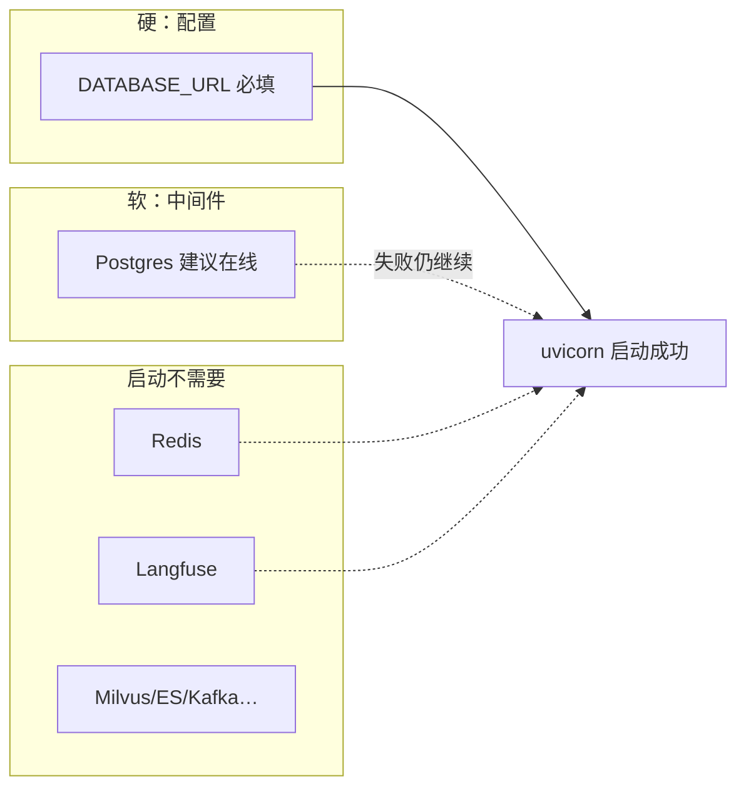
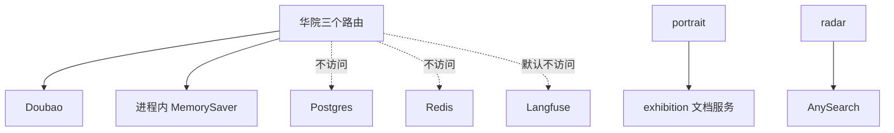

# 华院接口 vs 项目中间件：启动必需与业务不需要

> 换一种说法：先回答「**不改代码时，项目启动必须要哪些中间件**」，再回答「**华院三个路由对这些中间件哪些不需要**」。

---

## 0. 一句话结论

- **不改代码，进程要起来**：配置里必须有 `DATABASE_URL`；启动时会**尝试连一次 Postgres**（失败也继续）。**Redis、Langfuse 都不是启动必需。**
- **华院三个 `huayuan_*.py` 打请求时**：**不需要** Postgres / Redis / Langfuse / Session；需要的是 **Doubao**，以及 portrait 的 **exhibition 文档服务**、radar 的 **AnySearch**（后两者是外部 HTTP，不是本仓常见中间件）。

---

## 1. 口径说明（避免把「中间件」说混）

本报告把依赖分成三类：

| 类别 | 含义 | 例子 |
|------|------|------|
| **中间件 / 基础设施进程** | 需要单独部署、运维常说的组件 | Postgres、Redis、Langfuse |
| **外部 HTTP 能力** | 业务调用的第三方/兄弟服务 | Doubao、exhibition 文档、AnySearch |
| **配置假依赖** | `.env` 必须有值，但服务可以不活着仍能起进程 | `DATABASE_URL` 必填，库挂了也能启动 |

下文「启动必须」默认指：**不改代码、按现状 `backend/main.py` lifespan 启动**。

华院三个文件：

- `backend/app/api/routes/huayuan_chat.py`
- `backend/app/api/routes/huayuan_portrait.py`
- `backend/app/api/routes/huayuan_radar_event.py`

---

## 2. 不改代码：项目启动必须要什么？

### 2.1 启动实际做了什么

`backend/main.py` 的 lifespan 顺序：

1. 加载 `config/model_providers.yaml`（读本地配置 + 环境变量里的 API Key 名）
2. `init_tools()`（只 import 注册工具，不连中间件）
3. 扫描 `config/flows`
4. 预加载 `medical_agent_v5`（本地编译图；失败单条记日志，不挡全局则视 preload 实现）
5. `load_context_cache()`：**会连 Postgres** 拉 Token/Session；**异常被吞掉，允许继续启动**
6. 启动 Rewritten **进程内内存队列**消费者（此时不强制已有 DB 任务）

另外：`Settings` 在 import 时要求 **`DATABASE_URL` 必填**，否则进程直接起不来（与库是否在线无关）。

### 2.2 中间件清单：启动要不要？

| 中间件 / 组件 | 不改代码时，启动要不要？ | 说明 |
|---------------|--------------------------|------|
| **PostgreSQL** | **配置必须有**；**进程建议有，但非硬阻断** | `.env` 无 `DATABASE_URL` → 起不来；库宕机 → `load_context_cache` 失败打日志，**服务仍可标记启动完成** |
| **Redis** | **不要** | Python 代码无 Redis 客户端；`docker/deps.env` 有容器名，属运维习惯 |
| **Langfuse** | **不要** | 默认 `LANGFUSE_ENABLED=False`；不起 Langfuse 也能启动 |
| **Milvus / ES / Kafka / Neo4j / MinIO** | **不要** | 本仓未接入 |
| **Rewritten 队列** | **不是外部中间件** | 内存 `asyncio.Queue`，随 API 进程一起起；消费任务时才用 Postgres |
| **Doubao / AnySearch / exhibition** | **启动阶段不要** | 只在真正调接口、跑 Agent 时才访问 |

### 2.3 启动「最小条件」汇总（运维视角）

**硬条件（缺了起不来）：**

1. Python 依赖已安装（含 `langfuse` 包等，即使不用服务）
2. `.env` 中有合法格式的 `DATABASE_URL`
3. 本地存在 `config/model_providers.yaml`、`config/flows/` 等

**软条件（缺了仍能起来，但日志会报错 / 部分非华院功能不可用）：**

1. Postgres 真实可达（缓存加载成功）
2. `DOUBAO_API_KEY` 等（不影响启动，影响后续 LLM 调用）

**明确不需要为了「能启动」而拉起的：**

- Redis
- Langfuse 服务
- 任何消息队列 / 向量库中间件

---

## 3. 华院三个 py：对这些中间件哪些不需要？

### 3.1 对照总表

| 依赖 | 全项目启动相关？ | `huayuan_chat` | `huayuan_portrait` | `huayuan_radar_event` |
|------|------------------|----------------|--------------------|------------------------|
| **Postgres** | 软连一次 | **不需要** | **不需要** | **不需要** |
| **Redis** | 启动不需要 | **不需要** | **不需要** | **不需要** |
| **Langfuse** | 启动不需要 | **不需要**（可选埋点） | **不需要**（可选） | **不需要**（可选） |
| **Session / Token 缓存** | 启动会从 DB 灌 | **不需要** | **不需要** | **不需要** |
| **Doubao LLM** | 启动不强制 | **需要** | **需要** | **需要** |
| **exhibition 文档 HTTP** | 启动不涉及 | 不需要 | **需要** | 不需要 |
| **AnySearch HTTP** | 启动不涉及 | 不需要 | 不需要 | **需要** |

### 3.2 分文件说明

#### `huayuan_chat.py`

- 路径：`POST /api/v1/huayuan/chat` → `huayuan_simple_agent`（无 tools）
- **不需要的中间件**：Postgres、Redis、Langfuse、Session
- **需要的外部能力**：Doubao
- 本地：Flow YAML + Prompt + LLM Provider 配置

#### `huayuan_portrait.py`

- 路径：`POST /api/v1/huayuan/portrait` → `huayuan_react_agent` + `load_document_by_file_id`
- **不需要的中间件**：Postgres、Redis、Langfuse、Session、向量库
- **需要的外部能力**：Doubao + exhibition（`document_tool_base_url` 或 `HUAYUAN_DOCUMENT_TOOL_BASE_URL`）
- 请求级 ContextVar 限流，不落本仓库

#### `huayuan_radar_event.py`

- 路径：`POST /api/v1/huayuan/radar-event-score` → `huayuan_radar_event_agent` + AnySearch tools
- **不需要的中间件**：Postgres、Redis、Langfuse、Session、向量库
- **需要的外部能力**：Doubao + AnySearch（Key 可选，建议有）
- 同样无本仓持久化

### 3.3 请求路径示意（相对中间件）

---

## 4. 常见误解：为何感觉「启动要很多中间件」？

| 现象 | 实际原因 |
|------|----------|
| `docker/deps.env` 写了 Redis + Postgres + Langfuse | 全功能本地开发习惯；**Redis/Langfuse 与启动硬逻辑无关** |
| 启动日志有「加载 Token/Session 缓存」 | 会碰 Postgres，但失败不阻断启动 |
| 启动会起 Rewritten 消费者 | 内存队列，不是 Redis/MQ；华院接口不用 |
| 预加载 `medical_agent_v5` | 与华院无关，增加启动噪音与编译成本 |
| Settings 强制 `DATABASE_URL` | 造成「好像离不开库」，但华院路由**运行时不查库** |

**因此：**

- 问「启动必须要哪些中间件」→ 严格说 **没有「必须存活」的中间件**；实务上 **Postgres 配置必填 + 建议服务在线**。
- 问「华院要哪些」→ **中间件层：三个都不需要**；只需 LLM（+ 各自外部 HTTP）。

---

## 5. 对 Docker 部署的直接含义（仍不改代码时）

若目标只是「把现工程原样放进 Docker，给别的服务调华院三个接口」：

| 组件 | 原样部署建议 |
|------|----------------|
| API 容器 | **必须** |
| Postgres | **建议起**（满足 `DATABASE_URL` + 避免启动告警）；华院业务可不用 |
| Redis | **可以不起** |
| Langfuse | **可以不起**（保持 `LANGFUSE_ENABLED=false`） |
| 出网 / 内网 | Doubao 必达；portrait 达 exhibition；radar 达 AnySearch |

若以后改代码去掉 lifespan 里的 `load_context_cache` / Rewritten，并把 `DATABASE_URL` 改为可选，则连 Postgres 都可以从拓扑里拿掉——那是「瘦身改造」，不是现状。

---

## 6. 验证清单（对应本文口径）

1. **只起 API + 填 `DATABASE_URL`，不起 Redis/Langfuse** → 进程应能 `/health` 成功。
2. **Postgres 故意停掉** → 启动日志有缓存加载失败，但服务仍应起来（现状行为）。
3. **调 `/api/v1/huayuan/chat`** → 只需 Doubao；与 Postgres/Redis 无关。
4. **调 portrait / radar** → 分别验证 exhibition / AnySearch；仍不依赖 Redis/Langfuse/本库业务表。

---

## 7. 附录：三条路由与 Flow

| 接口 | 路由文件 | Flow | 工具 |
|------|----------|------|------|
| `POST /api/v1/huayuan/chat` | `huayuan_chat.py` | `huayuan_simple_agent` | 无 |
| `POST /api/v1/huayuan/portrait` | `huayuan_portrait.py` | `huayuan_react_agent` | `load_document_by_file_id` |
| `POST /api/v1/huayuan/radar-event-score` | `huayuan_radar_event.py` | `huayuan_radar_event_agent` | `anysearch_web_search` / `anysearch_extract` |
