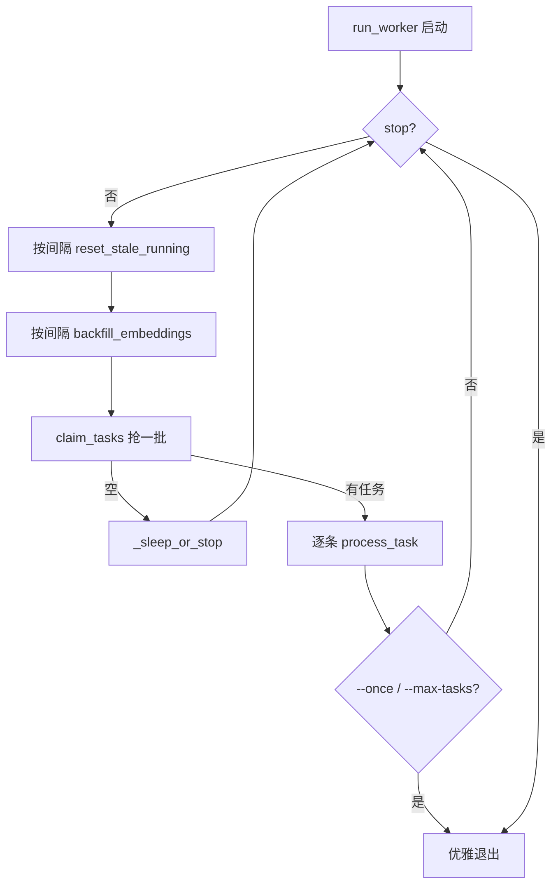
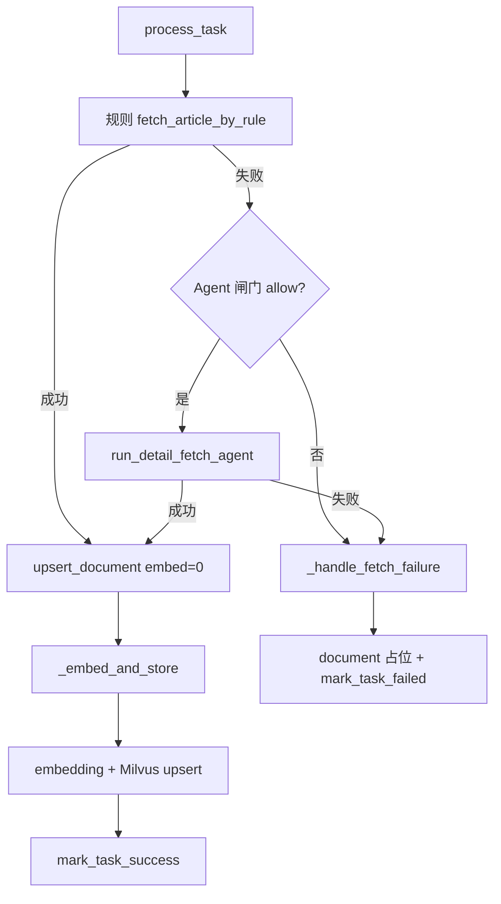
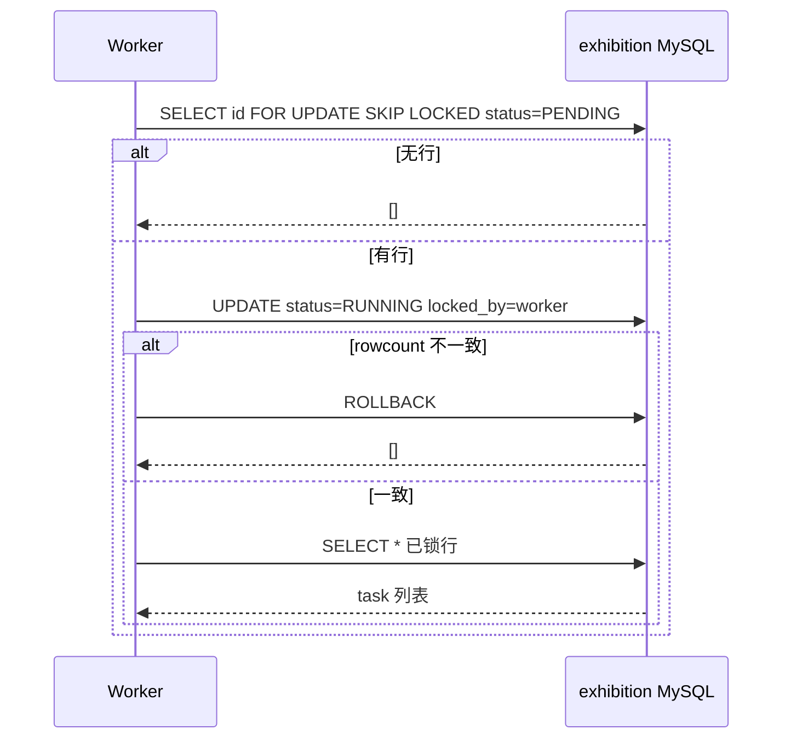
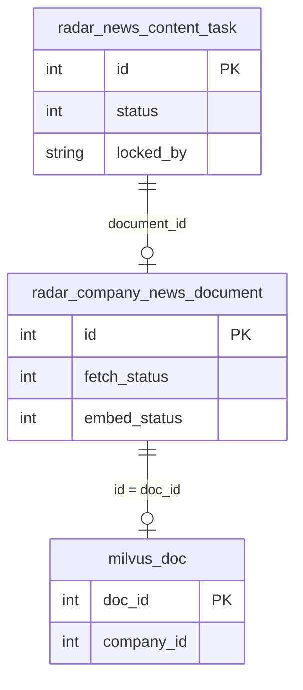

## 0. 代码概要

- **一句话定位**：gd25 侧常驻 CLI worker，消费 exhibition MySQL 中的 `radar_news_content_task`，把新闻详情页正文抓下来、向量化后写入 Milvus 与 `radar_company_news_document`。
- **价值与边界**：
  - **做**：抢锁 PENDING 任务 → 规则抓正文（失败再 Agent 兜底一次）→ 落 document → embedding → 写 Milvus → 回写 task；另周期补跑向量失败/待向量文档。
  - **不做**：不建表（DDL 归 Java）、不挂 FastAPI、不碰 exhibition 其它表（URL/来源字段全靠 task 快照）、不碰 gd25 主库 PG。
  - **上游**：Java quartz 只负责插入 PENDING 任务；**下游**：MySQL 两表 + 公司 embedding 网关 + Milvus。

## 1. 入口与入参解析

- **入口**：CLI / `main()`（`scripts/news_content_worker.py`），独立 asyncio 进程，由 supervisor/systemd/K8s 拉起。
- **进入条件**：
  - `--dry-run`：只读自检后退出，不要求常驻。
  - 正式跑：必须配置 exhibition MySQL（`settings.is_exhibition_mysql_enabled`），否则退出码 2。
- **入参形态与参数逻辑**（`argparse`）：

| 参数 | 作用 |
|------|------|
| `--dry-run` | 配置/MySQL/表计数/Milvus 只读探测，不写数据 |
| `--once` | 处理一轮（抢到的一批）后退出 |
| `--max-tasks N` | 累计处理满 N 条后退出 |
| `--batch-size` | 每轮 `claim_tasks` 条数（默认 `NEWS_CONTENT_BATCH_SIZE`） |
| `--poll-interval` | 无任务时休眠秒数 |
| `--worker-id` | 写 `locked_by`，默认 hostname:pid |
| `--no-agent` | 本次禁用 Agent 兜底 |
| `--skip-backfill` | 不做 embedding 补跑 |
| `-v` | DEBUG 日志 |

## 2. 出参、数据变更与外部依赖

- **出参**：进程退出码 —— `0` 正常；`1` dry-run 发现硬伤；`2` 未配 MySQL；`130` KeyboardInterrupt。业务结果写在库/日志里，不走 HTTP 响应。
- **存储变更**：
  - **读/写** `radar_news_content_task`：抢锁 PENDING→RUNNING、成功/失败回写、超时 RUNNING→PENDING、冗余 `embed_status`/`document_id`。
  - **读/写** `radar_company_news_document`：正文 upsert、抓取失败占位、`embed_status`/`vector_id`、补跑扫描。
  - **写** Milvus collection（`doc_id ≡ document.id`）。
- **外部依赖**：
  - exhibition MySQL（写型，任务与正文权威库）
  - 目标站点 HTTP（规则抓取 / Agent 工具抓页，读型）
  - 公司 embedding 网关 `HuayuanEmbeddingClient`（读型 API，产出向量）
  - Milvus `RadarNewsDocStore`（写型）
  - Agent SDK / Claude（仅规则失败且闸门放行时，可能写成本）
- **其它副作用**：进程日志；Agent 日配额/熔断为**进程内**计数。

## 3. 流程

### 3.1 核心流程概括

脚本启动后根据参数走 dry-run 或 worker 主循环。主循环周期性把卡死的 RUNNING 任务重置回 PENDING，并按间隔扫 document 补跑向量。每轮用行锁领取一批 PENDING，再**串行**交给 `NewsContentProcessor.process_task`：先规则下载，失败再视配额做一次 Agent 兜底；拿到正文后先写 document 拿主键，再 embedding、写 Milvus、回写状态；下载彻底失败则 task FAILED + document 占位。无任务时按 poll 间隔可中断休眠；SIGINT/SIGTERM 优雅退出。

### 3.2 纵向链路（入口 → 边界）

1. `scripts/news_content_worker.py.main` —— 解析参数、配日志；分支 dry-run 或 `run_worker`。
2. `run_dry_run`（可选）—— 只读查配置 / `mysql_ping` / `repo.count_*` / `RadarNewsDocStore.describe_async`。
3. `run_worker` —— 主循环：
   - `repo.reset_stale_running` —— RUNNING 超时回收
   - `NewsContentProcessor.backfill_embeddings` —— 补跑向量段
   - `repo.claim_tasks` —— `FOR UPDATE SKIP LOCKED` + 条件 UPDATE
   - `NewsContentProcessor.process_task` —— 单任务编排
4. `process_task` 内：
   - `content_fetcher.fetch_article_by_rule` —— HTTP + `ContentExtractor`
   - （失败）`AgentFallbackGuard` + `run_detail_fetch_agent` —— 配额/熔断/超时
   - `repo.upsert_document` 或 `mark_document_fetch_failed`
   - `_embed_and_store` → `HuayuanEmbeddingClient.embed_one` → `RadarNewsDocStore.upsert_document_async` → `mark_document_embed_ok/failed`
   - `repo.mark_task_success` / `mark_task_failed`
5. 收尾：`processor.aclose()`、`close_pool()`。

### 3.3 流程图 / 时序图

**总览**：worker 主循环四步节奏。

**子流程：单任务 process_task**

**子流程：抢锁 claim_tasks**

**小分支：向量失败 vs 下载失败**

- 下载失败：`task.status=FAILED`，document `fetch_status=2`（可有占位行）。
- 下载成功、向量失败：`task.status=SUCCESS`，document `fetch_status=1` + `embed_status=2`；正文已保住，由补跑只重做向量。

## 4. 实体清单与关系

- **关键实体清单**：
  - `radar_news_content_task`：调度队列；本流程抢锁与终态回写。
  - `radar_company_news_document`：正文与向量状态权威表。
  - Milvus 向量文档：检索侧副本，`doc_id = document.id`。
  - `ProcessOutcome`：内存结果对象，仅日志。
- **关系与约束**：
  - task : document ≈ 多对一/一对一业务关联（task.`document_id` 指向 document）；失败占位也会回填。
  - document 1 : 1 Milvus 行（主键同 id）。
  - 不读 `radar_company_news_url` / `radar_company_source_url`；`source_level` 等来自 task 快照。
- **ER / 依赖图**：

- **数据转换链**：task 快照(url/company/…) → ExtractedArticle(title/content/…) → document 行 → embed_text(`title\\n`正文前 N 字) → vector → Milvus 字段 → task SUCCESS 冗余字段。
- **字段说明**：

| 字段 | 含义 |
|------|------|
| task.status | 0 PENDING / 1 RUNNING / 2 SUCCESS / 3 FAILED |
| document.fetch_status | 0 未抓 / 1 已抓 / 2 失败 |
| document.embed_status | 0 待向量 / 1 已向量 / 2 失败 |
| actual_channel / source_type | `rule` 或 `agent` |
| locked_by / locked_at | 抢锁与超时重置依据 |

## 5. 用例

- **入参示例**：`python scripts/news_content_worker.py --once --batch-size 5`；库中有 PENDING：`id=101, url=https://example.com/news/1, company_id=42, source_level=P0`。
- **内部变化**：
  1. claim → task 101 变 RUNNING，`locked_by=host:pid`。
  2. 规则抓取成功 → upsert document（`fetch_status=1, embed_status=0`）得 `document_id=9001`。
  3. embedding + Milvus upsert(`doc_id=9001`) → document `embed_status=1`。
  4. task → SUCCESS，`document_id=9001`, `actual_channel=rule`。
- **出参示例**：进程退出 0；日志含 `ok=True channel=rule document_id=9001 embed_status=1`。

若规则失败且 Agent 日配额用尽：task FAILED，document 可能 `fetch_status=2` 占位，无成功向量。

## 6. 横切与其它（收尾）

- **并发**：多实例靠 MySQL `SKIP LOCKED` + `UPDATE WHERE status=0` + rowcount 校验；进程内任务**刻意串行**（同站限速 + 单条 embedding）。
- **自愈**：RUNNING 超过 `NEWS_CONTENT_LOCK_TIMEOUT_SECONDS`（默认 1800s）重置 PENDING；退出信号打断时剩余 RUNNING 亦依赖超时回收。
- **成本闸门**：Agent 开关 / 日配额 / 连续失败熔断 / 墙钟超时；配额进程内，多实例时配额放大（待确认是否上共享计数）。
- **可靠性**：`process_task` 不向外抛业务异常；向量失败与下载失败分状态，补跑幂等 upsert。
- **待确认**：exhibition 侧 quartz 具体插入字段与触发频率需对照 Java；Milvus collection 首次写入自动建表的生产权限/命名空间策略。
