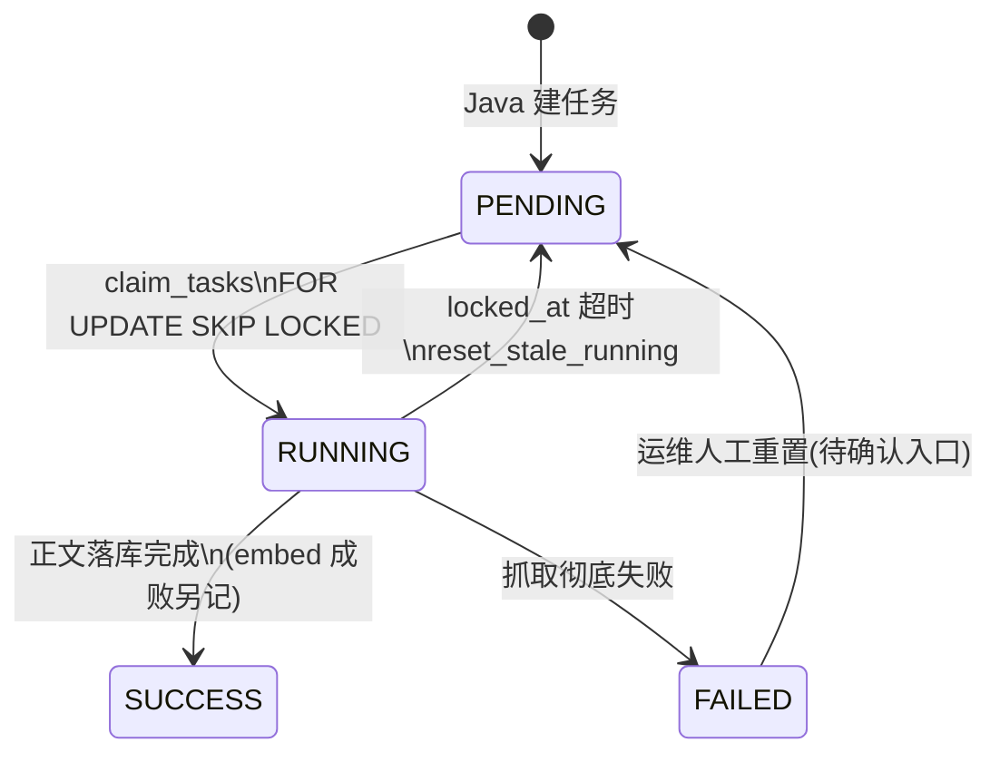
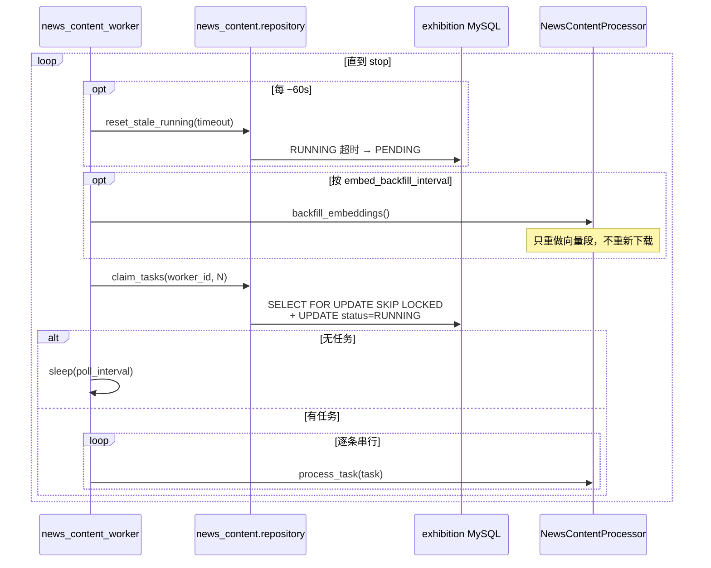
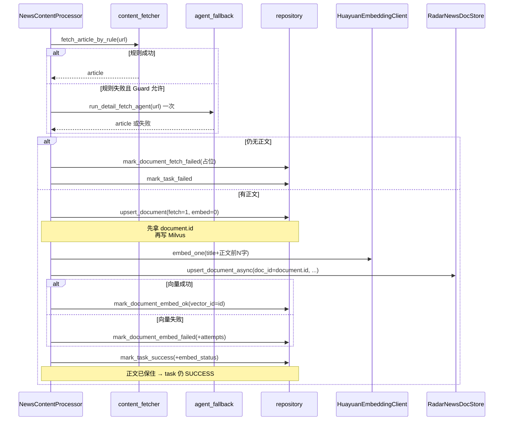
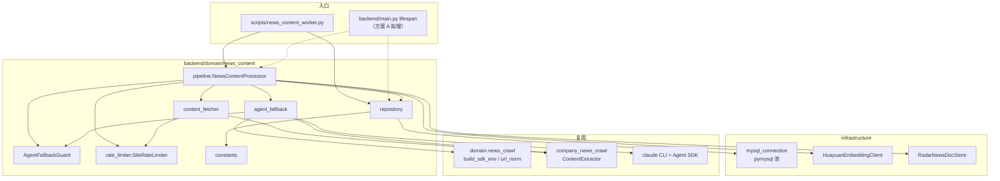

# 新闻知识库写入链路与方案 A 集成说明

> 目的：在把 `scripts/news_content_worker.py` **挂进 FastAPI** `lifespan`**（方案 A）** 之前，先把现网链路的时序、表结构、关键类依赖讲清楚，便于确认细节。  
> 代码入口：`scripts/news_content_worker.py` → `backend/domain/news_content/`  
> 上游设计：exhibition `projectDocs/技术设计-260915/02-知识库的构建/01-Claude的思考.md`  
> DDL：exhibition `.../SQL脚本/17_radar_news_content_schema.sql`（本仓不建表）

---

## 0. 一句话定位

本链路负责：Java 只建 `radar_news_content_task`（PENDING）→ gd25 **扫表抢锁** → 抓详情正文 → embedding → 写 Milvus → 写/回写 `radar_company_news_document` 与 task。

**明确不做**：不发现新闻 URL（那是 `news_url_crawl` / 列表采集）；不碰 PostgreSQL 主库；不碰 Rewritten 内存队列。

---

## 1. 系统边界与角色

```text
┌─────────────────┐     INSERT PENDING      ┌──────────────────────────┐
│ exhibition Java │ ───────────────────────▶│ radar_news_content_task  │
│ (quartz 建任务) │                         │     (exhibition MySQL)   │
└─────────────────┘                         └────────────▲─────────────┘
                                                         │ claim / 回写
┌─────────────────┐   HTTP 详情 / Agent     ┌────────────┴─────────────┐
│ 目标官网详情页    │◀───────────────────────│ news_content_worker      │
└─────────────────┘                         │ (现：独立脚本；拟：挂 app)│
                                            └─────┬──────────┬─────────┘
                    upsert 正文 / embed 状态       │          │ upsert 向量
                                                  ▼          ▼
                                   radar_company_news_document    Milvus
                                   (exhibition MySQL)             collection
                                                                  radar_company_news_doc
```


| 组件                    | 库/进程          | 职责                            |
| --------------------- | ------------- | ----------------------------- |
| Java quartz           | exhibition    | 只建 task（PENDING），不抓正文         |
| `news_content_worker` | gd25 进程       | 抢锁、抓取、embed、写 Milvus、回写       |
| FastAPI 主应用           | 同镜像           | 现无本链路；方案 A 拟在 lifespan 拉起同一循环 |
| Rewritten 队列          | PG + 内存 Queue | **无关**，保留不动                   |
| `news_url_crawl`      | FastAPI 路由    | 按需发现 URL 列表；**不是**本写入 worker  |


---


## 2. 表结构与状态机（gd25 只碰两张表）

仓储硬边界：`backend/domain/news_content/repository.py` **只读写**下面两张表；不读 `radar_company_news_url` / `radar_company_source_url`（建任务时所需字段已快照进 task）。

### 2.1 `radar_news_content_task`（任务表）

调度 + 结果摘要。抢锁字段：`status` / `locked_by` / `locked_at`。


| 字段（代码实际使用）                                                        | 含义                            |
| ----------------------------------------------------------------- | ----------------------------- |
| `id`                                                              | 主键                            |
| `company_id` / `company_name` / `stock_code`                      | 公司快照                          |
| `news_url_id` / `source_url_id`                                   | 上游 URL / 信息源 id（写 document 用） |
| `url` / `source_level` / `tenant_id`                              | 详情 URL、级别（如 P0）、租户            |
| `status`                                                          | 见下表                           |
| `locked_by` / `locked_at`                                         | 抢锁实例与时间                       |
| `actual_channel`                                                  | 实际通道：`rule` / `agent`         |
| `document_id`                                                     | 关联 document 主键                |
| `title` / `published_at` / `content_hash`                         | 出参摘要（与 document 对齐）           |
| `embed_status`                                                    | **冗余**向量状态（权威在 document）      |
| `cost_ms` / `agent_trace_id` / `error_message`                    | 耗时、Agent trace、失败原因           |
| `creator` / `updater` / `create_time` / `update_time` / `deleted` | 审计；`deleted = b'0'`           |


`status` **状态机**


| 值   | 名       | 谁改                                |
| --- | ------- | --------------------------------- |
| 0   | PENDING | Java 创建；超时 RUNNING 重置；运维人工重置      |
| 1   | RUNNING | worker `claim_tasks`              |
| 2   | SUCCESS | 正文已落库（**即使向量失败也是 SUCCESS**）       |
| 3   | FAILED  | 下载彻底失败（规则+Agent 都无正文）；**默认不自动重试** |





### 2.2 `radar_company_news_document`（正文/向量状态表）

一 URL 一篇（业务键：`news_url_id` + `deleted`）。


| 字段（代码实际使用）                                          | 含义                                                   |
| --------------------------------------------------- | ---------------------------------------------------- |
| `id`                                                | 主键；**≡ Milvus** `doc_id`                             |
| `company_id` / `news_url_id` / `source_url_id`      | 归属                                                   |
| `title` / `url` / `url_norm` / `url_hash`           | 标题与 URL                                              |
| `published_at`                                      | 发布日（字符串）                                             |
| `content_text` / `content_summary` / `content_hash` | 正文、摘要、sha1                                           |
| `source_type`                                       | `rule` / `agent`                                     |
| `source_level`                                      | 来自 task 快照                                           |
| `fetch_status`                                      | 0 未抓 / **1 已抓** / **2 失败占位**                         |
| `embed_status`                                      | 0 待向量 / **1 已向量** / **2 失败**                         |
| `vector_id`                                         | 成功时写 `document.id`（与 Milvus PK 一致）                   |
| `extra_json`                                        | 含 `embed_attempts` / `embed_error` / `fetch_error` 等 |
| `tenant_id` + 审计字段                                  | 同 task                                               |


`fetch_status` **/** `embed_status` **分步记状态（互不覆盖）**


| 场景        | task.status    | document.fetch | document.embed |
| --------- | -------------- | -------------- | -------------- |
| 下载失败      | FAILED         | 2（占位，已存在不覆盖）   | 0              |
| 下载成功、向量成功 | SUCCESS        | 1              | 1              |
| 下载成功、向量失败 | SUCCESS        | 1              | 2（可补跑）         |
| 补跑达上限     | 不动 task.status | 1              | 保持 2           |


### 2.3 Milvus collection `radar_company_news_doc`


| 字段                                         | 类型/说明                                |
| ------------------------------------------ | ------------------------------------ |
| `doc_id`                                   | int64，**PK** = `document.id`         |
| `company_id`                               | int64，partition key                  |
| `title` / `summary` / `url` / `embed_text` | varchar                              |
| `embedding`                                | float vector，dim=1024（bge-m3 / 公司网关） |
| 索引                                         | HNSW + COSINE                        |


库名配置：`MILVUS_DB_NAME`（如 `exhibition_test`）；与 MySQL 库名无关。

---


## 3. 核心时序


### 3.1 Worker 主循环（进程级）

现入口：`scripts/news_content_worker.py` → `run_worker()`。




要点：

- **串行**处理是刻意的（同站限速 + embedding 单条）。
- 多实例靠 MySQL 行锁互斥，不靠内存队列。
- 进程挂死后：RUNNING 靠 `NEWS_CONTENT_LOCK_TIMEOUT_SECONDS`（默认 1800s）重置。


### 3.2 单任务 `process_task`（写入链）




物理写入顺序（不要调换）：

1. 规则抓取
2. Agent 兜底（至多一次 / URL，受日配额与熔断）
3. **先插/更 document（embed_status=0）拿主键**
4. embedding
5. 写 Milvus（`doc_id` ≡ `document.id`）
6. 回写 document.embed_status / vector_id
7. 回写 task


### 3.3 补跑循环（向量段幂等）

条件：`fetch_status=1` 且 `embed_status IN (0,2)` 且正文非空，且 `extra_json.embed_attempts < NEWS_CONTENT_EMBED_MAX_ATTEMPTS`。

只调用 `_embed_and_store`，**不重新 HTTP/Agent**。

---


## 4. 关键类与依赖


### 4.1 模块依赖图




### 4.2 类 / 模块职责速查


| 符号                       | 路径                               | 职责                                            |
| ------------------------ | -------------------------------- | --------------------------------------------- |
| `run_worker`             | `scripts/news_content_worker.py` | 主循环：超时重置、补跑、抢锁、串行 `process_task`              |
| `NewsContentProcessor`   | `pipeline.py`                    | 单任务编排；持有 limiter / guard / embedder / milvus  |
| `repository`             | `repository.py`                  | 两表 SQL；claim / upsert / 状态回写 / 补跑扫描           |
| `fetch_article_by_rule`  | `content_fetcher.py`             | HTTP GET + trafilatura 抽取                     |
| `run_detail_fetch_agent` | `agent_fallback.py`              | Claude Agent 抠正文；与列表抓取工具不同                    |
| `AgentFallbackGuard`     | 同上                               | 开关 + 日配额 + 连续失败熔断（**进程内计数**）                  |
| `SiteRateLimiter`        | `rate_limiter.py`                | 按 `source_url_id` 礼貌限速                        |
| `HuayuanEmbeddingClient` | `infrastructure/llm/...`         | 公司网关 embedding                                |
| `RadarNewsDocStore`      | `infrastructure/milvus/...`      | Milvus upsert/search；同步客户端 + `to_thread` 异步包装 |
| `mysql_connection`       | `infrastructure/database/...`    | exhibition MySQL 连接池（与 PG `DATABASE_URL` 独立）  |


### 4.3 与易混模块的区别


| 模块                                | 关系                                                   |
| --------------------------------- | ---------------------------------------------------- |
| `rewritten_queue_service`         | **不共用**。内存 Queue + PG 改写批次；方案 A 只借「lifespan 起后台协程」形态 |
| `radar_crawl`                     | 巨潮公告 PDF 线；另一套 MySQL 任务表                             |
| `news_url_crawl` / `NEWS_CRAWL_*` | 发现 URL 的 HTTP API + CLI 自检；Agent 凭证可与兜底共用，但入口不同      |
| PG `embedding_records` / pgvector | 旧 RAG 线；本链路用 **Milvus**                              |


---


## 5. 配置开关（与方案 A 相关）


| 配置                         | 作用                                     |
| -------------------------- | -------------------------------------- |
| `EXHIBITION_MYSQL_*`       | MySQL；`is_exhibition_mysql_enabled`    |
| `MILVUS_*` / `EMBEDDING_*` | 向量库与维度                                 |
| `NEWS_CONTENT_*`           | batch / poll / lock / Agent 配额 / 补跑间隔等 |
| `NEWS_CRAWL_*` / Anthropic | Agent 兜底需要 CLI + 凭证（与 URL 抓取同源）        |


当前注释仍写「本组配置只服务 news_content_worker 常驻进程，不参与 FastAPI」——方案 A 落地后需改注释并增加例如：

- `NEWS_CONTENT_WORKER_IN_APP: bool = false`（默认关，避免本地起 API 就扫库）
- 开启条件建议：`IN_APP && is_exhibition_mysql_enabled`

---


## 6. 方案 A：拟如何挂进主应用


### 6.1 推荐改动形态（确认后实现）

1. 把 `run_worker` 主循环抽到 `backend/domain/news_content/worker_loop.py`（或保留在 pipeline 旁），脚本与 lifespan **共用**。
2. `scripts/news_content_worker.py` 保留为 CLI（`--dry-run` / `--once`），内部调用同一循环。
3. `backend/main.py` lifespan：
  - 启动：条件满足则 `asyncio.create_task(run_news_content_loop(stop_event))`
  - 关闭：`stop_event.set()` → 等当前任务收尾 → `processor.aclose()` / `close_pool()`（注意与 Rewritten 消费者并行收尾）
4. **不要**改成 Rewritten 式内存入队；继续 MySQL `claim_tasks`。


### 6.2 行为差异 / 风险（请确认）


| 点              | 说明                                                                         |
| -------------- | -------------------------------------------------------------------------- |
| API 扩副本        | 每个 Pod 都会跑一个 worker → 抢锁仍安全，但 Agent **日配额是进程内**，多副本 = 配额 × 副本数             |
| 资源争用           | 抓取 / embedding / Milvus 与 HTTP 同进程；高负载时可能拖慢接口                              |
| 启动失败策略         | 建议与新闻 CLI 自检一致：**配不全只告警，不阻断 FastAPI**；或严格模式直接不启 loop                       |
| 优雅退出           | uvicorn 收到 SIGTERM 会走 lifespan shutdown；需保证 stop 后不再 claim，RUNNING 残留靠超时重置 |
| 与 Rewritten 并存 | 无数据耦合；仅共享事件循环与进程内存                                                         |


### 6.3 建议验收用例

1. `NEWS_CONTENT_WORKER_IN_APP=false`：行为与现网一致，仅脚本能写库。
2. `=true` + MySQL/Milvus 齐：起 API 后 PENDING 被消费，document + Milvus 可见。
3. 杀进程中途：RUNNING 在超时后回 PENDING 并可再跑。
4. 向量失败：task=SUCCESS、embed_status=2，补跑后变 1。

---


## 7. 待确认清单

请对照本文确认或拍板：

1. **开关默认**：生产默认 `IN_APP=true`，还是默认 false、仅部署清单显式打开？
2. **多副本**：华院 API Deployment 副本数是否 >1？若是，Agent 配额是否先接受「×副本」？
3. **启动失败**：exhibition MySQL / Milvus 未配时，是跳过 worker 还是阻止启动？
4. **脚本去留**：集成后是否仍保留 `python scripts/news_content_worker.py` 作排障入口？
5. **FAILED 人工重置**：运维入口是否仍仅在 exhibition 侧？（本仓无重置 API）

确认后按 §6 改代码即可。

---


## 8. 关键源码索引


| 主题         | 路径                                                                            |
| ---------- | ----------------------------------------------------------------------------- |
| CLI / 主循环  | `scripts/news_content_worker.py`                                              |
| 单任务编排      | `backend/domain/news_content/pipeline.py`                                     |
| 两表 SQL     | `backend/domain/news_content/repository.py`                                   |
| 状态常量       | `backend/domain/news_content/constants.py`                                    |
| 规则抓取       | `backend/domain/news_content/content_fetcher.py`                              |
| Agent 兜底   | `backend/domain/news_content/agent_fallback.py`                               |
| Milvus     | `backend/infrastructure/milvus/radar_news_doc_store.py`                       |
| Embedding  | `backend/infrastructure/llm/huayuan_embedding_client.py`                      |
| MySQL 池    | `backend/infrastructure/database/mysql_connection.py`                         |
| 配置         | `backend/app/config.py`（`EXHIBITION_MYSQL_*` / `NEWS_CONTENT_*` / `MILVUS_*`） |
| 现 lifespan | `backend/main.py`（Rewritten + news_crawl CLI 自检）                              |


