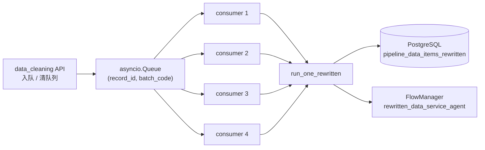
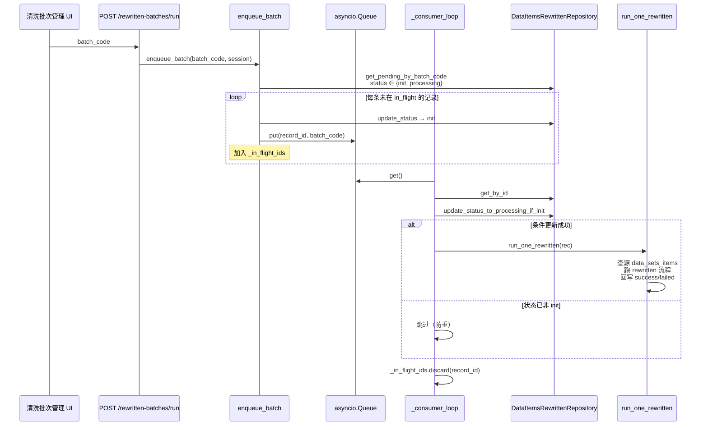

# Rewritten 队列消费者技术说明（main.py lifespan §6）

> 目的：帮助回忆 `backend/main.py` 启动时这段逻辑在做什么。  
> 锚点代码：

```148:153:backend/main.py
            # 6. 启动 Rewritten 任务队列消费者（021105，替代原 worker_loop）
            logger.info("6. 启动 Rewritten 任务队列消费者...")
            from backend.pipeline.rewritten_queue_service import start_consumers
            consumer_tasks = start_consumers()
            logger.info("   ✓ Rewritten 队列消费者已启动")
```

> 设计文档：`cursor_docs/021105-Step02批次任务队列与运行停止技术设计.md`、`021201-Rewritten队列与任务状态重构技术设计.md`  
> 实现：`backend/pipeline/rewritten_queue_service.py`、`rewritten_service.py`  
> API：`backend/app/api/routes/data_cleaning.py`（`/rewritten-batches/*`、`/data-items-rewritten/{id}/rerun`）

---

## 0. 一句话定位

这是 **GD25 Step02 数据清洗（Rewritten）** 的进程内任务队列消费者：FastAPI 启动时拉起 **4 个协程**，一直等内存队列里的改写任务；任务由清洗管理界面 API **手动入队**，再执行 `rewritten_data_service_agent` 流程。

**不是**新闻知识库写入、不是 Milvus、不是 exhibition MySQL。依赖本服务 **PostgreSQL**（`DATABASE_URL` / `ENABLE_DATABASE`）。

---

## 1. 为什么要有这段启动逻辑

### 1.1 替代了什么

旧方案：`rewritten_worker_loop()` **轮询 DB** 拉 `status=init` → 自动跑。问题是：

- 建完批次就会被后台吃掉，用户不好控「何时跑 / 何时停」
- 不利于排查与可控发布

新方案（021105）：**两阶段**

1. 用户点「进行数据清洗」→ 只建批次 + `pipeline_data_items_rewritten` 里多条 `init` 记录  
2. 用户再点「运行」→ 才入内存队列 → 消费者执行  

因此 lifespan 必须在应用存活期间 **常驻消费者**；否则 API 入队了也没人消费。

### 1.2 启动条件

```text
settings.is_database_enabled == True
  ← ENABLE_DATABASE=true 且配置了 DATABASE_URL
```

未启用数据库时跳过 §5 缓存与 §6 消费者（华院最小部署可关库）。

### 1.3 生命周期

| 时机 | 行为 |
|------|------|
| lifespan 启动 | `start_consumers()` → 4 个 `asyncio.Task`，赋给 `consumer_tasks` |
| 应用运行中 | 消费者阻塞在 `_queue.get()`；有入队才干活 |
| lifespan 关闭 | `cancel` 各 Task，再 `gather(..., return_exceptions=True)` |

---

## 2. 核心结构（进程内）

实现文件：`backend/pipeline/rewritten_queue_service.py`。

| 构件 | 说明 |
|------|------|
| `_queue: asyncio.Queue` | 元素 `(record_id: str, batch_code: str)` |
| `_in_flight_ids: Set[str]` | 已在排队或正在执行的 id，防重复入队 |
| `_CONSUMER_COUNT = 4` | 固定 4 个 `_consumer_loop` 协程 |
| `start_consumers()` | `create_task` × 4，应在 lifespan **只调一次** |



要点：

- **推式**，不轮询 DB 驱动执行  
- **单进程内存队列**：多 uvicorn worker 进程时各有一份队列（现网一般单 worker）；多进程共享需另换 Redis 等  
- 清队列 **不中断** 已 `get` 出去、正在执行的任务  

---

## 3. 时序

### 3.1 启动

```mermaid
sequenceDiagram
    participant Main as main.lifespan
    participant QS as rewritten_queue_service
    participant Loop as _consumer_loop ×4

    Main->>Main: is_database_enabled?
    Main->>QS: start_consumers()
    QS->>QS: _ensure_queue()
    QS->>Loop: create_task ×4
    Loop->>Loop: await _queue.get() 挂起等待
    Main-->>Main: yield（应用对外服务）
```

### 3.2 批次运行（最常见路径）



### 3.3 单消费者内部逻辑（对应代码）

```125:158:backend/pipeline/rewritten_queue_service.py
async def _consumer_loop() -> None:
    ...
    while True:
        record_id, _batch_code = await _queue.get()
        try:
            # 查库 → 仅 init 时改为 processing → run_one_rewritten
            ...
        except Exception as e:
            await _mark_failed(record_id, str(e))
        finally:
            _in_flight_ids.discard(record_id)
```

防重两层：

1. 内存 `_in_flight_ids`（入队去重）  
2. DB 条件更新 `init → processing`（消费占位；失败则跳过）

---

## 4. 入队 / 停跑 API 一览

路由前缀以 `data_cleaning` 路由挂载为准（清洗相关）。

| 能力 | 接口（相对路径） | 队列函数 | 语义 |
|------|------------------|----------|------|
| 批次运行 | `POST .../rewritten-batches/run` | `enqueue_batch` | 该批次 pending 记录改 init 并入队 |
| 清空全部队列 | `POST .../rewritten-batches/clear-queue` | `clear_all_queue` | 丢掉排队中全部；**执行中不杀** |
| 移除某批次排队 | `POST .../rewritten-batches/remove-batch` | `remove_batch_from_queue` | 只剔该 `batch_code`；其它回填队列 |
| 队列统计 | `GET .../rewritten-batches/queue-stats` | `get_queue_stats` | `queue_size` / `in_flight_count` |
| 单条再跑 | `POST .../data-items-rewritten/{id}/rerun` | `is_in_flight` + `enqueue_one` | 先 DB→init，再入队 |

`run_one_rewritten`（`rewritten_service.py`）：按 `source_dataset_id` / `source_item_id` 取源记录 → `FlowManager.get_flow("rewritten_data_service_agent")` → `_run_one`；终态由流程内更新函数写回。

---

## 5. 任务状态（简表）

表：`pipeline_data_items_rewritten`（PostgreSQL）。

| status | 含义 |
|--------|------|
| `init` | 待执行；可被消费者占位为 processing |
| `processing` | 执行中（或历史卡住的；批次运行会再改回 init 入队） |
| `success` / `failed` | 终态；批次入队查询 **不会** 再拉这些 |

单条 rerun：API 先把该条改为 `init`，再 `enqueue_one`（021201 约定）。

---

## 6. 关键类依赖

```text
main.lifespan
  └─ rewritten_queue_service.start_consumers
       └─ _consumer_loop ×4
            ├─ DataItemsRewrittenRepository  (PG)
            ├─ run_one_rewritten             (rewritten_service)
            │    ├─ DataSetsItemsRepository
            │    └─ FlowManager → rewritten_data_service_agent
            └─ _mark_failed

data_cleaning API
  └─ enqueue_batch / enqueue_one / clear_* / remove_* / get_queue_stats
```

与新闻链路对照（避免混）：

| | Rewritten 队列（本段） | news_content_worker |
|--|----------------------|---------------------|
| 启动位置 | FastAPI lifespan | 现为独立脚本 |
| 驱动方式 | API 入内存队列 | 扫 MySQL PENDING |
| 数据库 | PostgreSQL | exhibition MySQL |
| 业务 | 数据清洗改写 | 正文 + Milvus |

---

## 7. 运维时注意

1. **进程重启队列清空**：内存队列不持久；重启后需再点「运行」入队（DB 里仍是 init/processing）。  
2. **多副本 / 多 worker**：每进程一套队列与消费者；通常应保证清洗流量打到固定单实例，或接受各实例互不可见。  
3. **关库部署**：`ENABLE_DATABASE=false` 时本段不启动；清洗 API 本身也会因无库不可用。  
4. **保留策略**：与新闻知识库方案 A **无关**；可按产品需要继续保留本段逻辑。

---

## 8. 源码索引

| 主题 | 路径 |
|------|------|
| lifespan 启动/停止 | `backend/main.py` |
| 队列服务 | `backend/pipeline/rewritten_queue_service.py` |
| 单条执行 | `backend/pipeline/rewritten_service.py` → `run_one_rewritten` |
| HTTP 入队/停跑 | `backend/app/api/routes/data_cleaning.py` |
| 原设计 | `cursor_docs/021105-...`、`021201-...`、`021106-任务入队消费与状态变化梳理.md` |
