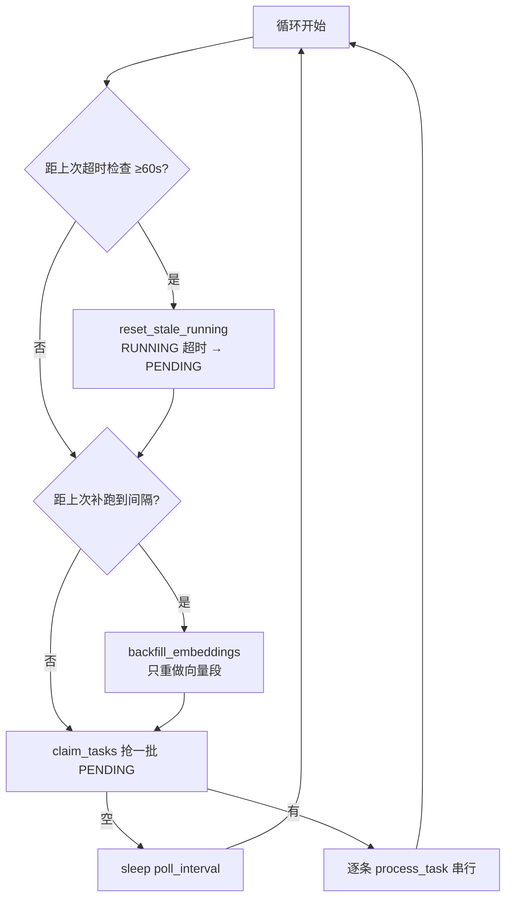
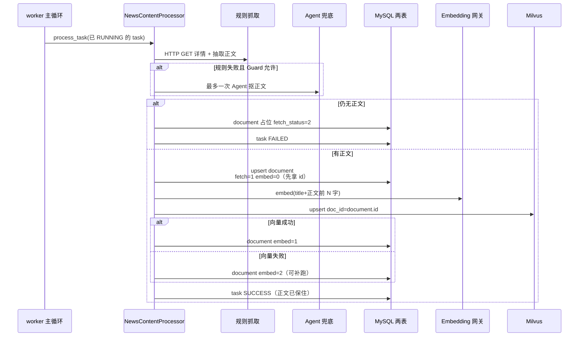

# 新闻知识库 Worker 技术说明（`scripts/news_content_worker.py`）

> 目的：单独讲清 **新闻知识库写入侧**——独立脚本如何扫表、抢锁、抓正文、embedding、写 Milvus。  
> 入口：`scripts/news_content_worker.py`  
> 业务实现：`backend/domain/news_content/`  
> 更细的表字段 / 方案 A 集成讨论见：`ai_docs/26091602-新闻知识库写入链路与方案A集成说明.md`  
> 对照（勿混）：`ai_docs/26091603-Rewritten队列消费者技术说明.md`（网页点运行 → 内存队列）

---

## 0. 一句话定位

这是 **雷达新闻知识库写入链路** 的常驻 worker：Java 只往 exhibition MySQL 插 `PENDING` 任务；本进程 **自己扫表抢锁**，串行完成「规则抓正文 →（失败则）Agent 兜底一次 → embedding → 写 Milvus → 回写 document/task」。

**不挂 FastAPI**；与 Rewritten「用户点网页才入内存队列」完全不同。

---

## 1. 和 Rewritten 队列差在哪

| | 本侧 `news_content_worker` | Rewritten（26091603） |
|--|---------------------------|------------------------|
| 启动方式 | `python scripts/news_content_worker.py` | FastAPI `lifespan` 起 4 消费者 |
| 任务从哪来 | Java quartz 写 MySQL `PENDING` | 用户网页点「运行」入内存 Queue |
| 驱动模型 | **拉**：周期 `claim_tasks` | **推**：API `enqueue_*` |
| 并发 | 进程内 **串行** 处理任务 | 4 个协程并发消费 |
| 数据库 | exhibition **MySQL**（两张表） | 本服务 **PostgreSQL** |
| 产物 | document 正文 + Milvus 向量 | 改写后的清洗记录 |

口诀：

- Rewritten：**人点一下 → 内存队列 → 4 工人抢**  
- 新闻 worker：**库里有 PENDING → 工人自己扫 → 一条一条干**

---

## 2. 怎么启动

仓库根目录：

```bash
# 只读自检（不写库）
python scripts/news_content_worker.py --dry-run

# 跑一轮就退出（联调）
python scripts/news_content_worker.py --once

# 常驻（生产）
python scripts/news_content_worker.py
```

常用参数：`--batch-size` / `--poll-interval` / `--worker-id` / `--no-agent` / `--skip-backfill` / `--max-tasks` / `-v`。

前置配置：

- `EXHIBITION_MYSQL_*`（硬依赖）  
- `MILVUS_*`、embedding 网关（向量段）  
- Agent 兜底另需 Claude CLI + Anthropic 类凭证（可关 `NEWS_CONTENT_AGENT_FALLBACK_ENABLED`）

**不依赖** `DATABASE_URL` / Rewritten / FastAPI 是否在跑。

---

## 3. 谁建任务、谁干活

```text
exhibition Java (quartz)
    │  INSERT status=PENDING
    ▼
radar_news_content_task          ←── claim / 回写 ──┐
                                                    │
目标官网详情页  ←── HTTP / Agent 抓取 ──  news_content_worker
                                                    │
radar_company_news_document  ←── upsert / embed 状态 ─┤
Milvus radar_company_news_doc ←── upsert 向量 ────────┘
```

- Java：**只建任务**，不抓正文、不写向量  
- 本脚本：抢锁后整条写入链跑完  
- gd25 仓储 **只碰两张表**（不读 url/source 表；字段已快照在 task 上）

---

## 4. 主循环在干什么

入口：`main()` → `asyncio.run(run_worker(args))`。

每一轮大致：



对应代码职责：

| 步骤 | 作用 |
|------|------|
| `reset_stale_running` | worker 挂死自愈：超时 RUNNING 清锁回 PENDING |
| `backfill_embeddings` | 正文已在、向量未好（embed 0/2）的补跑；不重新下载 |
| `claim_tasks` | `SELECT ... FOR UPDATE SKIP LOCKED` + 条件更新为 RUNNING |
| `process_task` | 单条写入链（见下节） |

串行是刻意的：同站礼貌限速 + embedding 单条调用，避免打爆目标站和网关。

多实例：靠 MySQL 行锁互斥，**不靠内存队列**；每实例自己的 `worker_id` 写在 `locked_by`。

---

## 5. 单条任务时序（核心业务）

`NewsContentProcessor.process_task(task)`：



分步记状态（容易忘）：

| 场景 | task.status | document |
|------|-------------|---------|
| 抓取彻底失败 | FAILED | fetch=2 占位 |
| 抓取成功、向量成功 | SUCCESS | fetch=1, embed=1 |
| 抓取成功、向量失败 | **仍 SUCCESS** | fetch=1, embed=2 → 补跑只修向量 |

物理顺序：**先落 document 拿主键，再写 Milvus**（`doc_id` ≡ `document.id`）。

---

## 6. 关键模块依赖

```text
scripts/news_content_worker.py
  ├─ run_dry_run / run_worker / main
  ├─ repository（claim / 回写 / 补跑扫描）
  └─ NewsContentProcessor
       ├─ content_fetcher          规则 HTTP + ContentExtractor
       ├─ agent_fallback           Claude Agent 兜底（配额/熔断）
       ├─ SiteRateLimiter          按 source_url_id 限速
       ├─ HuayuanEmbeddingClient   公司网关向量
       └─ RadarNewsDocStore        Milvus upsert
```

| 路径 | 角色 |
|------|------|
| `scripts/news_content_worker.py` | CLI、主循环、优雅退出、`--dry-run` |
| `backend/domain/news_content/pipeline.py` | 单任务编排 |
| `backend/domain/news_content/repository.py` | 两表 SQL |
| `backend/domain/news_content/content_fetcher.py` | 规则抓取 |
| `backend/domain/news_content/agent_fallback.py` | Agent 兜底 |
| `backend/infrastructure/database/mysql_connection.py` | exhibition MySQL 池 |
| `backend/infrastructure/milvus/radar_news_doc_store.py` | 向量库 |
| `backend/infrastructure/llm/huayuan_embedding_client.py` | embedding |

---

## 7. 表与状态（速查）

### `radar_news_content_task`

| status | 含义 |
|--------|------|
| 0 PENDING | 可被抢 |
| 1 RUNNING | 本 worker 持有 |
| 2 SUCCESS | 正文已落库（向量成败另见 embed_status） |
| 3 FAILED | 下载失败；默认不自动重试 |

### `radar_company_news_document`

| 字段 | 要点 |
|------|------|
| `fetch_status` | 0 未抓 / 1 已抓 / 2 失败占位 |
| `embed_status` | 0 待向量 / 1 已向量 / 2 失败（有 attempts 上限） |
| `id` | = Milvus `doc_id` |

### Milvus `radar_company_news_doc`

`doc_id` / `company_id` / `title` / `summary` / `url` / `embed_text` / `embedding(1024)`。

---

## 8. 并发与故障语义

1. **抢锁**：`FOR UPDATE SKIP LOCKED` → `UPDATE status=0→1`；rowcount 不一致则整批回滚。  
2. **挂死**：`locked_at` 超过 `NEWS_CONTENT_LOCK_TIMEOUT_SECONDS`（默认 1800s）→ 回 PENDING。  
3. **优雅退出**：SIGINT/SIGTERM 置 stop；当前条尽量跑完；本轮未处理完的 RUNNING 靠超时回收。  
4. **Agent 成本**：开关 + 日配额 + 连续失败熔断（**进程内计数**；多实例时配额约 × 实例数）。  
5. **幂等**：同一 `news_url_id` upsert document；Milvus upsert 同 `doc_id`。

---

## 9. `--dry-run` 查什么

只读：配置、MySQL `SELECT 1`、task 状态分布、PENDING 预览、document embed 分布、Milvus collection 是否存在。  
**不抢锁、不写数据、不建 collection。**

---

## 10. 部署形态

- **独立脚本（默认）**：`python scripts/news_content_worker.py`  
- **方案 A′（已实现）**：设 `NEWS_CONTENT_WORKER_IN_APP=true`，由 `backend/main.py` lifespan 拉起**同一** `worker_loop`（仍扫表抢锁，**不是** Rewritten 内存队列）。  
- 主循环代码：`backend/domain/news_content/worker_loop.py`；脚本仅为 CLI / `--dry-run` 薄壳。  
- 注意：API 多副本 = 多 worker；Agent 日配额为进程内计数。

---

## 11. 源码索引

| 主题 | 路径 |
|------|------|
| CLI / 主循环包装 | `scripts/news_content_worker.py` |
| **主循环实现** | `backend/domain/news_content/worker_loop.py` |
| lifespan 挂载 | `backend/main.py` §8（`NEWS_CONTENT_WORKER_IN_APP`） |
| 单任务 | `backend/domain/news_content/pipeline.py` |
| SQL | `backend/domain/news_content/repository.py` |
| 常量 | `backend/domain/news_content/constants.py` |
| 配置 | `backend/app/config.py` → `EXHIBITION_MYSQL_*` / `NEWS_CONTENT_*` / `MILVUS_*` |
| 端到端 + 表结构展开 | `ai_docs/26091602-...` |
| Rewritten 对照 | `ai_docs/26091603-...` |
