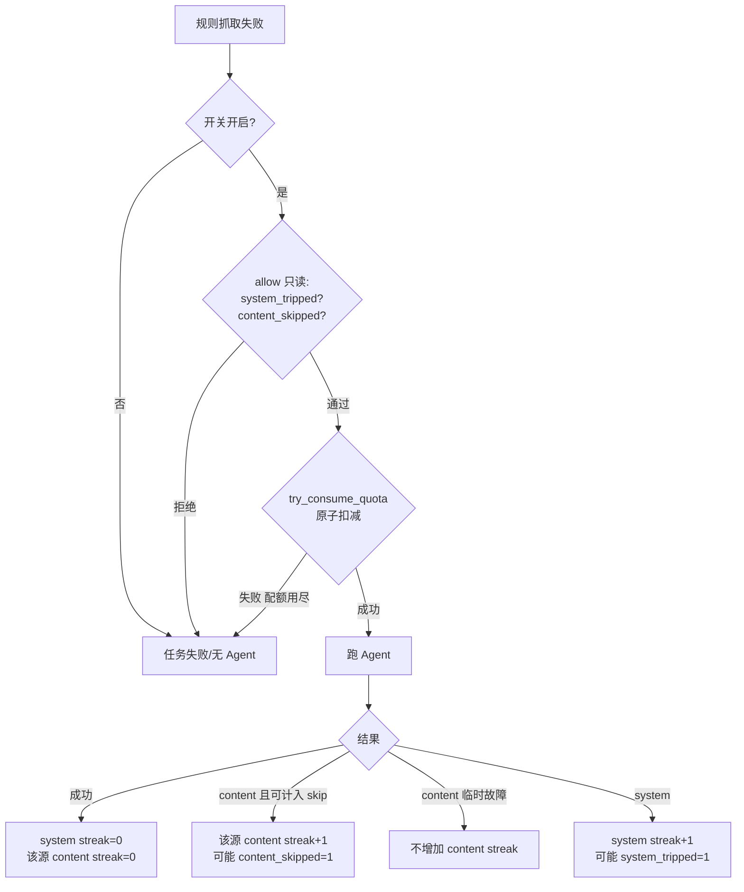

# Agent 兜底闸门改造设计

> 目的：修正「连续失败全局熔断」误伤可救 URL 的问题，同时保留成本硬顶与多实例一致性。  
> 现状：`backend/domain/news_content/agent_fallback.py`、`pipeline.py`  
> 关联：`ai_docs/26091604-新闻知识库Worker技术说明.md`

---

## 1. 结论

| 项 | 设计定案 |
|----|----------|
| 日配额 | 仍全局；**原子扣减**，落库 |
| 系统熔断 | 仅统计 **system** 连续失败；达阈值当日全局停 Agent |
| 内容跳过 | 按任务 **`source_url_id`（信息源）**，不是单篇 URL、不是路径前缀 |
| 存储 | 独立表 **`radar_news_agent_guard`**；**不改** `radar_company_source_url` |
| 调用序 | `await allow` → `await try_consume_quota` → Agent → `await mark_result` |

「页面抽不出」不再打穿全天兜底；「Agent 运行时坏了」仍可全日熔断。

---

## 2. 背景：现状与问题

### 2.1 改造前三道闸

| 闸门 | 配置 | 作用域 | 存储 |
|------|------|--------|------|
| 开关 | `NEWS_CONTENT_AGENT_FALLBACK_ENABLED` | 全局 | 配置 |
| 日配额 | `NEWS_CONTENT_AGENT_DAILY_QUOTA`（默认 30） | 进程内全局 | **内存** |
| 连续失败熔断 | `NEWS_CONTENT_AGENT_MAX_CONSECUTIVE_FAILURES`（默认 5） | 进程内全局 | **内存** |

任一兜底失败（`give_up`、空正文、SDK 超时等）都计入连续失败；满 5 次后当日**所有**信息源不再兜底。

### 2.2 要修的问题

异质队列里若先碰到一批壳站 / 加速页，连续 5 次内容失败会触发**全局熔断**，后面「规则抽歪、Agent 本可救」的 URL 当天也没机会。

根因：把「内容不可抽」和「Agent 不可用」当成同一种失败。  
日配额本身合理；不合理的是无差别连续失败熔断，以及状态只在内存、多实例会放大配额。

---

## 3. 目标、非目标与已知边界

### 3.1 目标

1. 硬站内容失败不误伤其它 `source_url_id`。  
2. 全日 Agent 次数有硬顶；系统故障可闭闸。  
3. 闸门状态持久化，重启与多 worker 共享同一计数。  
4. 不污染信息源主表；抽取工具集不变。

### 3.2 非目标（本版不做）

- Playwright / 浏览器打壳页  
- 单 URL 多次 Agent 重试  
- 改 `radar_company_source_url` 加字段  
- Redis；成功率降频 / 易站优先调度（可作为后续增强）

### 3.3 已知产品边界（设计内接受，不是漏改）

| 边界 | 说明 |
|------|------|
| 多硬源仍可能耗尽日配额 | 本设计修的是「误全局熔断」，不是「无限硬源下的配额分配」。每源试 N 次仍扣配额；硬源很多时后面可救源可能没额度。可用更小的 per-source 阈值，或后续做降频/调度。 |
| 闸门按日重置 ≠ 任务自动重爬 | 被跳过或抓取失败的 task 仍会 **FAILED**；次日解封只影响**尚未跑或被重置**的任务。已 FAILED 需人工/脚本重置 PENDING。 |
| 扣配额后进程崩溃 | 可能浪费 1 次配额且未记 streak；接受，不做两阶段提交。 |

---

## 4. 失败分类

每次兜底结束必须有明确结果：`ok` 或带 `failure_kind`。

| 结果 | `failure_kind` | 扣日配额 | 全局 system streak | 该源 content streak |
|------|----------------|----------|--------------------|---------------------|
| 成功 | — | 是（已扣） | 清零 | 清零 |
| 内容失败 | `content` | 是 | 不动 | **仅满足 §4.1 时 +1** |
| 系统失败 | `system` | 是 | +1，达阈熔断 | 不动 |
| `ok=False` 且 kind 缺失 | 按 **`system`** | 是 | +1 | 不动 |

### 4.1 内容失败何时计入「按源跳过」

避免把偶发 503 当成壳站：

| 现象 | kind | 是否 `content_fail_streak +1` |
|------|------|-------------------------------|
| HTTP **200** + 无可抽正文 / give_up（无正文） | `content` | **是** |
| 目标站 5xx / 连接失败 / 读超时等临时不可用 | `content` | **否**（记失败日志，不跳过该源） |
| SDK / CLI 异常、墙钟超时、鉴权、`is_error` | `system` | — |

### 4.2 `failure_kind` 填充分工

| 路径 | 谁填 | kind |
|------|------|------|
| `run_detail_fetch_agent` 内异常 / `is_error` | agent 函数 | `system` |
| `give_up` / 未提交 / 正文过短 | agent 函数 | `content`（是否 +streak 见 §4.1） |
| `pipeline` 的 `asyncio.TimeoutError` 包装 | **pipeline 必填** | `system` |
| 其它 `ok=False` 漏填 | `mark_result` 兜底 | 视为 `system` |

说明：超时在 pipeline 里直接构造 `AgentFallbackResult`，**不经过** agent 函数，必须在包装处写死 `failure_kind="system"`。

---

## 5. 闸门模型

三道闸同时生效；权威状态在表 `radar_news_agent_guard`。

### 5.1 全局日配额（原子）

- 一天最多发起 `NEWS_CONTENT_AGENT_DAILY_QUOTA` 次 Agent（默认 30）。  
- **禁止**「先读 `used < quota` 再另一步 +1」——多实例会超发。  
- 扣减唯一入口：`try_consume_quota`（行锁或 `UPDATE ... WHERE agent_used < quota`）。  
- 扣减成功才允许跑 Agent；失败则本任务不跑兜底。  
- 跨自然日：读新 `stat_date` 行（新建），旧行不改。

### 5.2 全局系统熔断

```text
仅 system 失败：system_fail_streak += 1
成功：streak = 0
content（含临时站点故障）：不增加 system streak

streak >= NEWS_CONTENT_AGENT_MAX_CONSECUTIVE_FAILURES（默认 5，语义=仅 system）
  → system_tripped = 1 → 当日全局不再 Agent
```

配置名可保留，**.env / 注释必须改成「仅系统失败」**。

### 5.3 按信息源内容跳过

**键 = `source_url_id`**（与现网限速一致），不是详情 URL，也不是 `/newsinfo` 前缀。

| 粒度 | 例 | 本设计 |
|------|----|--------|
| 单篇 URL | `.../11307121.html` | 否（每 URL 本就只兜底一次） |
| 栏目路径 | `.../newsinfo` | 否（结构不统一） |
| host | `www.katal.com.cn` | 否（易误伤同 CDN 多公司） |
| **信息源 id** | `source_url_id` | **是** |

```text
同一 source_url_id 下多篇详情共享 content_fail_streak
仅 §4.1 规定的「可计入」内容失败才 +1
成功：该源 streak=0 且 content_skipped=0
streak >= MAX_CONTENT_FAILURES_PER_SITE → content_skipped=1
当日该源不再 Agent；其它 source_url_id 不受影响
source_url_id 无效（≤0）：不写 SOURCE 行，只受 GLOBAL 闸门
```

默认 `NEWS_CONTENT_AGENT_MAX_CONTENT_FAILURES_PER_SITE = 1`（更省配额；若希望同源多试一次可调到 2）。

达到跳过阈值后：规则抓取照常；仅跳过 Agent，任务按抓取失败收尾（通常 FAILED）。

---

## 6. 存储：`radar_news_agent_guard`

### 6.1 为何独立表

| 方案 | 定案 |
|------|------|
| `radar_company_source_url` 加字段 | 否（主数据 ≠ 运行态；破坏零接触主表边界） |
| 仅内存 | 否（重启丢失、多实例配额放大） |
| **独立小表** | **是** |

仓储边界：

```text
radar_news_content_task
radar_company_news_document
radar_news_agent_guard          ← 新增
仍不碰：radar_company_news_url / radar_company_source_url
```

DDL 归 exhibition SQL 脚本；本仓不执行 DDL。上线顺序：**先建表，再发 worker**。

### 6.2 行模型

| `guard_scope` | `source_url_id` | 用途 |
|---------------|-----------------|------|
| `0` GLOBAL | 固定 `0` | `agent_used` / `system_fail_streak` / `system_tripped` |
| `1` SOURCE | 真实信息源 id（必须 >0） | `content_fail_streak` / `content_skipped` |

- `stat_date`：统计日，建议 Asia/Shanghai 日历日。  
- 跨日：插入新日期行；读只查今天。  
- 仓储拒绝 `guard_scope=SOURCE 且 source_url_id<=0`，避免与 GLOBAL 的 `0` 混淆。

### 6.3 字段与 DDL 草稿

| 字段 | 说明 |
|------|------|
| `guard_scope` / `source_url_id` / `stat_date` | 范围 + 日 |
| `agent_used` | GLOBAL：当日已发起次数 |
| `system_fail_streak` / `system_tripped` | GLOBAL：系统连续失败与熔断 |
| `content_fail_streak` / `content_skipped` | SOURCE：内容连续失败与跳过 |
| `version` | 乐观锁辅助 |
| 审计字段 | `creator`/`updater`/`create_time`/`update_time`/`deleted` |

```sql
-- exhibition 建议：18_radar_news_agent_guard.sql
CREATE TABLE IF NOT EXISTS radar_news_agent_guard (
  id                    BIGINT       NOT NULL AUTO_INCREMENT COMMENT '主键',
  guard_scope           TINYINT      NOT NULL COMMENT '0=GLOBAL 1=SOURCE',
  source_url_id         BIGINT       NOT NULL DEFAULT 0 COMMENT 'GLOBAL固定0；SOURCE=信息源id(>0)',
  stat_date             DATE         NOT NULL COMMENT '统计日',
  agent_used            INT          NOT NULL DEFAULT 0 COMMENT '当日已发起Agent次数(GLOBAL)',
  system_fail_streak    INT          NOT NULL DEFAULT 0 COMMENT '连续系统失败(GLOBAL)',
  system_tripped        TINYINT      NOT NULL DEFAULT 0 COMMENT '系统熔断0/1(GLOBAL)',
  content_fail_streak   INT          NOT NULL DEFAULT 0 COMMENT '连续内容失败(SOURCE，仅HTTP200空正文等)',
  content_skipped       TINYINT      NOT NULL DEFAULT 0 COMMENT '跳过该源Agent 0/1(SOURCE)',
  version               INT          NOT NULL DEFAULT 0 COMMENT '乐观锁版本',
  creator               VARCHAR(64)  NULL,
  updater               VARCHAR(64)  NULL,
  create_time           DATETIME     NOT NULL DEFAULT CURRENT_TIMESTAMP,
  update_time           DATETIME     NOT NULL DEFAULT CURRENT_TIMESTAMP ON UPDATE CURRENT_TIMESTAMP,
  deleted               BIT(1)       NOT NULL DEFAULT b'0',
  PRIMARY KEY (id),
  UNIQUE KEY uk_guard_day (guard_scope, source_url_id, stat_date, deleted),
  KEY idx_stat_date (stat_date)
) ENGINE=InnoDB DEFAULT CHARSET=utf8mb4 COMMENT='新闻Agent兜底闸门按日计数';
```

### 6.4 仓储契约

```text
get_or_create_global(stat_date) / get_or_create_source(source_url_id, stat_date)
  - 并发双插：ON DUPLICATE KEY 或捕获 Duplicate 后 SELECT；禁止裸 INSERT 不管冲突

try_consume_quota(stat_date, daily_quota) -> (ok, used, reason)
  - 唯一扣配额入口；事务内 FOR UPDATE 或条件 UPDATE

mark_system_result(stat_date, success, max_streak) -> tripped?
mark_content_result(source_url_id, stat_date, *, increment_streak: bool, max_streak) -> skipped?
  - increment_streak=False：记 content 失败但不推 skip（临时站点故障）

is_system_tripped / is_source_skipped：供 allow 只读
```

### 6.5 并发

- 配额：`SELECT ... FOR UPDATE` 后判断再 +1，或 `UPDATE ... WHERE agent_used < :quota`。  
- SOURCE streak / skipped：同样行锁或 CAS。  
- 权威在表；进程内短缓存可选，不得绕过 `try_consume_quota`。

### 6.6 运维

```sql
-- 今日全局
SELECT * FROM radar_news_agent_guard
WHERE guard_scope = 0 AND stat_date = CURDATE() AND deleted = b'0';

-- 今日被跳过的信息源
SELECT * FROM radar_news_agent_guard
WHERE guard_scope = 1 AND stat_date = CURDATE()
  AND content_skipped = 1 AND deleted = b'0';
```

人工解熔断 / 解跳过：优先 **UPDATE** `system_tripped`/`content_skipped`/streak，**不要**依赖软删再插；避免与 `uk(..., deleted)` 纠缠。

---

## 7. 决策流程

「该信息源」= **`source_url_id`**。



固定调用序：

```text
await allow(source_url_id)           # 开关 + 熔断/跳过，不扣配额
await try_consume_quota(...)         # 唯一扣配额；失败则禁止跑 Agent
await run_agent / wait_for(...)
await mark_result(..., failure_kind) # 含超时包装的 system
```

---

## 8. 代码改动面

### 8.1 结果类型

```python
failure_kind: Optional[Literal["content", "system"]] = None
# ok=True → None；ok=False → 必填（缺省按 system）
content_streak_eligible: bool = False
# 仅 content 且满足 §4.1（HTTP 200 空正文等）时为 True
```

### 8.2 Guard（异步）

```python
async def allow(self, source_url_id: int) -> tuple[bool, str]: ...
async def try_consume_quota(self) -> tuple[bool, str]: ...
async def mark_result(
    self,
    *,
    success: bool,
    source_url_id: int,
    failure_kind: Optional[Literal["content", "system"]] = None,
    content_streak_eligible: bool = False,
) -> None: ...
```

废弃同步内存版「`mark_used` 单独 +1」作为权威路径。

### 8.3 pipeline

```text
allowed, reason = await guard.allow(source_url_id)
if not allowed: ...
ok_quota, reason = await guard.try_consume_quota()
if not ok_quota: ...
agent_result = await _run_agent_with_timeout(...)  # Timeout → failure_kind=system
await guard.mark_result(
    success=agent_result.ok,
    source_url_id=source_url_id,
    failure_kind=agent_result.failure_kind,  # 缺省当 system
    content_streak_eligible=getattr(agent_result, "content_streak_eligible", False),
)
```

### 8.4 其它

- `config` / `.env.example`：per-source 新项；改连续失败注释为「仅 system」。  
- 更新 `26091602` / `26091604`：「两张表」→「三张表」。  
- worker 启动日志打印配额、system 阈值、per-source 阈值。

### 8.5 测试（`cursor_test/`）

1. 连续多次纯 content（可计入）→ **不**全局熔断；其它 `source_url_id` 仍可 `allow`。  
2. 同源连续可计入 content 达阈 → `content_skipped=1`；其它源仍可。  
3. 连续 system 达阈 → 全局熔断。  
4. 临时站点故障 content → **不**推 skip。  
5. pipeline 超时 → `failure_kind=system`。  
6. 跨日新旧行隔离。  
7. 两 worker 并发 `try_consume_quota` 总和 ≤ quota。  
8. 并发 `get_or_create` 不炸、最终一行。

---

## 9. 参数默认值

| 参数 | 建议默认 | 含义 |
|------|----------|------|
| `NEWS_CONTENT_AGENT_DAILY_QUOTA` | `30` | 全局日配额 |
| `NEWS_CONTENT_AGENT_MAX_CONSECUTIVE_FAILURES` | `5` | **仅 system** 连续失败熔断 |
| `NEWS_CONTENT_AGENT_MAX_CONTENT_FAILURES_PER_SITE` | `1` | 同 `source_url_id` 可计入 content 失败后跳过 |

---

## 10. 行为对照

场景：多个不同 `source_url_id`，前若干为加速壳（HTTP 200 空正文），其后有可救源。

| | 改造前 | 改造后 |
|--|--------|--------|
| 前 5 次壳站 | 连续失败 → **全日熔断** | 各源记 content；**不**全局熔断 |
| 其后可救源 | 不再兜底 | 配额未尽则可兜底 |
| 同源第 2 篇壳（阈值=1） | 可能已全局死 | 该源跳过 Agent，其它源继续 |
| SDK 连挂 5 次 | 熔断 | 仍熔断 |
| worker 重启 | 计数清零（可能解熔断） | **读表恢复**当日状态 |

---

## 11. 落地顺序

1. exhibition 落地 DDL。  
2. 仓储（防双插、原子扣配额、mark_*）+ 异步 Guard + `failure_kind` 全覆盖。  
3. pipeline 接线（含超时 kind）。  
4. 单测 §8.5。  
5. 更新 `26091602` / `26091604` / `.env.example`。  
6. （可选）成功率降频、易站优先、旧 `stat_date` 清理。

---

## 12. 验收标准

- 连续 ≥5 次可计入 content 失败后，其它 `source_url_id` 在配额内仍可发起 Agent。  
- 同源达 per-source 阈值后表中 `content_skipped=1`，日志含 `source_url_id`。  
- 临时站点故障不导致该源被 skip。  
- 连续 system 达阈后 `system_tripped=1`，当日全局停。  
- 多实例 `agent_used` 总和不超过日配额。  
- 重启后当日熔断/配额/跳过不丢。  
- 超时结果计为 system。  
- **不读写** `radar_company_source_url`。  
- 文档与运维知悉：FAILED 不因次日闸门重置而自动重试。
