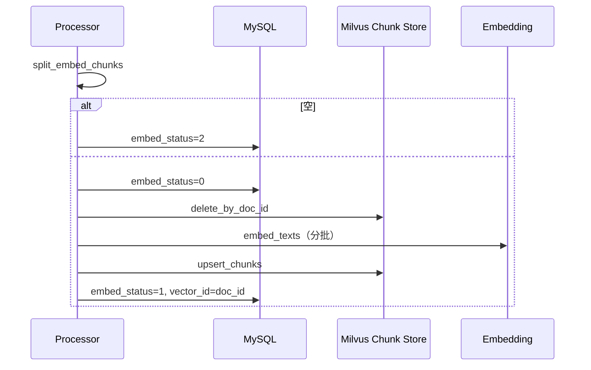

# 新闻知识库全文切分与召回策略 C 设计

> 状态：**已实现（待联调抽检）**  
> 决策：策略 **C**（chunk 检索 + 按文档合并 brief + quote 注入命中片段）  
> 相关：`26091602` / `26091604`、`radar_evidence_gather_node`、`load_news_document`  
> 替代：V1「`title + 正文前 2000` 单向量」  
> 说明：代码尚未对外发布 —— **直接改实现与默认配置即可**，无需单独的生产切流/双跑方案。

实现落点（摘要）：
- 切分：`backend/domain/news_content/chunking.py`
- 写入：`pipeline.py` `_embed_and_store` + `RadarNewsChunkStore`
- 召回：`radar_evidence_gather_node.py` 策略 C
- 单测：`cursor_test/test_news_content_chunking.py`
---

## 0. 目标与非目标

### 0.1 目标

1. **全文可检索**：正文后半段也能被召回，不再只嵌前 2000 字。  
2. **证据不碎片化**：同 `doc_id` 多 chunk 命中 → 给模型仍是 **1 条 brief**。  
3. **命中片段可见**：`quote` / `why_evidential` 带上最佳命中段（可选非重叠第二段）。  
4. **`load_news_document` 不变**：白名单仍是 `doc_id`，按文档拉全文。

### 0.2 非目标（本版不做）

- MySQL 不落 chunk 表（chunk 只进 Milvus）。  
- 不改 `load_news_document` 按 offset 拉片段。  
- 不做 Recursive/段落/Semantic 切分、不做 cross-encoder / 父子索引。  
- 不做软删 document 联动删向量的产品化（重嵌路径会清旧 chunk）。

### 0.3 已拍板参数

| 项 | 值 |
|----|-----|
| 切分 | 固定字符滑窗 **`CHUNK_SIZE=1000` / `OVERLAP=200` / `MAX_PER_DOC=50`** |
| 向量段状态机 | **写前先置 `embed_status=0`**，再删旧 chunk、再写入（见 §4） |
| 第二段 quote | **默认开启**，但须 `abs(index差)≥2`（避免重叠窗重复） |
| Collection | 默认即用 `radar_company_news_chunk`；本地若有旧 V1 测试数据可 drop 后重跑 worker |

---

## 1. 策略 C 一句话

```text
写入：1 文档 → N chunk → N 向量（Milvus）
检索：按 chunk 相似度 topK（放大候选，保证文档多样性）
合并：按 doc_id 聚合 → 每文档 1 条 brief
展示：brief.quote = 最佳命中 chunk（可附非近邻第二段）
全文：load_news_document(doc_id)
```

| 层级 | 粒度 |
|------|------|
| 向量检索 | chunk |
| briefs / 白名单 / 终评 | document |
| 原文核对 | document |

---

## 2. 切分规则（写入）

### 2.1 输入

- `title`（可空）、`content_text`（MySQL 全文，权威源）  
- 废弃「只取前 2000」作为唯一嵌入文本。

### 2.2 算法

固定滑窗 + 重叠；**本版不加** LangChain Recursive / 段落切分。

| 参数 | 配置项 | 默认 | 说明 |
|------|--------|------|------|
| 窗口 | `NEWS_CONTENT_CHUNK_SIZE` | `1000` | 正文最大字符（**不含** title） |
| 重叠 | `NEWS_CONTENT_CHUNK_OVERLAP` | `200` | 步长 = 800 |
| 上限 | `NEWS_CONTENT_CHUNK_MAX_PER_DOC` | `50` | 超出截断 + warn；`extra_json.chunk_truncated=true` |
| 前缀 | 固定 | `{title}\n` + 正文段 | 无 title 则仅正文 |
| 最短末段 | 固定 | `40` | 过短则并入上一段（上一段未超窗时） |

伪代码：

```text
body = content_text.strip()
if not body and not title:
    → 嵌入失败

若仅有 title、无正文 → 单 chunk = title；结束

chunks = []
step = max(1, CHUNK_SIZE - OVERLAP)
start = 0
while start < len(body) and len(chunks) < MAX:
    piece = body[start : start + CHUNK_SIZE]
    chunks.append({index, text: title?\n+piece : piece,
                   char_start: start, char_end: start+len(piece)})
    start += step

# 末段过短合并
if len(chunks) >= 2 and len(last.piece) < 40:
    尝试并入上一段（合并后正文 ≤ CHUNK_SIZE）；否则保留

if len(body) 未能被 MAX 覆盖:
    log.warn + extra_json.chunk_truncated = true
```

API 替换：`build_embed_text(...)` → `split_embed_chunks(title, content) -> list[Chunk]`。  
`NEWS_CONTENT_EMBED_TEXT_MAX_CHARS`：废弃（可读入但忽略）。

### 2.3 为何固定窗

官网正文经 HTML 抽取后段落边界不稳；固定窗可测。策略 C 用 quote + 全文工具补上下文。质量不够时再考虑 Recursive（不阻塞本版）。

---

## 3. Milvus Schema（V2）

### 3.1 为何新 collection

V1 PK=`doc_id`（一文一行）。V2 需一行一 chunk，**不能原地改 PK**。

| 项 | 值 |
|----|-----|
| Collection | `radar_company_news_chunk` |
| 配置 | `MILVUS_COLLECTION`（worker 与 API **必须同值**） |
| 旧 `radar_company_news_doc` | 联调可 drop；不必保留双跑 |

### 3.2 字段

| 字段 | 类型 | 约束 | 说明 |
|------|------|------|------|
| `chunk_id` | VARCHAR(64) | **PK** | `{doc_id}_{chunk_index}` |
| `doc_id` | INT64 | 标量索引 | ≡ `radar_company_news_document.id` |
| `company_id` | INT64 | partition key | 检索必过滤 |
| `chunk_index` | INT64 | | 从 0 |
| `chunk_count` | INT64 | | 当时总段数 |
| `char_start` / `char_end` | INT64 | | 相对正文（不含 title） |
| `title` | VARCHAR(512) | | |
| `summary` | VARCHAR(1024) | | 文档级，各 chunk 相同 |
| `url` | VARCHAR(1024) | | |
| `embed_text` | VARCHAR(8192) | | 实际嵌入文本（含 title 前缀） |
| `embedding` | FLOAT_VECTOR(1024) | HNSW+COSINE | dim 与现网一致 |

索引：HNSW `M=16` / `efConstruction=200`；`doc_id` 标量索引（`delete where doc_id==x`）。

### 3.3 MySQL

| 字段 | V2 语义 |
|------|---------|
| `embed_status` | 仍 0 待向量 / 1 成功 / 2 失败 |
| `vector_id` | 成功时仍写 `document.id`（**逻辑锚点**，≠ Milvus PK） |
| `extra_json` | 可选：`chunk_count`、`chunk_truncated` |

---

## 4. 写入链路

### 4.1 状态机（避免静默不可召回）

**禁止**在 `embed_status` 仍为 1 时直接删 Milvus。正确顺序：

```text
1. split_embed_chunks
2. 空 → mark embed_status=2；结束
3. mark embed_status=0（写前降状态，补跑可回收）
4. delete_by_doc_id（清旧 chunk）
5. embed_texts（分批，默认 batch=16）
6. upsert_chunks
7. mark embed_status=1, vector_id=doc_id
任一步失败 → embed_status=2，并尽量再 delete_by_doc_id 清半成品
```



要点：

- 中途崩溃：MySQL 为 0 或 2 → **补跑会捞回**；不会出现「Milvus 已空但 status=1」。  
- 补跑仍扫 `embed_status IN (0,2)`，不重新下载正文。  
- 超 `NEWS_CONTENT_EMBED_MAX_ATTEMPTS` 保持 2（与现逻辑一致）。

### 4.2 Store API

推荐 **新类** `RadarNewsChunkStore`（或同等），避免误写旧 schema：

```text
ensure_collection()           # 仅创建含 chunk_id 的 V2 schema
upsert_chunks_async(rows)
delete_by_doc_id_async(doc_id)
search_async(..., output 含 embed_text/chunk_*)
```

联调：`search`/`ensure` 若发现 collection 存在但无 `chunk_id` 字段 → **报错拒绝**（说明 `.env` 仍指向旧 V1 名，改配置或 drop 即可）。

### 4.3 涉及文件

| 文件 | 变更 |
|------|------|
| `pipeline.py` | `split_embed_chunks`；状态机；多向量写入 |
| `milvus/*` | Chunk Store |
| `config.py` + `.env.example` | chunk / collection / batch |
| `news_content_worker.py` | dry-run 打印新配置 |

---

## 5. 召回链路（策略 C）

### 5.1 检索

1. query → `embed_one`（bge-m3，不变）  
2. Milvus search：`company_id` 过滤  
3. **候选 chunk 数**（放大，减轻长文占满 topK）：

```text
top_k = min(128, max(max_docs * KNOWLEDGE_SEARCH_CHUNK_TOP_K_FACTOR, max_docs + 8))
默认 FACTOR = 8
```

4. `output_fields` 至少含：`doc_id`, `chunk_id`, `chunk_index`, `chunk_count`, `title`, `summary`, `url`, `embed_text`  
5. `score`：沿用现网 COSINE 返回值；实现时用样例断言「越相似越大，再降序」，避免距离/相似度搞反。

### 5.2 合并

```text
candidates = 各 query 的 chunk hits
按 score 降序扫描，维护 best_by_doc[doc_id] = {best, second?}
  - second 仅当：分数接近（≥ best×0.95 或差 < 0.03）
                且 abs(chunk_index 差) ≥ 2

按 best.score 降序取文档，直到 max_docs
URL 去重与博查/AnySearch 共用 seen_urls（知识库仍优先合并进 briefs）

每文档 1 条 brief：
  quote = 去 title 前缀后的 best 正文，clip 至 KNOWLEDGE_BRIEF_QUOTE_MAX_CHARS（默认 500）
  若有合法 second → 追加「【相关段落2】...」
  why_evidential 含 score、doc_id、chunk_index/chunk_count
  subject_match 输入 = title + summary + quote
  白名单只登记 doc_id
```

**禁止**同 `doc_id` 两条 knowledge brief。

### 5.3 brief 字段

```text
quote / why_evidential / summary / doc_id / tool_name=knowledge_base / source_level=P0 / score / query
```

### 5.4 `load_news_document`

本版不改；白名单 = 并入 briefs 的 `doc_id`。

### 5.5 涉及文件

| 文件 | 变更 |
|------|------|
| Chunk Store `search` | 出参 |
| `radar_evidence_gather_node.py` | top_k、聚合、quote、subject_match |

---

## 6. 配置清单

| 配置 | 默认 | 说明 |
|------|------|------|
| `MILVUS_COLLECTION` | `radar_company_news_chunk` | V2；API 与 worker 同值 |
| `NEWS_CONTENT_CHUNK_SIZE` | `1000` | |
| `NEWS_CONTENT_CHUNK_OVERLAP` | `200` | |
| `NEWS_CONTENT_CHUNK_MAX_PER_DOC` | `50` | |
| `NEWS_CONTENT_EMBED_BATCH_SIZE` | `16` | |
| `KNOWLEDGE_SEARCH_CHUNK_TOP_K_FACTOR` | `8` | chunk 候选放大 |
| `KNOWLEDGE_BRIEF_QUOTE_MAX_CHARS` | `500` | |
| `KNOWLEDGE_BRIEF_SECOND_CHUNK_ENABLED` | `true` | 且 index 间隔 ≥2 |
| ~~`NEWS_CONTENT_EMBED_TEXT_MAX_CHARS`~~ | 废弃 | |

本地若曾跑过 V1：把 `MILVUS_COLLECTION` 换成新名（或 drop 旧 collection），有需要时把已有 document 的 `embed_status` 置 0 让补跑重嵌即可。无额外「迁移章节」。

---

## 7. 验收标准

1. 正文 >2000 字，后半段实体可被召回。  
2. 同文档多 chunk 命中 → knowledge brief 仅 1 条，`quote` 含最高分片段。  
3. 第二段仅在 index 间隔 ≥2 时出现；近邻重叠不重复贴。  
4. `load_news_document` 仅白名单 doc 成功。  
5. 正文变短后重嵌：旧高 index chunk 数为 0。  
6. **崩溃回收**：`embed_status=0` 后、写入完成前杀进程 → 补跑能重新向量化（不会永久卡在「假 1」）。  
7. `max_docs=5` 时 knowledge brief ≤5；长文 + 多短文场景下短文仍有机会进入 briefs（候选 top_k 足够）。  
8. embedding 失败 → `embed_status=2`，半成品尽量被删掉。

---

## 8. 开发任务

| 序 | 任务 | 产出 |
|----|------|------|
| T1 | `split_embed_chunks` + 末段合并 + 单测（`cursor_test/`） | 切分 |
| T2 | Chunk Store（schema/upsert/delete-by-doc/search/门闩） | 存储 |
| T3 | `_embed_and_store` 状态机 + 分批 embed + 补跑 | 写入 |
| T4 | gather 策略 C（top_k×8、聚合、quote、subject_match） | 召回 |
| T5 | 配置默认值 / dry-run / 同步修订 `26091604` 要点 | 可运维 |
| T6 | 联调抽检长文召回（本地有旧数据则 drop/重嵌） | 验收 |

依赖：`T1→T2→T3`；`T2→T4`；`T3+T4→T5→T6`。

---

## 9. 风险（实现时注意即可）

| 风险 | 处理 |
|------|------|
| 网关 batch/限流 | `EMBED_BATCH_SIZE` 可调；失败整篇标 2 并清半成品 |
| title+1000 超 8192 | 几乎不可能；超则截断打日志 |
| `.env` 仍指向旧 collection | schema 门闩报错；改名或 drop |
| MAX=50 截断超长稿 | warn + `chunk_truncated` |
| 软删不联动向量 | 非目标；接受 |

---

## 10. 决议摘要

- **切分**：`1000 / 200 / MAX=50` 固定滑窗。  
- **写入**：`embed_status=0` → delete → embed → upsert → `=1`。  
- **存储**：新 collection，PK=`chunk_id`；代码直接改默认配置，无生产切流专题。  
- **召回**：策略 C；chunk 候选 ×8；brief 注入 quote；第二段需 index 间隔 ≥2；`subject_match` 含 quote。  
- **工具**：`load_news_document` 不变。
