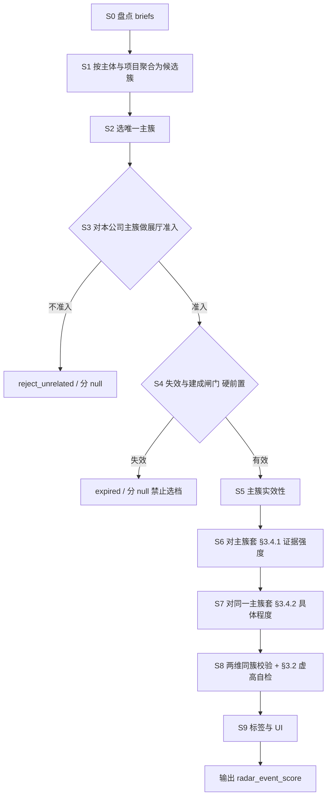

# 展厅需求终评提示词：产品对照、缺失规则与思维链设计

> 对照真源：`华院Agent设计/产品提供-260903/数字文旅商机中心可配置规则设计v2.md` **§3 规则二**  
> 现行生效提示词：`config/flows/huayuan_radar_event_agent/prompts/radar_event_score.md`  
> 未挂载旧稿（含完整档位表）：同目录 `radar_event_react.md`  
> Agent 侧约定：`华院Agent设计/03-二阶段的Agent任务.md` §4（禁止输出 S1–S4；定级封顶由调用方）

---

## 0. 一句话结论

产品规则二要求：**先准入 → 再按 §3.4.1/3.4.2 互斥选档 → 标签仅解释不计分 → 待核验/已失效闸门**。  
现行 `radar_event_score.md` 有实效性/已建成排除等工程增强，但**缺失产品档位表与 §3.2 定级前提的可执行表述**，且「须同时具备项目动作」与产品允许的 **25/10 潜在信号档冲突**。

实测另两类问题（两维引用不同信号、过时/已建成仍计分）表明：仅「选主事件」不够。**v2 思维链必须先按主体/项目把证据聚成簇，闸门硬前置，再对同一主簇套产品规则且两维共用该簇。**

---

## 1. 产品 §3 ↔ 现行提示词对照

| 产品条款         | 产品要求（摘要）                                              | 现行 `radar_event_score.md`                                        | 缺口等级     |
| ------------ | ----------------------------------------------------- | ---------------------------------------------------------------- | -------- |
| §3.1 核心原则    | 评「需求证据强弱」；总部/品牌等仅在与展厅明确关联时才参与                         | 有「实体空间」表述，**未写**「一般企业动态默认不准入」                                    | 中        |
| §3.2-1       | 须出现展厅/展馆/展示中心/体验中心/长期展示接待空间                           | 有物理空间要求                                                          | 基本覆盖     |
| §3.2-2       | **S1 必须有明确项目动作**（招标/采购/立项/改造启动/供应商征集）；无则总分≥75 最高只能 S2 | Agent 禁止出 S，但**未写**「无动作时禁止虚高到 75/85」自检                           | **高**    |
| §3.2-3       | **S2 必须有明确需求/意向**；仅潜在信号最高 S3                          | **未写**「仅潜在信号时 evidence_score 上限 25」                              | **高**    |
| §3.2-4       | 主体/原文无法确认 → **待核验**，不直接当弱 S4                          | 时效无日期时有 pending；**主体 unknown / 仅标题关键词**约束弱                       | **高**    |
| §3.2-5       | 过期/取消/超窗口 → **已失效**，重新有事实再评                           | B 节「已建成」+ C 节部分覆盖；**招采结束无后续窗口**表述不全                              | 中        |
| §3.3 权重逻辑    | 证据强度 85 + 具体程度 15；对象明确是前提不再重复加分                       | 有两维，**未写**「对象明确不重复计入 specificity」                                | 低        |
| §3.4.1 档位表   | 9 行情况→分（含判断逻辑）                                        | **仅枚举数字，无情况对照表、无判断逻辑列**                                          | **致命**   |
| §3.4.2 具体程度表 | 4 档 15/10/5/0                                         | **仅枚举数字，无情况对照**                                                  | **致命**   |
| §3.5 S 区间    | 75–100 / 50–74 / 25–49 / 0–24                         | 禁止输出 S（正确）；应加**自检注释**避免虚高                                        | 中（调用方定级） |
| §3.6 事件标签    | 固定子类词表，**不计分、不直接定级**；潜在/背景须同时有展厅事实                    | 有 `tags` 字段，**无词表、无「不计分」硬约束**                                    | 中        |
| §3.7 核验      | 主体/对象/原文冲突 → 待核验；失效仅留历史                               | `admission_hint` 有枚举；**冲突 → fact_status=conflict + pending** 未写清 | 中        |
| 规则一 §2.3 排除  | 展会临时展台、门店装修、普通维修                                      | C 节有；缺「招聘/短视频」等产品暂不接入口径（可选）                                      | 低        |
| —            | —                                                     | A 实效性、B 已建成、KB load：**产品原文无**，属工程增强，应保留并标注「非产品原文」                | 保留       |

### 1.1 现行提示词与产品的**直接冲突**

`radar_event_score.md` 第 11 行：

> 评估对象须**同时具备**：① 物理空间；② **项目动作**

产品 §3.4.1 明确允许在**无招标/立项等动作**时仍给分：

| 档   | 产品允许的场景             | 是否必须有「项目动作」     |
| --- | ------------------- | --------------- |
| 25  | 新总部/基地等潜在信号且与展厅明确关联 | **否**（潜在）       |
| 10  | 旧展厅老化等，尚未提改造需求      | **否**           |
| 60  | 明确需求/意向，尚无具体计划      | 有「需求表达」，未必已招标立项 |

若坚持「必须同时具备项目动作」，会把合法的 **S3/S4 候选**全部拒识，与产品矛盾。

**修正口径（建议写入提示词）：**

- **准入**：必须有展厅/长期展示空间相关事实（§3.2-1）。  
- **计分**：按 §3.4.1 互斥选最高一档；潜在信号档（25/10）**不要求**已有招采立项。  
- **高档约束**：75/85 必须有计划或立项类事实；**无明确项目动作时禁止选 75/85**（对齐 §3.2-2，防止暗示 S1）。

### 1.2 「签约」歧义（产品原文 vs 示例）

产品 10 分档原文：

> 已确定**设计或实施单位**、已签订合同或项目已进入实施，且**未发现新增采购/分包/合作窗口**

现行示例把「政企签约共建体验中心」打成 **60**，历史跑批甚至 **75**。  
产品语义是「**销售窗口关闭**的承包/实施合同」，不是「政企合作意向/共建协议」。

**思维链须强制分流：**

1. 政企/园区「签约共建 / 合作协议 / 战略合作」且展厅尚未定实施方 → 按文意落在 **60（意向）或 75（已有建设安排未定实施方）**，**不是** 10。
2. 已公告中标单位 / 设计总包已定 / 施工中且无新窗口 → **10** 或 **expired**。

---

## 2. 缺失规则清单（建议回填到终评提示词）

按优先级：

### P0（不补则分数不可复现）

1. **完整粘贴 §3.4.1 表**（情况 | 得分 | 判断逻辑），并写「互斥取最高、禁止自创连续分」。
2. **完整粘贴 §3.4.2 表**。
3. **删除或改写「必须同时具备项目动作」**，改为上文「准入 vs 高档约束」口径。
4. **修正示例**：避免「签约共建 → 60」无分流说明；示例应标注选档理由对应表中哪一行。

### P1（对齐 §3.2，防虚高/误拒）

1. **无明确项目动作**（招标/采购/立项/改造启动/供应商征集）→ `evidence_score` **禁止 75/85**；若模型倾向高分，在 `score_reason` 自检并下调。
2. **仅潜在信号**（总部/基地/品牌焕新等，无明确需求句）→ `evidence_score` **上限 25**（§3.2-3）。
3. **仅标题关键词 / 原文不可用 / 主体不明** → `admission_hint=pending_verify`，`fact_status` 相应为 `unknown`/`inferred`，**不得** `pass`，不宜给高档。
4. **招采已结束且无后续窗口 / 项目取消终止** → `expired_or_done=true`，`admission_hint=expired`，分 null（补全 §3.2-5，与「已建成」并列）。

### P2（解释性与核验）

1. **§3.6 标签词表** +「标签不计分、不单独定级」。
2. **信息冲突** → `fact_status=conflict`，`admission_hint=pending_verify`。
3. **P2/开放搜索证据**：建议默认 `admission_hint` 不得轻易 `pass`（调用说明已有；提示词可写一句「仅 briefs 且无强权威原文时优先 pending_verify」）。
4. **同一事件只评一个最强主事件**（旧 react 有，score 缺）：禁止把多城多项目拼成一条抬分。

### 工程增强（产品无、建议保留）

1. 实效性三档（≤3月 / 3–12月降档 / ≥1 年 ≤25 + pending）。
2. 已建成/开业覆盖同一标的 → expired。
3. KB `load_news_document` 白名单与次数。

---

## 2.5 实测痛点回应：有没有「先按主体聚合再套产品规则」？

**短答：上一版 S0–S8 还没有。** 只有「选一个最强主事件」的软约束，**没有**正式的「证据 → 主体/项目簇 → 对簇套 §3」流水线；因此你看到的两类实害仍然会发生：

| 实害 | 根因（现行实现 + 旧设计） |
|------|---------------------------|
| 两维各自引用不同信号 | `score_items[].evidence_nos` 允许两维引用不同编号；提示词未强制「两维必须绑定同一簇」；模型可用 A 条抬 `evidence_score`、用 B 条抬 `specificity_score` |
| 过时 / 已建成仍出分 | 失效与时效只在提示词里，**排在选档之前但可被跳过**；代码解析也不因「已开业 / 过旧」清分 |

产品规则二的隐含单位是 **「同一企业下的同一展厅项目事件」**（见规则一 §2.3 事件级去重：企业/项目、地点、时间窗、动作），不是「briefs 袋子里任意两条拼分」。

因此 **v2 思维链必须改成：先聚合，再闸门，再对同一簇做两维计分**（见 §3）。

---

## 3. 思维链设计 v2（主体/项目簇优先）

目标：

1. **先聚合、后规则**：briefs → 候选簇 → 选主簇 → 才套产品 §3。  
2. **两维同簇**：`evidence_score` 与 `specificity_score` 必须基于**同一主簇**的事实快照与同一组 `evidence_nos`（允许 specificity 用子集，但不得引用簇外编号）。  
3. **闸门硬前置**：主簇若过时/已建成/招采结束 → **禁止进入选档**，分必须 null。  
4. 禁止输出 S1–S4；用虚高自检对齐 §3.2。

### 3.1 总览

### 3.2 核心对象：证据簇 `EvidenceCluster`

聚合键（模型在思维中显式写出，不必落库）：

| 字段 | 含义 |
|------|------|
| `subject` | 本公司 / 子公司 / 他主体 / 不明 |
| `space_object` | 展厅对象（滨江体验中心、企业展厅等） |
| `place` | 城市或园区（可空） |
| `project_hint` | 同一项目的近似名或同一动作链（招标→中标→开工） |
| `member_evidence_nos` | 归入本簇的 brief 序号 |
| `latest_signal_time` | 簇内最晚可用发布日 |
| `lifecycle` | `demand` / `procurement` / `awarded` / `under_construction` / `opened` / `cancelled` / `unknown` |

**归簇规则（简）：**

1. 先按 **主体** 分流：不提本公司名/代码/别名 → `他主体` 簇，默认不进主簇。  
2. 同主体下再按 **展厅对象 + 地点** 合并；对象名不同但明显同一标的（简称/全称）可合并。  
3. **时间线合并**：同一对象上「意向 → 立项 → 招标 → 建成」算**同一簇的不同生命周期阶段**，用最新阶段决定 `lifecycle`，**不要**用早期意向分 + 晚期开业细节拼两维。  
4. 不同城市、不同展馆名、明显另一项目 → **分簇**，禁止拼分。

### 3.3 逐步规格

#### S0 盘点证据（不打分）

- 预分配 `evidence_no`；标出有无发布日、url/doc_id、摘要是否可用。  
- 无效页不进簇。KB 可按需 `load_news_document`。

#### S1 按主体与项目聚合（**先于产品规则**）

- 输出候选簇列表（思维中即可）：每簇含 `subject`、`space_object`、`place`、`member_evidence_nos`、`lifecycle` 初判。  
- 他主体 / 噪声 / 纯行情 → 记入 `discarded`，reason 写清。  
- **本步不计分、不套档位表。**

#### S2 选唯一主簇

- 仅从「主体=本公司（含可信别名）」的簇中选 **一个** 最强候选：优先有项目动作或明确需求的簇；并列时取 `latest_signal_time` 更新、或阶段更靠前但仍有销售窗口者。  
- 未入选簇全部 `discarded`（非主事件）。  
- 锁定：`primary_cluster_nos = member_evidence_nos`（后续两维 **只能** 引用该集合或其子集）。

#### S3 对主簇做展厅准入（§3.2-1）

对**主簇事实**判断（不是对全 briefs 扫关键词）：

| 判断 | 出口 |
|------|------|
| 主簇无展厅/展馆/展示中心/体验中心/长期展示接待空间 | `reject_unrelated`，分 null |
| 仅总部/基地等且与展厅无明确关联 | 同上 |
| 线上体验中心 / 临时展位 / 门店装修 / 普通维修 | 同上 |
| 仅参观已有展厅、无需求或潜在信号 | 拒识 |
| 通过 | `exhibition_related=true` → S4 |

通过后仍可能只落到 25/10 潜在档。

#### S4 失效与建成闸门（**硬前置，禁止选档**）

对主簇 `lifecycle` / 证据综合判断，**任一成立则分必须 null，不得进入 S6/S7**：

1. `opened`：建成 / 开业 / 启用 / 对外开放（与需求标的同一对象）；  
2. 项目取消 / 终止；  
3. 招采结束且无后续合作窗口；  
4. （可选，待产品确认）`awarded`/`under_construction` 且无新窗口 → 直接 expired，或按表给 10（默认产品表 10，但 **不得** 再按早期意向打 60/75）。

出口：`admission_hint=expired`，`expired_or_done=true`，可保留审计用 `signal_summary` / `signal_time`。

#### S5 主簇实效性

- `signal_time` = 主簇 `latest_signal_time`（禁止跑批日）。  
- ≤3 月不降；3–12 月至少降一档；≥12 月上限 ≤25 且 `pending_verify`。  
- 无发布日：至少 `pending_verify`，不宜高档。  
- **过旧若业务定义为「无有效销售机会」**：可直接走 S4 expired（待产品确认）；默认仍可给弱分但不得高档。

#### S6 对主簇套 §3.4.1（证据强度）

仅用主簇成员原文，互斥取最高一档（表同前版 §3.4.1）。  
`score_items[evidence_score].evidence_nos` ⊆ `primary_cluster_nos`。

#### S7 对**同一主簇**套 §3.4.2（具体程度）

依据主簇已抽出的 `subject / space_object / action / place / time` 完整度选档。  
`score_items[specificity_score].evidence_nos` ⊆ `primary_cluster_nos`。  
**禁止**用簇外另一条「细节更全」的新闻单独抬 specificity。

`total_score` = 两维之和（不准入/失效 null）。

#### S8 两维同簇校验 + §3.2 虚高自检

| 条件 | 动作 |
|------|------|
| 任一分项的 `evidence_nos` 落在主簇外 | **非法**：改引用或清分重评 |
| 两维引用的信号明显不是同一 `space_object`/`place` | 非法，重评 |
| 主簇无明确项目动作却打出 75/85 | 强制 ≤60 |
| 仅潜在信号却 >25 | 强制 ≤25 |
| 主体不明 / 仅标题 | `pending_verify`，禁止 `pass` |
| 簇内事实冲突（既说在建又说已开业） | 优先按 S4 opened/expired；否则 `conflict` + pending |

#### S9 标签与 UI

- `tags` 来自主簇，§3.6 词表，不计分。  
- 有分必有 `signal_summary`、`signal_time`、kept 证据（均属主簇）。  
- `pass` 仅当主体高置信 + 有 `signal_time` + 未触发过旧强制 pending。

### 3.4 与「只评一个最强事件」的关系

旧表述保留，但升级为：

> **先按主体/项目聚成簇，再选唯一主簇；两维只对该主簇计分。**  
> 「最强」是簇间比较，不是把多个簇的优点拼进一个总分。

---

## 4. 提示词落盘建议结构（终评一页纸）

建议 `radar_event_score.md` 改版骨架：

1. 角色与目标（禁止输出 S；有分必有据；**两维必须同主簇**）
2. 输入占位符
3. **思维链 S0→S9**（聚合 → 选主簇 → 闸门硬前置 → 同簇双维 → 同簇校验）
4. **§3.4.1 / §3.4.2 全表**（含判断逻辑列，可略缩）
5. 标签词表（不计分）
6. 输出 JSON schema + **与选档一致的示例**（示例中两维 `evidence_nos` 同属一簇）
7. 附录：实效性 / KB 工具（标明工程增强）

可选代码加固（提示词之外）：解析时校验两个 `score_items` 的 `evidence_nos` 交集非空或同属声明的主簇；`admission_hint=expired` 时强制清分（已有部分逻辑）。

`query_planner.md` 可另补一句：queries 宜覆盖「空间对象词」与至少 1 条「动作词」，以降低漏招采导致的虚低分（规划侧，非评分规则本身）。

---

## 5. 待产品确认

1. 「已定实施单位且无新窗口」默认给 **10 分（S4 沉淀）** 还是直接 **expired（不进 S）**？产品表是 10；业务推送策略可能希望 expired。
2. 实效性三档是否升级为**产品正式规则**（当前仅工程约定）？过旧是否直接 expired？
3. 开放搜索 / KB 并存时，`pass` 是否一律禁止、仅允许 `pending_verify`（调用说明偏严）？
4. 同一公司多展厅项目：API 仍只出**一条** `radar_event_score` 时，主簇选取策略是否「取窗口未关闭的最强簇」即可？

---

## 6. 参考路径

| 材料       | 路径                                                                                   |
| -------- | ------------------------------------------------------------------------------------ |
| 产品规则二    | `华院Agent设计/产品提供-260903/数字文旅商机中心可配置规则设计v2.md` §3                                      |
| 现行终评提示词  | `config/flows/huayuan_radar_event_agent/prompts/radar_event_score.md`                |
| 旧档位表全文   | `config/flows/huayuan_radar_event_agent/prompts/radar_event_react.md`                |
| Agent 契约 | `华院Agent设计/03-二阶段的Agent任务.md` §4                                                     |
| 解析兜底     | `backend/app/api/routes/huayuan_radar_event.py` → `parse_radar_event_score_from_obj` |

