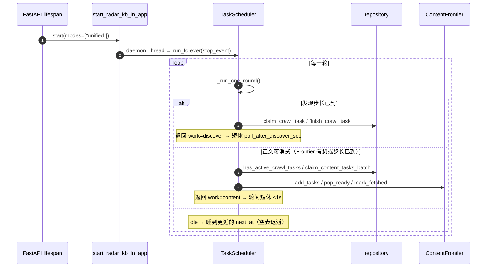
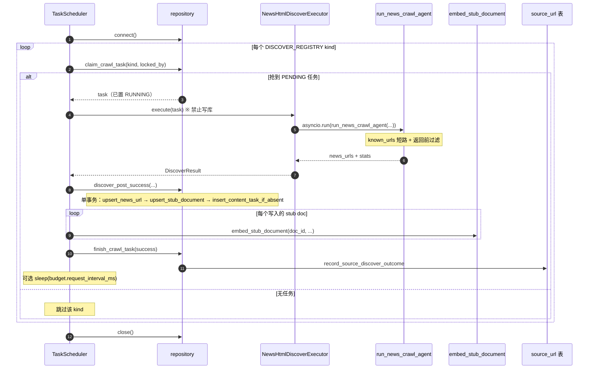
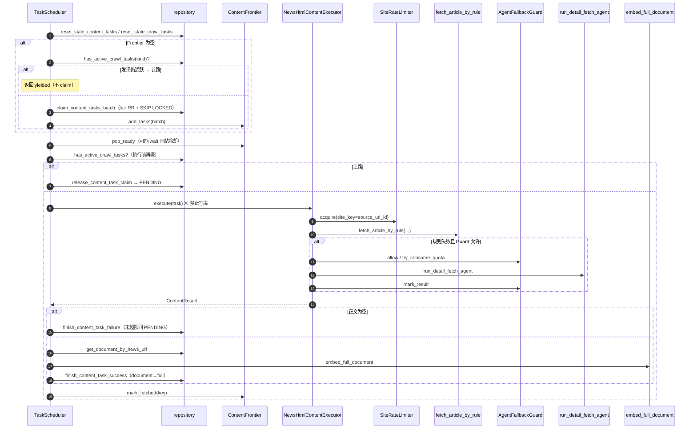
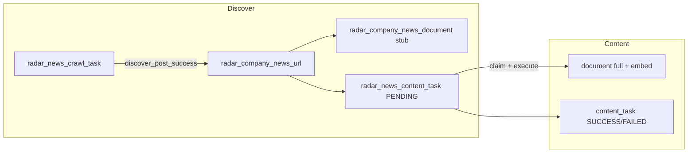
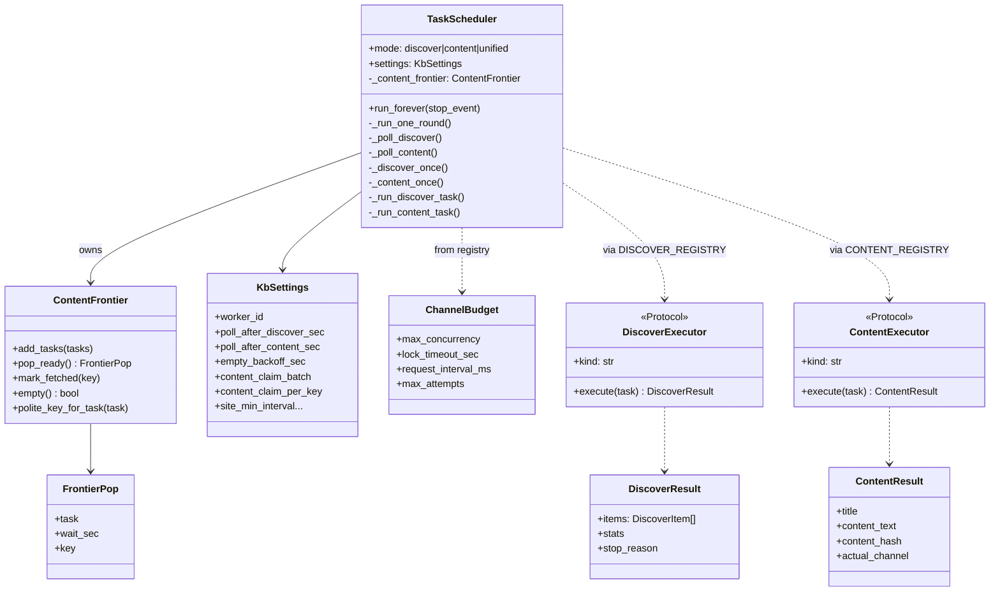
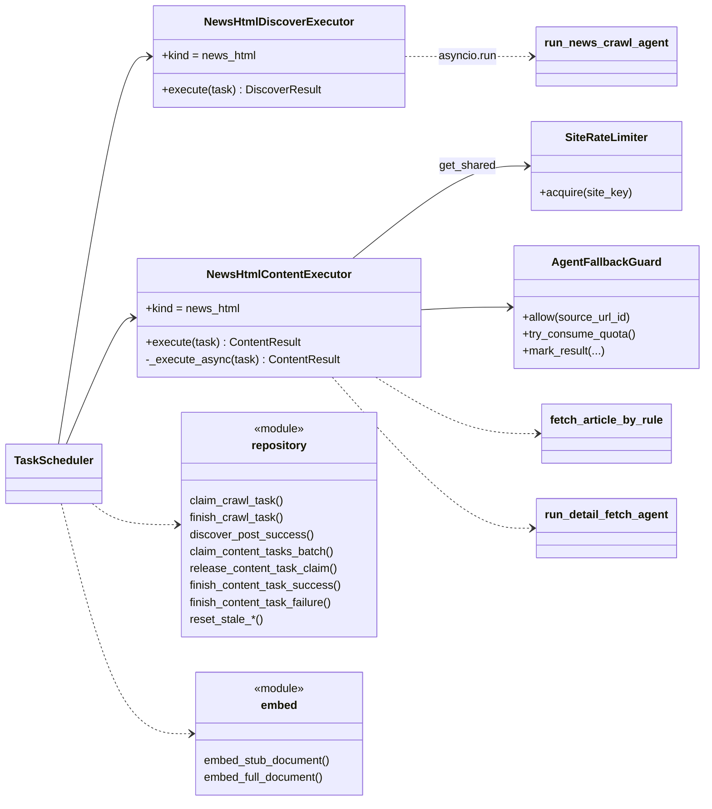
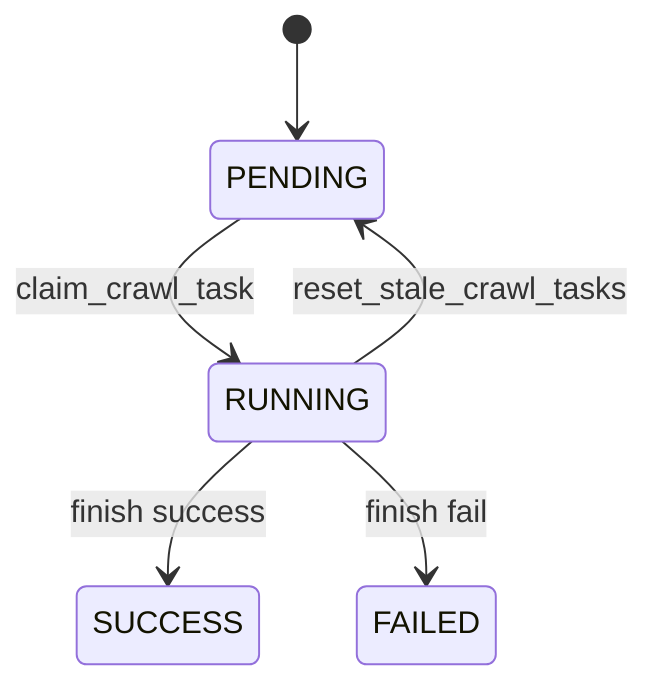
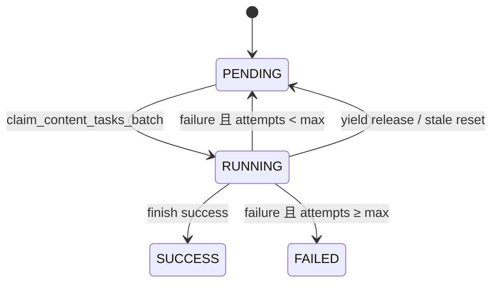

# 列表抓取与正文抓取：当前设计

**文档编号**：26092101  
**类型**：现状说明（非改造方案）  
**主路径**：`radar_kb/`（统一调度）  
**关联**：`26091801`（正文 fair claim + Frontier）、`26091802`（正文并发提效探讨，未落地）

本文描述**当前已落地**的列表发现（list / discover）与正文抓取（content）设计：先给时序，再给类图，中间穿插必要说明。

---

## 1. 范围与入口

| 项 | 现状 |
|----|------|
| 主调度 | `radar_kb.TaskScheduler` 同步 `while True` 循环 |
| 进程内挂载 | FastAPI lifespan：`RADAR_KB_WORKER_IN_APP` → `start_radar_kb_in_app()`（默认 `modes=["unified"]`，daemon 线程） |
| CLI | `python -m radar_kb`：`unified` / `discover` / `content` / `all` |
| 旧正文 worker | `NEWS_CONTENT_WORKER_IN_APP`；若 radar_kb 已启动则**互斥跳过**，避免双扫 `radar_news_content_task` |
| 抓取实现复用 | 正文仍调用 `backend/domain/news_content/`（规则抓取、限速、Agent 兜底、embedding） |

**模式含义**：

- `discover`：只跑列表发现  
- `content`：只跑正文  
- `unified`：同线程内发现优先；本轮发现有活则**不再跑正文**

---

## 2. 总览时序：`unified` 一轮

**说明**

1. 调度跑在**独立 daemon 线程**，不占用 uvicorn 的 asyncio 事件循环；但每个任务内部仍用 `asyncio.run(...)` 临时起 loop。  
2. **发现优先**有两层：  
   - unified 本轮：发现 `work` → 直接跳过正文；  
   - 正文侧：claim / 执行前若同 kind 有活跃 crawl 任务 → `yielded`（已认领则 `release_content_task_claim`）。  
3. 空表后写入 `_discover_next_at` / `_content_next_at`（默认约 60s），避免空转查库；Frontier 未空时正文可无视空表步长继续 `pop_ready`。

---

## 3. 列表发现时序（news_html）

列表任务粒度是「一个信息源 / seed 一次发现」；当前**每 kind 每轮最多 claim 1 条**，kinds 串行执行。

**说明**

| 点 | 当前行为 |
|----|----------|
| Claim | `PENDING→RUNNING` + `locked_by` / `locked_at`；`ORDER BY id … FOR UPDATE`（**无** `SKIP LOCKED`） |
| 执行器边界 | `NewsHtmlDiscoverExecutor` **只抓不写库**；写库全在 scheduler + `repository` |
| URL 防重 | `url_norm` → `url_hash=sha1`；`upsert_news_url` |
| 正文任务防重 | `insert_content_task_if_absent`：同 `news_url_id` 已有 PENDING/RUNNING 则不插 |
| 产物 | stub 文档（`content_grade=stub`，`fetch_status=LIST_ONLY`）+ 可选 stub 向量 |
| 注册表预算 | `ChannelBudget(max_concurrency=2, …)` **已声明，调度未兑现并发**——实际仍串行 1 |

失败路径：`finish_crawl_task(success=False)`，并回写源站健康状态。僵尸 RUNNING 由正文轮询时顺带 `reset_stale_crawl_tasks` 回收（默认超时约 1800s）。

---

## 4. 正文抓取时序（news_html）

正文侧已落地 **fair claim 批量认领 + 内存 ContentFrontier（同站礼貌间隔）**；**执行仍串行**：每次 `_content_once` 只 `pop_ready` 一条再 `execute`。

**说明**

1. **Fair claim**（`claim_content_tasks_batch`）：按 `source_url_id`（或回退 `company_id`）分组，`ROW_NUMBER` 每组最多 `content_claim_per_key`，再按 `rn, id` 交错，`FOR UPDATE SKIP LOCKED` 批量 `PENDING→RUNNING`。  
2. **ContentFrontier**：按礼貌键分 FIFO；`mark_fetched` 后该键冷却（随机 gap ∩ `site_min_interval`）；倾向换站消费。  
3. **双层礼貌**：Frontier gap（调度层）+ `SiteRateLimiter.acquire`（HTTP 前，进程单例）。  
4. **串行瓶颈**：Frontier / fair claim 只改「认领顺序与冷却」，墙钟吞吐仍 ≈ `1 / 单条耗时`（见 26091802）。  
5. 执行器同样 `asyncio.run`；Agent 受 `AgentFallbackGuard`（开关 / 日配额 / 源站连续失败跳过）约束。

---

## 5. 两阶段数据关系（穿插）

列表产出「待抓正文」的种子；正文消费同一 `news_url_id`。

| 表 | 角色 |
|----|------|
| `radar_news_crawl_task` | 列表发现任务 |
| `radar_company_news_url` | URL 权威去重（`url_norm` / `url_hash`） |
| `radar_company_news_document` | stub → full |
| `radar_news_content_task` | 正文任务（fair claim / 重试 / 让路释放） |
| `radar_company_source_url` / `radar_global_source_url` | 发现结束后源站健康回写 |

**防重分层（列表与正文共用语义，调度形态不同）**

| 层 | 机制 | 谁负责 |
|----|------|--------|
| 任务租约 | `PENDING→RUNNING→终态` + stale 回收 | 两边都有；正文另有 yield→PENDING |
| URL 唯一 | `url_hash` upsert | 列表写 |
| 正文任务不重复插 | `insert_content_task_if_absent` | 列表写 |
| 同站礼貌 | Frontier + SiteRateLimiter | 正文为主；列表靠「一源一任务」+ Agent 内翻页节奏 |

---

## 6. 类图：调度与协议

**说明**

- **执行器禁止写库**（Protocol 约定）：便于单测与「抓取 / 持久化」分离；DB 变更集中在 `radar_kb/repository.py`。  
- `ChannelBudget.max_concurrency` 目前是**声明值**；调度循环尚未按该值开协程池。  
- 另有 `cninfo` 发现 / PDF 正文执行器，注册方式相同，本文聚焦 `news_html`。

---

## 7. 类图：news_html 执行器与复用域

**模块落点**

| 组件 | 路径 |
|------|------|
| 调度 | `radar_kb/scheduler.py` |
| Frontier | `radar_kb/content_frontier.py` |
| 仓储 | `radar_kb/repository.py` |
| 注册表 | `radar_kb/registry.py` |
| 列表执行器 | `radar_kb/executors/news_html_discover.py` |
| 正文执行器 | `radar_kb/executors/news_html_content.py` |
| 向量 | `radar_kb/embed.py` |
| 进程内启动 | `radar_kb/in_app.py` |
| 限速 / Guard / 规则抓取 | `backend/domain/news_content/` |

---

## 8. 状态机

### 8.1 列表任务 `radar_news_crawl_task`

成功/失败结束时清理锁，并 `record_source_discover_outcome`。

### 8.2 正文任务 `radar_news_content_task`

### 8.3 文档侧（摘要）

| 阶段 | `content_grade` | `fetch_status`（概念） |
|------|-----------------|------------------------|
| 发现成功 | stub | LIST_ONLY |
| 正文成功 | full | OK + embed 状态 |
| 正文失败 | 保持 / 更新 attempts | FAILED（可再入队） |

---

## 9. 现状对照小结

| 维度 | 列表发现 | 正文抓取 |
|------|----------|----------|
| 调度形态 | 每 kind 串行 1 条 | fair 批量 claim + Frontier，**执行仍串行 1 条** |
| Claim SQL | 单条 `FOR UPDATE` | 批量 + `SKIP LOCKED` + 分组打散 |
| 内存队列 | 无 | `ContentFrontier` |
| 写库边界 | 执行器不写；`discover_post_success` | 执行器不写；scheduler finish |
| 异步用法 | 每任务 `asyncio.run` | 同左 |
| 防重核心 | `url_hash` + content_task 幂等插入 | 消费已存在的 `news_url_id` / task 行 |
| 对另一侧影响 | unified / yield 会挤占正文 | 不阻塞发现 |

**一句话**：两边共用「任务租约 + URL/`news_url_id` 去重」语义；列表仍是朴素串行 claim，正文已完成认领打散与同站冷却，但真正的跨站 IO 重叠（方案 A）尚未落地。
