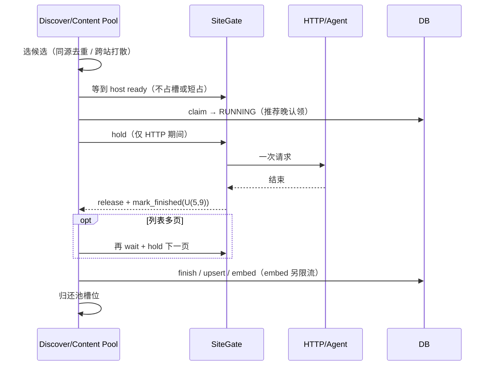

# 列表与正文跨站并发、同站串行：需求理解与总体设计

**文档编号**：26092102  
**类型**：独立设计探讨（非落地定稿；不绑定现有 `TaskScheduler` 编排顺序）  
**关联**：`26092101`（现状）、`26091802`（正文 Scheme A）、`26092103`（评审；本稿已吸收其 P0/P1 结论）  
**修订**：相对初稿，按评审修订站点键、软优先默认、冷却与池槽位关系、认领/租约、限速全量清单与验收口径。

---

## 上篇：需求描述与理解

### 1. 你提出的目标（原文归纳）

1. **网页 list 抓取做成并发**：同一时刻可以有多路列表发现**同时进行**。  
2. **新闻详情（正文）也做成并发**：同一时刻可以有多路详情抓取**同时进行**。  
3. **同站请求必须串行**：无论 list 还是详情，只要落在同一站点，同一时刻最多 1 个对该站的 HTTP 请求在执行。  
4. **同站两次请求之间间隔随机 5～9 秒**（礼貌冷却）。  
5. **保留优先级：网页 list 抓取优先**于详情抓取。  
6. **允许跳出当前任务编排顺序**重新想调度形态，不必纠结于现有「一轮发现 / 一轮正文」的同步循环。

### 2. 我对需求的理解（把隐含约束说清楚）

#### 2.1 「并发」指什么

- **跨站可重叠**：不同**站点（归一化 host）**上的 IO 可以同时进行。  
- **全局有界**：并发不是无限的；list 与详情各自有上限，避免打爆 Agent 配额、代理、FD、embedding。  
- **不是多进程必选**：单机优先用 asyncio 有界并发即可；多进程是后续扩展，不是本设计前提。  
- **单站吞吐有硬上限**：同站必须串行 + 冷却，该站积压清完时间 ≈ `条数 × (请求耗时 + 5～9s)`；加大 `N_c` 帮不上单站，只能靠跨站重叠提高整机吞吐。

#### 2.2 「同站串行 + 5～9s」指什么

- **「站」的定义**：以**归一化 host**为准（小写、去 `www.` 等，复用现有 `extract_host` 思路）。同一 host 上，list 与详情共用一把闸门。  
- **串行**：同一 host 上，任意时刻正在进行的 HTTP 请求 ≤ 1。  
- **间隔**：该站上一次请求**结束**后，下一次请求**开始**前，等待 `random.uniform(gap_min, gap_max)`（目标默认 5～9，可配置）。  
- **冷却不占并发槽位**：等待冷却期间**不得**持有池信号量，也不得长时间占着「业务锁」睡满 5～9s（详见下篇 §2）。  
- **相对现网是放宽，需确认**：现网冷却多从「整段任务结束（含 embedding/写库）」起算，且 gap 多为 5～10s 再与 `site_min_interval` 取 max。改为「纯 HTTP 结束后 5～9s」会提高单站请求密度。对绝大多数站可接受；巨潮等要求「保持低频」的通道须单独确认，不能默默套用。

#### 2.3 「list 优先」指什么

两层都要，但**默认不能把详情饿死**：

| 层 | 含义 | 默认 |
|----|------|------|
| **容量优先** | 有可跑的 list 时，详情接新任务的槽位下调，而不是整轮禁止 | **软优先**（`N_c_low ≥ 1`）；硬优先（`N_c_low=0`）仅可选且必须有界 |
| **站点闸门优先** | 同一 host 上 list 与详情争用时，list 先拿闸门 | 保留，但加 **aging**：同站连续 list 抢占超过阈值后放行一条详情 |

> 现有 `unified`「本轮发现有活就不跑正文」过粗，且在发现表有大量积压时会让正文小时级停摆，与需求 #2 冲突。新设计保留「list 更重要」的意图，用槽位与闸门表达，并防止饿死。

#### 2.4 任务边界（设计时默认）

| 阶段 | 任务单元 | 同站含义 |
|------|----------|----------|
| List | 一条发现任务 ≈ 一个信息源入口；内部可能多页翻页 | 翻页之间串行+间隔；且不得与同 host 其它 HTTP 并行 |
| Detail | 一条正文任务 ≈ 一个详情 URL | 同 host 下多 URL 排队串行；跨 host 并行 |

**认领键与闸门键分离**：

- **闸门键（SiteGate）**：归一化 `host` → 满足「同站串行」。  
- **认领/礼貌辅助键**：`(source_ref_type, source_url_id)` → 避免企业源与全局源自增 id 撞车；用于「同源任务不重复占槽」、fair claim 分组。  
- **禁止**再把裸 `source_url_id` 当作闸门主键（现网 `src:{id}` 有撞键隐患，应一并修掉）。

#### 2.5 本次文档刻意不绑定的事

- 不要求沿用「同步 while + 每任务 `asyncio.run`」。  
- 不要求保留 ContentFrontier / fair claim 的**具体类名**，只保留意图（跨站打散、同站冷却、崩溃可恢复）。  
- 接口签名、表结构变更、逐步迁移排期 → 另开落地文档。

#### 2.6 成功标准（验收口径）

1. **跨站重叠**：不同 host 上，list / 详情可同时进行。  
2. **同站串行可观测**：同一 host **无重叠 HTTP**；相邻两次请求的 **start 间隔 ≥ gap_min**；在**无同站排队竞争**时，间隔 **≤ gap_max**（有排队时允许 > gap_max）。  
3. **优先且不饿死**：有 list 积压时 list 明显占优；但详情在默认软优先下仍能持续推进（不会因发现一轮未扫完而连续数小时零吞吐）。  
4. **崩溃可恢复**：RUNNING 租约可超时回收；排队等待不导致误回收或重复抓（见下篇 §5）。  
5. **前置可测性**：SiteGate 每次 acquire/release 打结构化日志（`host / priority / wait_ms / gap_ms / holding`），否则第 2 条无法验收。

---

## 下篇：总体设计思路

### 1. 一句话架构

> **一个 asyncio 调度内核 + 按 host 的统一 SiteGate + Discover/Content 双池有界并发；默认软优先；所有出站 HTTP（含 Agent 工具、重试、cninfo）不得绕闸。**

```text
                    ┌─────────────────────────────────────┐
                    │         Async Scheduler Kernel        │
                    │  refill / spawn / await done / metrics│
                    └──────────────┬──────────────────────┘
                                   │
           ┌───────────────────────┼───────────────────────┐
           ▼                       ▼                       ▼
   DiscoverPool (N_d)       ContentPool (N_c)        SiteGate(host)
   有界协程 / 槽位           有界协程 / 槽位         互斥 + next_allowed
           │                       │                       │
           └─────────── 每一次出站 HTTP 必须经 SiteGate ────┘
```

### 2. 核心抽象：统一站点闸门 `SiteGate`

#### 2.1 键与状态

- **主键**：归一化 `host`。  
- 每 host 维护：`Lock`（或等价互斥）、`next_allowed_at`、带优先级的等待队列（`DISCOVER > CONTENT`，同级 FIFO + aging）。  
- **辅助**：任务侧仍携带 `(source_ref_type, source_url_id)`，供认领去重与指标，**不作为** SiteGate 主键。

#### 2.2 冷却语义（修订后，避免 HOL）

**正确语义**：

1. 协程要发请求时：若 `now < next_allowed_at`，在**未占用池槽位**的前提下等待到点（或由调度器延迟 spawn）。  
2. 到点后获取互斥 → 发 HTTP → 请求结束立刻释放互斥。  
3. `finally`：`next_allowed_at = now + U(gap_min, gap_max)`。  
4. **禁止**在「持锁」状态下 sleep 满冷却区间；**禁止**冷却等待占用 `N_d`/`N_c` 槽位。

伪语义：

```text
# 池子只 spawn「该 host 已到点或即将到点」的任务；未到点不占槽

async with site_gate.hold_for_request(host, priority):
    # 仅短临界区：确认到点 + 互斥
    response = await do_http(...)
# 锁已释放
site_gate.mark_finished(host)  # next_allowed = now + U(5,9)
```

若实现成单一 `acquire()`，必须保证：**冷却 sleep 在锁外；持锁区间 ≈ 实际 HTTP 区间**。

#### 2.3 设计要点

1. **List 与 Detail 共用同一 SiteGate（按 host）**——同站串行的唯一真相源。  
2. **列表 / 详情 Agent 内部翻页、规则抓取、重试**都必须走 Gate。注入点（现状明确、可落地）：  
   - 列表：`crawl_tools._fetch_html`（父进程内 MCP tool）；  
   - 详情兜底：`agent_fallback` 内已有 `limiter.acquire` 处，替换为 SiteGate；  
   - 前提：Agent `allowed_tools` 已禁 `Bash/WebFetch/WebSearch`，出网不能绕过 tool——写成**硬约束**。  
3. 冷却记在「**请求**结束」，不是「任务（含 embed）结束」。  
4. 进程内单例，且必须绑定**调度器那个长期 event loop**（httpx / 旧 limiter 单例同理）；多进程再升分布式租约。  
5. Gate 对象字典可随后补空闲回收；三千级 host 量级可先不做 eviction。

### 3. 两路有界并发池

| 池 | 建议起点 | 说明 |
|----|----------|------|
| DiscoverPool | `N_d = 2`（可调到 4） | 与 registry 声明 `news_html max_concurrency=2` 对齐；Agent 子进程成本高 |
| ContentPool | `N_c = 4`（可调到 8） | 与 registry 声明 `4` 对齐；上限上调需压测 embedding/代理 |
| Embed | 另设信号量（如 ≤4） | 与 HTTP 礼貌分离 |
| cninfo | `max_concurrency=1` **保持** | 全通道实质单源；**无跨站并发收益**；节奏见 §6 |

每个池：

1. **Refill**：claim 可跑任务（`SKIP LOCKED` + 租约语义见 §5）。  
2. **Ready 筛选**：跳过「host 未到点」或「池槽已满」的项，避免占槽空等。  
3. **Spawn** → **run_one**（HTTP 经 Gate）→ **Finish**（写库、还槽）。

#### 3.1 Discover 认领（必须同源去重）

现网同一 `source_url_id` 可有多行 crawl 任务；若只 `ORDER BY id LIMIT N`，`N_d` 个槽会打到同一源 → 白烧 Agent 且全堵在同一 host 闸门后。

**规则**：

- `SKIP LOCKED` 批量/多次 claim；  
- **同一时刻正在跑（或本批已选）的 `(source_ref_type, source_url_id)` 不重复**；  
- 可选：同 host 已有 Discover 在跑则跳过该 host 的其它源（更严，防同域多源并行——与闸门一致时闸门已挡 HTTP，认领侧去重主要省 Agent）。

#### 3.2 Content 认领

保留 **fair / 跨站打散**意图（按源分组交错），避免池内塞满同一站。  
Refill 时：若该 host 已有 Discover 在跑或排队，可先跳过该站详情，减少无效占槽（§4.3）。

### 4. 「List 优先」落地（修订后）

#### 4.1 容量层：默认软优先

```text
if discover_has_runnable_work:          # 口径见下
    content_effective_slots = N_c_low   # 默认 1，可配置
else:
    content_effective_slots = N_c
```

| 模式 | `N_c_low` | 何时用 |
|------|-----------|--------|
| **软优先（默认）** | ≥ 1 | 日常；保证详情不断流 |
| **硬优先（可选）** | 0 | 仅短窗口；必须配**有界抢占** |

**有界抢占（硬优先开启时必选其一）**：

- 连续发现运行 ≥ T 分钟后，强制把详情槽抬回 ≥1；或  
- 仅当「待发现积压 < 阈值」时才允许 `N_c_low=0`。

**`discover_has_runnable_work` 口径（勿照搬现网「按 kind 全局有一条 PENDING/RUNNING 就禁正文」）**：

- 推荐：存在**可 claim 的** discover 任务，或 DiscoverPool **当前占用槽 > 0**；  
- 统计可按 kind 分开（news_html 与 cninfo 互不误伤）；  
- 禁止解读成「库里还有任意历史失败行也算有活」。

#### 4.2 闸门层 + aging

同 host：`DISCOVER` 优先于 `CONTENT`。  
**Aging**：同一 host 上连续被 discover 抢占 ≥ K 次（或详情等待 > T）后，下一次放行 content，避免单站详情无界等待。

#### 4.3 认领层

Content refill 跳过「本 host 已有 Discover 占用/排队」的站，优先其它 host。

### 5. 租约与认领时机（修订）

并发后「先 claim 再在闸门后排长队」会与 `reset_stale_*`（约 1800s）冲突：排队过久被打回 PENDING → 再被领 → 重复占配额。

**二选一（落地必须写死；推荐 A）**：

| 方案 | 做法 |
|------|------|
| **A. 晚认领（推荐）** | 调度侧先选好候选 → 等到 host 近 ready → **拿到发请求资格前后再** `PENDING→RUNNING`；闸门长等不计租约 |
| **B. 早认领 + 排队续租** | 仍可早 claim，但 SiteGate 等待期间定期续 `locked_at` / 排队不计入 stale |

崩溃恢复：Gate 为内存态；重启后仅 DB 租约 + 重新冷却（偏保守可接受）。

### 6. 限速全量清单（收敛到 SiteGate，禁止双重睡眠）

| # | 现状限速点 | 落地处理 |
|---|------------|----------|
| 1 | `ContentFrontier` gap 5～10s | **删除**，改由 SiteGate |
| 2 | `SiteRateLimiter`（按 source_url_id，且**不保证**同站 in-flight≤1） | **删除**，改由 SiteGate（带互斥） |
| 3 | 列表 Agent `request_interval`≈0.4s | **删除或改为 0**，间隔由 SiteGate 统一 |
| 4 | cninfo adapter：`threading.Lock` + 持锁 sleep（约 5s+抖动） | **二选一**：与 SiteGate **共享同一份 `next_allowed_at`** 的同步 API；或文档声明「巨潮自管节奏、不进双池跨站模型」，避免 5～9 再叠一层变成 10～18s |
| 5 | `ChannelBudget.request_interval_ms` 后置 sleep | 保持 0 / 删除，防止恢复后叠加 |

**cninfo 专项**：

- 同步执行路径（`to_thread`）**不能**直接 await 异步锁 → 需 **SyncSiteGate 与 AsyncSiteGate 共享状态**，或整段 cninfo 留在线程侧自管。  
- 仅一个 global 源量级 → **验收时不要期望巨潮有「跨站并发」加速**。

**禁止绕闸范围**：一切出站 HTTP 入口，含重试、legacy `NEWS_CONTENT_WORKER_IN_APP`、独立 `radar_crawl` worker。新内核启用后须关闭或改造 legacy，否则需求 #3 当场失效。

### 7. 运行时形态

```text
推荐：
  Worker 线程或独立进程
    └── asyncio.run(scheduler_main())   # 唯一长期 loop
          ├── DiscoverPool / ContentPool
          ├── SiteGate（+ 可选 Sync 门面给 cninfo）
          ├── Embed 信号量
          └── stale_reset / metrics / Gate 日志

禁止：
  每条任务 asyncio.run(...)
  多协程共用一条同步 pymysql 连接
```

**DB**：每任务独立连接或小连接池；`discover_post_success` 等单事务语义保留；`to_thread` 的 executor 容量与 `N_d+N_c` 匹配，避免线程池反成瓶颈。  
**单例**：`httpx.AsyncClient`、Milvus、SiteGate 绑定调度 loop；`embed_stub/full` 去掉内部 `asyncio.run`，改为直接 await。  
**Agent 并发**：不必再叠第三套抽象信号量——**`N_d`（及正文兜底并发上限）即 Agent 子进程上限**；与 `AgentFallbackGuard` 日配额分工：前者限同时跑几个，后者限一天用多少。

### 8. 生命周期（概念；与晚认领一致）



### 9. 防重与可靠性（并发下仍成立，勿误改）

| 主题 | 思路 |
|------|------|
| URL 去重 | `url_norm` / `url_hash` → `news_url_id`；list 侧 upsert 幂等 |
| 正文任务不重复插 | `insert_content_task_if_absent` / 唯一约束 |
| 正文 fair claim SQL | 分组 `ROW_NUMBER` 交错在并发下**更需要**，保留意图 |
| 执行器禁止写库 | Protocol 边界在并发下更重要 |
| 任务租约 | 见 §5；多协程一律 `SKIP LOCKED` |
| stale reset | 保留，但计时口径与排队对齐 |

### 10. 与「旧编排」的关系

| 旧形态 | 新形态 |
|--------|--------|
| 发现有活 → 整轮不跑正文 | 双池常驻 + **默认软优先** + 闸门优先 + aging |
| Frontier gap + SiteRateLimiter 双 sleep | **仅 SiteGate** |
| 礼貌键 `src:{id}` | 闸门键 = **host**；源键 = `(ref_type, id)` |
| 每任务 `asyncio.run` | 单一长期 loop |
| registry `max_concurrency` 仅声明 | 成为真实 `N_d`/`N_c`（cninfo 保持 1） |

### 11. 风险与默认策略

| 风险 | 默认策略 |
|------|----------|
| List Agent 配额打满 | `N_d` 从 2 起；受 Guard 日配额约束 |
| 发现积压导致详情饿死 | **默认软优先**；硬优先必须有界；闸门 aging |
| 同站 list+详情共用闸门变慢 | 接受礼貌代价；用跨站重叠补整机吞吐；单站上限见 §2.1 |
| 冷却占槽 → HOL | 锁外冷却 + 未到点不 spawn |
| 绕闸（legacy worker） | 上线清单强制关闭/改造 |
| 冷却起点放宽 | 业务确认；巨潮可维持更严间隔或自管 |
| 与 API 同机抢 CPU | Worker 独立进程作退路 |

### 12. 建议落地顺序

1. **SiteGate**（host 键、锁外冷却、优先级 + aging、acquire/release 日志）；单测互斥与间隔。  
2. **收敛旧限速**：删/旁路 Frontier gap、SiteRateLimiter、列表 0.4s；处理 cninfo 同步门面或豁免声明。  
3. **正文池并发**：拆 `asyncio.run` / embed；晚认领或续租；fair claim 保留。  
4. **列表池并发**：claim 同源去重 + `SKIP LOCKED`；`_fetch_html` 接 Gate；`N_d=2`。  
5. **挂软优先 + 压测**（纯 list / 纯详情 / 混合）；确认不饿死与同站无重叠。  
6. **关闭 legacy 绕闸入口**；补齐指标（按 host 同时进行数、间隔直方图、池利用率、aging/让路次数）。

### 13. 设计结论

- **并发**：跨 host 靠双池有界重叠；**同站串行 + 间隔**收敛为按 **host** 的 **SiteGate**（锁外冷却，不占槽）。  
- **优先**：默认**软优先**保详情不断流；闸门上 list 优先但带 **aging**；硬优先仅可选且有界。  
- **认领**：Discover 同源去重 + `SKIP LOCKED`；Content 继续跨站打散；租约与闸门排队解耦（晚认领优先）。  
- **限速**：全量点清单收敛，禁止双重睡眠；cninfo 显式处理且不指望跨站加速。  
- **防重**：仍以 DB 为准；闸门只负责节奏与优先级。

该模型对齐需求五条，并吸收 `26092103` 评审中的 P0/P1 结论后再进入接口级落地设计。
