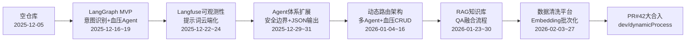

# gd25-biz-agent-python 项目开发历史时间线

> **分支**：`shumac/v1`  
> **统计范围**：该分支全部 Git 提交记录（含 Merge 提交）  
> **生成日期**：2026-06-11  
> **主要贡献者**：shuxl / shuxiaolong  
> **总提交数**：85 次（其中功能提交 79 次，Merge PR 6 次）

---

## 一、项目概览

本项目是一个基于 **LangGraph + LangChain** 的医疗健康领域**多智能体路由系统**（LangGraphFlow Multi-Agent Router）。系统根据用户意图将对话路由到专业 Agent（血压记录、安全边界、数据点评、RAG 问答等），并配套前端聊天界面、PostgreSQL 持久化、Langfuse 可观测性，以及知识库 RAG 与数据清洗流水线。

开发周期大致分为 **6 个阶段**，历时约 **3 个月**（2025-12 至 2026-02），2026-06 有一次本地暂存提交。

### 月度提交密度


| 月份      | 提交次数 | 阶段特征                     |
| ------- | ---- | ------------------------ |
| 2025-12 | 30   | 项目启动、MVP 搭建、Langfuse 对接  |
| 2026-01 | 36   | 动态路由改造、多 Agent 扩展、RAG 攻坚 |
| 2026-02 | 18   | 数据清洗平台、Embedding 批次化     |
| 2026-06 | 1    | 本地暂存（非功能开发）              |


### 已合并的 Pull Request


| PR  | 来源分支                 | 时间         | 意义                              |
| --- | -------------------- | ---------- | ------------------------------- |
| #2  | `dev/cursor`         | 2025-12-17 | Milestone 1 基础架子首次合入            |
| #4  | `dev/cursor`         | 2025-12-18 | 基础架子补充合入                        |
| #6  | `dev/cursor`         | 2025-12-19 | 线上工具对接 + RAG 集成合入               |
| #7  | `main`               | 2025-12-19 | 主分支同步                           |
| #14 | `dev/milestone2`     | 2025-12-24 | Milestone 2（Langfuse + 提示词升级）合入 |
| #42 | `dev/dynamicProcess` | 2026-02-27 | 动态流程 + 数据清洗 + Embedding 批次化大合入  |


---

## 二、开发时间线总览（甘特式）

```
2025-12
├── 12-05  项目初始化
├── 12-16~17  [#1] LangGraph 基础架子 + 意图识别
├── 12-18~19  [#3][#5] 线上工具对接、RAG/血压 Agent、追加 Agent
├── 12-22~24  [#10][#8] Langfuse 全面对接、Milestone 2 合入
└── 12-29~31  [#15][#16] 血压提示词、安全边界 Agent、工具优化

2026-01
├── 01-04~09  [#17][#19][#20][#21] 工具/Langfuse/动态路由/链路优化
├── 01-12~15  [#18][#23~#31] 动态路由改造、多 Agent、血压 CRUD、RAG 启动
├── 01-16~23  [#13][#33][#39] RAG 方案落地、多节点接入、Embedding 脚本
└── 01-26~30  [#35] RAG 深化、QA 知识库、融合流程

2026-02
├── 02-03~12  [#41] 数据清洗模块 Step1/Step2、前端串联
├── 02-12       春节前封存
├── 02-25~27  [#41] ER 图、Embedding 批次、批量创建完成
└── 02-27       PR #42 大合入（dev/dynamicProcess）

2026-06
└── 06-11       本地暂存
```

---

## 三、分阶段详细时间线

### 阶段 0：项目启动（2025-12-05）


| 日期         | 提交               | 说明                              |
| ---------- | ---------------- | ------------------------------- |
| 2025-12-05 | `Initial commit` | 创建仓库，添加 LICENSE 与 README，项目正式立项 |


**阶段成果**：空仓库就绪，确定 Python + LangGraph 技术方向。

---

### 阶段 1：Milestone 1 — LangGraph 基础架子与 MVP（2025-12-16 ~ 2025-12-19）

> 关联 Issue：**#1**、**#3**、**#5**

#### 1.1 基础架构搭建（#1）


| 日期         | 提交摘要                    |
| ---------- | ----------------------- |
| 2025-12-16 | 搭建基础的 LangGraph 架子      |
| 2025-12-16 | 意图识别第一个测试 case 通过       |
| 2025-12-17 | 基础架子开发完成 → **PR #2 合入** |
| 2025-12-18 | 架子补充调整 → **PR #4 合入**   |


**关键产出**：

- LangGraph 多 Agent 路由图骨架
- 意图识别节点与基础测试用例
- FastAPI 后端 + Web 聊天前端雏形
- LLM 调用日志基础设施（`llm_call_log_repository`、`llm_logger`）

#### 1.2 线上工具对接与 Agent 扩展（#3、#5）


| 日期         | 提交摘要                            |
| ---------- | ------------------------------- |
| 2025-12-18 | 对接 HZ 线上工具，修复 main 启动问题         |
| 2025-12-19 | 患者 RAG 信息集成 + 血压数据收集 Agent 回复美化 |
| 2025-12-19 | 追加其它 Agent 效果 → **PR #6、#7 合入** |


**关键产出**：

- 与外部 Java 服务（HZ）联调通过
- 血压记录 Agent 可用
- 患者 RAG 信息初步集成
- 多 Agent 效果验证

**阶段回顾要点**：约两周内从空仓库到可对话的 MVP；核心难点是 LangGraph 图结构设计、意图识别准确率、外部服务对接。

---

### 阶段 2：Milestone 2 — Langfuse 可观测性与提示词体系（2025-12-22 ~ 2025-12-31）

> 关联 Issue：**#10**、**#8**、**#15**、**#16**

#### 2.1 Langfuse 全面对接（#10）


| 日期         | 提交摘要                                     |
| ---------- | ---------------------------------------- |
| 2025-12-22 | 测试用例对接完成；提示词模版迁移至云平台；Agent 微调            |
| 2025-12-23 | 移除多余方案；解决路由后 traceId 不一致；路由+多意图监控；核心功能实现 |
| 2025-12-23 | LLM 思考过程记录问题修复（#8）                       |
| 2025-12-24 | **PR #14 合入**（`dev/milestone2`）          |


**关键产出**：

- Langfuse 提示词云端管理
- 多意图路由的 Trace 监控
- 分布式追踪父子 Span 关系
- LLM 思考过程可记录

#### 2.2 Agent 精简与输出规范化


| 日期         | 提交摘要                                      |
| ---------- | ----------------------------------------- |
| 2025-12-24 | 移除不需要的 Agent                              |
| 2025-12-24 | Agent 提示词升级，模型输出统一 JSON 格式；前端支持 JSON 数据提取 |
| 2025-12-24 | 修复提示词大括号导致 LangChain 异常                   |


#### 2.3 血压与安全边界 Agent 深化（#15、#16）


| 日期            | 提交摘要                                    |
| ------------- | --------------------------------------- |
| 2025-12-29~30 | 按需求设计血压模块提示词；修复 max_tokens 限制；提示词读取逻辑升级 |
| 2025-12-30    | 安全边界回复 Agent 开发（测试调优中）                  |
| 2025-12-31    | 工具调用代码优化                                |


**阶段回顾要点**：从"能跑"到"可观测、可管理"；Langfuse 对接是此阶段最大投入，解决了提示词版本管理、链路追踪、多意图监控等生产级问题。

---

### 阶段 3：架构升级 — 动态路由与多 Agent 生态（2026-01-04 ~ 2026-01-16）

> 关联 Issue：**#17**~**#31**、**#13**、**#33**、**#34**

#### 3.1 工具、Langfuse 与动态路由基础（#17~#21）


| 日期            | 提交摘要                             |
| ------------- | -------------------------------- |
| 2026-01-04    | 工具调用对接 Langfuse 完成；实现基础动态路由注册    |
| 2026-01-05~09 | Langfuse 日志接入（流程+工具），多轮 bug 修复   |
| 2026-01-07~08 | 修复模型调用链路节点过多问题；Tracename 与流程节点记录 |


#### 3.2 动态路由方案改造（#18、#23）


| 日期            | 提交摘要                          |
| ------------- | ----------------------------- |
| 2026-01-12~13 | 动态路由方案改造；复制血压、安全边界、意图识别三个流程节点 |


**架构变化**：从静态硬编码路由 → YAML/注册式动态路由，流程节点可配置、可复用。

#### 3.3 血压 CRUD 与多数据场景 Agent（#25~#31）


| 日期            | 提交摘要                                               |
| ------------- | -------------------------------------------------- |
| 2026-01-13~14 | 血压工具集成；系统提示词运行时变量修复；血压新增/修改/查询                     |
| 2026-01-14    | 前端可选择后端流程（由静态改为动态）；数据点评 Agent（#31）；数据记录 Agent（#30） |
| 2026-01-15    | Token session 持久化临时方案；YAML 模型配置（思考与思考等级）；集成其它数据场景  |


#### 3.4 RAG 功能启动（#13、#33、#34）


| 日期            | 提交摘要                                     |
| ------------- | ---------------------------------------- |
| 2026-01-15~16 | RAG 技术调研与实验；简单 RAG 方案实现；聊天支持 Markdown 格式 |
| 2026-01-21    | 多节点 RAG 接入                               |


**阶段回顾要点**：架构从 MVP 向平台化演进；动态路由是核心重构；血压 Agent 达到完整 CRUD；开始布局 RAG 能力。

---

### 阶段 4：RAG 与知识库攻坚（2026-01-23 ~ 2026-01-30）

> 关联 Issue：**#35**、**#39**


| 日期            | 提交摘要                                       |
| ------------- | ------------------------------------------ |
| 2026-01-23    | 编写 scripts 工程，流程 Embedding 存入向量库；环境同步；现状总结 |
| 2026-01-26    | 供应商添加模型默认值；RAG 问题梳理节点；血压简单场景测试通过           |
| 2026-01-27    | RAG 初步见效；疾病信息提取 → 文章召回 → 回复追加链接            |
| 2026-01-28~29 | 非血压知识库清洗；QA 案例清洗入库；QA 对接完成；融合流程完成          |
| 2026-01-30    | 数据清洗调研                                     |


**关键产出**：

- `scripts/` 独立工程：Embedding 流水线
- 向量库 + 多节点 RAG 召回链路
- QA 场景知识库（cursor_docs 中大量 QA 场景独立记录文档即此阶段产物）
- 血压场景 + RAG 融合流程

**阶段回顾要点**：约一周密集攻坚 RAG；从"技术验证"到"QA 可对接"；为后续数据清洗平台奠定数据和认知基础。

---

### 阶段 5：数据清洗平台与 Embedding 批次化（2026-02-03 ~ 2026-02-27）

> 关联 Issue：**#41**

#### 5.1 数据清洗模块（Step 1 & Step 2）


| 日期            | 提交摘要                                 |
| ------------- | ------------------------------------ |
| 2026-02-03    | 元数据归一化，统一格式                          |
| 2026-02-05    | 数据清洗模块 Step1；前端流程串联；UK 逻辑；原始素材统一入库   |
| 2026-02-09~10 | Step2 初步完成；修复模型返回 JSON 不稳定；前端 bug 修复 |
| 2026-02-12    | 数据简单入库；**春节前封存**                     |


#### 5.2 节后恢复：Embedding 批次体系


| 日期         | 提交摘要                                           |
| ---------- | ---------------------------------------------- |
| 2026-02-25 | 数据清洗 ER 图整理                                    |
| 2026-02-26 | Embedding 流程；批次处理逻辑抽成独立代码                      |
| 2026-02-27 | Batch 基础表；批次基础类；批量创建 Embedding 前端调试 → **测试完成** |
| 2026-02-27 | **PR #42 合入**（`dev/dynamicProcess`）            |


**关键产出**：

- 数据清洗两步流水线（原始素材 → 归一化 → Rewritten）
- 前端数据清洗操作界面
- Embedding 批次任务通用框架（batch 表、批次基础类、批量创建 API）
- 大量技术设计文档（见 `cursor_docs/02xxxx-*.md` 系列）

**阶段回顾要点**：从 Agent 对话系统横向扩展到**数据生产平台**；批次化 Embedding 是为大规模知识库运营做准备；春节前后形成明显的开发断点。

---

### 阶段 6：本地暂存（2026-06-11）


| 日期         | 提交摘要 |
| ---------- | ---- |
| 2026-06-11 | 本地暂存 |


> 该提交为工作区暂存，非功能性开发，可能包含未提交的本地修改快照。

---

## 四、Issue 与功能模块对照表


| Issue | 功能模块                      | 主要时间段         | 状态（据提交信息推断）   |
| ----- | ------------------------- | ------------- | ------------- |
| #1    | LangGraph 基础架子、意图识别       | 2025-12-16~18 | ✅ 完成          |
| #3    | HZ 线上工具对接、患者 RAG、血压 Agent | 2025-12-18~19 | ✅ 完成          |
| #5    | 追加其它 Agent                | 2025-12-19    | ✅ 完成          |
| #8    | LLM 思考过程记录                | 2025-12-23    | ✅ 完成          |
| #10   | Langfuse 对接（提示词/追踪/多意图）   | 2025-12-22~23 | ✅ 完成          |
| #13   | RAG 功能实现                  | 2026-01-15~16 | ✅ 初版完成        |
| #15   | 血压模块提示词                   | 2025-12-29~30 | ✅ 完成          |
| #16   | 安全边界回复 Agent              | 2025-12-30    | 🔄 测试调优中（提交时） |
| #17   | 工具调用对接 Langfuse           | 2026-01-04    | ✅ 完成          |
| #18   | 动态路由方案改造                  | 2026-01-12~13 | ✅ 完成          |
| #19   | 基础动态路由注册                  | 2026-01-04    | ✅ 完成          |
| #20   | Langfuse 日志接入（流程+工具）      | 2026-01-05~09 | 🔄 多轮修复后完成    |
| #21   | 模型调用链路节点优化                | 2026-01-07~08 | ✅ 完成          |
| #22   | YAML 模型配置（思考等级）           | 2026-01-15    | ✅ 完成          |
| #23   | 复制三个核心流程节点                | 2026-01-13    | ✅ 完成          |
| #25   | 血压工具集成                    | 2026-01-13    | ✅ 完成          |
| #26   | 血压 CRUD + 其它数据场景          | 2026-01-14~15 | ✅ 完成          |
| #27   | 系统提示词运行时变量替换              | 2026-01-14    | ✅ 完成          |
| #28   | 前端可选后端流程                  | 2026-01-14    | ✅ 完成          |
| #29   | Token session 持久化         | 2026-01-15    | 🔄 临时方案       |
| #30   | 数据记录专用智能体                 | 2026-01-14    | ✅ 开发完成        |
| #31   | 数据点评智能体                   | 2026-01-14    | ✅ 开发完成        |
| #33   | 多节点 RAG 接入                | 2026-01-21    | ✅ 完成          |
| #34   | 聊天 Markdown 格式支持          | 2026-01-16    | ✅ 完成          |
| #35   | RAG 深化、QA 知识库、融合流程        | 2026-01-23~30 | ✅ 完成          |
| #39   | Embedding 脚本工程            | 2026-01-23    | ✅ 完成          |
| #41   | 数据清洗 + Embedding 批次化      | 2026-02-03~27 | ✅ 完成          |


---

## 五、技术演进脉络




### 技术栈演进


| 维度       | 初期（12月）        | 中期（1月）             | 后期（2月）              |
| -------- | -------------- | ------------------ | ------------------- |
| 路由方式     | 静态硬编码          | 动态注册/YAML 配置       | 动态流程 + 前端可选         |
| 可观测性     | 本地日志           | Langfuse 全链路追踪     | Langfuse + 批次任务监控   |
| Agent 能力 | 血压 + 意图识别      | +安全边界+数据记录+数据点评    | +RAG 多节点召回          |
| 知识库      | 患者 RAG 信息      | 向量库 + Embedding 脚本 | 数据清洗 + 批次 Embedding |
| 前端       | 基础聊天页          | JSON 提取 + Markdown | 数据清洗操作界面            |
| 数据层      | PostgreSQL 基础表 | 血压 CRUD + Session  | 清洗表 + Batch 批次表     |


---

## 六、开发节奏与协作模式观察

1. **Issue 驱动**：几乎每个功能提交都关联 `Fixes #N`，说明使用 GitHub Issue 进行任务管理。
2. **分支策略**：功能在 `dev/cursor`、`dev/milestone2`、`dev/dynamicProcess` 等分支开发，通过 PR 合入。
3. **迭代密度**：12 月下旬和 1 月全月最为密集（日均 1~2 次提交），2 月因春节出现约 13 天空窗期。
4. **文档同步**：`cursor_docs/` 目录下有 170+ 篇技术文档，与代码提交同期沉淀，尤其在 RAG（0128xx）和数据清洗（02xxxx）阶段。
5. **先跑通再优化**：多个 Issue 标注"ing"、"有 bug"、"临时方案"，体现快速迭代、逐步完善的风格。

---

## 七、完整提交记录（按时间正序）


| 序号  | 日期               | 提交摘要                                                        | 作者          |
| --- | ---------------- | ----------------------------------------------------------- | ----------- |
| 1   | 2025-12-05 17:43 | Initial commit                                              | shuxl       |
| 2   | 2025-12-16 16:25 | 搭建基础的langgraph的架子 Fixes #1                                  | shuxl       |
| 3   | 2025-12-16 19:20 | 搭建基础的langgraph的架子 Fixes #1 （测试意图识别的第一个case通过）               | shuxl       |
| 4   | 2025-12-17 15:51 | 搭建基础的langgraph的架子 Fixes #1 完成                               | shuxl       |
| 5   | 2025-12-17 15:54 | Merge pull request #2 from GD25Workhome/dev/cursor          | shuxl       |
| 6   | 2025-12-18 16:36 | 搭建基础的langgraph的架子 Fixes #1                                  | shuxl       |
| 7   | 2025-12-18 16:37 | Merge pull request #4 from GD25Workhome/dev/cursor          | shuxl       |
| 8   | 2025-12-18 17:18 | 对接HZ的线上工具，然后进行实际的测试 Fixes #3 （修复mian 启动问题）                  | shuxl       |
| 9   | 2025-12-19 16:23 | 患者Rag信息集成+血压数据收集Agent回复美化 Fixes #3                          | shuxl       |
| 10  | 2025-12-19 16:27 | Merge pull request #6 from GD25Workhome/dev/cursor          | shuxl       |
| 11  | 2025-12-19 16:30 | Merge pull request #7 from GD25Workhome:main                | shuxl       |
| 12  | 2025-12-19 18:27 | 追加其它Agent效果 Fixes #5                                        | shuxl       |
| 13  | 2025-12-22 11:30 | 对接 langfuse-测试用例对接完成 Fixes #10                              | shuxl       |
| 14  | 2025-12-22 15:07 | 对接 langfuse （模版迁移至云平台） Fixes #10                            | shuxl       |
| 15  | 2025-12-22 18:40 | 对接 langfuse （Agent微调） Fixes #10                             | shuxl       |
| 16  | 2025-12-23 09:39 | 对接 langfuse （移除代码中的多余方案） Fixes #10                          | shuxl       |
| 17  | 2025-12-23 11:36 | 对接 langfuse （路由后，traceId不一致问题待解决） Fixes #10                 | shuxl       |
| 18  | 2025-12-23 13:57 | 对接 langfuse（路由+多意图的langfuse的监控） Fixes #10                   | shuxl       |
| 19  | 2025-12-23 16:14 | 对接 langfuse （核心功能已经实现） Fixes #10                            | shuxl       |
| 20  | 2025-12-23 17:45 | LLM的思考过程现在没有被记录下来 Fixes #8                                  | shuxl       |
| 21  | 2025-12-24 11:21 | Merge pull request #14 from GD25Workhome/dev/milestone2     | shuxl       |
| 22  | 2025-12-24 16:46 | 移除不需要的Agent                                                 | shuxl       |
| 23  | 2025-12-24 18:45 | 升级Agent的提示词，模型输出统一使用json格式，方便工具对接。然后前端展示也支持json数据提取         | shuxl       |
| 24  | 2025-12-24 18:56 | 提示词如果有大括号，langchain异常                                       | shuxl       |
| 25  | 2025-12-29 18:51 | 按照需求设计血压模块的提示词 Fixes #15                                    | shuxl       |
| 26  | 2025-12-30 15:55 | 按照需求设计血压模块的提示词 Fixes #15                                    | shuxl       |
| 27  | 2025-12-30 16:51 | 修复模型请求时返回的max_tokens的限制，移除它 Fixes #15                       | shuxl       |
| 28  | 2025-12-30 17:06 | 提示词的读取逻辑代码升级 Fixes #15                                      | shuxl       |
| 29  | 2025-12-30 19:54 | 安全边界回复的Agent开发 （测试，调优中） Fixes #16                           | shuxl       |
| 30  | 2025-12-31 18:56 | 工具调用的代码优化                                                   | shuxl       |
| 31  | 2026-01-04 15:06 | 工具调用对接langfuse （完成） Fixes #17                               | shuxl       |
| 32  | 2026-01-04 18:59 | 实现基础的动态路由注册 Fixes #19                                       | shuxl       |
| 33  | 2026-01-05 18:59 | 实现langfuse的日志接入（流程+工具）(有bug，需要继续修改) Fixes #20               | shuxl       |
| 34  | 2026-01-06 17:07 | 实现langfuse的日志接入（流程+工具-bug） Fixes #20                        | shuxl       |
| 35  | 2026-01-07 11:22 | 修复模型调用的链路节点太多的问题 （搭建测试代码） Fixes #21                         | shuxl       |
| 36  | 2026-01-08 18:18 | 测试用例验证可以做Tracename和流程节点的记录 Fixes #21                        | shuxl       |
| 37  | 2026-01-08 18:59 | 修复模型调用的链路节点太多的问题 （测试用例版本） Fixes #21                         | shuxl       |
| 38  | 2026-01-09 18:33 | 实现langfuse的日志接入（流程+工具）（ing） Fixes #20                       | shuxl       |
| 39  | 2026-01-12 19:09 | 动态路由方案改造 Fixes #18                                          | shuxl       |
| 40  | 2026-01-13 13:31 | 动态路由方案改造 Fixes #18                                          | shuxl       |
| 41  | 2026-01-13 17:01 | 复制血压、安全边界、以及意图识别三个流程节点 Fixes #23                            | shuxl       |
| 42  | 2026-01-13 19:01 | 血压的工具集成 Fixes #25                                           | shuxl       |
| 43  | 2026-01-14 10:37 | 系统提示词的运行时变量未替换问题修复 Fixes #27                                | shuxl       |
| 44  | 2026-01-14 12:32 | 可以实现血压的新增、修改、查询操作 Fixes #26                                 | shuxl       |
| 45  | 2026-01-14 14:14 | 准备工作-前端可以选择后端的流程改造（原来是静态的） Fixes #27                        | shuxl       |
| 46  | 2026-01-14 18:56 | 开发-数据点评智能体 Fixes #31 开发-数据记录专用智能体开发 Fixes #30               | shuxl       |
| 47  | 2026-01-15 11:26 | token session 持久化-临时方案 Fixes #29                            | shuxl       |
| 48  | 2026-01-15 14:16 | 增加yaml中的模型配置，思考与思考等级 Fixes #22                              | shuxl       |
| 49  | 2026-01-15 16:18 | 集成其它数据场景的逻辑 Fixes #26                                       | shuxl       |
| 50  | 2026-01-15 18:59 | RAG功能实现-技术调研和实验 Fixes #13                                   | shuxl       |
| 51  | 2026-01-16 16:45 | 实现了简单的rag方案（后续可以继续优化） Fixes #13                             | shuxl       |
| 52  | 2026-01-16 17:49 | 聊天支持md格式，前端、提示词调整 Fixes #34                                 | shuxl       |
| 53  | 2026-01-21 16:49 | 多节点RAG接入 Fixes #33                                          | shuxl       |
| 54  | 2026-01-23 17:48 | 编写了脚本（scripts）工程，实现使用流程进行embedding，存入向量库的rag准备工作 Fixes #39  | shuxl       |
| 55  | 2026-01-23 17:53 | 环境同步                                                        | shuxl       |
| 56  | 2026-01-23 18:29 | 思考怎么做，以及总结当前的情况 Fixes #35                                   | shuxl       |
| 57  | 2026-01-26 14:14 | 供应商田间模型默认值，方便统一管理 Fixes #35                                 | shuxl       |
| 58  | 2026-01-26 17:12 | rag流程中问题梳理的节点代码暂存 Fixes #35                                 | shuxl       |
| 59  | 2026-01-26 18:20 | 血压的简单场景，测试通过了。还需要持续改进rag Fixes #35                          | shuxl       |
| 60  | 2026-01-27 16:46 | RAG初步见到成效 Fixes #35                                         | shuxl       |
| 61  | 2026-01-27 18:15 | Agent可以提取用户的疾病信息，然后查询相关文章，然后进行文章召回，回复中追加链接 Fixes #35        | shuxl       |
| 62  | 2026-01-28 19:06 | 非血压数据知识库的清洗（ing，完成原始数据入库） Fixes #35                         | shuxl       |
| 63  | 2026-01-29 11:20 | QA的案例清洗入库完成 Fixes #35                                       | shuxl       |
| 64  | 2026-01-29 14:41 | QA对接完成 Fixes #35                                            | shuxl       |
| 65  | 2026-01-29 16:35 | 融合流程完成 Fixes #35                                            | shuxl       |
| 66  | 2026-01-30 18:16 | 数据清洗调研 Fixes #35                                            | shuxl       |
| 67  | 2026-02-03 19:02 | 数据清洗-元数据归一化，统一格式 Fixes #41                                  | shuxl       |
| 68  | 2026-02-05 11:03 | 数据清洗模块的开发-步骤一 Fixes #41                                     | shuxl       |
| 69  | 2026-02-05 16:19 | 数据清洗的前端流程已经串起来了 Fixes #41                                   | shuxl       |
| 70  | 2026-02-05 17:35 | 增加uk逻辑 Fixes #41                                            | shuxl       |
| 71  | 2026-02-05 18:11 | 原属素材统一入库 Fixes #41                                          | shuxl       |
| 72  | 2026-02-09 16:07 | 数据清洗步骤2-初步完成 Fixes #41                                      | shuxl       |
| 73  | 2026-02-09 16:08 | 数据清洗step2 初步完成 Fixes #41                                    | shuxl       |
| 74  | 2026-02-10 17:26 | 基础数据的清理操作，修复模型返回的数据结构不稳定的问题（有时不是json结构） Fixes #41           | shuxl       |
| 75  | 2026-02-10 18:03 | 修改了部分的前端bug Fixes #41                                       | shuxl       |
| 76  | 2026-02-12 15:15 | 数据的一次简单入库 Fixes #41                                         | shuxl       |
| 77  | 2026-02-12 15:36 | 放假前将内容封存 Fixes #41                                          | shuxl       |
| 78  | 2026-02-25 18:12 | 数据清洗的ER图整理 Fixes #41                                        | shuxl       |
| 79  | 2026-02-26 17:51 | embedding流程；以及将批次处理的逻辑抽成独立的代码 Fixes #41                     | shuxl       |
| 80  | 2026-02-27 11:33 | batch 的基础表的代码实现 Fixes #41                                   | shuxl       |
| 81  | 2026-02-27 16:26 | 创建批次基础类 Fixes #41                                           | shuxl       |
| 82  | 2026-02-27 17:25 | 批量创建embedding的前端--调试中 Fixes #41                             | shuxl       |
| 83  | 2026-02-27 17:57 | 批量创建embedding的实现-测试完成 Fixes #41                             | shuxl       |
| 84  | 2026-02-27 21:01 | Merge pull request #42 from GD25Workhome/dev/dynamicProcess | shuxl       |
| 85  | 2026-06-11 10:33 | 本地暂存                                                        | shuxiaolong |


---

## 八、回顾建议：如何用这份时间线复盘开发过程

1. **按阶段重读**：每个阶段结束时，对照 `cursor_docs/` 中同期文档（如 `M2.1.1意图识别增强开发总结.md`、`阶段二三四开发完成总结.md`），回忆当时的决策背景。
2. **关注"卡点"提交**：如 traceId 不一致、链路节点过多、模型 JSON 不稳定等，这些往往是架构演进的关键转折点。
3. **Issue 串联**：用 Issue 编号在 GitHub 上查看原始需求描述，对比最终实现。
4. **PR 边界**：6 次 PR 合入标志了 3 个里程碑边界，适合作为复盘会议的分段节点。
5. **断点意识**：春节前后（02-12 ~ 02-25）有 13 天无提交，恢复后直接进入 Embedding 批次化，说明节前已规划好后续方向。

---

*本文档由 Git 提交记录自动梳理生成，提交摘要均来自 `git log` 原始信息。*