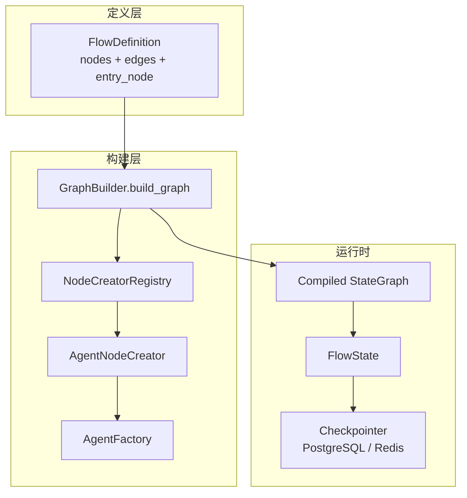

# 项目核心内容梳理

> 来源：手写梳理图 [`20260617-172355.png`](./20260617-172355.png)  
> 整理日期：2026-06-17

---

## 一、OCR 原文转录

### 2. 技术栈与关键词（中上）

**LangGraph**

- 状态图（StateGraph）编排
- 支持循环、多 Agent 交互
- 状态共享与节点解耦

**RAG（检索增强生成）**

- 向量数据库
- Embedding 优化
- 分块（Chunking）策略

**业务层**

- 中间层服务节点
- LLM 代理 / 网关

### 3. 关键开发点（中上偏右）

- 通过 LangGraph 解耦多 Agent 交互
- 业务算子 / 组件可复用
- 维护 LLM 会话状态（Session State）
- 意图识别与任务路由 / 分发
- 自定义算子函数映射到 LLM Function Call
- Platform API 与 Meta-script 可编程控制分离
- `trace_id`、线程安全、并发下的状态管理
- 流式输出可读性优化（展示节点状态与思考过程）

### 4. 数据处理（右上）

- 数据清洗
- 分块策略（Chunking Strategy）
- 清洗规则
- 检索机制：Recall（召回）+ Re-rank（重排序）

### 5. 项目对比 / 分析表（中部）

| 维度 | 内容摘要 |
|------|----------|
| 项目背景 | 通过记忆、决策、动态路由解决复杂业务逻辑 |
| 关键技术 | LangGraph 状态机实现状态共享与节点解耦 |
| Agent 设计 | 多 Agent 协作，节点类型可扩展（agent / function / rag_agent 等） |
| 知识库 | 多路召回、混合检索 |
| 召回（Recall） | 向量检索 + 规则 / 关键词补充 |
| 数据源 | 业务数据集，经清洗、分块、Embedding 入库 |

### 6. 系统架构与类定义（下部大图）

#### 6.1 数据定义

**FlowDefinition**

- `name` — 流程名称
- `version` — 流程版本
- `description` — 流程描述
- `nodes` — 节点列表
- `edges` — 边列表
- `entry_node` — 入口节点

**NodeDefinition**

- `id` / `name` — 节点标识
- `type` — 节点类型（agent、condition、function 等）
- `config` — 节点配置

**EdgeDefinition**

- `from_node` — 起始节点
- `to_node` — 目标节点
- `condition` — 路由条件（如 `always`、意图表达式）

**AgentNodeConfig**

- `prompt` — 提示词（路径或模板）
- `model` — 模型配置（provider、name、temperature 等）
- `tools` — 工具列表

#### 6.2 图构建流程（Graph Builder）

`build_graph(flow_def: FlowDefinition)` 步骤：

1. 创建 `StateGraph` 对象，绑定 `FlowState` 及 input/output schema
2. 遍历 `nodes`，经 `NodeCreatorRegistry` 按类型创建节点函数并注册
3. 遍历 `edges`，挂载普通边或条件边（同一源节点二者互斥）
4. 设置 `entry_node`，返回待 `compile` 的图

#### 6.3 注册表与创建器

**NodeCreatorRegistry**

- 节点类型 → 对应 `NodeCreator` 的映射表

**NodeCreator（接口）**

- `create(node_def, flow_def) -> Callable`

**AgentNodeCreator**

- 使用 `AgentFactory` 创建 `AgentExecutor`，将 Agent 逻辑包装为图节点函数

**AgentFactory**

- 根据 `AgentNodeConfig` 组装 LangChain 组件（如 `ChatOpenAI`、`PromptTemplate`、Tools）

#### 6.4 状态管理

**FlowState** 主要字段：

- `current_message` — 当前用户消息
- `history_messages` — 历史消息
- `flow_msgs` — 流程中间消息（Annotated + reducer 追加）
- `session_id` — 会话 ID
- `trace_id` — 可观测性追踪 ID
- `prompt_vars` — 提示词变量
- `edges_var` / `persistence_edges_var` — 边条件与持久化变量通道

#### 6.5 执行与持久化

**执行链路**

```
用户输入 → 按 session_id 加载状态 → 运行 Compiled Graph → 保存状态 → 返回结果
```

**持久化**

- 使用 `trace_id` 与自定义 `Checkpointer`
- 状态存入 PostgreSQL 或 Redis
- 支持会话隔离与流程中断恢复

---

## 二、核心内容提取（简历 / 面试用）

### 1. 项目定位（一句话）

基于 **LangGraph + LangChain** 的企业级 **AI Agent 编排平台**，通过 YAML 声明式流程定义，将多 Agent、RAG、工具调用、条件路由统一纳入可配置、可观测、可持久化的状态图执行引擎。

### 2. 技术栈

| 层次 | 技术 |
|------|------|
| 语言 / 框架 | Python、FastAPI、Pydantic |
| Agent 编排 | LangGraph（StateGraph）、LangChain |
| 向量 / 检索 | 向量数据库（Milvus / Chroma 等）、Embedding、混合召回 |
| 状态 / 缓存 | Redis、PostgreSQL Checkpointer |
| 可观测性 | Langfuse / trace_id 全链路追踪 |
| 部署 | Docker、K8s |

### 3. 核心能力（可写进简历 bullet）

1. **声明式流程编排**：`FlowDefinition`（节点 + 边 + 入口）驱动 `GraphBuilder` 动态编译 LangGraph，支持 agent / function / rag_agent / embedding 等多类型节点。
2. **动态路由**：基于 `EdgeDefinition.condition` 与 `ConditionEvaluator`，按 state 变量（如意图、业务字段）做条件边路由，实现 Planner → Executor → Checker 等复杂分支。
3. **状态持久化与会话恢复**：`FlowState` 在节点间传递；`session_id` + Checkpointer 支持长会话中断恢复与并发隔离。
4. **多 Agent 解耦**：`NodeCreatorRegistry` + 工厂模式，各 Agent 独立配置 prompt / model / tools，通过图边协作而非硬编码调用链。
5. **RAG 链路**：数据清洗 → 分块 → Embedding 入库 → 多路召回 + Re-rank → 注入下游 Agent 上下文。
6. **工具与算子映射**：业务 Function 节点与 LLM Function Call 对齐，Platform API 与 Meta-script 分层，便于业务扩展。
7. **可观测与流式体验**：`trace_id` 贯穿请求；流式输出展示节点执行状态与思考过程，便于调试与用户体验。

### 4. 架构要点（面试可画）



### 5. 关键设计模式

| 模式 | 应用 |
|------|------|
| 注册表 | `NodeCreatorRegistry` 按节点 type 分发创建逻辑 |
| 工厂 | `AgentFactory` 统一创建 AgentExecutor |
| 策略 | 条件边 + `ConditionEvaluator` 实现动态路由 |
| 状态机 | LangGraph StateGraph + TypedDict FlowState |
| 声明式配置 | flow.yaml → Pydantic 模型 → 编译图 |

### 6. 解决的典型问题

1. **多 Agent 耦合**：用图节点 + 边替代直接函数调用，便于独立演进与复用。
2. **长会话上下文**：Checkpointer 持久化 + `history_messages` / `flow_msgs` 分层管理。
3. **执行稳定性**：节点级错误处理、条件路由兜底、trace 便于定位失败节点。
4. **RAG 质量**：分块策略、清洗规则、Recall + Re-rank 提升检索准确率。

### 7. 经验沉淀（手写图底部延伸）

- **提示词工程**：结构化 prompt 与变量注入（`prompt_vars`）是 Agent 质量的关键。
- **结构化输出**：Pydantic / JSON Schema 约束 LLM 输出，降低解析失败率。
- **人机协作**：关键决策节点可设计 human-in-the-loop 检查点。
- **监控重要性**：Langfuse 等 Trace 树对调试 Agent 行为不可或缺。

---

## 三、与代码库对应关系（便于核对）

| 梳理图概念 | 代码位置 |
|------------|----------|
| FlowDefinition / NodeDefinition / EdgeDefinition | `backend/domain/flows/models/definition.py` |
| FlowState | `backend/domain/state.py` |
| GraphBuilder.build_graph | `backend/domain/flows/builder.py` |
| NodeCreatorRegistry / AgentNodeCreator | `backend/domain/flows/nodes/registry.py`、`agent_creator.py` |
| AgentFactory | `backend/domain/agents/factory.py` |
| FlowManager（compile + 执行） | `backend/domain/flows/manager.py` |

---

## 四、简历表述参考（可直接改写）

**项目名称**：企业级 AI Agent 编排平台（biz-agent-python）

**项目描述**：负责基于 LangGraph 的多 Agent 工作流引擎设计与实现。通过 YAML 声明式定义流程节点与条件边，支持 Agent、RAG、Function 等多类型节点动态编译；实现会话状态持久化、trace 全链路追踪与流式输出，支撑复杂业务场景的意图路由与工具调用。

**个人职责（示例）**：

- 设计 `FlowDefinition` → `GraphBuilder` → `CompiledGraph` 的声明式编排链路，实现节点注册表与工厂模式扩展
- 基于 LangGraph 条件边实现动态路由，解耦多 Agent 协作与业务算子复用
- 落地 RAG 数据 pipeline（清洗 / 分块 / Embedding / 混合召回）并接入 Agent 上下文注入
- 集成 Langfuse 与 `trace_id`，优化流式输出中的节点状态展示，提升可观测性与调试效率
