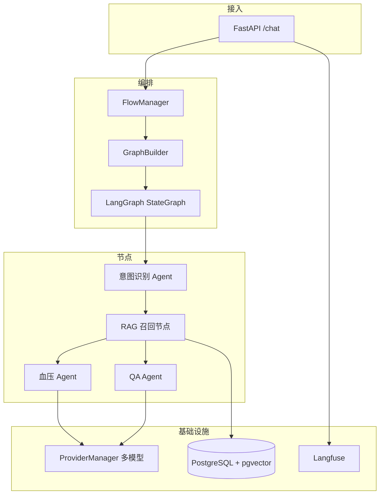

# 医疗分身 Agent 项目 — 技术口试口头介绍稿

> **适用场景**：技术面试开场「介绍一下你最近/最拿手的项目」、深挖 Agent / RAG / 工程化能力时的主线叙事。  
> **目标**：用 30 秒～5 分钟讲清「业务价值 → 你的贡献 → 技术亮点 → 可追问的深度」，让面试官愿意往下问。  
> **素材来源**：仓库实况核对 + [`26061702-简历素材结构化底稿.md`](../简历-项目情况梳理/26061702-简历素材结构化底稿.md)

---

## 使用说明（开口前先读 10 秒）

| 原则 | 怎么说 |
|------|--------|
| **先业务后技术** | 先说解决什么医疗场景问题，再说 LangGraph / RAG，避免一开口堆名词 |
| **用「我」做主语** | 「我负责…」「我设计了…」，比「项目采用了…」更能体现贡献 |
| **留钩子** | 每个层次结尾埋 1 个技术点，引导面试官追问你准备过的内容 |
| **诚实边界** | 没上线的能力说「方案设计 / 内测验证」，不编 QPS、准确率 |
| **控制节奏** | 30 秒版必背；1～2 分钟版是主力；3～5 分钟版只在对方说「详细讲讲」时用 |

**口播节奏参考**：中文口语约 **150～180 字/分钟**。下面各版本已标注大致字数，可按时间裁剪。

---

## 一、30 秒版（≈80 字，必背）

> 这是我最近三个月主导的后端核心项目：**医疗健康场景的多智能体对话系统**。用户用自然语言提问，系统先做意图识别，再**动态路由**到血压管理、知识问答等专业 Agent，并结合 **RAG** 召回相似案例提升回答质量。  
> 我基于 **LangGraph** 自研了一套 **YAML 声明式编排引擎**，把多 Agent 协作、工具调用、向量检索统一进可配置的状态图；同时接了 **Langfuse 全链路追踪** 和知识库 **数据清洗 / Embedding 批次平台**，形成从对话到知识生产的闭环。  
> 如果您感兴趣，我可以展开讲**动态路由重构**或 **RAG 融合**这块。

**加分点**：业务域清晰（医疗）、技术栈完整（编排 + RAG + 观测）、主动递出两个深挖话题。

---

## 二、1～2 分钟版（≈250 字，主力版本）

### 1. 背景与问题（20 秒）

慢病管理场景里，用户一句话可能是在**记血压**、**问科普**，也可能触发**合规边界**。如果用一个万能 Prompt 硬扛，准确率和可维护性都很差。所以我们做成**多 Agent 分工 + 统一编排**：上层识别意图，下层专业 Agent 处理，中间还要能接业务工具和知识库。

### 2. 我的角色（15 秒）

我在项目里**负责后端核心开发**，从 MVP 的硬编码路由，迭代到当前 **medical_agent v6.3** 融合方案，覆盖编排引擎、对话 API、RAG 链路、数据清洗与批次任务，大约 **3 个月、80+ 次功能提交**。

### 3. 架构一句话（25 秒）

整体是 **FastAPI 接入 → FlowManager 加载 YAML 流程 → LangGraph 状态图执行 → 各节点 Agent / 函数 / RAG**。状态在 `FlowState` 里流转，条件边根据意图和置信度路由；内层单个 Agent 用 LangChain 的 ReAct + Function Calling 调血压、用药等工具。

### 4. 三个技术亮点（45 秒）

**第一，声明式编排。** 我把路由从代码里抽出来，做成 `FlowDefinition` + `GraphBuilder` + `NodeCreatorRegistry`，新增 Agent 主要改 YAML 和 Prompt，不用动核心路由文件——我们迭代了 **10 套流程、v4 到 v6.3**。

**第二，RAG 融合进主对话。** 意图节点提取关键词后，先用 **pgvector** 召回相似 QA 案例注入上下文，再按 `intent` 和 `confidence` 分到血压 Agent 或 QA 兜底 Agent，开放问答质量明显提升。

**第三，工程化可观测。** 多 Agent 路由后 Trace 容易断链，我用 **ContextVar 传 trace_id** 配合 Langfuse Callback，把 API → Graph → LLM → Tool 串成一棵树，线上排障效率很高。

### 5. 收尾递钩子（10 秒）

这里面我觉得最有意思的是**动态路由重构**和 **Langfuse Trace 一致性**两个难点，您更想听哪块？

---

## 三、3～5 分钟版（对方说「详细讲讲」时用）

在 **§二** 基础上，按下面顺序各加 30～60 秒。

### 3.1 典型请求链路（边画边说）

```
用户消息
  → 拉取用户血压等上下文（function 节点）
  → optimization_agent：意图识别 + 关键词
  → rag_node：向量召回相似 QA，写入 prompt_vars
  → 条件路由：
       血压意图且 confidence ≥ 0.8 → blood_agent（可 Function Call 记血压）
       否则 → QA_agent 兜底
  → JSON 结构化回复 → 前端渲染
```

**口播提示**：画 5 个方框就够，强调「**先 RAG 再路由**」是 v6.3 的设计选择——召回案例对所有分支都有用。

### 3.2 编排引擎怎么体现「平台思维」（45 秒）

- **定义层**：`flow.yaml` 描述 nodes、edges、entry_node，条件边支持 `intent == "blood_pressure" && confidence >= 0.8` 这类表达式。
- **构建层**：`NodeCreatorRegistry` 按节点类型（agent / function / rag_agent / embedding）创建执行函数，**注册表 + 工厂**扩展新类型。
- **运行时**：`ApplicationBootstrap` 启动时预加载供应商、工具、流程图，降低首包延迟；`RuntimeContext` 用 contextvars 把 token/session/trace 送进深层 Tool，避免层层传参。

### 3.3 知识库与数据平台（45 秒）

对话侧用 RAG，运营侧我建了**数据清洗两步流水线**：原始素材归一化 → LLM Rewritten 改写（asyncio 内存队列 + 多消费者）→ **BatchJob 通用框架**批量 Embedding 入库。这样 QA 场景案例可以持续运营，不是一次性导库。我们整理了 **40+ QA 场景** 的知识条目。

### 3.4 难点故事（选 1～2 个 STAR，见 §五）

---

## 四、分层介绍：按面试官画像切换 emphasis

| 面试官倾向 | 加强什么 | 弱化什么 |
|------------|----------|----------|
| **业务 / 产品型** | 血压管理、合规边界、QA 兜底、知识库运营闭环 | NodeCreator 类名细节 |
| **架构型** | YAML 编排、状态图、注册表、分层（app/domain/infrastructure） | 具体 Prompt 文案 |
| **AI / 算法型** | 意图识别、RAG 召回与注入、Embedding 批次、JSON 输出稳定性 | CRUD API 细节 |
| **工程 / SRE 型** | Langfuse Trace、Bootstrap 预加载、异步 SQLAlchemy、Issue 驱动迭代 | Agent 业务话术 |
| **全栈 / 创业型** | 3 个月从 0 到 v6.3、一人闭环后端 + 配合前端页面 | 过度强调「大型团队协作」 |

---

## 五、STAR 故事库（口述时各 60～90 秒）

### 故事 1：动态路由架构重构（体现架构能力）⭐ 首选

| | 内容 |
|---|------|
| **S** | MVP 阶段路由写死在代码里，每加一个 Agent 都要改核心文件，版本越多越难维护。 |
| **T** | 做到流程可配置、节点可复用，产品还能在前端切换不同对话流程。 |
| **A** | 设计 `FlowDefinition` / `GraphBuilder` / `NodeCreatorRegistry`；条件边用 `ConditionEvaluator` 求值；`FlowManager` 扫描并预编译多套 flow。 |
| **R** | 支撑 **v4→v6.3** 快速迭代，新增 Agent 以 **YAML + Prompt** 为主；这是我在项目里最有成就感的一次重构。 |

**记忆句**：「把**变化点**从代码挪到配置，把**扩展点**收敛到注册表。」

---

### 故事 2：Langfuse Trace 一致性（体现工程深度）⭐ 首选

| | 内容 |
|---|------|
| **S** | 多 Agent 路由后，子 Agent 的 traceId 和入口对不上，调用链在 Langfuse 里断成几段，排障很痛苦。 |
| **T** | 一次用户请求要在 UI 上看到完整树：API → 意图 → RAG → 业务 Agent → Tool。 |
| **A** | 用 ContextVar 贯穿 `trace_id`；在 `graph.ainvoke` 的 config 挂 Langfuse Callback；规范根 Trace 与 `request.trace_id` 一致。 |
| **R** | 多意图路由可观测；Issue #10 关闭；后续工具调用、LLM 思考过程都能在同一棵 Trace 树下看。 |

**记忆句**：「观测不是事后打日志，而是**和主链路同一套上下文**设计出来的。」

---

### 故事 3：RAG 融合主流程（体现 AI 业务落地）

| | 内容 |
|---|------|
| **S** | 纯规则路由盖不住开放问答；没有案例参考时 QA Agent 回答偏泛。 |
| **T** | 在不大改架构的前提下，把向量召回接进主对话。 |
| **A** | optimization 提 intent/keywords → rag_node 写 prompt_vars → 条件边分流；43 场景 QA 清洗入库 pgvector。 |
| **R** | v6.3 融合方案上线内测；相似案例能稳定注入下游 Prompt。 |

---

### 故事 4：数据清洗 JSON 不稳定（体现韧性）

| | 内容 |
|---|------|
| **S** | Step2 改写模型有时返回非 JSON，批处理流水线会中断。 |
| **A** | 统一 JSON Schema、Pydantic 校验、失败重试；前端支持字段提取调试。 |
| **R** | Step2 可批量跑通，支撑 Embedding 批次导入。 |

---

## 六、白板 / 架构图（1 分钟能画完）



**边画边说的三句话**：

1. 「横向是**一次请求**在状态图里怎么走，纵向是**平台分层**。」  
2. 「LangGraph 管**多节点协作**，LangChain Agent 管**单节点内 ReAct**。」  
3. 「RAG 和对话共用 PostgreSQL，运营侧清洗的数据直接服务线上召回。」

---

## 七、高频追问 & 口语化回答要点

| 追问 | 30 秒回答框架 |
|------|----------------|
| **LangGraph 和 LangChain Agent 区别？** | 外层 StateGraph 管多 Agent、条件边、状态持久化；内层 `create_agent` 管单个 Agent 的 Thought-Action-Observation 循环。我们是**双层**：图编排 + ReAct。 |
| **动态路由怎么实现？** | `flow.yaml` 里条件边 + `state` 里的 `intent`/`confidence`；`ConditionEvaluator` 对表达式求值，决定下一跳节点。 |
| **RAG 链路？** | 意图节点抽关键词 → rag_agent 查 pgvector（可混合关键词）→ 结果写入 `prompt_vars` → 下游 Agent Prompt 模板注入。 |
| **Tool 怎么拿到用户身份？** | `RuntimeContext` + contextvars，在 `/chat` 入口 `with` 注入 token_id，Tool 里 `get_token_id()`，不污染 LangChain Tool 签名。 |
| **为什么用 YAML 不用代码写图？** | 医疗流程变得快，运营要试不同 Agent 组合；配置化让**改流程 ≈ 改配置**，发布风险更小。 |
| **最大挑战？** | 选故事 1 或 2，按 STAR 讲，最后补一句 trade-off（如 contextvars 的隐式依赖）。 |
| **如果重做会改什么？** | 诚实说：Session 持久化目前是 PG 缓存方案；大规模队列可考虑 Redis/RabbitMQ；README 与代码版本要同步。 |

更细的模块口播稿见：

- [`26061601-RuntimeContext面试介绍.md`](../26061601-RuntimeContext面试介绍.md)
- [`26061603-Langfuse埋点与Trace树结构讲解.md`](../26061603-Langfuse埋点与Trace树结构讲解.md)
- [`26061501-chat-graph-ainvoke内部运行机制.md`](../26061501-chat-graph-ainvoke内部运行机制.md)

---

## 八、量化数据（口述时自然带出 2～3 个）

| 可说 | 数值 | 备注 |
|------|------|------|
| 开发周期 | 约 3 个月（2025-12～2026-02） | 主功能期 |
| 流程版本 | 10 套 flow，v4→v6.3 | 配置目录可核对 |
| 后端规模 | ~165 个 Python 文件，21 次 DB 迁移 | 体现工程厚度 |
| QA 场景 | 40+ 场景知识条目 | cursor_docs 有场景文档 |
| 供应商 | 4 路 LLM/Embedding 可配置切换 | doubao / deepseek / openai 等 |

**不要说**：用户数、QPS、线上准确率——仓库里没有证据。

---

## 九、边界与避坑（面试官问「上线了吗」时）

| 实际情况 | 建议口播 |
|----------|----------|
| 主贡献者为本人，仓库内单贡献者 | 「后端核心是我主导开发的」 |
| Session 为 PG 缓存方案，Issue 标过临时方案 | 「会话状态持久化**方案已实现**，生产级分布式 Session 是后续演进方向」 |
| 向量库实际是 pgvector，不是 Milvus | 「当前用 **PostgreSQL + pgvector**，与业务库统一，降低运维复杂度」 |
| Redis/RabbitMQ/K8s 在规划或未完整落地 | 不主动提；被问到就说「架构上预留了，本仓库以 PG + 内存队列为主」 |
| 安全边界 Agent 曾标注调优中 | 「参与开发，效果持续迭代」 |

---

## 十、结尾记忆点（三选一，根据气氛收束）

1. **架构向**：「这个项目对我来说，是把 LangGraph 从 Demo 做成**可配置、可观测、可运营**的医疗 Agent 平台。」  
2. **业务向**：「用户一句『我头晕』和『帮我记血压』走完全不同的专业链路，但背后同一套编排引擎支撑。」  
3. **成长向**：「三个月内从 MVP 硬编码路由走到 YAML 编排 + RAG 融合，我最大的收获是**知道 Agent 系统真正的成本在工程和观测，而不只是 Prompt**。」

---

## 十一、开口前 30 秒自检清单

- [ ] 项目名称和业务域说清楚了（医疗健康 / 慢病 / 多 Agent）  
- [ ] 用了「我负责 / 我设计」而不是泛泛的「我们用了 LangGraph」  
- [ ] 至少讲了 1 个完整链路（意图 → RAG → 路由 → Agent）  
- [ ] 至少埋了 1 个钩子（动态路由 / Trace / RAG）  
- [ ] 没有编造线上流量和准确率  
- [ ] 控制在对方要求的时长内，留时间给对方提问  

---

## 十二、相关文档索引

| 文档 | 用途 |
|------|------|
| [`26061702-简历素材结构化底稿.md`](../简历-项目情况梳理/26061702-简历素材结构化底稿.md) | 事实核对、bullet、关键词 |
| [`26061701-项目核心内容梳理.md`](../简历-项目情况梳理/26061701-项目核心内容梳理.md) | 架构类与类图 |
| [`061101-项目开发历史时间线.md`](../简历-项目情况梳理/061101-项目开发历史时间线.md) | 里程碑时间线 |
| [`26061601-RuntimeContext面试介绍.md`](../26061601-RuntimeContext面试介绍.md) | 上下文传递深挖 |
| [`26061603-Langfuse埋点与Trace树结构讲解.md`](../26061603-Langfuse埋点与Trace树结构讲解.md) | 可观测性深挖 |

---

*文档生成日期：2026-06-26 · 口试前建议对着 §一、§二各朗读 3 遍，计时控制在 35 秒 / 2 分钟内。*
