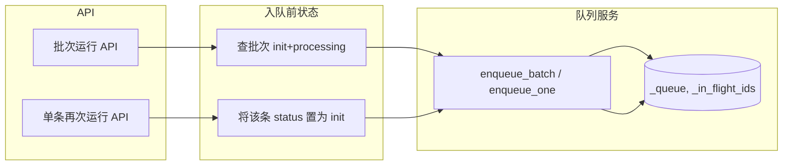
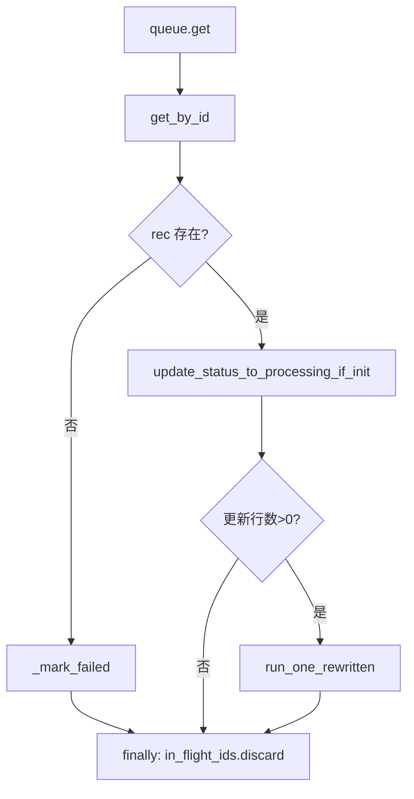
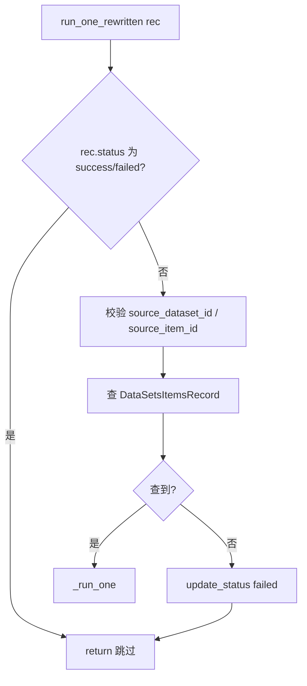

# Rewritten 队列与任务状态重构技术设计

## 1. 概述

### 1.1 目标

在现有「Step02 批次任务队列」实现基础上，明确**队列与任务状态**的职责边界，通过「入队即 init、消费时 update-select 置 processing」的语义，避免任务被重复消费，并统一单条/批次入队与消费者行为。本文档给出当前代码现状总结、重构思路、类图与流程图，以及具体改造方案。

### 1.2 相关文档

| 文档 | 说明 |
|------|------|
| 021104-执行数据清洗接口整体运行逻辑与表设计.md | 执行流程与表结构 |
| 021105-Step02批次任务队列与运行停止技术设计.md | 队列与三种停止模式 |
| 021106-任务入队消费与状态变化梳理.md | 任务入队与状态变化 |

---

## 2. 外部 API 与前端功能

前端支持的能力可归纳为三类：

| 能力 | API | 说明 |
|------|-----|------|
| **将任务加入队列（单个/多个）** | `POST /rewritten-batches/run`（批次运行） | 将指定批次下待处理任务入队 |
| | `POST /data-items-rewritten/{item_id}/rerun`（单条再次运行） | 将单条任务入队 |
| **移除队列中的任务** | `POST /rewritten-batches/clear-queue` | 清空全部队列 |
| | `POST /rewritten-batches/remove-batch` | 从队列中移除指定批次任务 |
| **队列统计** | `GET /rewritten-batches/queue-stats` | 排队数、执行中+排队总数 |

**结论**：外部需求本质是——**向队列添加任务**（单个或批量）、**从队列移除任务**（全部或按批次），以及**由消费者从队列取任务并执行**。任务状态（init/processing/success/failed）应与队列语义一致，用于防重与可观测性。

---

## 3. 当前代码现状总结

### 3.1 模块与职责

| 模块 | 文件 | 职责概要 |
|------|------|----------|
| **API 层** | `backend/app/api/routes/data_cleaning.py` | 批次运行、清空队列、移除批次、单条再次运行、队列统计、创建批次、列表/更新/删除改写项 |
| **队列服务** | `backend/pipeline/rewritten_queue_service.py` | 内存队列 `_queue`、`_in_flight_ids`；入队（批次/单条）、清空、按批次移除、统计；启动消费者 |
| **执行服务** | `backend/pipeline/rewritten_service.py` | `create_rewritten_batch`（创建批次+init 记录）、`run_one_rewritten`（单条执行）、`_run_one`/`build_state_from_record`（流程执行）、`_mark_failed`、`rewritten_worker_loop`（已由队列消费者替代，可停用） |
| **仓储** | `data_items_rewritten_repository.py` | CRUD、`get_pending_by_batch_code`(init+processing)、`get_init_records`、`update_status`（无条件更新） |
| **仓储** | `rewritten_batch_repository.py` | 批次表 CRUD |
| **仓储** | `data_sets_items_repository.py` | 按 dataset_id+item_id 查原始项 |

### 3.2 队列与状态现状

- **队列结构**：`_queue: asyncio.Queue` 元素为 `(record_id: str, batch_code: str)`；`_in_flight_ids: Set[str]` 表示「已在队列或正在执行」的 record_id，用于入队去重与消费完成后移除。
- **批次运行入队**：`enqueue_batch(batch_code, session)` 查询该批次下 `status in (init, processing)` 的记录，将未在 `_in_flight_ids` 的 record_id 入队并加入 `_in_flight_ids`。**不修改 DB 状态**。
- **单条再次运行**：API 先将该条 `update_status(item_id, STATUS_PROCESSING)`，再 `enqueue_one(item_id, batch_code)`。即**入队前把状态改为 processing**，与「仅 init 才可被消费」的防重语义不一致。
- **消费者**：`_consumer_loop` 从队列取 `(record_id, batch_code)` → `get_by_id(record_id)` → `run_one_rewritten(rec)`，**未**在执行前做「仅当 status=init 才更新为 processing」的条件更新，因此无法从 DB 层防止同一任务被重复消费（例如同一 id 被重复入队或重复拉取）。
- **run_one_rewritten**：内部校验 source、查 `DataSetsItemsRecord`、调 `_run_one`；**未**在入口根据 status 跳过已终态（success/failed），**未**在执行前将状态从 init 更新为 processing。

### 3.3 现状问题小结

1. **状态与队列语义不统一**：单条再次运行入队前改为 processing，而「可被消费」的语义更合理是「入队=待执行(init)，消费时再改为 processing」。
2. **缺少「update-select」防重**：消费者取到任务后直接执行，没有「仅当 status=init 时更新为 processing，否则跳过」的 DB 级防重。
3. **run_one_rewritten 未做状态防护**：未跳过已终态，未在执行前显式置为 processing，与设计文档中的「子方案 B」语义不完全一致。

---

## 4. 重构思路（队列与状态关系）

### 4.1 原则

1. **添加任务（单个/多个）到队列**：先判断 record_id 是否已在 **`_in_flight_ids`** 中；若已存在，则**不再进行后续的状态处理与入队**（避免重复入队、重复写 DB）。若不存在，再做两件事——（1）**管理队列**：将 record_id（及 batch_code）放入 `_queue`，并加入 `_in_flight_ids`；（2）**任务状态**：入队时**将任务状态改为 init**（表示「待执行」），与「仅 init 可被消费」一致。  
   - 批次运行：对每条待入队记录，先查 `_in_flight_ids`，已存在则跳过该条；未存在则**先将该条状态改为 init**，再入队并加入 `_in_flight_ids`。  
   - 单条再次运行：先查 `_in_flight_ids`，已存在则直接返回「已在队列或执行中」；未存在则**先将该条状态改为 init**，再入队并加入 `_in_flight_ids`。

2. **任务运行（消费者）**：从队列取任务 → 查库得 `rec` → **先做「update-select」**：仅当 `status = init` 时更新为 `processing`（例如 `UPDATE ... SET status='processing' WHERE id=? AND status='init'`），若更新影响行数为 0，则跳过后续执行（防止重复消费）；否则再调用 `run_one_rewritten` 执行流程。

3. **删除任务**：仅操作队列与 `_in_flight_ids`（清空全部或按批次移除），不依赖任务状态变更。

### 4.2 状态语义（重构后）

| 状态 | 含义 |
|------|------|
| init | 待执行（在队列中或即将入队） |
| processing | 正在执行流程 |
| success / failed | 已结束，不再参与入队/消费 |

- **入队**：入队时即将该条状态改为 init；只有不在 `_in_flight_ids` 的 record_id 才会被写入 init 并入队。
- **消费**：仅当 DB 中 status=init 时才能被「占位」为 processing 并执行，否则视为已被其他消费者或历史占用，跳过执行。

---

## 5. 类图与接口依赖

### 5.1 模块依赖关系（简图）

```
                    ┌─────────────────────────────────────────┐
                    │  API Layer (data_cleaning.py)            │
                    │  - run_rewritten_batch                   │
                    │  - clear_rewritten_queue                 │
                    │  - remove_batch_from_queue_endpoint      │
                    │  - rerun_data_item_rewritten             │
                    │  - get_rewritten_queue_stats             │
                    │  - execute_rewritten_endpoint            │
                    └──────────────────┬──────────────────────┘
                                       │
         ┌─────────────────────────────┼─────────────────────────────┐
         │                             │                             │
         ▼                             ▼                             ▼
┌─────────────────────┐    ┌─────────────────────┐    ┌─────────────────────┐
│ rewritten_queue_    │    │ rewritten_service   │    │ Repositories         │
│ service             │    │                     │    │ - RewrittenBatchRepo │
│ - enqueue_batch     │───▶│ - run_one_rewritten │◀───│ - DataItemsRewritten │
│ - enqueue_one       │    │ - _mark_failed      │    │   Repository         │
│ - clear_all_queue   │    │ - create_rewritten_│    │ - DataSetsItemsRepo  │
│ - remove_batch_     │    │   batch             │    └─────────────────────┘
│   from_queue        │    └─────────────────────┘
│ - get_queue_stats   │
│ - start_consumers   │
│ (_consumer_loop 内   │
│  调用 run_one_      │
│  rewritten)         │
└─────────────────────┘
```

### 5.2 队列服务与执行服务接口（重构后建议）

**队列服务**（`rewritten_queue_service`）：

| 接口 | 说明 | 与状态的关系（重构后） |
|------|------|------------------------|
| `enqueue_batch(batch_code, session) -> int` | 批次入队 | 对未在 `_in_flight_ids` 的每条记录：先将该条状态改为 **init**，再入队并加入 `_in_flight_ids` |
| `enqueue_one(record_id, batch_code) -> bool` | 单条入队 | 调用方（API）先将该条状态改为 **init**，再调用本方法；若 record_id 已在 `_in_flight_ids` 则返回 False |
| `clear_all_queue() -> int` | 清空队列 | 仅操作 `_queue` 与 `_in_flight_ids` |
| `remove_batch_from_queue(batch_code) -> int` | 按批次移除 | 同上 |
| `get_queue_stats() -> dict` | 队列统计 | 只读 |
| `start_consumers() -> list[Task]` | 启动消费者 | 内部循环：取任务 → 条件更新 init→processing → run_one_rewritten |

**执行服务**（`rewritten_service`）：

| 接口 | 说明 | 与状态的关系（重构后） |
|------|------|------------------------|
| `run_one_rewritten(rec)` | 单条执行 | 入口：若 rec.status 为 success/failed 则直接 return；执行前由**消费者**做「仅 init→processing」的更新，本函数可不再写 processing（或保留一次「占位」写，由仓储条件更新保证只写一次） |
| `_mark_failed(record_id, reason)` | 标记失败 | 写 failed |
| `create_rewritten_batch(...)` | 创建批次+init 记录 | 写 init，不改队列 |

**仓储**（`DataItemsRewrittenRepository`）：

| 接口 | 说明 | 重构新增/变更 |
|------|------|----------------|
| `update_status(record_id, status, ...) -> bool` | 无条件更新 status | 保留 |
| `update_status_to_processing_if_init(record_id, ...) -> bool` | 仅当 status=init 时更新为 processing | **新增**，用于消费者防重 |

---

## 6. 流程图

### 6.1 批次运行 / 单条再次运行（入队）



- **批次运行**：查该批次 `status in (init, processing)` → 对未在 `_in_flight_ids` 的每条记录：先将该条状态改为 init，再入队并加入 `_in_flight_ids`。  
- **单条再次运行**：先将该条 **update_status(record_id, STATUS_INIT)**，再 `enqueue_one(record_id, batch_code)`。

### 6.2 消费者运行（含 update-select 防重）



- 取到 `(record_id, batch_code)` 后查库得 `rec`；若不存在则 `_mark_failed` 并 discard。  
- 若存在，调用 **update_status_to_processing_if_init(record_id)**（`UPDATE ... SET status='processing' WHERE id=? AND status='init'`），若 `rowcount==0` 则跳过 `run_one_rewritten`（防重）；否则执行 `run_one_rewritten(rec)`。  
- 无论成功失败，finally 中 `_in_flight_ids.discard(record_id)`。

### 6.3 run_one_rewritten 内部（重构后建议）



- 入口若已终态则直接 return。  
- 执行前「置为 processing」已由消费者通过「update-select」完成，`run_one_rewritten` 内可不再写 processing（或保留一次幂等写，由仓储条件更新保证只生效一次）。

---

## 7. 改造方案清单

### 7.1 仓储层

| 项 | 说明 |
|----|------|
| **新增** `DataItemsRewrittenRepository.update_status_to_processing_if_init(record_id, execution_metadata=None) -> bool` | 执行 `UPDATE pipeline_data_items_rewritten SET status='processing'[, execution_metadata=?] WHERE id=? AND status='init'`，返回是否更新到行（rowcount>0）。 |

### 7.2 队列服务层（rewritten_queue_service）

| 项 | 说明 |
|----|------|
| **消费者** | 在 `get_by_id` 得到 `rec` 且非空后，先 `update_status_to_processing_if_init(record_id)`（新 session），若返回 False 则跳过 `run_one_rewritten`，避免重复消费；若返回 True 再调用 `run_one_rewritten(rec)`。 |
| 其余 | `enqueue_batch` 内对每条待入队记录先改 DB 为 init 再入队；`enqueue_one` 由 API 层先改该条为 init 再调用。`clear_all_queue`、`remove_batch_from_queue`、`get_queue_stats` 仅操作队列与 `_in_flight_ids`。 |

### 7.3 执行服务层（rewritten_service）

| 项 | 说明 |
|----|------|
| **run_one_rewritten 入口** | 若 `rec.status in (STATUS_SUCCESS, STATUS_FAILED)` 则直接 return（可选打日志）。需在 rewritten_service 中导入 `STATUS_SUCCESS`。 |
| **执行前 processing** | 由消费者在调用 `run_one_rewritten` 前通过 `update_status_to_processing_if_init` 完成，`run_one_rewritten` 内可不再显式写 processing；或保留一次「占位」写并改为调用 `update_status_to_processing_if_init`，语义一致。 |
| **rewritten_worker_loop** | 若已完全由队列消费者替代，可保留但默认不启动（与 021105 一致），或标记废弃。 |

### 7.4 API 层（data_cleaning）

| 项 | 说明 |
|----|------|
| **单条再次运行** `rerun_data_item_rewritten` | 将「先 `update_status(item_id, STATUS_PROCESSING)` 再入队」改为「先 `update_status(item_id, STATUS_INIT)` 再 `enqueue_one(...)`」，使该条重新进入「待执行」状态，由消费者通过 update-select 占位为 processing 后执行。 |

### 7.5 可选增强

| 项 | 说明 |
|----|------|
| **run_one_rewritten 入口重查** | 消费者已做「update-select」且只有一条消费者会抢到，入口用内存 `rec.status` 判断即可；若需更强一致性，可在入口用 `record_id` 再查一次 DB 取最新 status 再判断是否跳过。 |

---

## 8. 小结

- **外部需求**：向队列添加任务（单个/批次）、从队列移除任务（全部/按批次）、由消费者执行队列中的任务。  
- **现状**：队列与 `_in_flight_ids` 管理清晰；单条再次运行入队前改为 processing，消费者未做「仅 init→processing」的条件更新，存在重复消费与状态语义不统一。  
- **重构要点**：  
  1. 入队时**将任务状态改为 init**（批次运行与单条再次运行均如此；先查 `_in_flight_ids`，未存在则改 init 再入队）。  
  2. 消费者取任务后先 **update-status-where-init** 再执行，若未更新到行则跳过，实现 DB 级防重。  
  3. **run_one_rewritten** 入口跳过已终态，执行前 processing 由消费者侧条件更新完成。  

按上述方案改造后，队列与任务状态的职责清晰，类图与流程图可直接用于实现与评审；实现时注意 session 边界与异常时 `_in_flight_ids.discard` 的 finally 保证。

---

## 9. 开发完成情况

| 章节 | 项 | 状态 | 说明 |
|------|-----|------|------|
| 7.1 | 仓储层新增 `update_status_to_processing_if_init` | 已完成 | `DataItemsRewrittenRepository.update_status_to_processing_if_init(record_id, execution_metadata=None) -> bool`，WHERE id=? AND status='init' |
| 7.2 | 队列服务：enqueue_batch 入队前改 init | 已完成 | 对未在 `_in_flight_ids` 的每条记录先 `update_status(rid, STATUS_INIT)` 再入队 |
| 7.2 | 队列服务：消费者 update-select 防重 | 已完成 | 取到 rec 后先 `update_status_to_processing_if_init(record_id)`，若返回 False 则跳过 `run_one_rewritten` |
| 7.3 | run_one_rewritten 入口跳过已终态 | 已完成 | 若 `rec.status in (STATUS_SUCCESS, STATUS_FAILED)` 则 return，已导入 `STATUS_SUCCESS` |
| 7.4 | API 单条再次运行改为 STATUS_INIT | 已完成 | `rerun_data_item_rewritten` 先 `update_status(item_id, STATUS_INIT)` 再 `enqueue_one` |
| 7.5 | 可选增强（入口重查） | 未做 | 按设计为可选，当前未实现 |

**完成时间**：按 021201 技术设计实现；代码已通过 lint，可通过手动/接口验证批次运行、单条再次运行、清空队列、消费者防重与入口跳过终态等行为。
