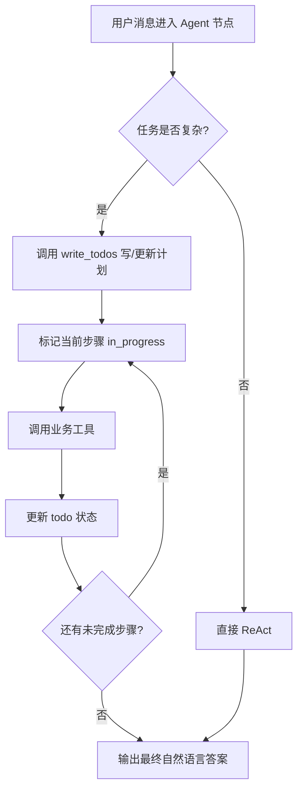

# TodoListMiddleware 路线 A 改造方案

本文档说明：若在本项目（gd25-biz-agent-python）中按**路线 A**接入 LangChain 的 `TodoListMiddleware`，需要改哪些代码、改完后新增哪些能力、哪些东西**不会**变，以及推荐的分阶段落地方式。

> **路线 A 定义**：在现有 `create_agent` 创建的单 Agent 节点上，通过 Middleware 注入 `write_todos` 工具，让模型在 ReAct 循环内**自主拆任务、跟踪进度、动态改计划**；**不**改造外层 YAML 流程图结构，也**不**引入独立的 Planner / Replanner 节点。

---

## 一、TodoListMiddleware 是什么（与本项目的关系）

### 1.1 本质

`TodoListMiddleware` 是 **LangChain 1.x Agent 中间件**，挂载在 `langchain.agents.create_agent()` 上，作用有三点：

| 动作 | 说明 |
|------|------|
| 注入工具 | 自动增加 `write_todos` 工具（非业务工具，不参与 YAML `tools` 列表配置） |
| 注入提示词 | 在 system prompt 末尾追加「何时写 todo、如何更新状态」的说明 |
| 扩展 Agent 状态 | Agent 图内部增加 `todos: list[Todo]` 字段 |

单个 todo 的结构：

```python
{
    "content": "查询最近 7 天血压记录",
    "status": "pending" | "in_progress" | "completed"
}
```

### 1.2 与 FastAPI Middleware 的区别

本项目 `backend/main.py` 里的 `CORSMiddleware` 是 **HTTP 层**中间件；`TodoListMiddleware` 是 **Agent 运行时**中间件，只在 `create_agent` 编译出的 LangGraph 子图内生效，两者完全无关。

### 1.3 与「完整 Plan-and-Execute（路线 B）」的区别

| 维度 | 路线 A（TodoListMiddleware） | 路线 B（Planner/Executor/Replanner 子图） |
|------|------------------------------|-------------------------------------------|
| 改造范围 | 主要改 `AgentFactory` + 可选 YAML 开关 | 新建子图、扩展 `FlowState`、改流程编排 |
| 规划主体 | 同一个 Agent 自己写 todo | 独立 Planner / Replanner 节点 |
| 流程 YAML | **不变**（仍 intent → retrieval → core_agent） | 需新增 plan 相关节点与边 |
| 上线成本 | 低 | 高 |
| 可控性 | 中（靠 prompt + 工具约束） | 高（阶段可独立观测与限流） |

---

## 二、当前项目基线（改造前）

### 2.1 Agent 创建链路

```
flow.yaml (type: agent)
    ↓
AgentNodeCreator.create()
    ↓
AgentFactory.create_agent()
    ↓
create_agent(model=llm, tools=agent_tools)   # 无 middleware
    ↓
AgentExecutor.ainvoke() → graph.ainvoke({"messages": ...})
```

关键代码位置：

- `backend/domain/agents/factory.py` — `AgentFactory.create_agent()`、`AgentExecutor.ainvoke()`
- `backend/domain/flows/nodes/agent_creator.py` — Agent 节点执行、结果写入 `edges_var` / `flow_msgs`
- `backend/domain/flows/models/definition.py` — `AgentNodeConfig`（当前仅 `prompt` / `model` / `tools`）

### 2.2 外层流程编排（不变）

以 `medical_agent_v5` 为例，仍是**人工预规划**的静态图：

```
intent_recognition → retrieval_node → core_agent → END
```

模型的「多步能力」目前发生在 **单个 Agent 节点内部的 ReAct 循环**里：想一步 → 调工具 → 再想，**没有显式任务清单**。

### 2.3 对外 API 与状态

- Chat 接口：`POST /chat` → 执行整图 → 从 `flow_msgs` 取最后一条 AI 回复
- 流程级状态：`FlowState`（`current_message`、`edges_var`、`flow_msgs` 等）
- Agent 级状态：`{"messages": [...]}`（`AgentExecutor` 传入/取出，**当前未向外暴露 `todos`**）

---

## 三、路线 A 改造后的目标架构

### 3.1 改造后 Agent 内部循环



### 3.2 改造后整体链路（外层不变）

```
flow.yaml (可选 planning: true)
    ↓
AgentNodeCreator（可选：把 todos 写入 edges_var）
    ↓
AgentFactory.create_agent(middleware=[TodoListMiddleware()])
    ↓
AgentExecutor.ainvoke() → result 含 messages + todos
    ↓
Chat API（可选：响应里带 todos）
```

**核心原则**：YAML 流程图、条件边、`GraphBuilder`、function 节点逻辑**均不改动**；变化集中在 **Agent 子图内部**。

---

## 四、具体变化点清单

以下按**必改 / 建议改 / 可选改**分级。

### 4.1 必改（最小可用版本）

#### （1）`backend/domain/agents/factory.py`

**变化**：根据配置决定是否挂载 `TodoListMiddleware`。

```python
from langchain.agents.middleware import TodoListMiddleware

# AgentNodeConfig 增加 planning 字段后：
middleware = []
if config.planning:
    middleware.append(TodoListMiddleware())

graph = create_agent(
    model=llm,
    tools=agent_tools,
    middleware=middleware or None,
)
```

**`AgentExecutor.ainvoke()` 返回值扩展**：

```python
# 当前
return {"output": output, "output_data": output_data, "messages": ...}

# 改造后（建议）
return {
    "output": output,
    "output_data": output_data,
    "messages": result.get("messages", []),
    "todos": result.get("todos", []),  # 新增
}
```

#### （2）`backend/domain/flows/models/definition.py`

**变化**：`AgentNodeConfig` 增加可选字段。

```python
class AgentNodeConfig(BaseModel):
    prompt: str
    model: ModelConfig
    tools: Optional[List[str]] = None
    planning: bool = Field(
        default=False,
        description="是否启用 TodoListMiddleware，为 Agent 注入 write_todos 任务规划能力",
    )
```

对应 YAML 写法：

```yaml
- name: core_agent
  type: agent
  config:
    prompt: prompts/50-core_agent.md
    planning: true          # 新增：仅该节点启用
    model:
      provider: doubao
      name: doubao-seed-1-8-251228
    tools:
      - query_blood_pressure
      - record_blood_pressure
```

#### （3）`backend/domain/flows/nodes/agent_creator.py`

**变化**：解析 `planning` 并传入 `AgentNodeConfig`；可选将 `todos` 写入 `edges_var` 供下游或日志使用。

```python
agent_config = AgentNodeConfig(
    prompt=config_dict["prompt"],
    model=model_config,
    tools=config_dict.get("tools"),
    planning=config_dict.get("planning", False),  # 新增
)

# ainvoke 之后（可选）
if result.get("todos"):
    new_state["edges_var"]["agent_todos"] = result["todos"]
```

---

### 4.2 建议改（可观测性与产品化）

#### （4）Langfuse 追踪

- `write_todos` 的 tool call 会出现在 LangGraph/LangChain trace 中（与现有 `langfuse_handler` 兼容）
- **建议**：在 span metadata 中增加 `todos_snapshot`，便于在 Langfuse 里看到任务拆解过程
- **注意**：Middleware 追加的 system prompt 与 `build_system_message()` 注入的节点提示词会**合并**；需在联调时确认豆包模型对超长 system 的容忍度

#### （5）日志

在 `AgentNodeCreator` 或 `AgentExecutor` 中增加 debug 日志：

```python
logger.info(f"[节点 {node_name}] todos 数量={len(todos)}, 未完成={...}")
```

#### （6）Chat API 响应（可选）

若前端需要展示「Agent 正在执行哪几步」，可扩展 `ChatResponse`：

```python
class ChatResponse(BaseModel):
    reply: str
    session_id: str
    todos: Optional[List[dict]] = None  # 可选
```

从**最后一个启用 planning 的 Agent 节点**的 `edges_var["agent_todos"]` 或流程级扩展字段读取。

---

### 4.3 可选改（增强体验，非必须）

| 改动点 | 说明 |
|--------|------|
| 自定义 `TodoListMiddleware(system_prompt=...)` | 医疗场景可追加「先查数据再下结论」「禁止编造指标」等规则 |
| `FlowState` 增加 `agent_todos` 字段 | 类型更明确；当前也可先放 `edges_var` |
| 单元测试 `cursor_test/test_todo_list_middleware.py` | 验证 planning 开关、todos 回传 |
| 仅对部分 flow 试点 | 如先在 `medical_agent_v5` 的 `core_agent` 开启 |

---

### 4.4 明确不需要改动的部分

| 模块/文件 | 原因 |
|-----------|------|
| `backend/domain/flows/builder.py` | 外层 StateGraph 结构不变 |
| `config/flows/*/flow.yaml` 的 edges | 路由逻辑不变（除非你要新加展示节点） |
| `backend/domain/tools/*` | 业务工具定义不变；`write_todos` 由 Middleware 注入 |
| `requirements.txt` | `TodoListMiddleware` 已包含在现有 `langchain>=1.0.0` 中，**无需新依赖** |
| function / rag / embedding 节点 | 非 Agent 节点不受影响 |
| PostgreSQL / 缓存 / Rewritten 队列 | 无数据模型变更 |

---

## 五、改造后支持的能力（具体说明）

### 5.1 新增能力

#### 能力 1：Agent 内动态任务拆解

用户提出复合需求时，模型可先调用 `write_todos`，例如：

```json
[
  {"content": "查询最近 7 天血压", "status": "in_progress"},
  {"content": "查询当前用药记录", "status": "pending"},
  {"content": "对比趋势并给出建议", "status": "pending"}
]
```

再按步骤调用 `query_blood_pressure`、`query_medication` 等**已有业务工具**。

#### 能力 2：执行过程中动态改计划

若某步失败或发现新信息，模型可再次调用 `write_todos`，**整体替换** todo 列表（增删改步骤）。Middleware 会限制**同一轮**不能并行多次调用 `write_todos`，避免状态冲突。

#### 能力 3：任务进度可追踪

- **运行时**：`result["todos"]` 含最新状态
- **可选对外**：Chat 响应或 `edges_var["agent_todos"]` 暴露给前端/运营
- **Langfuse**：tool call 链路上可见规划与执行顺序

#### 能力 4：按节点粒度开关

通过 YAML `planning: true/false`，可只对「多工具、多步骤」的节点（如 `core_agent`）启用，对「单步意图识别」节点（如 `intent_recognition`）保持关闭，**控制 token 与延迟成本**。

---

### 5.2 典型适用场景（本项目）

| 场景 | 是否适合开启 planning | 说明 |
|------|------------------------|------|
| 用户问「我血压怎么样，药要不要调整」 | ✅ 适合 | 需查记录 → 查用药 → 综合分析 |
| 单条血压记录写入 | ❌ 不必 | 1～2 步即可完成 |
| 意图识别节点 | ❌ 不必 | 输出 JSON，步骤固定 |
| 多工具串联的健康报告 | ✅ 适合 | 步骤多、依赖强 |

---

### 5.3 仍然不支持的能力（避免预期偏差）

| 能力 | 路线 A 是否支持 | 说明 |
|------|-----------------|------|
| 外层 YAML 流程自动重规划 | ❌ | 流程仍由 YAML 静态定义 |
| 独立 Planner 节点输出审计级计划 | ❌ | 计划仅在 Agent 内部，无单独节点 |
| 跨节点共享 todo 状态 | ❌ 默认 | todo 生命周期在一个 Agent 节点的一次 `ainvoke` 内 |
| 保证 100% 先规划再执行 | ❌ | 简单问题模型可能跳过 todo（官方设计如此） |
| 前端默认展示进度条 | ❌ 需额外改 API | 需实现 4.2（6） |
| 与 AutoGen 等第三方框架互通 | ❌ | 无关 |

若需要「跨节点、可审计、强制先规划」，应评估**路线 B**（独立 Plan-and-Execute 子图）。

---

## 六、数据流变化对比

### 6.1 改造前

```
ChatRequest
  → FlowState { current_message, history_messages, ... }
  → graph.ainvoke(FlowState)
  → core_agent 节点
      → AgentExecutor.ainvoke(msgs)
          → create_agent 子图 { messages }
          → 返回 output / messages
  → edges_var（业务 JSON）+ flow_msgs（AI 回复）
  → ChatResponse { reply }
```

### 6.2 改造后（启用 planning 的节点）

```
ChatRequest
  → FlowState（不变）
  → graph.ainvoke(FlowState)（不变）
  → core_agent 节点（planning: true）
      → AgentExecutor.ainvoke(msgs)
          → create_agent 子图 { messages, todos }
          → 内部可能多次：write_todos → 业务 tool → write_todos → ...
          → 返回 output / messages / todos
  → edges_var + flow_msgs + agent_todos（可选）
  → ChatResponse { reply, todos? }
```

**对用户可见的最终回复**仍来自最后一条 AI 消息的 `content`；`todos` 是**过程元数据**，除非前端专门展示。

---

## 七、配置与代码示例（完整最小改造）

### 7.1 YAML 示例（medical_agent_v5 试点）

```yaml
- name: intent_recognition
  type: agent
  config:
    prompt: prompts/10-before-rag.md
    planning: false    # 显式关闭（也可省略，默认 false）
    model: { ... }

- name: core_agent
  type: agent
  config:
    prompt: prompts/50-core_agent.md
    planning: true     # 仅核心 Agent 启用
    model: { ... }
    tools:
      - record_blood_pressure
      - query_blood_pressure
      # ...
```

### 7.2 AgentFactory 伪代码

```python
def create_agent(config: AgentNodeConfig, flow_dir: str, ...) -> AgentExecutor:
    # ... 加载 prompt、tools、llm ...

    middleware = [TodoListMiddleware()] if config.planning else []

    graph = create_agent(
        model=llm,
        tools=agent_tools,
        middleware=middleware,
    )
    return AgentExecutor(graph, agent_tools, prompt_cache_key, planning_enabled=config.planning)
```

### 7.3 一次调用后的 result 形态（示意）

```python
{
    "output": "根据您近一周血压……建议……",
    "output_data": None,
    "messages": [ HumanMessage(...), AIMessage(tool_calls=[write_todos]), ToolMessage(...), ... ],
    "todos": [
        {"content": "查询最近7天血压", "status": "completed"},
        {"content": "查询用药记录", "status": "completed"},
        {"content": "给出综合建议", "status": "completed"},
    ],
}
```

---

## 八、风险、成本与测试建议

### 8.1 风险

| 风险 | 影响 | 缓解 |
|------|------|------|
| 额外 token 消耗 | `write_todos` + 更长 system prompt | 仅对必要节点开启 `planning: true` |
| 延迟增加 | 多一轮 tool call | 简单问答场景保持 planning 关闭 |
| 模型跳过 todo | 简单任务直接答 | 符合官方设计；复杂场景可在节点 prompt 中强调 |
| system prompt 过长 | 豆包上下文或指令跟随下降 | 联调监控；必要时精简节点 prompt |
| todos 未传到 API | 前端看不到进度 | 做 4.2（6）可选改造 |

### 8.2 测试清单

- [ ] `planning: false` 时行为与改造前一致（回归）
- [ ] `planning: true` 时复杂多步请求会触发 `write_todos`
- [ ] 简单单步请求不强制写 todo（或写了也不影响正确性）
- [ ] Langfuse trace 中可见 `write_todos` 与业务 tool 调用顺序
- [ ] `edges_var` / 条件边路由不受 todos 干扰
- [ ] `medical_agent_v4` 等带条件边的 flow 全流程回归

---

## 九、推荐落地步骤（分 3 步）

### 阶段 1：内核改造（1～2 天）

1. 扩展 `AgentNodeConfig.planning`
2. 修改 `AgentFactory.create_agent` 挂载 Middleware
3. `AgentExecutor` 回传 `todos`
4. 本地手动调用验证

### 阶段 2：流程试点（1 天）

1. 仅在 `medical_agent_v5` 的 `core_agent` 设 `planning: true`
2. 准备 3～5 个多步测试用例（查+比+建议）
3. 对比开启前后 Langfuse trace 与回复质量

### 阶段 3：产品化（可选）

1. Chat API 返回 `todos`
2. 前端展示任务进度
3. 补充 `cursor_test` 自动化测试

---

## 十、总结

| 问题 | 答案 |
|------|------|
| 路线 A 改什么？ | 主要是 `AgentFactory`、`AgentNodeConfig`、可选 `agent_creator` / Chat API |
| 外层 YAML 流程改吗？ | **不改**；仅节点 config 加 `planning` 开关 |
| 新增依赖吗？ | **不需要**；LangChain 1.x 已内置 |
| 新增什么能力？ | Agent 内动态拆任务、跟踪进度、执行中改计划 |
| 不解决什么？ | 跨节点规划、YAML 级重规划、强制全局 Plan 架构 |
| 最小改动文件数 | **2 个必改**（factory + definition），**1 个建议改**（agent_creator） |

路线 A 的本质是：**在现有「单节点 ReAct Agent」上，加一层轻量自规划能力**，而不是替换整个 LangGraph 流程引擎。适合作为 Plan-and-Execute 的**第一步试点**；若效果明显且需更强可控性，再评估路线 B。

---

## 附录：相关源码索引

| 文件 | 职责 |
|------|------|
| `backend/domain/agents/factory.py` | Agent 创建与执行 |
| `backend/domain/flows/nodes/agent_creator.py` | Agent 节点闭包与状态回写 |
| `backend/domain/flows/models/definition.py` | 节点配置模型 |
| `backend/app/api/routes/chat.py` | 对外 Chat 接口 |
| `config/flows/medical_agent_v5/flow.yaml` | 推荐试点流程 |
| LangChain 官方 | `langchain.agents.middleware.TodoListMiddleware` |
