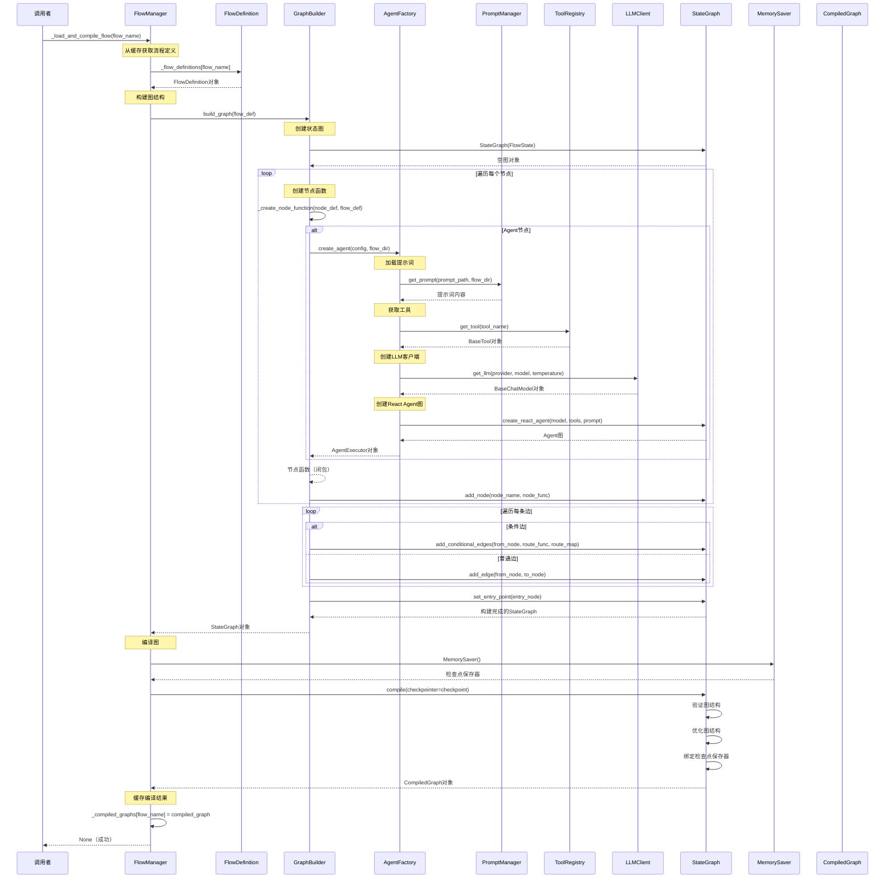
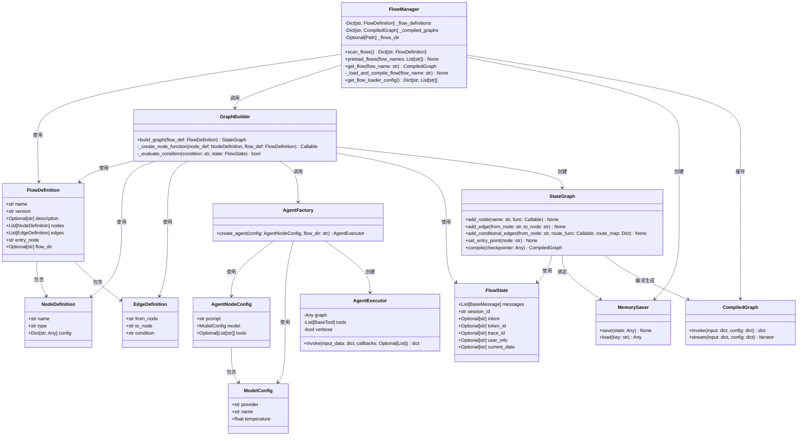

# 加载并编译流程方法实现细节分析

## 1. 方法概述

`_load_and_compile_flow` 是 `FlowManager` 类中的核心方法，负责将流程定义（`FlowDefinition`）转换为可执行的 LangGraph 编译图。

### 方法签名

```python
@classmethod
def _load_and_compile_flow(cls, flow_name: str) -> None:
```

### 方法位置

```111:129:backend/domain/flows/manager.py
    @classmethod
    def _load_and_compile_flow(cls, flow_name: str) -> None:
        """
        加载并编译流程
        
        Args:
            flow_name: 流程名称
        """
        flow_def = cls._flow_definitions[flow_name]
        
        # 构建图
        graph = GraphBuilder.build_graph(flow_def)
        
        # 编译图（使用内存检查点保存器）
        checkpoint = MemorySaver()
        compiled_graph = graph.compile(checkpointer=checkpoint)
        
        # 缓存编译后的图
        cls._compiled_graphs[flow_name] = compiled_graph
        logger.info(f"成功编译流程: {flow_name}")
```

## 2. 实现细节分析

### 2.1 执行流程

该方法执行以下步骤：

1. **获取流程定义**：从类变量 `_flow_definitions` 字典中根据 `flow_name` 获取对应的 `FlowDefinition` 对象
2. **构建图结构**：调用 `GraphBuilder.build_graph()` 方法，将流程定义转换为 LangGraph 的 `StateGraph` 对象
3. **创建检查点保存器**：实例化 `MemorySaver()`，用于保存流程执行的状态检查点
4. **编译图**：调用 `graph.compile(checkpointer=checkpoint)` 将 `StateGraph` 编译为可执行的图
5. **缓存编译结果**：将编译后的图存储到类变量 `_compiled_graphs` 字典中，供后续使用

### 2.2 关键依赖

#### 2.2.1 FlowDefinition

流程定义对象，包含：
- `name`: 流程名称
- `version`: 流程版本
- `nodes`: 节点列表（`List[NodeDefinition]`）
- `edges`: 边列表（`List[EdgeDefinition]`）
- `entry_node`: 入口节点名称
- `flow_dir`: 流程目录路径（用于解析相对路径）

#### 2.2.2 GraphBuilder.build_graph()

图构建器的核心方法，执行以下操作：

1. **创建状态图**：使用 `StateGraph(FlowState)` 创建空图
2. **添加节点**：
   - 遍历 `flow_def.nodes`，为每个节点创建节点函数
   - 调用 `_create_node_function()` 创建节点函数（对于 Agent 节点，会调用 `AgentFactory.create_agent()`）
   - 使用 `graph.add_node()` 添加节点
3. **添加边**：
   - 按源节点分组边
   - 区分条件边和普通边
   - 条件边使用 `add_conditional_edges()` 添加，普通边使用 `add_edge()` 添加
4. **设置入口节点**：调用 `graph.set_entry_point()` 设置流程入口

#### 2.2.3 节点函数创建

对于 Agent 类型的节点，`GraphBuilder._create_node_function()` 会：

1. 解析节点配置（`AgentNodeConfig`、`ModelConfig`）
2. 调用 `AgentFactory.create_agent()` 创建 Agent 执行器
3. 返回一个节点函数，该函数：
   - 从状态中获取最后一条用户消息
   - 从 ContextVar 获取 `trace_id`，创建 Langfuse Handler
   - 调用 `agent_executor.invoke()` 执行 Agent
   - 更新状态（包括消息列表和意图识别结果）

#### 2.2.4 MemorySaver

LangGraph 提供的内存检查点保存器，用于：
- 保存流程执行过程中的状态快照
- 支持流程的暂停和恢复
- 在内存中维护状态历史

#### 2.2.5 graph.compile()

LangGraph 的编译方法，将 `StateGraph` 编译为可执行的图：
- 验证图的完整性（节点、边、入口点）
- 优化图结构
- 绑定检查点保存器
- 返回编译后的图对象（`CompiledGraph`）

## 3. 时序图



## 4. 类图



## 5. 关键设计点

### 5.1 缓存机制

- **流程定义缓存**：`_flow_definitions` 存储已解析的流程定义，避免重复解析 YAML 文件
- **编译图缓存**：`_compiled_graphs` 存储已编译的图，避免重复编译（编译是相对耗时的操作）

### 5.2 延迟加载

- 流程定义在首次调用 `get_flow()` 时通过 `scan_flows()` 加载
- 编译图在首次使用时才进行编译（`get_flow()` 中的按需加载）

### 5.3 检查点机制

- 使用 `MemorySaver` 在内存中保存流程执行状态
- 支持流程的暂停和恢复（虽然当前实现未使用此功能）

### 5.4 节点函数闭包

- Agent 节点函数通过闭包捕获 `node_name`、`agent_executor` 等变量
- 运行时从 ContextVar 获取 `trace_id`，动态创建 Langfuse Handler

## 6. 调用链分析

### 6.1 直接调用者

- `preload_flows()`：预加载指定流程时调用
- `get_flow()`：按需加载流程时调用

### 6.2 间接调用者

- 应用启动时的流程预加载
- API 路由层处理请求时的流程获取

## 7. 错误处理

当前实现中，该方法不包含显式的错误处理，错误会向上传播：

- 如果 `flow_name` 不在 `_flow_definitions` 中，会抛出 `KeyError`
- 如果 `GraphBuilder.build_graph()` 失败，会抛出相应的异常
- 如果 `graph.compile()` 失败，会抛出编译异常

建议在调用该方法前确保：
1. 流程定义已加载（通过 `scan_flows()` 或 `preload_flows()`）
2. 流程定义格式正确
3. 所有依赖（Agent、工具、提示词）都已正确配置

## 8. 性能考虑

### 8.1 编译开销

- 图编译是相对耗时的操作，因此使用缓存机制避免重复编译
- 预加载机制可以在应用启动时提前编译常用流程

### 8.2 内存占用

- 编译后的图对象会占用一定内存
- 检查点保存器也会占用内存（存储状态历史）
- 对于大量流程，需要考虑内存管理策略

## 9. 扩展性

### 9.1 节点类型扩展

当前仅支持 Agent 节点，可以通过扩展 `GraphBuilder._create_node_function()` 支持其他节点类型（如条件节点、工具节点等）。

### 9.2 检查点存储扩展

当前使用内存检查点，可以扩展为使用数据库或文件系统存储，支持持久化和分布式部署。

### 9.3 编译优化

可以添加编译选项，如：
- 图结构优化
- 节点执行顺序优化
- 条件评估优化

