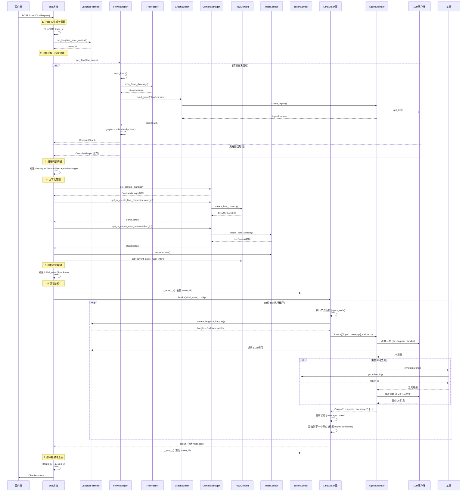

# 运行时流程分析 - chat 方法实现细节

## 1. 方法概述

`chat` 方法是聊天 API 的核心入口点，位于 `backend/app/api/routes/chat.py`，负责处理用户聊天请求并返回 AI 回复。该方法实现了完整的流程执行链路，包括请求处理、上下文管理、流程执行和结果返回。

### 1.1 方法签名

```22:25:backend/app/api/routes/chat.py
@router.post("/chat", response_model=ChatResponse)
async def chat(
    request: ChatRequest,
    app_request: Request
) -> ChatResponse:
```

### 1.2 输入参数

- **request: ChatRequest** - 聊天请求对象，包含以下字段：
  - `message: str` - 用户消息内容
  - `session_id: str` - 会话ID（用于标识对话会话）
  - `token_id: str` - 令牌ID（当前阶段等于用户ID）
  - `flow_name: Optional[str]` - 流程名称（可选，默认为 "medical_agent"）
  - `conversation_history: Optional[List[ChatMessage]]` - 对话历史（可选）
  - `user_info: Optional[str]` - 患者基础信息（多行文本，可选）
  - `current_date: Optional[str]` - 当前日期时间（可选）
  - `trace_id: Optional[str]` - Trace ID（可选，32位十六进制字符）

- **app_request: Request** - FastAPI 请求对象（用于获取应用状态）

### 1.3 返回值

- **ChatResponse** - 聊天响应对象，包含：
  - `response: str` - AI 助手回复内容
  - `session_id: str` - 会话ID

## 2. 实现步骤详解

### 2.1 Trace ID 生成与管理

```36:59:backend/app/api/routes/chat.py
    try:
        # 获取或生成 traceId（32位小写十六进制字符，符合Langfuse格式要求）
        trace_id = request.trace_id
        if not trace_id:
            # 使用 secrets.token_hex(16) 生成32位十六进制字符（16字节 = 32个十六进制字符）
            trace_id = secrets.token_hex(16)
        
        # 设置Langfuse Trace上下文
        langfuse_trace_id = set_langfuse_trace_context(
            # name="chat_request",
            name = request.flow_name or "UnknownChat",
            user_id=request.token_id,
            session_id=request.session_id,
            trace_id=trace_id,
            metadata={
                "message_length": len(request.message),
                "history_count": len(request.conversation_history) if request.conversation_history else 0,
                "flow_name": request.flow_name or "medical_agent",
            }
        )
        
        # 如果Langfuse创建了Trace，使用Langfuse的Trace ID
        if langfuse_trace_id:
            trace_id = langfuse_trace_id
```

**功能说明**：
- 如果请求中没有提供 `trace_id`，则使用 `secrets.token_hex(16)` 生成一个32位十六进制字符串
- 调用 `set_langfuse_trace_context()` 设置 Langfuse 可观测性追踪上下文
- 如果 Langfuse 返回了新的 Trace ID，则使用该 ID

**涉及类**：
- `set_langfuse_trace_context()` 函数（`backend/infrastructure/observability/langfuse_handler.py`）

### 2.2 流程获取（按需加载）

```70:73:backend/app/api/routes/chat.py
        flow_name = request.flow_name or "medical_agent"
        
        # 获取流程图（按需加载）
        graph = FlowManager.get_flow(flow_name)
```

**功能说明**：
- 获取流程名称（默认为 "medical_agent"）
- 调用 `FlowManager.get_flow()` 获取编译后的流程图（如果未加载则按需加载和编译）

**涉及类**：
- `FlowManager`（`backend/domain/flows/manager.py`）

**加载流程**：
1. 检查是否已编译（`_compiled_graphs` 缓存）
2. 如果未编译，检查流程定义是否存在（`_flow_definitions` 缓存）
3. 如果流程定义不存在，调用 `scan_flows()` 扫描流程目录
4. 调用 `_load_and_compile_flow()` 加载并编译流程：
   - 获取流程定义（`FlowDefinition`）
   - 调用 `GraphBuilder.build_graph()` 构建 LangGraph 图
   - 使用 `MemorySaver` 创建检查点保存器
   - 编译图（`graph.compile(checkpointer=checkpoint)`）
   - 缓存编译后的图

### 2.3 消息列表构建

```75:85:backend/app/api/routes/chat.py
        # 构建消息列表（从conversation_history和当前消息）
        messages = []
        if request.conversation_history:
            for msg in request.conversation_history:
                if msg.role == "user":
                    messages.append(HumanMessage(content=msg.content))
                elif msg.role == "assistant":
                    messages.append(AIMessage(content=msg.content))
        
        # 添加当前用户消息
        messages.append(HumanMessage(content=request.message))
```

**功能说明**：
- 将对话历史中的消息转换为 LangChain 消息类型（`HumanMessage`、`AIMessage`）
- 将当前用户消息添加到消息列表末尾

**涉及类**：
- `HumanMessage`、`AIMessage`（`langchain_core.messages`）

### 2.4 上下文管理

```87:111:backend/app/api/routes/chat.py
        # 获取上下文管理器
        context_manager = get_context_manager()
        
        # 创建或获取流程上下文
        flow_context = context_manager.get_or_create_flow_context(flow_id=request.session_id)
        
        # 创建或获取用户上下文
        user_context = context_manager.get_or_create_user_context(user_id=request.token_id)
        
        # 初始化用户上下文（从请求中加载用户信息）
        if request.user_info:
            try:
                # 尝试解析user_info为JSON
                if isinstance(request.user_info, str):
                    user_info_dict = json.loads(request.user_info)
                else:
                    user_info_dict = request.user_info
                user_context.set_user_info(user_info_dict)
            except (json.JSONDecodeError, TypeError):
                # 如果解析失败，作为字符串存储
                user_context.set("user_info_raw", request.user_info)
        
        # 将上下文数据添加到流程上下文（用于提示词替换）
        flow_context.set("current_date", request.current_date)
        flow_context.set("user_info", user_context.get_user_info())
```

**功能说明**：
- 获取全局上下文管理器实例（单例模式）
- 创建或获取流程上下文（以 `session_id` 作为流程ID）
- 创建或获取用户上下文（以 `token_id` 作为用户ID）
- 解析并设置用户信息（支持 JSON 格式或字符串格式）
- 将上下文数据添加到流程上下文（用于后续提示词替换）

**涉及类**：
- `get_context_manager()` 函数（`backend/domain/context/manager.py`）
- `ContextManager`（`backend/domain/context/manager.py`）
- `FlowContext`（`backend/domain/context/flow_context.py`）
- `UserContext`（`backend/domain/context/user_context.py`）

### 2.5 初始状态构建

```113:122:backend/app/api/routes/chat.py
        # 构建初始状态
        initial_state: FlowState = {
            "messages": messages,
            "session_id": request.session_id,
            "intent": None,
            "token_id": request.token_id,
            "trace_id": trace_id,
            "user_info": request.user_info,
            "current_date": request.current_date
        }
```

**功能说明**：
- 构建流程初始状态对象（`FlowState` TypedDict）
- 包含消息列表、会话ID、意图、令牌ID、Trace ID、用户信息和当前日期

**涉及类**：
- `FlowState`（`backend/domain/state.py`）

### 2.6 流程执行

```124:128:backend/app/api/routes/chat.py
        # 在TokenContext中执行流程图（确保工具可以获取token_id）
        with TokenContext(token_id=request.token_id):
            # 执行流程图
            config = {"configurable": {"thread_id": request.session_id}}
            result = graph.invoke(initial_state, config)
```

**功能说明**：
- 使用 `TokenContext` 上下文管理器设置 `token_id`（工具可以通过 `get_token_id()` 获取）
- 配置 LangGraph 执行参数（`thread_id` 用于检查点保存）
- 调用 `graph.invoke()` 执行流程图，传入初始状态和配置

**涉及类**：
- `TokenContext`（`backend/domain/tools/context.py`）
- 编译后的 LangGraph 图（由 `FlowManager` 管理）

**流程执行内部机制**：
1. 根据流程定义执行节点（Agent 节点）
2. Agent 节点执行时：
   - 从状态中获取最后一条用户消息
   - 从 ContextVar 获取 `trace_id`，创建 Langfuse Handler
   - 调用 `AgentExecutor.invoke()` 执行 Agent
   - Agent 执行器调用 LLM 并可能调用工具
   - 工具执行时可以从 `TokenContext` 获取 `token_id`
   - 将 AI 回复添加到消息列表
   - 如果是意图识别节点，解析 JSON 并更新 `intent`
3. 根据边（edges）和条件（conditions）路由到下一个节点
4. 继续执行直到流程结束

### 2.7 结果提取与返回

```130:146:backend/app/api/routes/chat.py
        # 提取最后一条AI消息作为回复
        messages = result.get("messages", [])
        if messages:
            last_message = messages[-1]
            response_text = last_message.content if hasattr(last_message, "content") else str(last_message)
        else:
            response_text = "抱歉，我没有收到回复。"
        
        logger.info(
            f"[Chat请求完成] session_id={request.session_id}, "
            f"response_length={len(response_text)}"
        )
        
        return ChatResponse(
            response=response_text,
            session_id=request.session_id
        )
```

**功能说明**：
- 从执行结果中提取消息列表
- 获取最后一条消息的内容作为 AI 回复
- 记录完成日志
- 构建并返回 `ChatResponse` 对象

**涉及类**：
- `ChatResponse`（`backend/app/api/schemas/chat.py`）

### 2.8 异常处理

```148:150:backend/app/api/routes/chat.py
    except Exception as e:
        logger.error(f"处理聊天请求失败: {e}", exc_info=True)
        raise HTTPException(status_code=500, detail=f"处理请求失败: {str(e)}")
```

**功能说明**：
- 捕获所有异常并记录详细错误日志
- 返回 HTTP 500 错误响应

## 3. 时序图



## 4. 类图

```mermaid
classDiagram
    class ChatRequest {
        +str message
        +str session_id
        +str token_id
        +Optional[str] flow_name
        +Optional[List[ChatMessage]] conversation_history
        +Optional[str] user_info
        +Optional[str] current_date
        +Optional[str] trace_id
    }
    
    class ChatResponse {
        +str response
        +str session_id
    }
    
    class ChatRoute {
        +async chat(request: ChatRequest, app_request: Request) ChatResponse
    }
    
    class FlowManager {
        -Dict[str, FlowDefinition] _flow_definitions
        -Dict[str, CompiledGraph] _compiled_graphs
        -Optional[Path] _flows_dir
        +scan_flows() Dict[str, FlowDefinition]
        +preload_flows(flow_names: List[str]) None
        +get_flow(flow_name: str) CompiledGraph
        -_load_and_compile_flow(flow_name: str) None
    }
    
    class FlowParser {
        +parse_yaml(yaml_path: Path) FlowDefinition
        +scan_flows_directory(flows_dir: Path) Dict[str, FlowDefinition]
    }
    
    class FlowDefinition {
        +str name
        +str version
        +Optional[str] description
        +List[NodeDefinition] nodes
        +List[EdgeDefinition] edges
        +str entry_node
        +Optional[str] flow_dir
    }
    
    class NodeDefinition {
        +str name
        +str type
        +Dict[str, Any] config
    }
    
    class EdgeDefinition {
        +str from_node
        +str to_node
        +str condition
    }
    
    class GraphBuilder {
        +build_graph(flow_def: FlowDefinition) StateGraph
        -_create_node_function(node_def: NodeDefinition, flow_def: FlowDefinition) Callable
        -_evaluate_condition(condition: str, state: FlowState) bool
    }
    
    class AgentFactory {
        +create_agent(config: AgentNodeConfig, flow_dir: str, tools: Optional[List[BaseTool]]) AgentExecutor
    }
    
    class AgentExecutor {
        -Any graph
        -List[BaseTool] tools
        -bool verbose
        +invoke(input_data: dict, callbacks: Optional[List]) dict
    }
    
    class AgentNodeConfig {
        +str prompt
        +ModelConfig model
        +Optional[List[str]] tools
    }
    
    class ModelConfig {
        +str provider
        +str name
        +float temperature
    }
    
    class FlowState {
        <<TypedDict>>
        +List[BaseMessage] messages
        +str session_id
        +Optional[str] intent
        +Optional[str] token_id
        +Optional[str] trace_id
        +Optional[str] user_info
        +Optional[str] current_date
    }
    
    class ContextManager {
        -Dict[str, FlowContext] _flow_contexts
        -Dict[str, UserContext] _user_contexts
        +create_flow_context(flow_id: str) FlowContext
        +get_flow_context(flow_id: str) Optional[FlowContext]
        +get_or_create_flow_context(flow_id: str) FlowContext
        +create_user_context(user_id: str) UserContext
        +get_user_context(user_id: str) Optional[UserContext]
        +get_or_create_user_context(user_id: str) UserContext
    }
    
    class FlowContext {
        -Dict[str, Any] _data
        +set(key: str, value: Any) None
        +get(key: str, default: Any) Any
        +update(data: Dict[str, Any]) None
        +clear() None
        +remove(key: str) Any
        +has(key: str) bool
        +data Dict[str, Any]
    }
    
    class UserContext {
        -str user_id
        -Dict[str, Any] _data
        +set_user_info(user_info: Optional[Dict[str, Any]]) None
        +get_user_info() Optional[Dict[str, Any]]
        +set_preference(key: str, value: Any) None
        +get_preference(key: str, default: Any) Any
        +set_setting(key: str, value: Any) None
        +get_setting(key: str, default: Any) Any
        +set(key: str, value: Any) None
        +get(key: str, default: Any) Any
    }
    
    class TokenContext {
        -str token_id
        -Any _token
        +__enter__() TokenContext
        +__exit__(exc_type, exc_val, exc_tb) None
    }
    
    class LangfuseHandler {
        <<module>>
        +set_langfuse_trace_context(name: str, user_id: Optional[str], session_id: Optional[str], trace_id: Optional[str], metadata: Optional[Dict]) Optional[str]
        +get_current_trace_id() Optional[str]
        +create_langfuse_handler(context: Optional[Dict]) Optional[LangfuseCallbackHandler]
        +get_langfuse_client() Optional[Langfuse]
    }
    
    ChatRoute --> ChatRequest : 接收
    ChatRoute --> ChatResponse : 返回
    ChatRoute --> FlowManager : 获取流程图
    ChatRoute --> ContextManager : 获取上下文管理器
    ChatRoute --> TokenContext : 设置token_id上下文
    ChatRoute --> LangfuseHandler : 设置Trace上下文
    
    FlowManager --> FlowParser : 解析流程定义
    FlowManager --> GraphBuilder : 构建图
    FlowManager --> FlowDefinition : 管理流程定义
    
    FlowParser --> FlowDefinition : 创建
    FlowDefinition --> NodeDefinition : 包含
    FlowDefinition --> EdgeDefinition : 包含
    
    GraphBuilder --> FlowDefinition : 使用
    GraphBuilder --> AgentFactory : 创建Agent节点
    GraphBuilder --> FlowState : 使用状态类型
    
    AgentFactory --> AgentExecutor : 创建
    AgentFactory --> AgentNodeConfig : 使用配置
    AgentFactory --> ModelConfig : 使用模型配置
    
    AgentExecutor --> FlowState : 处理状态
    
    ContextManager --> FlowContext : 管理
    ContextManager --> UserContext : 管理
    
    LangfuseHandler --> Langfuse : 使用Langfuse SDK
```



## 5. 关键组件说明

### 5.1 流程管理

- **FlowManager**: 负责流程的加载、编译和缓存管理，实现按需加载机制
- **FlowParser**: 解析 YAML 格式的流程配置文件，生成 `FlowDefinition` 对象
- **GraphBuilder**: 根据 `FlowDefinition` 构建 LangGraph 状态图，包括节点和边的创建

### 5.2 Agent 管理

- **AgentFactory**: 根据配置创建 Agent 实例，包括 LLM 客户端、工具和提示词的加载
- **AgentExecutor**: Agent 执行器包装类，提供统一的 `invoke()` 接口

### 5.3 上下文管理

- **ContextManager**: 全局上下文管理器（单例模式），管理流程上下文和用户上下文的生命周期
- **FlowContext**: 流程级别的共享数据，用于 Agent 间数据传递和提示词替换
- **UserContext**: 用户级别的数据，存储用户信息、偏好和设置

### 5.4 工具上下文

- **TokenContext**: 使用 Python `contextvars` 实现线程安全的 `token_id` 传递，工具可以通过 `get_token_id()` 获取

### 5.5 可观测性

- **LangfuseHandler**: Langfuse 可观测性集成，提供 Trace 追踪和 LLM 调用日志记录

## 6. 数据流转路径

### 6.1 请求到响应的数据流

1. **请求接收**: `ChatRequest` → `chat()` 方法
2. **Trace 初始化**: 生成/获取 `trace_id` → 设置 Langfuse Trace 上下文
3. **流程加载**: `flow_name` → `FlowManager.get_flow()` → 编译后的 LangGraph 图
4. **消息构建**: `conversation_history` + `message` → `HumanMessage`/`AIMessage` 列表
5. **上下文准备**: `session_id` + `token_id` + `user_info` → `FlowContext` + `UserContext`
6. **状态构建**: 消息列表 + 上下文数据 → `FlowState`
7. **流程执行**: `FlowState` → LangGraph → Agent 节点执行 → LLM 调用 → 工具调用 → 更新状态
8. **结果提取**: 执行结果 → 最后一条 AI 消息 → `ChatResponse`

### 6.2 工具调用时的数据流

1. Agent 决定调用工具
2. 工具执行时从 `TokenContext` 获取 `token_id`
3. 工具使用 `token_id` 进行业务逻辑处理（如调用外部 API）
4. 工具返回结果给 Agent
5. Agent 将工具结果整合到回复中

### 6.3 可观测性数据流

1. API 路由层创建 Langfuse Trace（设置 `trace_id` 到 ContextVar）
2. Agent 节点执行时从 ContextVar 获取 `trace_id`
3. 创建 Langfuse CallbackHandler，关联到 Trace
4. LLM 调用时自动记录到 Langfuse（通过 CallbackHandler）
5. 所有调用记录关联到同一个 Trace，实现分布式追踪

## 7. 设计模式与架构特点

### 7.1 设计模式

- **单例模式**: `ContextManager`、`LangfuseHandler` 的客户端
- **工厂模式**: `AgentFactory` 创建 Agent 实例
- **上下文管理器模式**: `TokenContext` 管理工具上下文
- **策略模式**: 不同类型的节点（Agent 节点）通过统一的接口执行

### 7.2 架构特点

- **分层架构**: API 层 → 领域层 → 基础设施层
- **按需加载**: 流程图在首次使用时才加载和编译，提高启动速度
- **缓存机制**: 编译后的流程图和流程定义都缓存在内存中
- **上下文隔离**: 使用 `contextvars` 实现线程安全的上下文传递
- **可观测性**: 完整的 Langfuse 集成，支持分布式追踪和 LLM 调用日志

## 8. 性能优化点

1. **流程图缓存**: 编译后的流程图缓存在 `FlowManager._compiled_graphs`，避免重复编译
2. **流程定义缓存**: 解析后的流程定义缓存在 `FlowManager._flow_definitions`
3. **按需加载**: 只加载实际使用的流程，减少内存占用
4. **上下文复用**: 流程上下文和用户上下文在同一个会话中复用

## 9. 扩展点

### 9.1 新增节点类型

在 `GraphBuilder._create_node_function()` 中添加新的节点类型处理逻辑

### 9.2 新增工具类型

在工具注册表中注册新工具，Agent 配置中指定工具名称即可使用

### 9.3 新增流程

在 `config/flows/` 目录下创建新的流程目录和 `flow.yaml` 文件，系统会自动扫描并加载

### 9.4 自定义上下文数据

在 `FlowContext` 和 `UserContext` 中扩展数据字段，支持更多的业务场景

## 10. 注意事项

1. **线程安全**: `TokenContext` 使用 `contextvars` 实现线程安全，但在多线程环境下需要注意上下文隔离
2. **内存管理**: 流程图和上下文的缓存不会自动清理，长时间运行可能需要考虑清理策略
3. **异常处理**: 流程执行过程中的异常会被 LangGraph 捕获，但需要确保异常信息能够正确传播
4. **Trace ID 格式**: Langfuse 要求 Trace ID 为 32 位小写十六进制字符，系统会自动规范化

