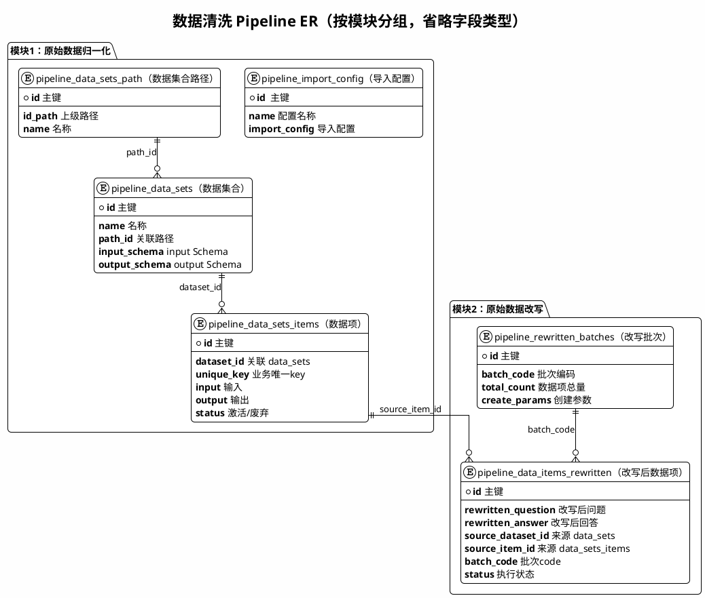

# 数据清洗-Pipeline流程ER

## 模块

### 1. 原始数据归一化

#### pipeline_import_config

| 字段 | 类型 | 说明 |
|------|------|------|
| id | VARCHAR(50) | 主键，ULID |
| name | VARCHAR(200) | 配置名称，NOT NULL |
| description | TEXT | 描述 |
| import_config | JSONB | 导入逻辑配置（后台强绑定） |
| created_at | TIMESTAMPTZ | 创建时间 |
| updated_at | TIMESTAMPTZ | 更新时间 |

#### pipeline_data_sets_path

| 字段 | 类型 | 说明 |
|------|------|------|
| id | VARCHAR(50) | 主键，路径 ID，用于路径拼接 |
| id_path | VARCHAR(500) | 上级路径（根为空；多级用逗号拼接），有索引 |
| name | VARCHAR(200) | 名称，NOT NULL |
| description | TEXT | 描述 |
| metadata | JSONB | 扩展元数据 |
| created_at | TIMESTAMPTZ | 创建时间 |
| updated_at | TIMESTAMPTZ | 更新时间 |

#### pipeline_data_sets

| 字段 | 类型 | 说明 |
|------|------|------|
| id | VARCHAR(50) | 主键，ULID 或业务 ID |
| name | VARCHAR(200) | 名称，NOT NULL |
| path_id | VARCHAR(50) | 外键 → pipeline_data_sets_path.id，ON DELETE SET NULL |
| input_schema | JSONB | input 的 JSON Schema |
| output_schema | JSONB | output 的 JSON Schema |
| metadata | JSONB | 扩展元数据 |
| created_at | TIMESTAMPTZ | 创建时间 |
| updated_at | TIMESTAMPTZ | 更新时间 |

#### pipeline_data_sets_items

| 字段 | 类型 | 说明 |
|------|------|------|
| id | VARCHAR(50) | 主键，ULID |
| dataset_id | VARCHAR(50) | 外键 → pipeline_data_sets.id，ON DELETE CASCADE |
| unique_key | VARCHAR(200) | 业务唯一 key，有索引 |
| input | JSONB | 输入数据 |
| output | JSONB | 输出数据 |
| metadata | JSONB | 扩展元数据 |
| status | SMALLINT | 1=激活，0=废弃，默认 1 |
| source | VARCHAR(200) | 来源 |
| created_at | TIMESTAMPTZ | 创建时间 |
| updated_at | TIMESTAMPTZ | 更新时间 |

---

### 2. 原始数据改写

#### pipeline_rewritten_batches

| 字段 | 类型 | 说明 |
|------|------|------|
| id | VARCHAR(50) | 主键，ULID |
| batch_code | VARCHAR(100) | 批次编码，NOT NULL，UNIQUE |
| total_count | INT | 本批次数据项总量，NOT NULL |
| create_params | JSONB | 创建参数（如 dataset_id/dataset_ids） |
| status | VARCHAR(20) | 批次级状态（可选） |
| created_at | TIMESTAMPTZ | 创建时间 |
| updated_at | TIMESTAMPTZ | 更新时间 |

#### pipeline_data_items_rewritten

| 字段 | 类型 | 说明 |
|------|------|------|
| id | VARCHAR(50) | 主键，ULID |
| scenario_description | TEXT | 场景描述 |
| rewritten_question | TEXT | 改写后的问题 |
| rewritten_answer | TEXT | 改写后的回答 |
| rewritten_rule | TEXT | 改写后的规则 |
| source_dataset_id | VARCHAR(100) | 来源 pipeline_data_sets.id，有索引 |
| source_item_id | VARCHAR(100) | 来源 pipeline_data_sets_items.id，有索引 |
| scenario_type | VARCHAR(1000) | 场景类型 |
| sub_scenario_type | VARCHAR(1000) | 子场景类型 |
| batch_code | VARCHAR(100) | 批次 code（逻辑关联 rewritten_batches） |
| status | VARCHAR(20) | init / processing / success / failed |
| ai_tags | JSONB | AI 标签 |
| ai_score | NUMERIC(10,4) | AI 评分 |
| manual_score | NUMERIC(10,4) | 人工评分 |
| execution_metadata | JSONB | 执行过程元数据 |
| created_at | TIMESTAMPTZ | 创建时间 |
| updated_at | TIMESTAMPTZ | 更新时间 |

---

### 3. 人工筛选、二次标记与打分

### 4. 组装、embedding、写入向量库

---

## ER 关系图 （plantuml）

单图展示，按模块分组，字段不列类型。可用 [PlantUML 在线](https://www.plantuml.com/plantuml/uml/) 或本地渲染。

