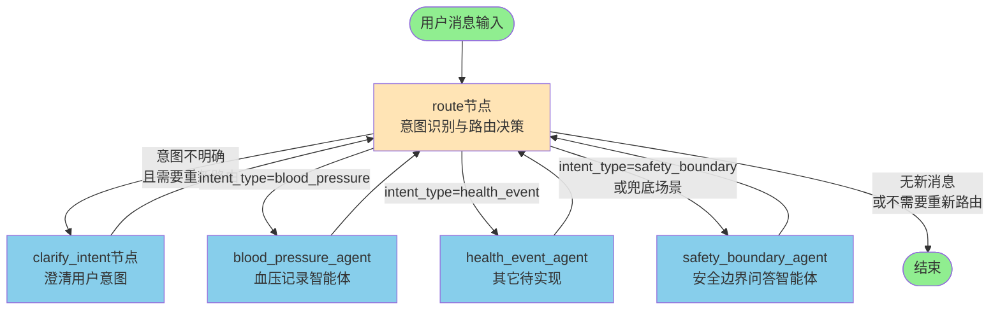
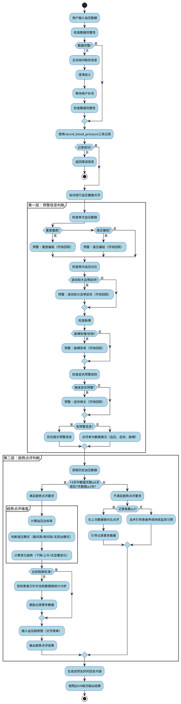
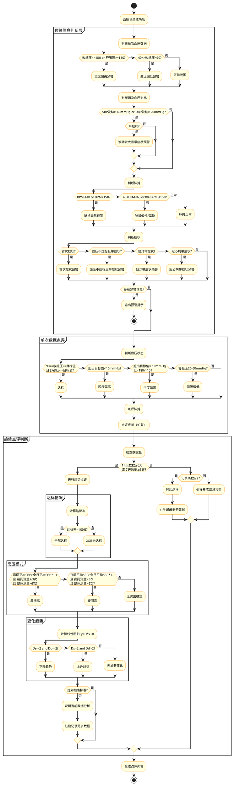

# 血压提示词中的流程

本文档详细描述了血压Agent系统提示词中定义的工作流程和血压点评规则。

## 一、总体流程图

### 1.1 主流程图（StarUML/PlantUML格式）

### 1.0 LangGraph 路由流程图



### 1.1 主流程图（StarUML/PlantUML格式）



### 1.2 血压点评详细流程图



## 二、流程说明

### 2.1 核心工作流程

血压Agent的核心工作流程分为两个主要步骤：

#### 第一步：血压数据收集

1. **接收用户输入**：系统接收用户提供的血压相关数据
2. **数据完整性检查**：
   - 必填信息：收缩压（systolic）、舒张压（diastolic）
   - 可选信息：心率（heart_rate）、记录时间（record_time）、备注（notes）、症状信息
3. **澄清机制**：
   - 如果信息不完整，主动询问缺失信息（使用友好语言）
   - 如果信息有歧义（如时间不明确），友好地澄清
   - 支持多轮对话，理解上下文，记住之前提到的信息
   - 为提高效率，可一次性询问所有缺失信息；但如果多次回复仍不完整，改为一次询问一个
4. **执行记录**：当收集到完整信息后，立即使用 `record_blood_pressure` 工具执行记录操作

#### 第二步：血压数据点评（记录成功后自动执行）

血压记录成功后，系统自动进行血压健康点评。点评流程采用**两层判断结构**：

### 2.2 第一层：预警信息判断

**目的**：优先识别需要紧急处理的预警情况。

**判断顺序**：
1. **单次血压数据预警**：
   - 重度偏高：收缩压≥180 mmHg 或 舒张压≥110 mmHg → **需预警，尽快回院**
   - 高压偏低：40 mmHg ≤ 收缩压 < 90 mmHg → **需预警，尽快回院**

2. **两次血压对比预警**：
   - 波动较大：相比7天内的上一次，收缩压波动≥40mmHg 或 舒张压波动≥20mmHg
   - 若波动较大且带症状 → **需预警，尽快回院**

3. **脉搏预警**：
   - 脉搏较慢：BPM ≤ 40 → **需预警，尽快回院**
   - 脉搏较快：BPM > 150 → **需预警，尽快回院**

4. **症状预警规则**：
   - 高血压患者首次给症状，且短期内未缓解 → **需预警，尽快回院**
   - 高血压患者血压不达标且带症状（若波动较大）→ **需预警，尽快回院**
   - 高脂血症患者服用他汀带症状 → **需预警，尽快回院**
   - 冠心病患者血压不达标且带症状 → **需预警，尽快回院**

**决策逻辑**：
- 如果存在预警信息，**优先提示预警信息**
- 如果没有预警信息，则进行**单次数据情况点评**（血压、症状、脉搏）

### 2.3 第二层：趋势点评判断

**目的**：基于历史数据量，决定是否进行趋势分析。

**判断条件**：
- **满足趋势点评要求**：14天中数据天数≥6天，或后7天数据≥3天
- **不满足趋势点评要求**：近7天数据<3天

#### 情况1：满足趋势点评要求

进行完整的趋势点评，包括三个维度：

1. **是否达标**：
   - 计算公式：近XX天血压达标率 = 近XX天血压达标天数 / 近XX天有血压记录的总天数
   - 达标定义：90 ≤ 收缩压 ≤ 患者设定收缩压 且 舒张压 ≤ 患者设定舒张压
   - 判定规则：当日所有血压记录均达标才算达标日
   - 输出结果：达标 或 XX%未达标

2. **高压模式**：
   - **晨间高**：晨间时段（2点-10点）平均收缩压高于全日平均收缩压10%，且晨间测量≥3次，整体测量>6次
   - **夜间高**：夜间时段（18点-2点）平均收缩压高于全日平均收缩压10%，且夜间测量>3次，整体测量>6次
   - **无突出模式**：晨间、夜间测量各>3次，但不满足上述两个条件

3. **变化趋势**：
   - 计算方法：对周期内所有数据点计算线性回归 y = D*x + B（y是血压值，x是周期内天数，D是斜率，B是截距）
   - **下降**：当收缩压斜率Ds和舒张压斜率Dd均 < -2
   - **上升**：当Ds和Dd均 > 2
   - **无显著变化**：-2 ≤ Ds和Dd ≤ 2

**特别说明**：
- 在趋势点评之前，需插入血压趋势图（用一段独立的文字表单）
- 如果患者的血压数据达不到指南标准（7天数据≥3天，且血压记录条数≥12条），需要告知患者只针对当前血压数据做统计分析，并鼓励患者记录更多数据

#### 情况2：不满足趋势点评要求

根据记录条数进行不同处理：

- **记录条数≥2**：与上次数据做对比点评（提示升高或降低），并引导记录更多数据
- **记录条数=1**：话术引导患者养成居家持续监测习惯，记录更多数据

### 2.4 单次血压数据点评规则

当没有预警信息时，对单次血压数据进行点评，血压情况与点评语对应关系：

| 血压情况 | 判断条件 | 点评语 |
|---------|---------|--------|
| 达标 | 90≤收缩压≤收缩压目标值 且 舒张压≤舒张压目标值 | 达标 |
| 轻度偏高 | 收缩压、舒张压任一值超过对应设定目标值，但两者超过了均不到10mmHg | 轻度偏高 |
| 中度偏高 | 收缩压、舒张压任一值超过对应设定目标值+10mmHg；但未超过180/110 | 中度偏高 |
| 重度偏高 | 收缩压≥180 or 舒张压≥110 | 重度偏高（需预警，尽快回院） |
| 低压偏低 | 20mmHg<舒张压≤60mmHg 且 舒张压≤舒张压目标值 | 低压偏低 |
| 高压偏低 | 40mmHg≤收缩压<90mmHg 且 收缩压≤收缩压目标值 | 高压偏低（需预警，尽快回院） |

### 2.5 两次血压数据对比点评规则

**前提条件**：前一次血压为7天内的数据

| 血压情况 | 判断条件 | 点评语 |
|---------|---------|--------|
| 波动较大 | 相比患者7天内的上一次血压，SBP升高/降低≥40mmHg 或 DBP升高/降低≥20mmHg | 波动较大（若带症状需预警，尽快回院） |
| 波动不大 | 不满足"波动较大"条件 | 波动不大 |

### 2.6 脉搏点评规则

| 脉搏情况 | BPM范围 | 点评语 |
|---------|---------|--------|
| 脉搏较慢 | BPM ≤ 40 | 脉搏较慢（需预警，尽快回院） |
| 脉搏偏慢 | 40 < BPM < 60 | 脉搏偏慢 |
| 脉搏正常 | 60 ≤ BPM ≤ 80 | 脉搏正常（不评价） |
| 脉搏偏快 | 80 < BPM ≤ 150 | 脉搏偏快 |
| 脉搏较快 | BPM > 150 | 脉搏较快（需预警，尽快回院） |

### 2.7 症状预警规则

以下条件出现症状且休息后未缓解，需提醒患者引起重视，并引导回复：

| 症状情况 | 触发条件 | 预警级别 |
|---------|---------|---------|
| 首次症状 | 历史首次反馈【头昏头晕】【胸闷】【胸痛】【呼吸急促】【恶心腹胀】【视力模糊】【咳嗽】【肢体麻木】【夜尿增多】【血尿】之一 | 需预警，尽快回院 |
| 血压不达标且带症状 | 高血压患者，【头昏头晕】【胸闷】【胸痛】【呼吸急促】【恶心腹胀】【视力模糊】【呕吐】【烦躁不安】之一 | 若波动较大，需预警尽快回院 |
| 他汀带症状 | 高脂血症患者服用他汀，【肌肉酸痛】【肌肉不适】【肌肉无力】之一 | 需预警，尽快回院 |
| 冠心病带症状 | 冠心病患者血压不达标且带症状，【胸闷】【胸痛】【憋喘】之一 | 需预警，尽快回院 |

## 三、输出格式要求

### 3.1 JSON格式

所有回复必须严格按照以下JSON格式返回：

```json
{
    "session_id": "{{session_id}}",
    "response_content": "你的回复内容（直接面向用户的文本）",
    "reasoning_summary": "你的推理过程小结（简要说明你的思考过程和决策依据）",
    "additional_fields": {
        "key1": "value1",
        "key2": "value2"
    }
}
```

### 3.2 回复风格要求

**重要原则**：所有回复必须自然、友好、人性化，避免机械化、生硬的列举式回复。

1. **使用自然的口语化表达**：避免"1. ... 2. ..."这样的列举格式
2. **融入鼓励性和温暖的语言**：如"赞！"、"做得很棒！"、"继续加油！"等
3. **信息组织方式**：
   - 先表达对用户的认可和鼓励
   - 然后自然地融入血压点评信息
   - 最后给出建议或引导，语气温和、贴心
4. **语气特点**：像朋友一样亲切，但保持专业性；温暖、鼓励、支持

### 3.3 必填字段说明

- **session_id**：当前会话的唯一标识符，必须使用上下文信息中提供的 `{{session_id}}` 值
- **response_content**：直接返回给用户的文本内容，必须遵循回复风格要求
- **reasoning_summary**：简要说明思考过程和决策依据，长度控制在50-200字之间
- **additional_fields**：可选，用于存储额外的结构化信息（如工具调用结果、点评结果等）

## 四、关键要点总结

1. **数据完整性优先**：确保收集到完整的血压数据后再执行记录操作
2. **预警优先原则**：存在预警信息时，优先提示预警信息
3. **数据量决定分析深度**：根据历史数据量决定是否进行趋势分析
4. **自然友好表达**：所有回复必须自然、友好、人性化，避免机械化列举
5. **自动点评机制**：血压记录成功后，必须自动进行血压健康点评
