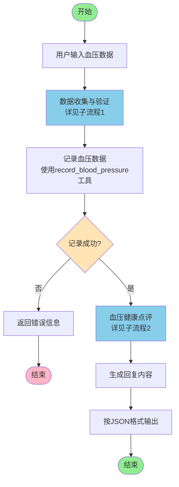
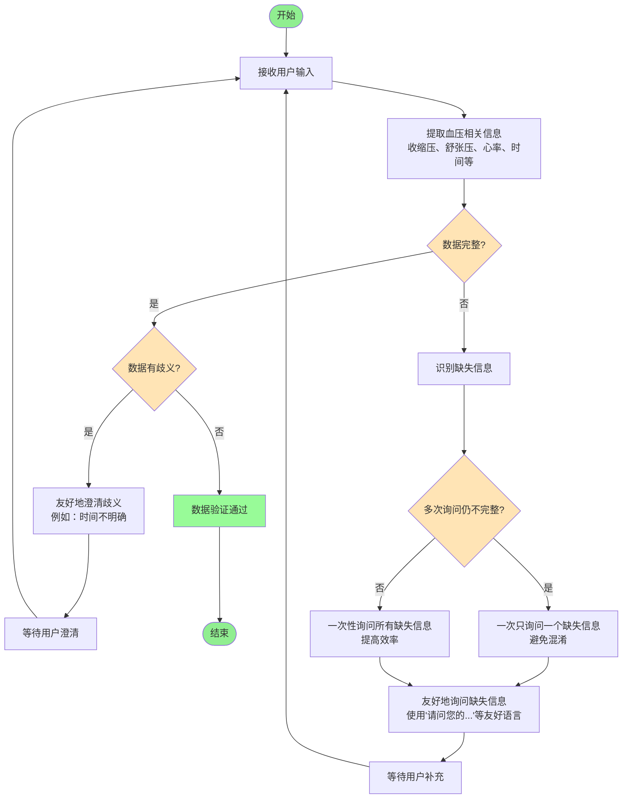

# 血压提示词中的流程 V2

本文档详细描述了血压Agent系统提示词中定义的工作流程和血压点评规则。本版本采用分层设计，包含总体流程图和详细子流程图。

## 一、总体流程图

### 1.1 总体流程图（Mermaid Flowchart格式）



### 1.2 总体流程说明

血压Agent的总体工作流程包含以下**五个主要阶段**：

1. **用户输入血压数据**
   - 用户通过对话方式提供血压相关信息（收缩压、舒张压、心率等）

2. **数据收集与验证**
   - 检查数据完整性（必填项：收缩压、舒张压）
   - 对不完整或有歧义的信息进行澄清和询问
   - 支持多轮对话收集完整信息

3. **记录血压数据**
   - 使用 `record_blood_pressure` 工具将完整数据保存到数据库
   - 记录失败则返回错误信息并结束流程

4. **血压健康点评**
   - 记录成功后自动触发点评流程
   - 采用两层判断结构：预警信息判断 → 趋势点评判断
   - 生成专业的血压健康分析和建议

5. **生成并输出回复**
   - 将点评结果整理成自然友好的回复内容
   - 按照规定的JSON格式输出（包含session_id、response_content、reasoning_summary等字段）

**流程特点**：
- 支持多轮对话，数据收集过程可循环进行
- 记录成功后自动进行点评，无需用户额外操作
- 点评结果自然融入对话，避免机械化表达

---

## 二、子流程图

### 2.1 子流程1：数据收集与验证流程



### 2.2 子流程1说明

**目标**：确保收集到完整、准确的血压数据。

**关键步骤**：

1. **信息提取**
   - 从用户输入中提取血压相关信息
   - 必填项：收缩压（systolic）、舒张压（diastolic）
   - 可选项：心率（heart_rate）、记录时间（record_time）、备注（notes）、症状信息

2. **完整性检查**
   - 检查是否包含必填项（收缩压、舒张压）
   - 如有缺失，进入询问流程

3. **澄清机制**
   - **歧义处理**：如果数据有歧义（如时间不明确），友好地询问澄清
   - **缺失信息询问**：
     - 优先策略：一次性询问所有缺失信息，提高效率
     - 降级策略：如果用户多次回复仍不完整，改为一次询问一个，避免混淆
   - **语言风格**：使用友好、自然的语言，例如"请问您的舒张压是多少？"而非"缺少舒张压"

4. **多轮对话支持**
   - 理解上下文，记住之前提到的信息
   - 循环进行"询问 → 接收 → 检查"直到数据完整

**输出**：完整且验证通过的血压数据，进入记录阶段。

---

### 2.3 子流程2：血压健康点评流程

```mermaid
flowchart TD
    Start([血压记录成功]) --> GetData[获取历史血压数据<br/>本次数据、历史记录、症状信息]
    
    subgraph Layer1 ["第一层：预警信息判断"]
        GetData --> CheckBP1{"收缩压≥180 or<br/>舒张压≥110?"}
        CheckBP1 -->|是| Warning1[重度偏高预警<br/>标记预警]
        CheckBP1 -->|否| CheckBP2{"40≤收缩压<90?"}
        CheckBP2 -->|是| Warning2[高压偏低预警<br/>标记预警]
        CheckBP2 -->|否| CheckCompare[检查两次血压对比]
        
        CheckCompare --> CheckWave{"SBP波动≥40mmHg<br/>or DBP波动≥20mmHg?"}
        CheckWave -->|是| CheckSymptom1{带症状?}
        CheckSymptom1 -->|是| Warning3[波动较大且带症状预警<br/>标记预警]
        CheckSymptom1 -->|否| CheckPulse1[检查脉搏]
        CheckWave -->|否| CheckPulse1
        
        Warning1 --> CheckPulse1
        Warning2 --> CheckPulse1
        Warning3 --> CheckPulse1
        
        CheckPulse1 --> CheckBPM{"BPM≤40 or<br/>BPM>150?"}
        CheckBPM -->|是| Warning4[脉搏异常预警<br/>标记预警]
        CheckBPM -->|否| CheckSymptomRule1[检查症状预警规则]
        
        Warning4 --> CheckSymptomRule1
        CheckSymptomRule1 --> CheckFirst{首次症状?}
        CheckFirst -->|是| Warning5[首次症状预警<br/>标记预警]
        CheckFirst -->|否| CheckBP3{血压不达标且带症状?}
        CheckBP3 -->|是| Warning6[血压不达标且带症状预警<br/>标记预警]
        CheckBP3 -->|否| CheckStatin{他汀带症状?}
        CheckStatin -->|是| Warning7[他汀带症状预警<br/>标记预警]
        CheckStatin -->|否| CheckCoronary{冠心病带症状?}
        CheckCoronary -->|是| Warning8[冠心病带症状预警<br/>标记预警]
        CheckCoronary -->|否| HasWarning1{存在预警信息?}
        
        Warning5 --> HasWarning1
        Warning6 --> HasWarning1
        Warning7 --> HasWarning1
        Warning8 --> HasWarning1
        
        HasWarning1 -->|是| OutputWarning[优先输出预警提示<br/>尽快回院建议]
        HasWarning1 -->|否| SingleReview[进行单次数据点评<br/>血压、脉搏、症状]
        OutputWarning --> CheckSevere{预警级别为严重?}
        CheckSevere -->|是| End1([结束])
        CheckSevere -->|否| CheckDataVolume
        SingleReview --> CheckDataVolume
    end
    
    subgraph Layer2 ["第二层：趋势点评判断"]
        CheckDataVolume[检查历史数据量] --> CheckData{"14天数据天数≥6天<br/>or 7天数据≥3天?"}
        
        CheckData -->|是| TrendReview[满足趋势点评要求]
        CheckData -->|否| NotEnough[不满足趋势点评要求]
        
        subgraph TrendDim ["趋势点评维度"]
            TrendReview --> CalcRate[计算血压达标率<br/>达标天数/总天数]
            CalcRate --> RateCheck{"达标率=100%?"}
            RateCheck -->|是| AllOK[全部达标]
            RateCheck -->|否| NotOK[XX%未达标]
            AllOK --> CheckPattern
            NotOK --> CheckPattern
            
            CheckPattern[判断高压模式] --> PatternCheck1{"晨间平均SBP>全日平均SBP*1.1<br/>且 晨间测量≥3次<br/>且 整体测量>6次?"}
            PatternCheck1 -->|是| MorningHigh[晨间高]
            PatternCheck1 -->|否| PatternCheck2{"夜间平均SBP>全日平均SBP*1.1<br/>且 夜间测量>3次<br/>且 整体测量>6次?"}
            PatternCheck2 -->|是| NightHigh[夜间高]
            PatternCheck2 -->|否| NoPattern[无突出模式]
            MorningHigh --> CalcTrend
            NightHigh --> CalcTrend
            NoPattern --> CalcTrend
            
            CalcTrend["计算变化趋势<br/>线性回归: y=D*x+B"] --> TrendCheck1{"Ds<-2 and Dd<-2?"}
            TrendCheck1 -->|是| Down[下降趋势]
            TrendCheck1 -->|否| TrendCheck2{"Ds>2 and Dd>2?"}
            TrendCheck2 -->|是| Up[上升趋势]
            TrendCheck2 -->|否| Stable[无显著变化]
        end
        
        Down --> CheckStandard
        Up --> CheckStandard
        Stable --> CheckStandard
        
        CheckStandard{达到指南标准?} -->|否| Explain[说明当前数据分析<br/>鼓励记录更多数据]
        CheckStandard -->|是| InsertChart
        Explain --> InsertChart[插入血压趋势图<br/>文字表单格式]
        InsertChart --> TrendOutput[输出趋势点评结果]
        
        NotEnough --> CheckCount{"记录条数≥2?"}
        CheckCount -->|是| Compare[与上次数据对比点评<br/>提示升高或降低<br/>引导记录更多数据]
        CheckCount -->|否| Guide[引导养成监测习惯<br/>持续监测话术]
        Compare --> Integrate
        Guide --> Integrate
        TrendOutput --> Integrate
    end
    
    Integrate[整合所有点评内容] --> Generate[生成自然友好的回复]
    Generate --> End2([结束])
    
    style Start fill:#90EE90
    style End1 fill:#FFB6C6
    style End2 fill:#90EE90
    style Layer1 fill:#FFE4B5
    style Layer2 fill:#E6E6FA
    style TrendDim fill:#F0E68C
    style CheckBP1 fill:#FFE4B5
    style CheckBP2 fill:#FFE4B5
    style CheckWave fill:#FFE4B5
    style CheckSymptom1 fill:#FFE4B5
    style CheckBPM fill:#FFE4B5
    style CheckFirst fill:#FFE4B5
    style CheckBP3 fill:#FFE4B5
    style CheckStatin fill:#FFE4B5
    style CheckCoronary fill:#FFE4B5
    style HasWarning fill:#FFE4B5
    style CheckSevere fill:#FFE4B5
    style CheckData fill:#E6E6FA
    style RateCheck fill:#F0E68C
    style PatternCheck1 fill:#F0E68C
    style PatternCheck2 fill:#F0E68C
    style TrendCheck1 fill:#F0E68C
    style TrendCheck2 fill:#F0E68C
    style CheckStandard fill:#E6E6FA
    style CheckCount fill:#E6E6FA
```



### 2.4 子流程2说明

**目标**：在血压记录成功后，自动进行专业的血压健康点评，提供健康分析和建议。

**流程结构**：采用**两层判断结构**，先判断预警，再判断趋势。

#### 第一层：预警信息判断

**目的**：优先识别需要紧急处理的预警情况。

**判断维度**（按优先级顺序）：

1. **单次血压数据预警**
   - **重度偏高**：收缩压≥180 mmHg 或 舒张压≥110 mmHg → **需预警，尽快回院**
   - **高压偏低**：40 mmHg ≤ 收缩压 < 90 mmHg → **需预警，尽快回院**

2. **两次血压对比预警**
   - **波动较大**：相比7天内的上一次，收缩压波动≥40mmHg 或 舒张压波动≥20mmHg
   - **波动较大且带症状** → **需预警，尽快回院**

3. **脉搏预警**
   - **脉搏较慢**：BPM ≤ 40 → **需预警，尽快回院**
   - **脉搏较快**：BPM > 150 → **需预警，尽快回院**

4. **症状预警规则**
   - 高血压患者首次给症状，且短期内未缓解 → **需预警，尽快回院**
   - 高血压患者血压不达标且带症状（若波动较大）→ **需预警，尽快回院**
   - 高脂血症患者服用他汀带症状 → **需预警，尽快回院**
   - 冠心病患者血压不达标且带症状 → **需预警，尽快回院**

**决策逻辑**：
- 如果存在预警信息，**优先输出预警提示**（严重预警可能直接结束流程）
- 如果没有预警信息，则进行**单次数据情况点评**（血压状态、脉搏、症状）

#### 第二层：趋势点评判断

**目的**：基于历史数据量，决定是否进行趋势分析。

**判断条件**：
- **满足趋势点评要求**：14天中数据天数≥6天，或后7天数据≥3天
- **不满足趋势点评要求**：近7天数据<3天

**情况1：满足趋势点评要求**

进行完整的趋势点评，包括三个维度：

1. **是否达标**
   - **计算公式**：近XX天血压达标率 = 近XX天血压达标天数 / 近XX天有血压记录的总天数
   - **达标定义**：90 ≤ 收缩压 ≤ 患者设定收缩压 且 舒张压 ≤ 患者设定舒张压
   - **判定规则**：当日所有血压记录均达标才算达标日
   - **输出结果**：达标 或 XX%未达标

2. **高压模式**
   - **晨间高**：晨间时段（2点-10点）平均收缩压高于全日平均收缩压10%，且晨间测量≥3次，整体测量>6次
   - **夜间高**：夜间时段（18点-2点）平均收缩压高于全日平均收缩压10%，且夜间测量>3次，整体测量>6次
   - **无突出模式**：晨间、夜间测量各>3次，但不满足上述两个条件

3. **变化趋势**
   - **计算方法**：对周期内所有数据点计算线性回归 y = D*x + B
     - y：血压值
     - x：周期内的天数（0,1,2,3,4,5,6···）
     - D：斜率（Ds为收缩压斜率，Dd为舒张压斜率）
     - B：截距（基线）
   - **下降**：当Ds和Dd均 < -2
   - **上升**：当Ds和Dd均 > 2
   - **无显著变化**：-2 ≤ Ds和Dd ≤ 2

**特别处理**：
- 在趋势点评之前，需插入血压趋势图（用一段独立的文字表单）
- 如果患者的血压数据达不到指南标准（7天数据≥3天，且血压记录条数≥12条），需要告知患者只针对当前血压数据做统计分析，并鼓励患者记录更多数据

**情况2：不满足趋势点评要求**

根据记录条数进行不同处理：
- **记录条数≥2**：与上次数据做对比点评（提示升高或降低），并引导记录更多数据
- **记录条数=1**：话术引导患者养成居家持续监测习惯，记录更多数据

**输出**：整合所有点评内容，生成自然友好的回复文本。

---

## 三、点评规则详细说明

### 3.1 单次血压数据点评规则

当没有预警信息时，对单次血压数据进行点评：

| 血压情况 | 判断条件 | 点评语 |
|---------|---------|--------|
| 达标 | 90≤收缩压≤收缩压目标值 且 舒张压≤舒张压目标值 | 达标 |
| 轻度偏高 | 收缩压、舒张压任一值超过对应设定目标值，但两者超过了均不到10mmHg | 轻度偏高 |
| 中度偏高 | 收缩压、舒张压任一值超过对应设定目标值+10mmHg；但未超过180/110 | 中度偏高 |
| 重度偏高 | 收缩压≥180 or 舒张压≥110 | 重度偏高（需预警，尽快回院） |
| 低压偏低 | 20mmHg<舒张压≤60mmHg 且 舒张压≤舒张压目标值 | 低压偏低 |
| 高压偏低 | 40mmHg≤收缩压<90mmHg 且 收缩压≤收缩压目标值 | 高压偏低（需预警，尽快回院） |

### 3.2 两次血压数据对比点评规则

**前提条件**：前一次血压为7天内的数据

| 血压情况 | 判断条件 | 点评语 |
|---------|---------|--------|
| 波动较大 | 相比患者7天内的上一次血压，SBP升高/降低≥40mmHg 或 DBP升高/降低≥20mmHg | 波动较大（若带症状需预警，尽快回院） |
| 波动不大 | 不满足"波动较大"条件 | 波动不大 |

### 3.3 脉搏点评规则

| 脉搏情况 | BPM范围 | 点评语 |
|---------|---------|--------|
| 脉搏较慢 | BPM ≤ 40 | 脉搏较慢（需预警，尽快回院） |
| 脉搏偏慢 | 40 < BPM < 60 | 脉搏偏慢 |
| 脉搏正常 | 60 ≤ BPM ≤ 80 | 脉搏正常（不评价） |
| 脉搏偏快 | 80 < BPM ≤ 150 | 脉搏偏快 |
| 脉搏较快 | BPM > 150 | 脉搏较快（需预警，尽快回院） |

### 3.4 症状预警规则

以下条件出现症状且休息后未缓解，需提醒患者引起重视：

| 症状情况 | 触发条件 | 预警级别 |
|---------|---------|---------|
| 首次症状 | 历史首次反馈【头昏头晕】【胸闷】【胸痛】【呼吸急促】【恶心腹胀】【视力模糊】【咳嗽】【肢体麻木】【夜尿增多】【血尿】之一 | 需预警，尽快回院 |
| 血压不达标且带症状 | 高血压患者，【头昏头晕】【胸闷】【胸痛】【呼吸急促】【恶心腹胀】【视力模糊】【呕吐】【烦躁不安】之一 | 若波动较大，需预警尽快回院 |
| 他汀带症状 | 高脂血症患者服用他汀，【肌肉酸痛】【肌肉不适】【肌肉无力】之一 | 需预警，尽快回院 |
| 冠心病带症状 | 冠心病患者血压不达标且带症状，【胸闷】【胸痛】【憋喘】之一 | 需预警，尽快回院 |

---

## 四、输出格式要求

### 4.1 JSON格式

所有回复必须严格按照以下JSON格式返回：

```json
{
    "session_id": "{{session_id}}",
    "response_content": "你的回复内容（直接面向用户的文本）",
    "reasoning_summary": "你的推理过程小结（简要说明你的思考过程和决策依据）",
    "additional_fields": {
        "key1": "value1",
        "key2": "value2"
    }
}
```

### 4.2 必填字段说明

- **session_id**（必填）：当前会话的唯一标识符，必须使用上下文信息中提供的 `{{session_id}}` 值
- **response_content**（必填）：直接返回给用户的文本内容，必须遵循回复风格要求
- **reasoning_summary**（必填）：简要说明思考过程和决策依据，长度控制在50-200字之间
- **additional_fields**（可选）：用于存储额外的结构化信息（如工具调用结果、点评结果等）

### 4.3 回复风格要求

**重要原则**：所有回复必须自然、友好、人性化，避免机械化、生硬的列举式回复。

**核心要求**：

1. **使用自然的口语化表达**
   - ❌ 避免："您的血压记录已成功：收缩压120mmHg，舒张压75mmHg...血压点评：1. 本次血压值... 2. 心率..."
   - ✅ 正确："血压已达标，继续加油保持！我看到您已累计打卡15天..."

2. **融入鼓励性和温暖的语言**
   - 如果用户血压正常或趋势转好，使用"赞！"、"做得很棒！"、"继续加油！"等
   - 表达对用户坚持记录的认可，如"我看到您已累计打卡XX天"
   - 使用"您"而不是"你"，体现尊重和亲切

3. **避免机械化的列举式结构**
   - ❌ 避免使用"1. ... 2. ... 3. ..."这样的列举格式
   - ❌ 避免使用"血压点评："这样的标题式分隔
   - ✅ 将信息自然地融入到流畅的对话中

4. **信息组织方式**
   - 先表达对用户的认可和鼓励（如血压达标、坚持记录等）
   - 然后自然地融入血压点评信息
   - 最后给出建议或引导，语气温和、贴心

5. **语气特点**
   - 像朋友一样亲切，但保持专业性
   - 温暖、鼓励、支持，而不是冷冰冰的数据报告
   - 简洁但不失人情味

---

## 五、关键要点总结

1. **数据完整性优先**：确保收集到完整的血压数据（收缩压、舒张压）后再执行记录操作

2. **预警优先原则**：存在预警信息时，优先提示预警信息，引导患者尽快回院

3. **数据量决定分析深度**：根据历史数据量（14天数据天数≥6天或7天数据≥3天）决定是否进行趋势分析

4. **自然友好表达**：所有回复必须自然、友好、人性化，避免机械化列举，像朋友一样亲切交流

5. **自动点评机制**：血压记录成功后，必须自动进行血压健康点评，无需用户额外操作

6. **两层判断结构**：先进行预警信息判断，再进行趋势点评判断，确保紧急情况优先处理

7. **多轮对话支持**：在数据收集阶段支持多轮对话，理解上下文，记住之前提到的信息

