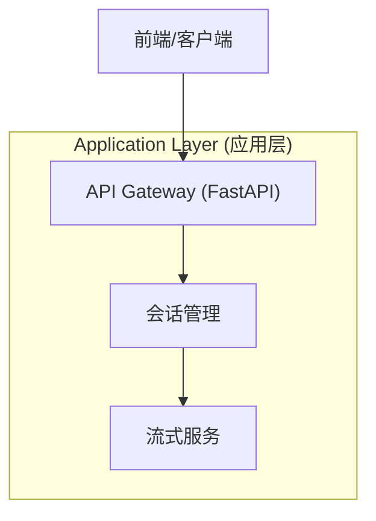
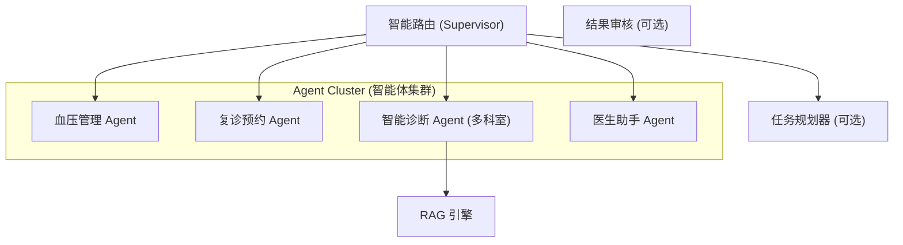
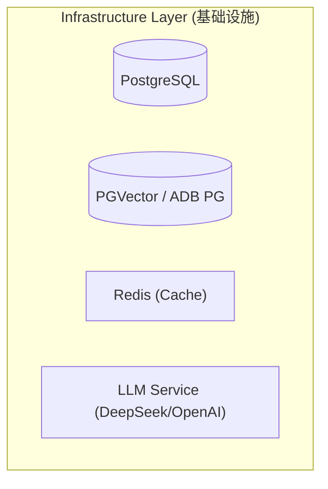

# GD25 Biz Agent Python 总体设计文档 (v0.1)

## 1. 项目背景与目标

### 1.1 背景
本项目旨在对原有 `langGraphFlow` (V2.0 Agent) 项目进行重构与升级。老项目验证了基于 LangGraph 的多智能体路由架构在医疗咨询场景（如血压记录、复诊预约、分科室诊断）的可行性，但在代码结构、扩展性、配置管理及智能化程度方面仍有提升空间。

### 1.2 目标
构建一个**高质量、可扩展、易维护**的企业级 AI Agent 平台。
- **架构升级**：采用更清晰的分层架构和模块化设计。
- **能力增强**：引入更高级的 Agent 模式（如 Plan-and-Execute）、混合检索（Hybrid Search）和增强型 Router。
- **工程化**：完善配置管理、日志监控、异步处理和流式响应（Streaming）。
- **业务覆盖**：支持血压管理、复诊预约、多科室智能诊断及医生助手等核心业务。

---

## 2. 现有系统分析 (As-Is)

### 2.1 现有架构概览
- **模式**：Hub-and-Spoke (Router -> Specialist Agents)。
- **核心组件**：
    - `Router`: 基于 LLM 的意图分类，单次决策。
    - `Agents`: 基于 ReAct 模式，硬编码 System Prompt 和 Tools。
    - `RAG`: 支持 PGVector/ADB PG，标准的 ETL 流程。
    - `State`: 简单的消息列表堆叠。

### 2.2 痛点与改进点
1.  **配置硬编码**：Agent 的 System Prompt、工具参数配置大量硬编码在 Python 文件中（如 `diagnosis/agent.py`），难以动态调整和运营配置。
2.  **路由逻辑简单**：Router 仅做单次意图分类，缺乏对复杂任务的分解（Planning）能力。若用户意图包含多个步骤（如“先查血压记录，再预约复诊”），当前架构难以处理。
3.  **Agent 能力单一**：所有科室诊断均使用同一种 ReAct 模式，对于复杂病例分析可能不够深入。
4.  **RAG 检索单一**：主要依赖向量相似度检索，对于精确匹配（如特定药品名、疾病名）效果可能不佳。
5.  **代码复用性**：多个科室 Agent 的创建代码高度重复，缺乏工厂模式或构建器模式的有效封装。

---

## 3. 总体架构设计 (To-Be)

### 3.1 核心设计原则
- **配置驱动 (Configuration Driven)**：Prompt、模型参数、工具开关均通过配置加载。
- **关注点分离 (SoC)**：路由、执行、记忆、工具严格解耦。
- **接口标准化**：定义统一的 Agent 和 Tool 接口协议。

### 3.2 系统分层架构

**图 1: 应用层架构 (Application Layer)**



**图 2: 领域层架构 (Domain Layer - LangGraph)**



**图 3: 基础设施层架构 (Infrastructure Layer)**



### 3.3 核心模块详细设计

#### 3.3.1 Router Engine (增强型路由)
不再仅仅是意图分类器，升级为 **Supervisor Agent**。
- **功能**：
    1.  **意图识别**：识别用户显式意图。
    2.  **上下文理解**：结合历史多轮对话判断隐式意图。
    3.  **任务分发**：将任务分发给指定 Agent。
    4.  **状态检查**：检查 Agent 执行结果，决定是返回用户还是继续流转。
- **实现**：使用 LangGraph 的 `StateGraph`，引入 Structured Output (Pydantic) 来规范路由决策。

#### 3.3.2 Agent System (智能体系统)
采用 **Factory Pattern** + **Configuration** 构建 Agent。
- **BaseAgent**：定义 `ainvoke`, `get_tools`, `get_prompt` 等标准接口。
- **Configuration**：
    ```yaml
    agents:
      cardiology_diagnosis:
        type: "react"
        model: "deepseek-chat"
        temperature: 0.2
        system_prompt_path: "prompts/diagnosis/cardiology.md"
        tools: ["retrieve_guidelines", "search_drug_db"]
    ```
- **Agent 类型**：
    - **ReAct Agent**: 适用于大多数需要工具调用的场景。
    - **Plan-and-Execute Agent**: 适用于复杂诊断，先生成分析步骤，再逐步执行。

#### 3.3.3 RAG System (混合检索增强)
- **Hybrid Search**: 结合 **Keyword Search (BM25)** 和 **Vector Search (Embedding)**，加权得出最终结果。
- **Rerank**: 引入 Rerank 模型（如 BGE-Reranker）对检索结果进行重排序，提高相关性。
- **Query Rewriting**: 在检索前对用户 Query 进行改写（扩充、去噪）。

#### 3.3.4 Memory & State Management
- **Short-term Memory**: 存储在 LangGraph State 中，随会话流转。
- **Long-term Memory**:
    - **PostgreSQL**: 存储结构化业务数据（血压、预约）。
    - **Vector Store**: 存储用户画像、历史病历摘要。
- **Checkpointing**: 使用 Postgres 保存每一步的状态快照，支持断点恢复和时光倒流（Time Travel）。

### 3.4 数据库设计
保持与老项目兼容，并进行规范化。

1.  **`users`**: 用户基础信息。
2.  **`blood_pressure_records`**: 血压数据。
3.  **`appointments`**: 预约记录。
4.  **`knowledge_base`**: RAG 向量表 (pgvector/adbpg)。
5.  **`chat_history`**: 对话历史持久化。
6.  **`agent_traces`**: Agent 执行链路追踪日志。

---

## 4. 接口设计 (API)

采用 RESTful 风格，核心交互接口支持 SSE (Server-Sent Events)。

### 4.1 核心接口
- `POST /api/v1/chat/send`: 发送消息（支持流式）。
    - Request: `{ "message": "...", "session_id": "...", "user_id": "..." }`
    - Response (Stream): `event: agent_thought`, `event: tool_call`, `event: final_answer`
- `GET /api/v1/history/{session_id}`: 获取历史记录。
- `POST /api/v1/feedback`: 用户反馈（点赞/点踩）。

---

## 5. 实施路线图 (Roadmap)

### Phase 1: 基础重构 (Current Focus)
- [ ] 搭建新项目脚手架 (FastAPI + LangGraph)。
- [ ] 迁移并优化 `Router` 和基础 `Agent` 逻辑。
- [ ] 实现配置化加载机制 (YAML/Env)。
- [ ] 跑通核心流程：血压记录、简单的内科诊断。

### Phase 2: 能力增强
- [ ] 引入混合检索 (Hybrid Search)。
- [ ] 实现多科室细分 Agent。
- [ ] 增加流式响应 (SSE) 支持。

### Phase 3: 高级特性
- [ ] 引入任务规划器 (Planner)。
- [ ] 完善监控与评估体系 (LangSmith/Phoenix)。
- [ ] 对接真实业务系统 API。

---

## 6. 目录结构规范

```
gd25-biz-agent-python/
├── app/                    # 应用层
│   ├── api/                # API 路由
│   ├── core/               # 核心配置、工厂
│   └── schemas/            # Pydantic 模型
├── domain/                 # 领域层
│   ├── agents/             # 各类 Agent 实现
│   │   ├── base.py
│   │   ├── factory.py
│   │   └── diagnosis/
│   ├── router/             # 路由逻辑
│   ├── tools/              # 工具集
│   └── workflows/          # LangGraph 图定义
├── infrastructure/         # 基础设施
│   ├── database/           # DB 连接、ORM
│   ├── llm/                # LLM 客户端
│   └── rag/                # RAG 引擎 (支持 Local Embedding)
├── config/                 # 配置文件
│   ├── agents.yaml
│   └── prompts/
├── tests/                  # 测试
└── docs/                   # 文档
```
