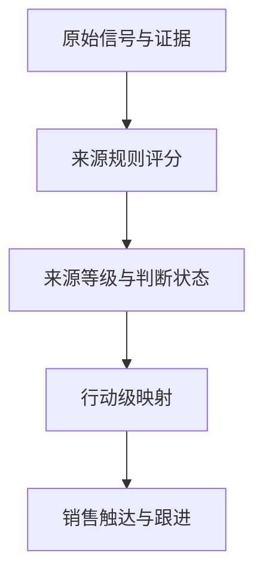
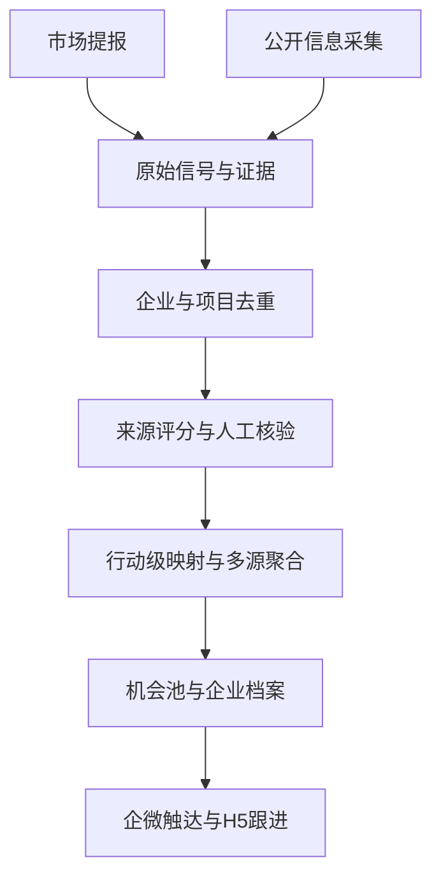
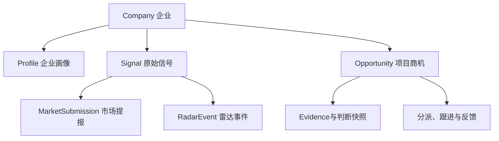
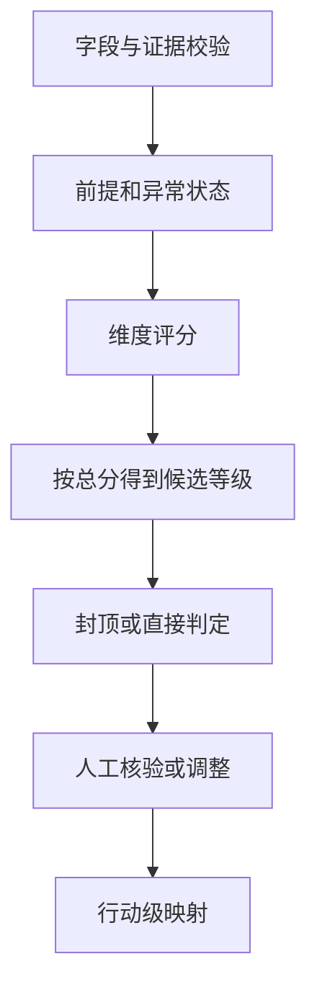
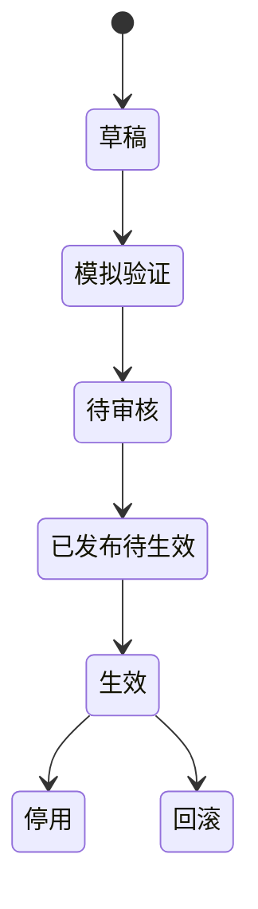

# 数字文旅商机中心产品开发需求文档 V2

> 状态：开发评审稿  
> 日期：2026-09-02  
> 适用对象：产品、设计、前端、后端、测试、数据、AI、市场、情报运营、销售及管理人员

---

## 0. 文档说明

### 0.1 文档定位

本文档用于指导“数字文旅商机中心”V1 的产品设计、研发实现、接口联调、测试验收及试运行。

产品将“市场部提报”和“客户雷达”两条业务链统一到一套企业、项目、证据、判断、销售协作和审计底座中；PC 管理端承担录入、核验和配置，移动 H5 承担销售查看与响应，企业微信承担消息触达。

### 0.2 配套文档与职责边界

本 PRD 与《数字文旅商机中心可配置规则设计v2》共同作为开发依据，二者职责如下：

| 文档 | 负责定义 | 不重复定义 |
|---|---|---|
| 本 PRD | 产品范围、角色权限、业务流程、数据对象、页面功能、状态机、接口边界、配置机制和验收标准 | 具体评分档位、分值、等级区间和映射表 |
| 《数字文旅商机中心可配置规则设计v2》 | 雷达抓取规则、企业画像、雷达 S1–S4 评分、市场 A/B/C 评分、销售行动级映射及多来源合并规则 | 页面交互、权限、接口和技术实现 |

开发、联调和测试引用业务规则时，统一采用“`规则文档 §章节号`”的索引方式。例如：`[规则文档 §4.3.2]`。

### 0.3 规则引用与优先级

1. 业务分值、权重、等级阈值、硬门槛、封顶条件和默认映射，以《数字文旅商机中心可配置规则设计v2》为准。
2. 产品流程、数据保存、权限、页面展示、接口和异常处理，以本 PRD 为准。
3. 规则文档更新后必须发布新的规则版本；不得仅修改文档或代码常量后直接覆盖线上结果。
4. 同一规则在两份文档中出现冲突时，不由开发自行选择，需提交产品和业务负责人确认后再进入开发。
5. 每个开发任务、接口用例和测试用例应同时标注 PRD 需求编号与规则章节索引。

---

## 1. 产品背景与目标

### 1.1 业务问题

产品需要同时解决：

1. 市场已接触客户的信息如何规范提报、评分、分发和沉淀；
2. 公开信息中的潜在展厅项目如何持续发现、核验和转化；
3. 两类来源如何关联到同一企业或项目，同时保留各自证据与判断；
4. 规则持续迭代时，系统如何做到可配置、可回滚、可追溯和可复现；
5. 销售如何快速理解机会、认领负责人并形成反馈闭环。

### 1.2 产品定位

“数字文旅商机中心”是企业智能展厅业务的统一机会发现、判断、分发与轻量跟进平台，位于原始线索发现和完整 CRM 之间。

- 市场提报是高可信的内部输入渠道；
- 客户雷达是外部机会发现与情报生产模块；
- 商机中心是统一业务数据真源；
- 企业微信负责触达，PC/H5 负责查看和操作。

### 1.3 V1 目标

- 市场提报与雷达事件进入统一企业和项目底座；
- 市场资料支持 AI 预填、人工确认和可配置问卷；
- 客户雷达的数据源、监测对象、抓取范围、关键词、频率和过滤条件可配置；
- 市场和雷达分别执行对应的评分规则，不合并为黑箱总分；
- 雷达 S1/S2 经人工核验后才能进入销售推送；
- 销售可在 1 分钟内理解机会并选择跟进、协作或不跟进；
- 每次判断、人工调整、合并、映射、推送和跟进均可追溯。

### 1.4 V1 范围

V1 仅覆盖企业智能展厅的新建、翻新、升级及长期展示、接待、参观空间机会。

### 1.5 V1 不包含

- 景区、文博馆和政府文旅数字化等其他业务的正式问卷与规则；
- 面向外部客户的自动消息发送；
- 完整 CRM 的报价、合同、回款、审批、销售预测和业绩归因；
- 自动生成完整方案、预算清单或投标文件；
- 未经人工审核自动学习并发布新规则；
- 任意新网站的完全无代码接入。

### 1.6 一期成功标准

| 目标 | 判断标准 |
|---|---|
| 统一入库 | 两类来源可关联到同一企业、同一项目，且不丢失原始证据。 |
| 判断准确 | 评分结果满足规则文档中的权重、阈值、门槛、封顶和异常状态要求。 |
| 信息可信 | 未核验雷达 S1/S2 不向销售发布；事实、推断、未知和冲突严格区分。 |
| 销售可用 | 核心任务“读懂并选择跟进/协作/不跟进”完成率不低于 85%。 |
| 触达有效 | “需立即跟进”机会在触发后 60 秒内完成企业微信发送。 |
| 可持续运营 | 抓取策略、问卷、评分规则、行动级映射、卡片和推送策略均支持版本化、模拟、发布、回滚和审计。 |

---

## 2. 产品原则

### 2.1 四类规则职责分离

| 判断 | 回答的问题 | 结果 | 规则索引 |
|---|---|---|---|
| 雷达抓取 | 监测谁、去哪里找、找什么、多久找一次 | 原始采集记录与证据 | [规则文档 §2] |
| 雷达项目需求判定 | 公开信息中的展厅需求证据有多强 | S1–S4或异常状态 | [规则文档 §3] |
| 市场客户判定 | 已接触项目是否优质、是否值得跟进 | A/B/C或异常状态 | [规则文档 §4] |
| 行动级映射 | 销售现在应该采取什么动作 | 四档销售行动级 | [规则文档 §5] |

企业画像只决定是否进入目标客户池，不得进入 A/B/C、S1–S4 或销售行动级的项目评分。

### 2.2 原始信号、来源判断和销售行动分离

系统必须依次保存原始输入、来源评分结果和销售行动级，不得只保存最终文案。



### 2.3 事实、推断、未知和冲突分离

| 状态 | 含义 | 处理要求 |
|---|---|---|
| `confirmed` | 有问卷确认、客户材料或可靠原文直接支撑 | 可参与评分并显示为已确认 |
| `inferred` | AI 根据有限信息推断 | 默认不得作为硬门槛成立的唯一依据，必须标记待核实 |
| `unknown` | 无法确认 | 按规则计 0 或进入待补充，不得按“否”处理 |
| `conflicted` | 多来源互相冲突 | 不自动选主值，进入人工核验 |

### 2.4 等级与分数的展示边界

- 市场人员、情报运营、管理者和管理员可查看其权限范围内的完整评分结果。
- 销售以销售行动级为主；在 H5 详情中可查看已经正式定级的来源等级、总分、分项得分、关键证据、缺失项和人工调整说明。
- 企业微信卡片默认只展示行动级、关键事实和建议动作，不展示复杂规则表达式和配置日志。
- 原始条件表达式、内部评分项编码、规则 JSON 和执行日志仅对情报运营、管理者和管理员开放。
- 待补充、待核验或已失效记录不得以正式等级形式展示或推送。

### 2.5 可解释、可配置、可复现

每次评分至少回答：使用了什么输入、各维度得多少分、命中什么评分档位、触发什么门槛或封顶、依据是什么、使用哪个规则版本、是否被人工调整。

相同输入快照、事实状态和规则版本必须产生相同系统结果。人工结果可以不同，但必须记录原因。

### 2.6 多来源并存

同一项目的市场提报、雷达事件和销售补充信息均作为独立来源保存。后到信息不得静默覆盖先到信息；各来源分别评分、分别映射，再按规则文档 §5.3 聚合项目当前行动级。

---

## 3. 用户角色与权限

### 3.1 角色定义

| 角色 | 核心任务 |
|---|---|
| 市场人员 | 提报客户、上传材料、确认 AI 预填、补充信息、查看评分和处理建议。 |
| 情报运营 | 维护目标客户池和抓取策略、核验雷达事件、处理重复与冲突、发布或撤回情报。 |
| 销售人员 | 查看被分发机会及其评分解释，选择跟进、协作或不跟进，维护轻量跟进。 |
| 销售/市场管理者 | 配置接收人池、查看全量机会、人工调整等级或行动级、改派负责人、处理异常。 |
| 系统管理员 | 管理字段、问卷、规则、映射、模板、权限、账号、审计和系统参数。 |

### 3.2 权限矩阵

| 能力 | 市场 | 情报运营 | 销售 | 管理者 | 管理员 |
|---|:---:|:---:|:---:|:---:|:---:|
| 新增/补充市场提报 | ✅ | 查看 | ─ | ✅ | ✅ |
| 核验/发布雷达情报 | ─ | ✅ | ─ | ✅ | ✅ |
| 查看正式来源等级与分项得分 | 本人提报 | ✅ | 被分发项目 | ✅ | ✅ |
| 查看规则表达式与执行日志 | ─ | 业务范围 | ─ | ✅ | ✅ |
| 跟进/协作/不跟进 | ─ | ─ | ✅ | ✅ | ✅ |
| 人工调整来源等级 | ─ | 雷达范围 | ─ | ✅ | ✅ |
| 人工调整销售行动级 | ─ | ─ | ─ | ✅ | ✅ |
| 发布配置版本 | ─ | ─ | ─ | 审核 | ✅ |
| 查看审计日志 | 本人范围 | 业务范围 | 本人范围 | 组织范围 | 全量 |

### 3.3 数据安全

- 接口采用角色与对象范围双重鉴权，不能仅依赖前端隐藏字段；
- 联系方式默认脱敏，仅主负责人和授权协作人可查看完整内容；
- 附件按企业、项目、组织和角色校验权限；
- 无权限查询不得泄露记录是否存在、数量、摘要或联系人信息；
- 规则配置中的账号、密码和令牌只保存密钥引用，不保存明文。

---

## 4. 总体架构与信息架构

### 4.1 业务架构



AI 负责字段抽取、摘要、候选判断和重复建议；规则引擎负责确定性评分；人工负责确认关键事实、雷达核验、冲突处理和必要调整。

### 4.2 PC 管理端

| 一级模块 | 核心页面 |
|---|---|
| 首页工作台 | 待补充提报、待核验事件、冲突、待分派、异常任务和销售反馈。 |
| 市场提报 | 新增提报、AI 预填确认、草稿续填、我的提报和待补充。 |
| 客户雷达 | 目标客户池、候选事件、核验工作台、已发布情报、数据源、抓取策略和执行记录。 |
| 商机中心 | 主机会池、观察池、企业动态/历史沉淀区、重复/冲突处理、企业与项目详情。 |
| 分派协作 | 接收人池、主负责人、协作人、未响应和超时处理。 |
| 配置中心 | 字段、问卷、抓取策略、评分规则、行动级映射、卡片、推送和权限。 |
| 运营分析 | 采集质量、人工改级、推送响应、转商机、规则效果和审计日志。 |

### 4.3 移动 H5

| 页面 | 核心能力 |
|---|---|
| 今日机会 | 查看当前用户被分发的需立即跟进、建议跟进和未响应机会。 |
| 观察池 | 查看持续观察机会，不产生实时打扰。 |
| 机会详情 | 查看行动建议、来源等级与评分解释、关键事实、证据、待确认项和协作状态。 |
| 我的商机 | 我负责、我协作、待跟进、持续培育和已关闭。 |
| 跟进编辑 | 跟进状态、最新结果、备注、附件、下次跟进时间和关闭原因。 |

### 4.4 企业微信

- 发送实时机会卡片和每日摘要；
- 提供到 H5 对应机会的深链；
- 同步认领、协作、不跟进、改派和超时通知；
- V1 不支持通过企业微信对话直接查询或修改业务数据。

---

## 5. 核心业务对象

### 5.1 对象关系



### 5.2 核心实体

| 实体 | 关键字段 |
|---|---|
| `Company` | id、标准名称、别名、统一信用代码、官网域名、行业、地区、企业属性、监测状态。 |
| `Profile` | company_id、五维得分、总分、画像等级、入池结论、证据、规则版本、人工确认状态。 |
| `Signal` | id、company_id、source_channel、source_record_id、发生时间、创建时间、原始状态。 |
| `MarketSubmission` | signal_id、questionnaire_version_id、答案快照、提报人、附件、待补充字段。 |
| `RadarEvent` | signal_id、crawl_execution_id、策略版本、事件标签、AI 抽取结果、人工核验结果、有效性状态。 |
| `Evidence` | id、关联对象、来源、URL/附件、日期、摘录、事实状态、可信说明。 |
| `Opportunity` | id、company_id、项目名、地点、时间窗口、current_action_level、状态、主负责人、来源集合。 |
| `SourceDecisionSnapshot` | 对象 ID、来源类型、输入与证据快照、总分、分项得分、命中评分档、门槛/封顶、系统等级、最终等级、判断状态、规则版本、人工调整及原因。 |
| `ActionMappingSnapshot` | 对象 ID、各来源最终等级、各来源映射结果、项目聚合行动级、映射版本、人工调整及原因。 |
| `Assignment` | opportunity_id、primary_owner_id、collaborator_ids、分派来源、版本。 |
| `FollowUp` | opportunity_id、操作者、状态、结果、备注、下次跟进时间、关闭原因。 |
| `RulePackageVersion` | 规则类型、版本号、适用范围、维度、评分项、阈值、门槛、状态、生效时间。 |
| `CrawlPolicyVersion` | 数据源、监测对象、范围、触发条件、频率、限制、提取、去重、异常策略和版本。 |

### 5.3 关键枚举

| 类型 | 值 |
|---|---|
| `source_channel` | `market`、`radar`、`combined` |
| `fact_status` | `confirmed`、`inferred`、`unknown`、`conflicted` |
| `decision_status` | `pending_supplement`、`pending_verification`、`valid`、`out_of_scope`、`expired` |
| `verification_status` | `unverified`、`pending`、`verified`、`rejected` |
| `action_level` | `immediate`、`recommended`、`nurture`、`archive` |
| `recipient_response` | `pending`、`follow`、`collaborate`、`decline` |
| `opportunity_status` | `pending_assignment`、`following`、`nurturing`、`suspended`、`closed` |
| `config_status` | `draft`、`simulating`、`pending_review`、`scheduled`、`active`、`retired`、`rolled_back` |

`A/B/C` 和 `S1–S4` 使用可配置的 `source_level_code` 保存，不在数据库枚举和前端逻辑中写死。

### 5.4 判断快照最小结构

```json
{
  "source_type": "market | radar",
  "rule_version_id": "string",
  "input_snapshot_id": "string",
  "decision_status": "valid",
  "total_score": 0,
  "dimension_scores": [
    {"dimension_code": "string", "score": 0, "max_score": 0}
  ],
  "matched_item_codes": ["string"],
  "gate_results": [
    {"gate_code": "string", "result": true, "effect": "allow | cap | override | invalid"}
  ],
  "system_level": "string | null",
  "final_level": "string | null",
  "missing_fields": ["string"],
  "conflict_fields": ["string"],
  "evidence_ids": ["string"],
  "manual_adjustment": null
}
```

字段名可按技术规范调整，但语义不得缺失。

---

## 6. 核心业务流程

### 6.1 市场提报链路

1. 市场人员选择当前有效问卷，系统立即创建草稿和原始信号。
2. 用户上传材料或直接填写；AI 返回候选字段、来源片段、置信度和缺失项。
3. 用户确认或修正 AI 结果；冲突字段不得自动覆盖。
4. 系统执行企业和项目两级去重。
5. 用户提交后，按规则文档 §4.1 检查定级前提和异常状态。
6. 满足评分条件时，按规则文档 §4.2–§4.4 计算分项得分、总分和 A/B/C。
7. 系统保存判断快照；人工调整按规则文档 §4.6 记录系统值、人工值和原因。
8. 有效等级按规则文档 §5.2 映射销售行动级；待补充、待核验和已失效不推送。

### 6.2 客户雷达链路

1. 系统按当前有效抓取策略执行采集，保存原始正文、URL、日期、快照哈希、策略版本和任务 ID。
2. AI 执行主体识别、事实抽取、事件标签建议和重复候选识别。
3. 按规则文档 §3.2 执行展厅相关准入、主体/原文校验和有效性判断。
4. 满足评分条件时，按规则文档 §3.3–§3.5 计算分项得分、总分和 S1–S4候选等级。
5. 事件标签按规则文档 §3.6 保存，仅用于检索、解释和运营，不直接加分或定级。
6. 情报运营按规则文档 §3.7 核验主体、展厅对象、需求事实、证据、时效和重复关系。
7. S1/S2只有人工确认后才可映射行动级和推送；S3进入观察池；S4或已失效仅沉淀。

### 6.3 跨渠道合并

| 场景 | 处理 |
|---|---|
| 市场提报先到、雷达后到 | 雷达事件作为新来源关联现有项目，不覆盖市场判断。 |
| 雷达先到、市场后到 | 市场提报补充内部事实与联系人，关联同一项目。 |
| 同企业不同项目 | 保留多个项目，不因企业相同自动合并。 |
| 同项目多篇报道 | 合并事件，保留全部证据来源。 |
| 字段冲突 | 标记 `conflicted`，保留多值，由人工确认主值。 |

各来源分别评分、分别映射；项目当前行动级按规则文档 §5.3 聚合，来源冲突必须生成待核实提示。

### 6.4 雷达情报转商机

- 点击“跟进”且尚无正式商机：原子创建商机并将操作者设为主负责人；
- 已有关联商机：关联现有商机并提示当前负责人；
- 点击“协作跟进”：加入协作关系或协作意向；
- 点击“不跟进”：记录原因，该用户不再收到该机会催办；
- PC 手工转商机必须选择或新建项目、填写理由并保存审计。

---

## 7. 规则执行与入库机制

### 7.1 统一处理层级

1. 原始信号/雷达事件留存；
2. 企业和项目去重关联；
3. 来源侧准入、评分和定级；
4. 人工核验或人工调整；
5. 销售行动级映射与多来源聚合；
6. 进入主机会池、观察池或历史沉淀区；
7. 企业微信触达与销售跟进。

“已保存”不等于“已形成销售商机”。即使无法定级，原始输入仍需保留。

### 7.2 规则执行顺序



执行要求：

- `out_of_scope` 或 `expired` 直接结束本次评分并保留原因；
- `pending_supplement` 或 `pending_verification` 不生成正式等级和可推送行动级；
- 同一评分项若规则要求“选择最符合的一档”，只能命中一个最高档位；
- 总分必须等于各维度得分之和，且不得超过 100；
- 候选等级先按总分区间产生，再应用规则文档规定的等级前提、封顶或直接判定；
- 人工核验和人工调整不覆盖系统结果，只生成最终结果字段；
- 行动级映射只能读取最终来源等级，不得重新读取原始字段评分。

### 7.3 V1 规则索引

| 规则域 | PRD 实现要求 | 业务规则索引 |
|---|---|---|
| 抓取配置 | 配置 Schema、版本、执行、快照、去重、异常与审计 | [规则文档 §2.1–§2.3] |
| 企业画像 | 五维评分、等级、入池建议和人工确认 | [规则文档 §2.4] |
| 雷达准入 | 展厅相关性、主体/原文、时效及等级前提 | [规则文档 §3.2] |
| 雷达评分 | 85+15 两维评分和单档命中 | [规则文档 §3.3–§3.4] |
| 雷达定级 | S1–S4分数区间、事件标签和人工核验 | [规则文档 §3.5–§3.7] |
| 市场准入 | 核心缺失、冲突、直接 C、A 类前提和竞品封顶 | [规则文档 §4.1] |
| 市场评分 | 35+30+20+15 四维评分 | [规则文档 §4.2–§4.3] |
| 市场定级 | A/B/C区间、异常状态、重评与展示 | [规则文档 §4.4–§4.6] |
| 行动级 | 四档定义、默认映射、多源聚合与人工调整 | [规则文档 §5.1–§5.4] |

### 7.4 V1 默认映射

本表仅方便联调和验收，业务定义以规则文档 §5.2 为准。

| 来源与等级 | 销售行动级 | 默认去向 |
|---|---|---|
| 市场 A | 需立即跟进 | 主机会池，实时企微推送 |
| 市场 B | 建议跟进 | 主机会池，定期/每日摘要推送 |
| 市场 C | 仅沉淀 | 客户档案或历史沉淀区 |
| 雷达 S1 | 需立即跟进 | 人工核验后进入主机会池并实时推送 |
| 雷达 S2 | 建议跟进 | 人工核验后进入主机会池并定期推送 |
| 雷达 S3 | 持续观察 | 观察池，不主动打扰销售 |
| 雷达 S4 | 仅沉淀 | 展厅需求线索或历史沉淀区 |

### 7.5 最低保存标准

| 层级 | 最低条件 |
|---|---|
| 草稿 | 保存原始输入，企业主体可暂未确认。 |
| 原始信号/雷达事件 | 保存来源、时间和原始内容。 |
| 待补充/待核验 | 保存缺失项、冲突项、证据和处理人。 |
| 已定级来源 | 保存规则版本、分项得分、总分、门槛结果、等级和判断快照。 |
| 正式项目商机 | 市场有效 A/B，或雷达有效 S1/S2经人工核验后由销售/运营转化。 |

### 7.6 排序规则

列表默认按以下顺序排序：

1. 销售行动级；
2. 同行动级内含市场确认来源优先；
3. 多来源交叉验证优先；
4. 明确截止时间更近者优先；
5. 证据更完整者优先；
6. 最近更新时间更近者优先。

排序只改变展示顺序，不改变来源等级或销售行动级。

---

## 8. 功能需求

### 8.1 FR-01 PC 首页工作台

展示待补充市场提报、待核验雷达事件、疑似重复、字段冲突、待推送、超时未响应、配置异常和最新销售反馈。所有数字均可进入对应筛选结果。

### 8.2 FR-02 市场提报与 AI 预填

- 支持结构化表单、附件上传、文本粘贴和 AI 预填；
- 问卷字段和分支采用配置，不在前端写死；
- AI 输出候选值、来源片段、置信度和缺失项，用户确认后才进入正式输入；
- 每题支持“不清楚/稍后补充”；
- 自动保存草稿并支持断点续填；
- 提交后保存问卷版本、答案快照、附件解析状态和证据引用；
- 评分页面按规则文档 §4.6 展示等级、总分、分项得分、依据、缺失项和建议动作。

### 8.3 FR-03 客户雷达与核验工作台

- 目标客户池支持导入、画像评分、人工确认、筛选、监测启停和复核；
- 数据源和抓取策略支持新增、复制、编辑、测试、审核发布、定时生效、暂停、停用、回滚和版本比较；
- 任务列表展示策略版本、计划/实际时间、抓取数、新增/重复/过滤/失败数和失败原因；
- 候选事件展示准入结果、两维得分、总分、候选等级、事件标签、证据和异常状态；
- 核验时必须确认企业主体、展厅对象、需求事实、原文、时效和重复关系；
- 支持确认、改级、驳回、合并、保存草稿、发布和撤回；
- AI 初值、系统评分和人工终值分别保存。

### 8.4 FR-04 企业与项目两级去重

企业强匹配：统一信用代码、已验证官网域名、外部联系人主体 ID。  
企业弱匹配：标准名称、别名、地区和行业组合。

项目重复候选至少比较企业、项目名、地点、空间类型、时间窗口和来源内容相似度。

- 强匹配可自动关联，但不得自动覆盖字段；
- 弱匹配必须人工确认新建、关联或合并；
- 合并保留全部来源、证据、附件、判断快照和历史操作。

### 8.5 FR-05 统一机会工作区

业务分区：

| 分区 | 默认内容 |
|---|---|
| 销售主机会池 | 市场 A/B、人工核验后的雷达 S1/S2及人工批准进入的其他机会 |
| 观察池 | 雷达 S3及人工设置为持续观察的项目 |
| 企业动态/历史沉淀区 | 市场 C、雷达 S4、已失效和不满足项目准入的一般企业动态 |
| 待处理区 | 待补充、待核验、冲突、配置异常和疑似重复记录 |

支持按企业、项目、地区、行业、来源、来源等级、行动级、判断状态、核验状态、负责人、时间窗口和更新时间筛选。

### 8.6 FR-06 企业与项目详情

- 企业详情按“摘要、画像、项目、事件、证据”组织；
- 项目详情按“行动建议、来源评分、关键事实、待确认项、证据、判断历史、分派协作、跟进历史、审计”组织；
- 同一项目的市场和雷达结果分别展示，不合并成一个来源总分；
- 同一企业的多个项目独立展示。

### 8.7 FR-07 评分结果与人工调整

- 展示系统等级、系统总分、分项得分、命中评分项、门槛/封顶、证据和规则版本；
- 待补充/待核验不显示正式等级，突出缺失或冲突项；
- 市场评分变化由有权限人员重新提交触发；雷达最终等级必须经情报运营核验；
- 人工调整来源等级必须填写原因，不直接改写分数；
- 同时保存系统等级、人工等级、操作者、时间、原因和有效期；
- 规则或关键事实变化后，已有人工调整进入待复核，不静默失效。

### 8.8 FR-08 销售行动级与多来源聚合

- 各来源使用当前有效映射版本独立转换；
- 项目当前行动级默认取多来源中优先级最高者；
- 来源冲突时保留较高行动级，并显示“来源信息冲突，需优先核实”；
- 人工调整行动级必须填写原因，可配置有效期；
- 映射缺失、来源未正式定级或雷达未核验时不得推送，进入配置异常待办。

### 8.9 FR-09 接收人池与推送配置

- 管理者可配置多个启用/停用的企业微信接收人池；
- V1 默认一个“企业展厅机会接收人池”；
- 离职、停用或无权限成员自动排除并提醒管理者；
- “需立即跟进”实时推送，“建议跟进”进入每日摘要，“持续观察”和“仅沉淀”默认不推送；
- 销售仅查看自己被分发、已认领或已协作的机会，管理者按组织权限查看。

### 8.10 FR-10 企业微信机会卡片

| 区块 | 展示内容 |
|---|---|
| 标题 | 行动级、来源、企业名称 |
| 一句话结论 | 发生了什么、为什么值得关注，建议不超过 80 字 |
| 关键事实 | 项目、地点、阶段、时间、金额或规模，最多 5 项 |
| 来源与核验 | 来源名称、日期、核验状态 |
| 待确认 | 最多 3 个真正影响判断的问题 |
| 建议动作 | 建议在何时前完成什么动作 |
| 协作状态 | 尚未跟进、主负责人和协作人数 |

企业微信卡片不展示规则表达式、评分项编码和执行日志；点击“查看并处理”进入 H5 查看完整评分解释和最新状态。

响应后优先更新原卡片状态；若企业微信能力不支持更新，则发送幂等的状态变更通知。历史卡片点击后始终进入同一业务对象的 H5 最新状态，不得用历史消息覆盖当前数据。

### 8.11 FR-11 H5 机会详情与响应

销售可查看行动级、正式来源等级、总分、分项得分、关键事实、证据、待确认项、人工调整说明和跟进历史，并可执行：跟进、协作跟进、不跟进、补充事实、上传附件和设置下次跟进时间。

### 8.12 FR-12 主负责人和协作

- 第一位成功选择“跟进”的接收人成为唯一主负责人；
- 并发认领使用原子更新或乐观锁；
- 后续人员可选择协作或申请接管；
- “不跟进”必须记录原因，该用户停止收到该机会催办；
- 管理者改派必须填写原因并通知相关人员；
- 全部人员不跟进或超时无人跟进时，升级为管理者待办。

### 8.13 FR-13 轻量跟进

V1 跟进字段包括当前状态、最新结果、备注、附件、下次跟进时间和关闭原因。跟进记录只追加，不覆盖历史。

### 8.14 FR-14 销售反馈闭环

反馈至少包括：有价值、无价值、已知信息、非我负责，以及太早、证据不足、非展厅、已跟进、已过期、重复、其他等原因。

反馈用于规则模拟和版本效果比较，不能自动修改或发布规则。

### 8.15 FR-15 异常与空状态

| 场景 | 系统处理 |
|---|---|
| 核心信息缺失 | 保存原始记录，标记待补充，不判低等级 |
| 字段或证据冲突 | 标记待核验，不自动选择主值 |
| 原文不可访问或主体不明 | 雷达进入待核验，不直接判 S4 |
| 项目结束、取消或过期 | 标记已失效，不进入推送 |
| AI 无法判断 | 返回未知，进入人工处理 |
| 疑似重复 | 展示字段对比，等待人工合并 |
| 映射缺失 | 不生成行动级，进入配置异常待办 |
| 企业微信失败 | 幂等重试并显示发送状态 |
| 并发认领冲突 | 仅一人成功，其他人看到最新负责人 |
| 权限不足 | 拒绝访问且不泄露摘要或数量 |

---

## 9. 配置治理

### 9.1 统一字段字典

每个字段至少包含字段编码、名称、类型、校验规则、枚举、是否敏感、角色可见性、是否允许 AI 填写、证据要求和启停状态。

- 字段编码发布后不可修改，只能停用或调整显示名称；
- 所有进入评分的枚举必须支持未知或空值处理；
- 新问题优先映射已有字段；无法映射时先新增扩展字段；
- 权重、评分项和问卷字段通过稳定编码关联，不依赖中文名称。

### 9.2 问卷模板

支持单选、多选、文本、数字、金额、日期、附件、必填/选填、未知答案、条件分支、题目排序、字段映射、复制、预览、模拟、发布、停用和版本比较。

V1 内置市场部企业展厅初筛问卷，具体题目和选项以当前确认的问卷模板为准；规则项与问卷字段的对应关系按规则文档 §4.3 配置，不在页面代码中写死。

### 9.3 客户雷达抓取策略

策略 Schema 必须覆盖规则文档 §2.1 的十类配置组，并按规则文档 §2.2–§2.3 内置来源优先级和默认抓取基线。

每次正式执行必须绑定唯一策略版本并保存执行快照。策略发布、停用或回滚仅影响后续任务，不自动改变历史原文、雷达事件或评分结果。

发布前必须有限范围测试，展示预计访问范围、代表样本、字段完整率、命中/排除/重复数量和失败原因。禁止配置任意代码、脚本、SQL、明文凭据、来源等级、销售行动级和推送对象。

### 9.4 企业画像规则

- 内置规则文档 §2.4 的五个维度、100 分总分、等级区间和入池建议；
- 核心/重点推荐入池，观察需人工评估，非目标不进入常规监测；
- 画像评分和项目评分使用独立规则包及快照；
- 人工可调整入池结论，但不得通过调整画像分改变项目等级。

### 9.5 来源评分规则包

市场和雷达规则包独立配置、发布和保存版本。每个规则包至少支持：

- 适用来源、业务类型和输入字段；
- 评分维度、维度满分和合计校验；
- 评分项、单档/累计方式和条件组；
- 总分区间与来源等级；
- 准入、直接判定、封顶、无效和待核验条件；
- 缺失、未知和冲突处理；
- 证据要求、解释模板和人工权限；
- 生效时间、停用时间和版本说明。

V1 内置值直接引用规则文档 §3 和 §4，不在本 PRD 重复维护。

### 9.6 销售行动级映射

每个映射项至少配置来源类型、来源等级代码、目标行动级、同级排序、生效时间和版本。映射只做等级转换，不得包含原始事实条件、分数、硬门槛或证据判断。

多来源聚合和人工调整按规则文档 §5.3–§5.4 执行。

### 9.7 卡片与推送策略

- 卡片按来源和行动级配置区块、字段、顺序和空值展示；
- 推送策略配置接收人池、发送时段、摘要时间、催办间隔、升级对象和模板版本；
- 配置系统强制阻止规则表达式、内部编码和敏感字段进入企微模板；
- 默认推送方式以规则文档 §5.1–§5.2 为准。

### 9.8 配置版本生命周期



- 已发布版本不可原地修改，只能复制为新版本；
- 同一规则类型和适用范围同一时刻只能有一个生效版本；
- 发布前必须执行结构校验、规则样本测试和历史样本模拟；
- 新版本默认只作用于新记录、重新核验和关键字段变化的记录；
- 回滚只改变后续使用版本，不删除历史版本和历史结果。

### 9.9 发布校验

规则发布必须阻止以下情况：

- 维度满分之和不等于 100；
- 单个维度实际可得分超过维度满分；
- 总分区间存在重叠、空档或越界；
- 等级前提、封顶和直接判定引用不存在的字段或选项；
- 评分项不存在稳定编码或解释文案；
- 来源等级缺少销售行动级映射；
- 规则依赖的问卷版本、字典或字段未生效；
- S1/S2发布路径未配置人工核验门槛；
- 缺少最小测试样本、审核人或变更说明。

### 9.10 历史补采、重评与重新映射

| 任务 | 执行内容 | 不应改变 |
|---|---|---|
| 雷达历史补采 | 指定策略版本、来源、对象和时间窗重新采集 | 旧原文、旧事件和历史评分快照 |
| 来源规则重评 | 指定规则版本重新评分并生成新判断快照 | 原始输入和历史判断快照 |
| 行动级重新映射 | 保持来源等级不变，仅执行新映射 | 来源评分、事实和证据 |

三类任务必须先预览影响，再二次确认。已推送、已认领或跟进中的记录发生变化时进入人工复核，不静默覆盖负责人、跟进状态和历史消息。

---

## 10. 状态机与触发规则

### 10.1 市场提报状态

```text
草稿 → 待补充 → 已提交 → 已判断 → 已转商机
  └────────────→ 已撤回/已失效
```

核心信息缺失进入待补充；关键信息冲突进入待核验；明确无需求可直接形成 C 类；项目结束、取消或明确不推进进入已失效。具体条件见规则文档 §4.1、§4.5。

### 10.2 雷达事件状态

```text
已采集 → AI已分析 → 待人工核验 → 已确认 → 已发布情报
                         ├→ 已驳回
                         ├→ 已合并
                         └→ 已失效
```

主体或原文无法确认时进入待核验，不得直接判 S4；项目过期、结束或取消时进入已失效。具体条件见规则文档 §3.2、§3.7。

### 10.3 商机状态

```text
待分派 → 跟进中 → 持续培育 → 已关闭
             ├→ 暂缓 ───────→ 跟进中
             └→ 改派 ───────→ 跟进中
```

### 10.4 重新评分触发

以下变化触发对应来源重新评分：

- 市场：需求状态、立项、预算、面积、计划完成时间、企业规模/营收、企业属性、场地、对接人层级或竞品状态变化；
- 雷达：主体、展厅对象、需求动作、项目阶段、地点、时间、原文证据或有效性变化；
- 证据从未知/推断变为确认，或出现冲突；
- 人工发起指定规则版本重评。

仅映射版本变化时不重新评分。来源等级变化后才执行行动级映射。

---

## 11. 接口与数据边界

### 11.1 建议业务接口

| 能力 | 接口职责 |
|---|---|
| 创建/更新市场提报 | 保存草稿、答案、附件、证据和问卷版本，支持幂等 |
| AI 字段预填 | 返回候选值、来源片段、置信度、缺失和冲突项 |
| 提交并评分 | 校验输入、执行规则、保存判断快照并返回可解释结果 |
| 抓取策略测试 | 限定范围试采，不写正式事件 |
| 执行雷达采集 | 保存策略版本、执行快照、原文和候选事件 |
| 雷达事件核验 | 保存系统候选、人工终值、证据和核验说明 |
| 发布/撤回情报 | 校验发布门槛并生成销售可读内容 |
| 查询企业/项目/机会 | 按权限结构化过滤、分页和排序 |
| 获取评分历史 | 返回当前及历史判断快照、人工调整和版本 |
| 跟进/协作/不跟进 | 原子处理响应、负责人和协作关系 |
| 追加跟进 | 只追加历史，不覆盖已有记录 |
| 发布配置 | 模拟、审核并切换目标配置版本 |
| 历史补采/重评/重映射 | 预览影响、确认任务、执行并保存审计 |

### 11.2 DTO 边界

| DTO | 允许返回 | 禁止返回 |
|---|---|---|
| 销售 H5 详情 | 行动级、正式来源等级、总分、分项得分、事实状态、证据摘要、缺失项、建议动作、人工调整说明 | 规则表达式、内部评分项编码、原始规则 JSON、配置日志、无权限联系人 |
| 企业微信卡片 | 行动级、来源文案、企业/项目、关键事实、待确认项、建议动作、核验状态 | 复杂评分明细、规则表达式、内部编码、敏感字段 |
| 运营/管理详情 | 完整判断快照、规则版本、命中项、门槛、证据、系统值、人工值和审计 | 超出角色数据范围的记录 |

### 11.3 幂等与并发

- 写接口支持 `request_id` 或幂等键；
- 推送以“业务对象 ID + 消息类型 + 接收人 + 模板版本”为幂等标识；
- 认领使用原子条件更新或乐观锁，保证唯一主负责人；
- 配置和商机更新使用版本号或 `updated_at` 进行并发控制。

### 11.4 业务事件

至少包含：信号创建、策略发布/暂停、采集任务开始/完成/失败、来源评分完成、人工核验完成、来源等级调整、行动级映射/变化、情报发布/撤回、推送成功/失败、接收人响应、负责人变化、跟进追加、配置发布、历史重评和重映射完成。

事件至少携带对象 ID、对象版本、变更类型、操作者和时间。客户端发现版本落后时必须拉取最新详情。

---

## 12. AI 能力边界

### 12.1 AI 可以做

- 从市场材料中抽取问卷候选字段和来源片段；
- 从公开信息中识别主体、动作、空间类型、地点、时间和事件标签；
- 生成重复候选、摘要、待确认问题和销售可读结论草稿；
- 根据规则 Schema 返回结构化候选输入；
- 对规则执行结果生成自然语言解释，但不得改变分数。

### 12.2 AI 不得做

- 绕过确定性规则直接给出最终分数或等级；
- 绕过人工核验发布雷达 S1/S2情报；
- 无证据编造主体、预算、联系人、金额、时间和采购结论；
- 静默覆盖人工确认字段；
- 根据销售反馈自动修改或发布规则。

---

## 13. 非功能要求

### 13.1 性能与可用性

- PC/H5 首屏主要内容 2 秒内可用；
- 常规查询 5 秒内返回，详情主要信息 3 秒内返回；
- “需立即跟进”消息在触发后 60 秒内完成发送；
- 核心写入、采集、评分和推送支持失败重试且不重复。

### 13.2 安全

- 所有输入执行类型、长度、文件类型和业务 Schema 校验；
- 外部原文、AI 摘要和用户备注按不可信内容处理并防止 XSS；
- 查询先鉴权和数据范围过滤，再执行检索；
- 对外采集设置合理访问频率；
- 凭据使用密钥服务，不写入代码、规则配置或日志。

### 13.3 审计

采集、解析、评分、核验、人工调整、发布、撤回、合并、拆分、分派、改派、推送、配置发布、回滚、历史补采、重评和重新映射均记录操作者、时间、对象、前后值、原因和版本。

### 13.4 可观测性

按数据源、策略版本和规则版本监控采集成功率、字段完整率、有效事件率、重复率、人工驳回率、人工改级率、评分分布、待补充率、待核验率、推送成功率、响应率、转商机率和接口耗时。

### 13.5 可访问性与移动体验

- 关键文字和背景对比度达到 WCAG AA；
- 按钮触控区域不小于 44px；
- 状态不可只依赖颜色表达；
- H5 核心任务在常见手机尺寸下无需横向滚动。

---

## 14. 质量指标

| 指标 | V1 建议目标 |
|---|---:|
| 采集任务成功率 | ≥95% |
| 采集原文关键字段完整率 | ≥95% |
| 已发布情报证据完整率 | ≥98% |
| 同一项目重复展示率 | ≤10% |
| 雷达 S1候选事件当日核验率 | ≥95% |
| 企业微信消息发送成功率 | ≥99%（不含平台不可用） |
| 规则结果可复现率 | 100% |
| 已定级记录判断快照完整率 | 100% |
| 核心任务可用性完成率 | ≥85% |

---

## 15. 验收标准

### 15.1 市场提报与评分

1. 可选择有效问卷完成提报，AI 预填未经确认不进入正式评分输入。
2. 条件分支、未知答案、草稿和断点续填可用。
3. 核心信息缺失或两个及以上关键维度无法评分时进入待补充/待核验，不自动判 C。
4. 明确无新建或翻新计划时按规则文档 §4.1 直接判 C。
5. 市场评分严格按规则文档 §4.2–§4.4 的四维权重、分项档位和等级区间执行。
6. A 类前提、竞品封顶、信息冲突和已失效处理符合规则文档 §4.1、§4.5。
7. 评分结果展示符合规则文档 §4.6，并能回查证据和规则版本。

### 15.2 雷达采集、评分与核验

8. 抓取策略可配置规则文档 §2.1 所列配置组，并符合 §2.2–§2.3 的默认基线。
9. 企业画像按规则文档 §2.4 的五维权重、总分区间和入池规则执行。
10. 雷达事件未明确关联展厅或长期展示空间时，不进入 S1–S4。
11. 主体或原文无法确认时进入待核验，不直接判 S4。
12. 雷达评分严格按规则文档 §3.3–§3.5 的两维权重、单档命中、等级区间和封顶要求执行；S1必须有明确项目动作，S2必须有明确项目需求，仅有潜在信号时最高为 S3。
13. 事件子类仅作为标签，不单独计分或直接决定等级。
14. 项目结束、取消或超过有效窗口时标记已失效，不推送。
15. S1/S2未经人工核验不能生成销售推送。

### 15.3 规则引擎与版本

16. 相同输入快照、事实状态和规则版本产生相同系统分数与等级。
17. 总分等于分项得分之和，且维度上限和总分上限均不可突破。
18. 规则执行顺序符合“校验→前提/异常→评分→区间→封顶/直接判定→人工→映射”。
19. 人工调整不覆盖系统分数和系统等级，必须填写原因并保留历史。
20. 规则发布可阻止权重错误、区间冲突、字段缺失和映射缺失。
21. 已发布版本不可原地修改，新版本发布不静默改写历史结果。
22. 历史补采、来源重评和行动级重新映射为三个独立任务，均支持影响预览和二次确认。

### 15.4 行动级与多来源合并

23. 默认映射符合规则文档 §5.2：A/S1→需立即跟进，B/S2→建议跟进，S3→持续观察，C/S4→仅沉淀。
24. 待补充、待核验、已失效或未核验雷达事件不生成可推送行动级。
25. 多来源分别保留等级、分数、证据和映射快照，项目行动级取最高结果。
26. 市场与雷达信息冲突时保留较高行动级，并明确提示销售优先核实。
27. 人工行动级调整保存系统建议、人工结果、原因、操作者和时间。

### 15.5 销售触达与协作

28. “需立即跟进”实时推送，“建议跟进”进入定期摘要，“持续观察”和“仅沉淀”不产生实时消息。
29. 企微卡片点击后进入同一业务对象的 H5 最新状态。
30. 销售 H5 可查看正式来源等级、总分、分项得分、证据和缺失项，但不可查看规则表达式和配置日志。
31. 第一位成功选择跟进者成为唯一主负责人；并发认领只有一人成功。
32. 协作人不能覆盖主负责人；不跟进原因、改派和跟进记录均可追溯。
33. 企业微信发送失败可幂等重试且不产生重复消息。

### 15.6 权限与异常

34. 无权限用户无法读取联系人、附件、规则配置或其他组织数据。
35. 原文失效、AI 失败、重复、冲突、映射缺失、并发更新均有可理解的状态和恢复入口。
36. 所有关键配置和业务操作均有完整审计记录。

### 15.7 测试要求

- 单元测试覆盖每一个评分档位、分数边界、前提、直接判定、封顶、未知、冲突和已失效分支；
- 规则测试用例须逐条标注对应的规则文档章节；
- 集成测试覆盖问卷版本、策略版本、规则版本、人工核验、映射、推送和历史重评；
- E2E 覆盖市场正常链路、市场待补充链路、雷达采集核验链路、多来源冲突和并发认领；
- 整体自动化测试覆盖率不低于 80%；
- 使用 5–8 名目标用户进行可用性测试，核心任务完成率不低于 85%。

---

## 16. V1 优先级与后续规划

### 16.1 P0 / V1 必须实现

- PC 市场提报、AI 预填、问卷版本、草稿和评分结果页；
- 雷达目标池、企业画像、数据源、抓取策略、执行记录、事件采集、AI 抽取、人工核验和情报发布；
- 企业、项目、信号、事件、证据、判断快照和商机统一底座；
- 企业与项目两级去重、跨渠道关联和冲突处理；
- 两类来源评分规则、销售行动级映射、多来源聚合和人工调整；
- 字段、问卷、抓取策略、规则、映射、卡片和推送的版本配置；
- 企业微信分层推送、接收人池、唯一主负责人和多人协作；
- H5 机会查看、跟进/协作/不跟进和轻量跟进；
- 权限、脱敏、审计、异常重试和基础运营指标。

### 16.2 后续版本

- 更丰富的自动采集来源和雷达质量看板；
- 企业微信对话查询与轻量更新；
- CRM 双向同步；
- 关系资源图谱、案例匹配和销售建议；
- 方案生成和复杂协同任务；
- 基于真实转化数据的规则优化建议，仍需人工审核发布。

---

## 附录 A：开发规则索引速查

| 开发对象 | 必看规则章节 |
|---|---|
| 目标客户池与企业画像 | §2.4.1–§2.4.3 |
| 数据源与抓取策略 | §2.1–§2.3 |
| 雷达评分服务 | §3.2–§3.5 |
| 雷达标签与核验页 | §3.6–§3.7 |
| 市场评分服务 | §4.1–§4.5 |
| 市场评分结果页 | §4.6 |
| 行动级映射服务 | §5.1–§5.2 |
| 多来源聚合 | §5.3 |
| 人工调整与规则变更 | §5.4 |

> 上述章节均指《数字文旅商机中心可配置规则设计v2》；规则数值不在本 PRD 中二次维护。

## 附录 B：销售机会卡片示例

```text
【需立即跟进｜公开信息发现】XX股份

一句话结论
企业已正式立项建设展示中心，尚未确定设计或实施单位。

关键事实
• 项目：企业展示中心（已确认）
• 地点：杭州（已确认）
• 阶段：已立项（已确认）
• 计划时间：2027年Q1（已确认）
• 预算：待确认

来源与依据
企业官网公告｜2026-08-25发布｜情报运营已核验

待确认
预算区间、决策部门、供应商征集时间

建议动作
建议当天确认客户触达入口和方案介入节点。

当前状态：尚未跟进
[查看并处理]
```

## 附录 C：配置发布检查清单

- [ ] 本次发布引用的规则文档名称和版本已确认。
- [ ] 问卷字段、选项、未知值和评分项映射已验证。
- [ ] 各维度满分之和等于 100，所有评分项未超过维度上限。
- [ ] 等级区间无重叠、无空档，边界值测试通过。
- [ ] 前提、封顶、直接判定、待补充、待核验和已失效分支均有测试样本。
- [ ] 雷达评分项的单档命中逻辑已验证。
- [ ] 事件标签未被用于直接加分或定级。
- [ ] 来源等级与行动级映射完整，B 类映射为“建议跟进”。
- [ ] 多来源最高行动级与冲突提示已验证。
- [ ] 每次评分均能保存输入、分项、总分、门槛、证据和规则版本。
- [ ] 人工调整不会覆盖系统结果，且原因必填。
- [ ] 销售 H5、企微卡片和运营后台的字段权限已验证。
- [ ] 历史样本模拟、新旧差异、审核人、生效时间和回滚版本已填写。
