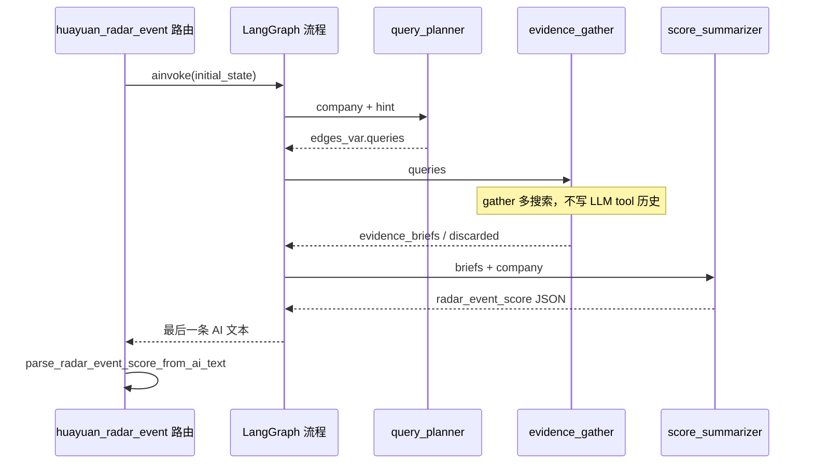

# 展厅发觉 Agent 技术设计

> 关联：`方案思考.md`、`千问的工具建议.md`  
> 现状流程：`config/flows/huayuan_radar_event_agent/`  
> 对外接口：`POST /api/v1/huayuan/radar-event-score`  
> 日期：2026-09-10

## 1. 背景与目标

### 1.1 背景

当前 `huayuan_radar_event_agent` 为**单节点 ReAct**：同一 Agent 在一轮对话里完成「发散检索 → 抽取验证 → 两维打分」，仅挂载 AnySearch。实践中出现：

- AnySearch 中文招采/公告召回一般
- 规划 / 取证 / 评分耦合，易早停或漏意图
- 多轮 tool 原文堆积在同一 `messages`，终评上下文膨胀

### 1.2 目标

1. 拆成**三节点流水线**：查询规划 → 证据采集（节点内并行搜索）→ 终评汇总  
2. 引入多搜索源（博查为主，AnySearch 为补；深读工具可选）  
3. **对外 API 契约尽量不变**（仍返回 `radar_event_score`）  
4. **不改造** `GraphBuilder` 的图级 `Send`/map-reduce（并行放在采集节点内部）

### 1.3 非目标（本期不做）

- 通用 YAML `map`/`parallel` 节点类型  
- 改评分枚举或增加「隐性需求」新档位（除非产品另立需求）  
- 替换整站 Flow 引擎或迁移 Session 模型  

---

## 2. 总体架构

### 2.1 目标拓扑

```text
entry: query_planner
         │  edges_var.queries[3..5]
         ▼
      evidence_gather   ← function：asyncio.gather 多 query×多工具
         │  edges_var.evidence_briefs[] / discarded[]
         ▼
      score_summarizer  ← agent：无工具，只读 briefs
         │  最后一条 AI = radar_event_score JSON
         ▼
        END
```

图仍是 **A → B → C 串行**（现有 `GraphBuilder` 已支持）。所谓「并行」仅发生在 `evidence_gather` **节点函数内部**对多个 HTTP 搜索的并发，不扇出子图。

### 2.2 与现状对比

| 项 | 现状 | 目标 |
|----|------|------|
| 节点 | 1× `agent` ReAct | 1× `agent` + 1× `function` + 1× `agent` |
| 工具 | AnySearch search/extract | 博查 + AnySearch（+ 可选深读） |
| 查询词 | Prompt 内阶段 A/B/C 隐式展开 | Planner 显式输出 3～5 条 |
| 证据传递 | Tool message 留在同一对话 | 压成 `evidence_briefs` 经 `edges_var` |
| 终评输入 | 含大量工具原文 | 仅 briefs + 公司信息 |

### 2.3 上下文膨胀如何避免

| 环节 | 策略 |
|------|------|
| `evidence_gather` | 用 **function 节点**调搜索 API，结果**不**以 tool message 进入 LLM 对话 |
| 原始结果 | 内存内过滤、去重、截断后丢弃或只打日志/Langfuse |
| 传给终评 | 仅 `evidence_briefs`（条数上限 + 单条字数上限） |
| `query_planner` | 默认无工具或最多 1～2 次广搜；输出只保留 query 列表 |
| `score_summarizer` | **禁止挂工具**，输入 = company + briefs + discarded 摘要 |

---

## 3. 节点设计

### 3.1 `query_planner`（agent）

**职责**：根据公司信息做语义发散，产出 3～5 条**单意图**检索式。

**输入（prompt_vars）**：沿用现有 `company_json`、`time_from`/`time_to`、`query_hint`、`current_date`。

**输出（写入 `edges_var`）**：

```json
{
  "queries": [
    "\"某某股份\" 展厅",
    "\"某某股份\" 展示中心 招标",
    "\"某某股份\" 企业文化中心"
  ],
  "planner_notes": "可选：别名/歧义说明，短文本"
}
```

**约束**：

- 公司名加英文双引号；一条 query 一个意图；禁止长布尔 OR  
- **不打分、不输出** `radar_event_score`  
- 节点结束后路由以 `edges_var` 为准；该节点 AI 文本可被下游忽略

### 3.2 `evidence_gather`（function，推荐）

**职责**：按 `queries` 并发调用搜索（及必要时 extract），产出结构化 briefs。

**伪逻辑**：

```text
1. 读 edges_var.queries
2. 为每条 query 选择工具组合（默认：博查 + AnySearch；摘要不足再深读）
3. asyncio.gather 执行（受全局/分工具配额限制）
4. 规范化 → 过滤无效页 → URL 去重
5. 写成 evidence_briefs[] / discarded[]
6. 可选：对「模糊但可能可评分」的 Top-N URL 再并发 extract，更新 quote
```

**`evidence_briefs` 单条字段**：

| 字段 | 说明 |
|------|------|
| `title` | 标题 |
| `url` | http(s) |
| `summary` | ≤200 字摘要 |
| `quote` | 可选，≤200 字原文摘录 |
| `why_evidential` | 为何可作证据（一句话） |
| `tool_name` | 来源工具 |
| `publish_date` | 可选 |
| `source_host` | 可由 URL 解析 |
| `query` | 命中该条的检索式 |

**配额**：沿用并扩展 `HuayuanRadarEventContext`（见 §5），超限跳过后续调用并记 reason。

### 3.3 `score_summarizer`（agent，无工具）

**职责**：只根据 briefs 做准入与两维打分，输出与现网一致的 JSON。

**评分规则**：复用现 `radar_event_react.md` 中的准入、排除项、分值枚举（可拆文件为 `radar_event_score.md`，逻辑不放宽）。

**输出**：当前 API 可解析的单个 JSON（`exhibition_related`、`evidence_score`、`specificity_score`、`evidences`、`discarded` 等）。

**路由注意**：`extract_last_ai_text` 取**图执行结束后**最后一条 AI。须保证 summarizer 是最后一个写 AI 消息的节点；planner 若也写 AI，需确认 `flow_msgs`/`add_messages` 顺序下 summarizer 在后（三节点串行即可）。

---

## 4. 工具方案

对齐 `千问的工具建议.md`，分期引入：

| 优先级 | 工具 | 用途 |
|--------|------|------|
| P0 | `bocha_web_search`（新建） | 中文主搜 |
| P0 | `anysearch_web_search` / `anysearch_extract`（已有） | 补源 + 正文 |
| P1 | Tavily 或 Firecrawl | 深读 / 动态页 |
| P2 | 巨潮等公告专项 | 招采召回 |

密钥与配置：环境变量（如 `BOCHA_API_KEY`），模式对齐 `ANYSEARCH_API_KEY`；无密钥时该工具降级跳过并记 discarded reason，避免整请求失败。

---

## 5. 运行时与数据流



**状态传递**：中间产物优先走 `edges_var`；`prompt_vars` 在 summarizer 侧注入序列化后的 briefs（或在 agent_creator 侧从 `edges_var` 合并进占位符，实现时二选一，需统一约定）。

---

## 6. 影响范围

### 6.1 影响矩阵

| 范围 | 是否影响 | 说明 |
|------|----------|------|
| 对外 HTTP 路径 / 方法 | **否**（默认） | 仍为 `POST /api/v1/huayuan/radar-event-score` |
| 响应主结构 `radar_event_score` | **否**（默认） | Schema 字段与合法分值保持兼容 |
| 请求体 | **可选扩展** | 可增加分工具限额字段；缺省兼容旧客户端 |
| Flow 配置 | **是** | `huayuan_radar_event_agent` 重写为三节点 |
| Prompt | **是** | 拆成 planner / summarizer；旧单文件可归档 |
| 工具层 | **是** | 新增博查等；AnySearch 保留 |
| 请求级 Context | **是** | 配额、计数按工具维度扩展 |
| `GraphBuilder` / 通用 Flow 引擎 | **否**（本期） | 不做图级 Send |
| 其他 Flow（医疗、画像、chat） | **否** | 不共用本 flow |
| Session / DB | **否** | 本接口无 Session |
| 部署环境变量 | **是** | 新增搜索 API Key |
| 成本与时延 | **是** | 并发搜提高 QPS；终评 token 应下降 |
| 可观测性 | **是** | Langfuse 按节点打 tag |

### 6.2 预期改动文件清单

**必改 / 新增**

| 路径 | 变更类型 | 内容 |
|------|----------|------|
| `config/flows/huayuan_radar_event_agent/flow.yaml` | 改 | 三节点 + edges |
| `config/flows/huayuan_radar_event_agent/prompts/query_planner.md` | 新 | 规划提示词 |
| `config/flows/huayuan_radar_event_agent/prompts/radar_event_score.md` | 新 | 终评提示词（自现 react 拆出） |
| `config/flows/huayuan_radar_event_agent/prompts/radar_event_react.md` | 归档或删 | 旧单体 prompt |
| `backend/domain/tools/bocha_tool.py`（名可调整） | 新 | 博查封装 + `@register_tool` |
| `backend/domain/tools/__init__.py` | 改 | `init_tools` 导入新工具 |
| `backend/domain/flows/implementations/` 下 gather 实现 | 新 | `evidence_gather` function 节点 |
| `backend/domain/tools/huayuan_radar_event_context.py` | 改 | 分工具计数 / 限额 / 协程安全 |
| `backend/app/api/routes/huayuan_radar_event.py` | 小改 | `prompt_vars` 注入；必要时改为读 `edges_var` 终评结果；Langfuse tags |
| `cursor_test/test_huayuan_radar_event.py` | 改/扩 | 中间态解析、配额、回归契约 |
| `华院Agent设计/04-展厅需求评分Agent调用说明.md` | 改 | 文档同步内部流程说明 |

**视实现可选**

| 路径 | 说明 |
|------|------|
| `backend/app/api/schemas/huayuan_radar_event.py` | 新增可选限额字段时 |
| `backend/domain/state.py` | 仅当要把 briefs 提升为一级 State 字段时（默认用 `edges_var` 可不动） |
| `.env.example` / 部署配置 | 文档化 `BOCHA_API_KEY` 等 |
| Tavily/Firecrawl 工具模块 | P1 |

**明确不改（本期）**

| 路径 | 原因 |
|------|------|
| `backend/domain/flows/builder.py` | 不做图级并行 |
| `config/flows/medical_*`、`huayuan_chat`、`huayuan_portrait` | 无关 |
| 对外响应字段合法枚举 | 保持兼容，除非产品改需求 |

### 6.3 兼容性与回滚

- **兼容**：旧请求体仍可跑通；响应 JSON 形状不变。  
- **回滚**：保留旧 `flow.yaml` + 单节点 prompt 为 `flow.yaml.bak` 或独立 flow key（如 `huayuan_radar_event_agent_v1`），配置切换即可回退。  
- **风险点**：若路由仍用「最后一条 AI」而 planner 误成为最后写入者 → 解析失败 500；上线前用集成测试锁死「仅 summarizer 产出评分 JSON」。

### 6.4 运维与配额影响

- 单请求搜索次数：由「ReAct 串行 ≤ max_search_times」变为「规划条数 × 工具数」并发，需重新标定默认 `max_search_times`（建议改为「总搜索调用上限」并对 gather 统一扣减）。  
- 时延：墙钟时间通常下降，但瞬时对外搜索 QPS 上升，注意博查/AnySearch 限流。  
- 费用：搜索 API 调用可能增加；LLM 侧因去掉 tool 长上下文，终评费用预期下降。

---

## 7. 落地分期

| 阶段 | 内容 | 验收 |
|------|------|------|
| L0 | 博查工具注册 + 单节点 prompt 可先挂上对比召回 | 同公司样本召回优于纯 AnySearch |
| L1 | 三节点编排 + briefs 契约 + 终评无工具 | API 契约回归通过；上下文无整页 tool dump |
| L2 | gather 内 `asyncio.gather` 并发 + 配额细化 | 同预算下 P95 时延下降 |
| L3 | 深读工具 / 巨潮专项 | 招采类线索召回提升 |

建议顺序：**L0 → L1 → L2**；L3 按效果再开。

---

## 8. 测试要点

1. **契约**：固定 mock 终评输出，断言 `RadarEventScoreResult` 字段与合法分值。  
2. **中间态**：planner 输出非 3～5 条 query 时的降级（截断/补默认/失败策略需定一条）。  
3. **并行与限额**：mock 多工具，确认超限后不再发请求且 briefs 仍可终评。  
4. **坏链**：Example Domain / 404 只进 `discarded`。  
5. **回归样本**：保留现有拉胯/成功 trace 公司，对比 admission 与分数分布（允许召回变多，不允许无动作却高分）。  
6. **解析路径**：确认 `extract_last_ai_text` 拿到的是 summarizer 输出。

---

## 9. 待确认项（已拍板 2026-09-10）

1. 博查 API：已就绪，`.env` 变量名 **`BO_CHA_APIKEY`**。
2. 配额：拆成 **`max_bocha` / `max_anysearch`**（旧 `max_search_times` 作两工具各自上限回退）。
3. Planner：允许 1～2 次广搜，**效果优先**。
4. 路由：优先读 **`edges_var["radar_event_score"]`**，回退最后一条 AI 文本。

回滚：使用备份流程 `config/flows/huayuan_radar_event_agent_v1_single_react/`（已在 flow_loader lazy_load）。

---

## 10. 一句话结论

用现有多节点能力把展厅发觉改成「规划 → **节点内并行采集并压缩 briefs** → 终评」，提升召回与可控性，同时把工具原文挡在终评上下文之外；**本期不动 GraphBuilder，对外 API 默认兼容，影响面集中在本 flow、工具与雷达 Context/测试文档。**
